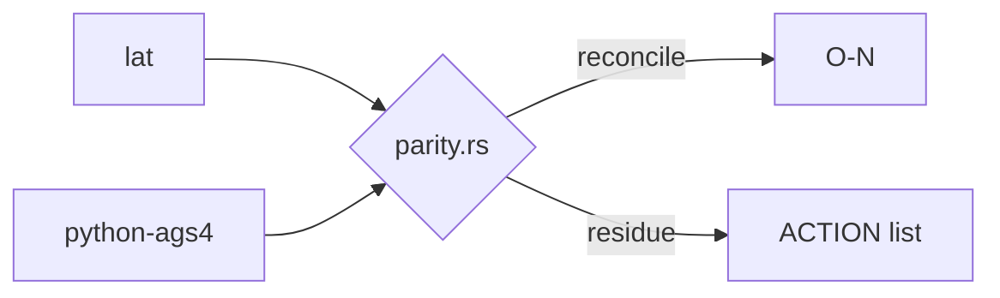

# rust vs python ags4 parity

> Query output — created/refreshed by the QUERY workflow, **not** bootstrap.

## Question
> [!quote] Question: where do the clean-room Rust validator and python-ags4 disagree, and is each disagreement understood? Answer (from [[parity-model]] + the probes): the symmetric rule-set difference is whittled against documented O-Ns — O-2 (Rust uniquely fires Rule 6, python no-ops), O-3 (Rule 5↔4 attribution), O-26 (python triple-reports 19b), O-30 (AGS3 refusal), O-34 (NotAgs4 vs missing-groups). Confirmed live divergences: cp1252→Rule 1 both AGREE (O-32), out-of-range dates both Rule 8 (O-33), digit GROUP names Rust-only Rule 19 ([[strat-rule19-digit-group]]). Unexplained residue is the dogfood ACTION list. Net: every known divergence is reconciled to an O-N; the harness compares rule-key *presence* only..

## Findings
Question: where do the clean-room Rust validator and python-ags4 disagree, and is each disagreement understood? Answer (from [[parity-model]] + the probes): the symmetric rule-set difference is whittled against documented O-Ns — O-2 (Rust uniquely fires Rule 6, python no-ops), O-3 (Rule 5↔4 attribution), O-26 (python triple-reports 19b), O-30 (AGS3 refusal), O-34 (NotAgs4 vs missing-groups). Confirmed live divergences: cp1252→Rule 1 both AGREE (O-32), out-of-range dates both Rule 8 (O-33), digit GROUP names Rust-only Rule 19 ([[strat-rule19-digit-group]]). Unexplained residue is the dogfood ACTION list. Net: every known divergence is reconciled to an O-N; the harness compares rule-key *presence* only.

## Related
[[start-here]]
