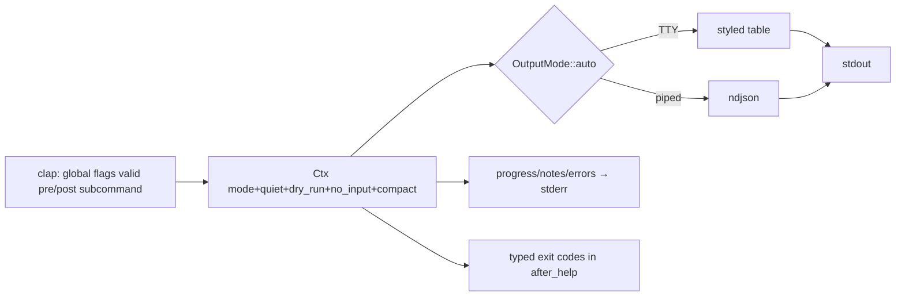

# agent-first CLI contract

## Definition
> [!quote] The shared behavioural contract every Rust CLI in
> `rust-packages/` follows — the **gogcli → discrawl →
> cli-printing-press → ags5db** lineage (the first three are external
> sibling tools, *not* in this repo; the convention is what carried
> over). Resolved-mode results to **stdout**; progress/hints/errors to
> **stderr**; **ndjson auto when piped**; global
> `--output/--json/--no-color/--quiet/--dry-run/--no-input/--compact`
> + `--readme`; `--dry-run` mutates nothing; **typed exit codes in an
> `after_help` epilog**; seedable RNG for reproducible runs. Embodied
> by `repo:rust-packages/laterite-cliutil/src/lib.rs` (the shared UX
> primitives) and the `repo:rust-packages/laterite-ags4-corpus-qa/src/cli.rs` /
> `src/main.rs` / `src/output.rs` (`Ctx` + `Report` trait + `emit`)
> pattern.

## Why it matters
The toolkit must "look and feel like one tool" and be
automation-friendly **by default** (no flag needed to pipe machine
output to another tool). It is also why `laterite-cliutil` exists at all:
duplication across CLIs is resolved by **extracting a shared crate**,
never a documented copy. The validator *library*'s lean dep-graph
(no walkdir/rayon/ratatui) is a hard guarantee — shared UI stays
bin-side. New CLIs ([[laterite-ags4-forge]]) inherit this verbatim; the
`Ctx/Report/emit/Plan` layer is being lifted into [[laterite-cliutil]] so
forge and [[laterite-ags4-corpus-qa]] share one report scaffold.

"Look and feel like one tool" extends past a single binary's own UX
contract: `lat` itself ships behind three launchers (the native binary,
`uvx --from laterite lat`, `npx laterite`), contractually the same tool
(#430). [[surface-census]] is the mechanical check of that claim at the
verb level — each launcher reflects its own parser rather than a
hand-list, so a verb missing from one launcher (as `merge` briefly was,
#494) is a finding, not a silent gap.

## Diagram

## Where it shows up
[[laterite-cli]], [[laterite-ags4-corpus-qa]], laterite-ags5-db today; [[laterite-ags4-forge]]
next. The shared primitives live in [[laterite-cliutil]]; the report-doc
half of the contract is the [[laterite-ags4-corpus-qa]] `output.rs` pattern.

## Related
[[laterite-cliutil]] · [[laterite-ags4-corpus-qa]] · [[laterite-cli]] · laterite-ags5-db · [[laterite-ags4-forge]] · [[laterite-ags4-parity]] · [[surface-census]]
