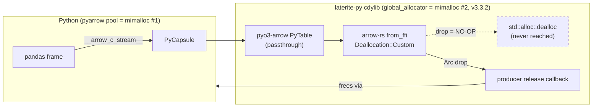

# Arrow C FFI under a foreign global allocator: who frees what

## Definition

[[pyo3-boundary]] establishes *where* Rust stops and Python starts and *what*
crosses (Arrow C Data Interface capsules, both directions). This page answers
the question that page does not: **when `laterite-py` installs mimalloc as
`#[global_allocator]`, whose allocator frees the Arrow buffers?**

**The answer, up front — and it is the opposite of the intuitive one:**

1. **The Arrow C Data Interface is allocator-agnostic by construction.** A
   buffer is never freed by "the allocator"; it is freed by the **producer's own
   release callback**, a function pointer carried inside the struct. Whoever
   allocated the memory supplies the code that frees it, so the free always runs
   producer-side. **Verified in arrow-rs source**, not inferred (§2).
2. **The Arrow FFI is not implicated at all — and this was measured, not
   inferred.** The minimal reproduction is two imports and a pyarrow table, with
   **no laterite call in it whatsoever** (§7). arrow-rs is exonerated by
   construction *and* by experiment. Two corroborating existence proofs: polars
   ships jemalloc/mimalloc in its Python extension and consumes pyarrow daily;
   datafusion-python ships mimalloc unconditionally (§6).
3. **The cause is two co-resident *instances of the same allocator*** — ours and
   the one inside pyarrow's default memory pool — with ours built as **v3.3.2**,
   inside the range microsoft/mimalloc#1287 flags as faulty (§3b). **Fixed by
   pinning `features = ["v2"]`**, shipped in PR #301.
4. **The `pl.from_pandas` guard stays — but for a different reason than its
   comment claimed.** It never made the pandas path memory-safe, and on the
   pyarrow path it copies nothing at all. It is load-bearing for **dep shape**:
   it keeps a pyarrow-free `[compat]` install working (§5).

> [!note] Resolved — the experiment in §7 has been run
> This page began as a research pass while the cause was still open. The matrix
> in §7 has since been **executed**, and the fix shipped as
> [PR #301](https://github.com/niko86/laterite/pull/301)
> (`fix/mimalloc-coresident-heap-corruption`). Measured results are recorded
> inline throughout, marked **Measured**.

Versions this page is scoped to (`repo:rust-packages/Cargo.lock`,
`repo:packages/laterite/pyproject.toml`, dev env at 2026-08-13):
`arrow` **59.1.0**, `pyo3` **0.29.0**, `pyo3-arrow` **0.19.0**,
`mimalloc` **0.1.52** / `libmimalloc-sys` **0.1.49** (v3.3.2 on default features;
`laterite-py` pins `v2` = 2.3.2 as of PR #301 — **`laterite-node` and
`laterite-cli` still take the v3 default**),
pyarrow **25.0.0**, pandas **2.3.3**, polars **1.43.1**.

## 1. Ownership across the Arrow C Data Interface

The spec is unambiguous: **the producer owns everything, and the consumer's only
lever is the release callback.**

> "The producer allocates and maintains all data pointed to by `ArrowSchema` and
> `ArrowArray`… The consumer must not interfere with this data's lifetime except
> through the release callback."
> — <https://arrow.apache.org/docs/format/CDataInterface.html>

The division of labour on release:

- **Consumer** MUST call the *base* structure's release callback when finished,
  and MUST NOT call any child's (or the dictionary's) callback — the producer's
  callback walks those itself.
- **Producer's callback** MUST walk all children, MUST free any data area it
  directly owns, and MUST then set `release` to NULL to mark the struct released.

"Moving an array" is a bitwise or shallow member-wise copy; the mover **marks the
source released without calling the callback**, so exactly one release happens.
The struct must be *trivially relocatable* — no pointer member (including
`private_data`) may point inside the struct.

The PyCapsule binding layers this onto Python
(<https://arrow.apache.org/docs/format/CDataInterface/PyCapsuleInterface.html>):
the capsule destructor calls the release callback **only if not already null**,
which is precisely why a consumer that moves the struct out must null the source.
As the spec puts it: *"If the capsule has been passed to a consumer, the consumer
should have moved the data and marked the release callback as null, so there
isn't a risk of releasing data the consumer is using."* Capsules are
**single-use**.

**Neither document mentions allocators at all.** That silence is the design: the
contract is expressed entirely in terms of *callbacks*, never in terms of
*allocators*, so an allocator never has to be named or matched.

## 2. Is the release callback guaranteed to run on the producer's allocator?

**Yes — and in arrow-rs the global allocator is not merely avoided, it is
structurally unreachable for foreign buffers.** This is the crux, so here is the
whole chain, verified at tag `59.1.0`.

**Step 1 — a foreign pointer becomes a `Buffer` with the FFI struct as its
owner** (`arrow-array/src/ffi.rs`,
<https://github.com/apache/arrow-rs/blob/59.1.0/arrow-array/src/ffi.rs>):

```rust
unsafe fn create_buffer(
    owner: Arc<FFI_ArrowArray>,
    array: &FFI_ArrowArray,
    index: usize,
    len: usize,
) -> Option<Buffer> {
    if array.num_buffers() == 0 { return None; }
    NonNull::new(array.buffer(index) as _)
        .map(|ptr| unsafe { Buffer::from_custom_allocation(ptr, len, owner) })
}
```

**Step 2 — that constructor tags the buffer `Deallocation::Custom`**
(`arrow-buffer/src/buffer/immutable.rs`):

```rust
pub unsafe fn from_custom_allocation(
    ptr: NonNull<u8>, len: usize, owner: Arc<dyn Allocation>,
) -> Self {
    unsafe { Buffer::build_with_arguments(ptr, len, Deallocation::Custom(owner, len)) }
}
```

`Deallocation` has exactly two variants (`arrow-buffer/src/alloc/mod.rs`):
`Standard(Layout)` — "An allocation using `std::alloc`" — and `Custom(Arc<dyn
Allocation>, usize)` — "An allocation from an external source like the FFI
interface. Deallocation will happen on `Allocation::drop`".

**Step 3 — the drop that decides everything** (`arrow-buffer/src/bytes.rs`):

```rust
impl Drop for Bytes {
    #[inline]
    fn drop(&mut self) {
        match &self.deallocation {
            Deallocation::Standard(layout) => match layout.size() {
                0 => {}
                _ => unsafe { std::alloc::dealloc(self.ptr.as_ptr(), *layout) },
            },
            // The automatic drop implementation will free the memory once the
            // reference count reaches zero
            Deallocation::Custom(_allocation, _size) => (),
        }
    }
}
```

**This is the whole answer.** `std::alloc::dealloc` — the call that routes to
`#[global_allocator]`, i.e. mimalloc — sits on the `Standard` arm only. The
`Custom` arm is *literally an empty body*. A pyarrow-allocated pointer can never
reach mimalloc's `dealloc`, because the only branch that could take it there is
not the branch it is on.

**Step 4 — what actually frees it.** Dropping the last `Buffer` drops the
`Arc<FFI_ArrowArray>`, and (`arrow-data/src/ffi.rs`):

```rust
impl Drop for FFI_ArrowArray {
    fn drop(&mut self) {
        match self.release {
            None => (),
            Some(release) => unsafe { release(self) },
        };
    }
}
```

`release` is **pyarrow's own C function pointer**, so the free executes inside
Arrow C++ against Arrow C++'s memory pool. Producer allocated, producer freed.

**The symmetry matters, and it is the reason the export direction is safe too.**
When arrow-rs *exports*, it installs its own Rust callback:

```rust
unsafe extern "C" fn release_array(array: *mut FFI_ArrowArray) {
    …
    let private = unsafe { Box::from_raw(array.private_data as *mut ArrayPrivateData) };
    …
    array.release = None;
}
```

`Box::from_raw` → drop → `std::alloc::dealloc` → **mimalloc**, the same allocator
that allocated it — even though *Python* triggered the call. The callback is a
function pointer, so "producer-side" is a property of the **code**, not of the
call site.

`FFI_ArrowArray::from_raw` implements the spec's move as
`std::ptr::replace(array, Self::empty())`, and `empty()` sets `release: None` —
so the capsule destructor sees a released struct and does nothing. **Double
release is structurally prevented**, matching the local ticket's finding that it
was ruled out.

> [!note] The invariant is already stated correctly in the code
> `repo:rust-packages/laterite-py/src/lib.rs` says it in the comment above the
> allocator: *"the engine leaves the Rust boundary via Arrow release callbacks,
> so Rust frees what Rust allocated (no cross-allocator handoff to
> polars/pyarrow)."* That comment is **right**, and §2 is its proof.

## 3. The failure modes that remain

Given §2, allocator *mismatch* is off the table. What is left:

**(a) Alignment — a real copy, but a safe one.** Both `from_ffi` and
`from_ffi_and_data_type` end with `data.align_buffers()`, because arrow-rs is
stricter than the spec (which only says buffers *MAY* be aligned to their
primitive type and consumers *MAY* refuse unaligned memory).
`arrow-data/src/data.rs`:

```rust
pub fn align_buffers(&mut self) {
    let layout = layout(&self.data_type);
    for (buffer, spec) in self.buffers.iter_mut().zip(&layout.buffers) {
        if let BufferSpec::FixedWidth { alignment, .. } = spec {
            if buffer.as_ptr().align_offset(*alignment) != 0 {
                *buffer = Buffer::from_slice_ref(buffer.as_ref());
            }
        }
    }
    for data in self.child_data.iter_mut() { data.align_buffers() }
}
```

This is **the only place a `Layout`-based dealloc touches a path that received
foreign pointers** — and it is safe, because it *replaces* the foreign buffer
with a fresh Rust allocation (freed by Rust) while the foreign one drops through
the no-op `Custom` arm. It is a no-op for pyarrow and polars, both of which
allocate 64-byte-aligned. **Alignment is not the hazard here.**

**(b) Two co-resident instances of the *same* allocator.** This is the one that
matters, and it is documented in the wild:

- **pyarrow's own default memory pool is mimalloc.** Arrow C++ docs: *"The
  default memory pool depends on how Arrow C++ was compiled: if enabled at
  compile time, a mimalloc heap; otherwise… a jemalloc heap; otherwise, the C
  library malloc heap"* (<https://arrow.apache.org/docs/cpp/memory.html>).
  Official wheels compile both in, so **mimalloc wins**. Confirmed on this
  machine: `pa.default_memory_pool().backend_name` → `'mimalloc'`
  (pyarrow 25.0.0), with `supported_memory_backends()` → `['mimalloc', 'system']`.
- So a laterite process holds **two statically-linked mimalloc instances**: the
  Rust crate's, and the one inside `libarrow`. Each has its own global and
  thread-local state.
- **apache/datafusion-python#1607** — *"Segfault with PyArrow 24 on macOS when
  using mimalloc v3"*, **open** — is exactly this, and is the closest real-world
  precedent to laterite's symptom.
  <https://github.com/apache/datafusion-python/issues/1607> Crash is inside
  `arrow::MimallocAllocator::ReallocateAligned`. Root-caused there to
  **microsoft/mimalloc#1287** — *"mimalloc >= 3.3.0 causes segmentation faults
  when used from multiple threads"*, **closed**, fixed on the `dev3` branch but
  **not in a stable release** as of that thread.
  <https://github.com/microsoft/mimalloc/issues/1287> Its reproducer is
  `dlopen`-shaped: load a shared library using mimalloc from a non-main thread,
  exit that thread, allocate from another — i.e. **exactly the shape of a CPython
  extension module**. datafusion-python's mitigation is to pin the Rust side to
  mimalloc **v2** via the crate's `v2` feature: *"no performance loss, no PyArrow
  pin."*

> [!success] Measured — this is the cause, and the cross-matrix is unambiguous
> Varying **our `.so`'s allocator** against **pyarrow's memory pool**
> independently (issue #294 / PR #301):
>
> | our allocator | pyarrow pool | result |
> |---|---|---|
> | mimalloc (v3) | mimalloc | **corrupt** |
> | mimalloc (v3) | system | clean |
> | system | mimalloc | clean |
> | system | system | clean |
>
> Only the **both-mimalloc** cell fails. Neither allocator is faulty alone, which
> is precisely the two-co-resident-instances signature and not an
> allocator-mismatch signature.
>
> **Direct evidence that our allocator never touches pyarrow's memory:** an
> instrumented `GlobalAlloc` wrapping `MiMalloc`, reporting
> `alloc`/`alloc_zeroed`/`dealloc` of a watched address, was pointed at pyarrow's
> data buffer (address read via `Buffer.address`). It **never fired**, while the
> corruption still occurred. §2's structural argument is therefore confirmed
> empirically: the cross-allocator-free story is dead.

**(c) ELF static-TLS under `dlopen`.** **PyO3/pyo3#678**, *"jemallocator & pyo3
?"*, **closed** (self-resolved 2019): `cannot allocate memory in static TLS
block` on import, fixed by `features = ["disable_initial_exec_tls"]`.
<https://github.com/PyO3/pyo3/issues/678> This is the known PyO3 material about
`#[global_allocator]` in extension modules — and note it is about **TLS
mechanics, not buffer ownership**. polars uses that exact flag today.

**Not stated by any source found:** that allocator *mismatch* across the Arrow C
Data Interface causes heap corruption. arrow-rs#10439 (**open, 0 comments**,
filed from this repo) is the only issue advancing that theory, and it is
untriaged. Searches of apache/arrow-rs for `mimalloc`/allocator/segfault surfaced
no other issue making that claim.

## 4. pyo3-arrow

`pyo3-arrow` **0.19.0** (tag `pyo3-arrow-v0.19.0` in `kylebarron/arro3`; its
manifest pins `arrow-array = "59"`, `pyo3 = "0.29"` — matching ours) is a
**pure passthrough**. It extracts the capsule and hands the raw struct to
arrow-rs; it never touches buffers itself.

```rust
pub(crate) fn import_stream_pycapsule(capsule: &Bound<PyCapsule>)
    -> PyResult<FFI_ArrowArrayStream> {
    let stream_ptr = capsule
        .pointer_checked(Some(ARROW_ARRAY_STREAM_CAPSULE_NAME))?
        .cast::<FFI_ArrowArrayStream>();
    Ok(unsafe { FFI_ArrowArrayStream::from_raw(stream_ptr.as_ptr()) })
}
```
<https://github.com/kylebarron/arro3/blob/pyo3-arrow-v0.19.0/pyo3-arrow/src/ffi/from_python/utils.rs>

`PyTable::from_arrow_pycapsule` — the type
`repo:rust-packages/laterite-py/src/emit_typed.rs` uses — then drives arrow-rs's
own reader and **eagerly drains it** into `Vec<RecordBatch>`:

```rust
let stream = import_stream_pycapsule(capsule)?;
let stream_reader = ArrowRecordBatchStreamReader::try_new(stream)…;
for batch in stream_reader { batches.push(batch?); }
```
<https://github.com/kylebarron/arro3/blob/pyo3-arrow-v0.19.0/pyo3-arrow/src/table.rs>

**On allocators, the crate is silent.** Its README (which *is* the crate docs via
`#![doc = include_str!("../README.md")]`) asserts zero-copy repeatedly — *"zero-copy FFI
conversions between Python objects and Rust representations using the `arrow`
crate"* — but **never mentions allocators, memory pools, mimalloc, jemalloc, or
`#[global_allocator]`**. Its issue tracker has **zero** hits for mimalloc,
jemalloc, heap corruption, use-after-free, or double free; the one real segfault
issue (#230, **closed**) is a PyO3 GIL/interpreter-teardown bug on the numpy
buffer-protocol side, unrelated.

This corroborates the local ticket: the wrapper is not implicated, because there
is nothing in it to implicate.

## 5. `pl.from_pandas` — is it zero-copy?

**Verdict: on the pyarrow path it copies nothing, so the guard never did what its
comment said. It stays anyway — but for a dep-shape reason, not a safety one.**

**It adopts, it does not copy.** `pandas_series_to_arrow` unconditionally calls
`pa.array(values, from_pandas=nan_to_null)`; for an `ArrowDtype` column pyarrow
short-circuits through `__arrow_array__`, which returns the *existing*
`ChunkedArray` verbatim. The Rust import is foreign adoption, not a memcpy
(`crates/polars-arrow/src/ffi/array.rs`):

```rust
// We have to check alignment, for zero-copy to be valid.
if ptr.is_aligned() {
    let slice = core::slice::from_raw_parts(ptr.add(offset), len);
    let storage = SharedStorage::from_slice_with_owner(slice, owner);
    Ok(Buffer::from_storage(storage))
} else {
    // Byte-wise copy for misaligned buffers.
```

and the owner's `Drop` calls the **producer's** callback — the same pattern as
arrow-rs (§2).

**`rechunk=True` (the default) is not an escape.** It is guarded
(`crates/polars-core/src/frame/mod.rs`):

```rust
pub fn rechunk_mut_par(&mut self) -> &mut Self {
    if self.columns().iter().any(|c| c.n_chunks() > 1) {
```

Single-chunk everywhere ⇒ the body never runs. **No copy.**

Measured on this repo's venv (polars 1.43.1 / pandas 2.3.3 / pyarrow 25.0.0):
buffer addresses are **identical** across `pl.from_pandas`, and
`pa.total_allocated_bytes()` stays elevated after the pandas frame is deleted,
dropping to zero only when the **polars** frame is dropped — polars is holding
pyarrow's allocation alive.

**So why does the guard work?** Because it changes **the producer**, not the
memory. When polars re-exports via `__arrow_c_stream__`, it stamps *polars'* own
`c_release_array` and private data onto the exported struct. The Rust consumer
stops seeing a **pyarrow-produced** stream and starts seeing a
**polars-produced** one; pyarrow's buffers are still there, released transitively
one level down. That is exactly consistent with the ticket's observation that
polars streams are never affected — and it relocates the defect to *the
consumer's handling of pyarrow's release semantics*, not to memory ownership.

**One genuine, but data-dependent, escape hatch.** `pandas_to_pydf` has an
all-or-nothing numpy bypass: if **every** column is "simple numpy-backed" it
converts via `to_numpy()` and pyarrow is never touched (measured: 0 bytes
allocated). `object`-dtype string columns count as simple **only when the Series
has no NaNs and is non-empty**. AGS4 frames are mostly all-string, so many
laterite frames really do come out fully polars-owned — but **add one `None` and
it falls back to the pyarrow path.** Resting a heap-corruption fix on that is
fragile.

> [!warning] The guard's comment was wrong — corrected in PR #301
> `repo:packages/laterite/python/laterite/__init__.py` claimed that normalising
> through `pl.from_pandas` avoids handing over pyarrow-backed memory. It does not
> — the polars frame usually wraps *the very same pyarrow buffers*. Same for
> `repo:packages/laterite/python/laterite/compat/_impl.py`'s `_to_polars`. Both
> comments were corrected in PR #301.

> [!success] Measured — the guard is still load-bearing, for dep shape
> After the v2 pin the unguarded pandas path is **memory-safe**, so the guard is
> no longer what makes it correct. It stays for a different reason: pandas'
> `__arrow_c_stream__` calls `import_optional_dependency("pyarrow")`, so on a
> **pyarrow-free `[compat]` install** the unguarded path raises `ImportError`.
> Measured with pyarrow blocked: **guarded OK, unguarded `ImportError`**. Since
> `[compat]` is specified as pandas-only and pyarrow-free (see
> [[pyo3-boundary]] and the dep-shape split), removing the guard would break the
> advertised install shape. **Keep it; the comment must say *dep shape*, not
> *memory safety*.**

## 6. What other projects do

**polars — the existence proof holds.** Its Python extension installs a
non-system global allocator **by default, unconditionally**
(`crates/polars-python/src/c_api/allocator.rs`):

```rust
#[global_allocator]
static ALLOC: polars_ooc::Allocator = polars_ooc::Allocator;
```

delegating per-target (`crates/polars-ooc/src/global_alloc.rs`): **jemalloc on
Unix** (`tikv-jemallocator`, with `disable_initial_exec_tls` — the pyo3#678 fix),
**mimalloc on Windows/emscripten**, system without `fast_alloc` (which is in
`default`). The runtime crate turns the feature on unconditionally. The choice is
a **measured performance** decision (PR #3108), not a safety carve-out; PR #7194,
which would have dropped mimalloc on Windows, was **closed unmerged**.

A library with polars' download volume, shipping a foreign global allocator and
consuming pyarrow buffers every day, is decisive: **allocator identity alone
cannot be the bug.**

**datafusion-python — mimalloc unconditionally, and it hit this exact wall.**
`crates/core/src/lib.rs` sets `#[global_allocator] static GLOBAL: MiMalloc`, with
`default = ["mimalloc", "abi3"]` and no target gating — in a crate that imports
pyarrow directly. Its manifest carries the tell:

```toml
mimalloc = { workspace = true, optional = true, features = [
  "local_dynamic_tls",
  # Pin to mimalloc v2 until apache/datafusion-python#1607 resolves.
  "v2",
] }
```

**Mitigation patterns actually used** (all at the allocator-crate-configuration
layer, none at the FFI call site): TLS-model flags
(`disable_initial_exec_tls` / `local_dynamic_tls`); **version-pinning the
allocator** (datafusion-python → mimalloc v2); platform-conditional choice
(polars). **No project found mitigates by forcing a copy at the FFI boundary or
by dropping the global allocator** — which is worth noting, because the
`pl.from_pandas` guard is closest in spirit to the former.

## 7. What this means for laterite

### The cause, and the fix is one line

laterite declares `mimalloc = "0.1"` in all three surfaces
(`repo:rust-packages/laterite-py/Cargo.toml`, `laterite-cli`, `laterite-node`)
**with no features**. And `libmimalloc-sys` 0.1.49's `build.rs` selects:

```rust
let version = if env::var("CARGO_FEATURE_V2").is_ok() { "v2" } else { "v3" };
```

The vendored headers give `v2` = **2.3.2** and `v3` = **3.3.2**. Nothing in the
workspace opts into `v2` (grep: no `"v2"` in any `Cargo.toml`). **laterite
therefore builds mimalloc v3.3.2** — inside the range microsoft/mimalloc#1287
identifies as faulty (*">= 3.3.0"*), co-resident with pyarrow's own bundled
mimalloc, in a `dlopen`'d extension module, on macOS. That is
datafusion-python#1607's situation feature-for-feature.

When first written this was **inference**. It has since been **confirmed by
experiment** (§3b matrix, and the reproduction below), and fixed in PR #301 by
pinning `laterite-py` to `features = ["v2"]`. It explains every observed fact the
allocator-mismatch theory could not — why only mimalloc, why the system allocator
masks it, and why the Arrow contract audits clean (§2).

**Scope is narrower than feared: pyarrow only.** polars and duckdb are clean
under the same allocation churn, so base `pip install laterite` — which is
polars + duckdb and no pyarrow — **was never exposed**. Only the
`[pyarrow]` / `[compat,pyarrow]` / `[all]` extras and dev/CI environments could
hit it.

**Corruption signature** (useful if this is ever taken upstream): it needs a
string buffer **larger than 64 bytes across 2+ rows**, landing in the **first
pyarrow allocations after our module loads**. A 1-row array never corrupts even
at 4 KB. The measured boundary is exact — 2 rows × 32 chars (64 B) is fine,
2 × 33 (66 B) corrupts.

**Performance, since it decided the fix.** v2 keeps **~18–19% read** and
**~14–15% validate** over the system allocator on the 25 MB fixture, and costs
only **~6% read** versus v3. Dropping mimalloc entirely would have cost read
**122 ms → 150 ms** — which is why the fix is a version pin, not a removal.

### Recommendations

**Done (PR #301):**

1. **`features = ["v2"]` on `laterite-py`'s mimalloc** — the datafusion-python
   fix. Confirmed by the §3b matrix.
2. **Both guard comments corrected** (§5), and the guard **kept** on its real
   (dep-shape) justification.
3. **mimalloc not dropped, and nothing "fixed" at the FFI boundary.** §2 shows
   the boundary is correct by construction; §6 shows the ecosystem's mitigations
   all live in allocator configuration. The `no-mimalloc` arm rides in #301 only
   as the **control** that rules out masking.

**Outstanding:**

4. **`laterite-node` and `laterite-cli` still declare bare `mimalloc = "0.1"`**,
   so both still build **v3.3.2**. Neither loads pyarrow today, so neither is
   known-exposed — but they carry the same faulty allocator version, and the node
   addon is the same `dlopen`'d-extension shape that microsoft/mimalloc#1287
   describes. **Owner's call**, deliberately not swept into #301.
5. **arrow-rs#10439 is mis-filed.** It blames the Arrow FFI for what is a mimalloc
   bug, and §2 plus the §3b matrix show the FFI is not involved. It should be
   **withdrawn or re-pointed at mimalloc**. Outward-facing, so owner's call.
6. **Consider `local_dynamic_tls`** (§3c) — cheap, and the ecosystem standard for
   allocators inside `dlopen`'d extension modules. Not required by any observed
   failure here.

### The experiment that settled it

The matrix below was run, changing **one** variable at a time. Predictions were
made from mimalloc#1287 before the arms were executed:

| Arm | Change | Predicted | **Measured** |
|---|---|---|---|
| baseline | as filed | SIGSEGV / corruption | **corrupt** |
| **A** | Rust side `mimalloc` features `["v2"]` | survives | **survives — shipped in #301** |
| B | `pa.set_memory_pool(pa.system_memory_pool())` at import | survives | **survives** |
| C | `ARROW_DEFAULT_MEMORY_POOL=system` in env | survives | **survives** |
| D | drop `#[global_allocator]` entirely | survives | **survives** (control only — proves nothing on its own) |

**A and B both surviving confirms two-mimalloc-instances and refutes
allocator-mismatch**, since A changes only *our* allocator and B changes only
*pyarrow's* — yet either alone is sufficient.

### The reproduction — and why iteration count never found it

The minimal reproduction contains **no laterite call at all**. Two imports and a
pyarrow table:

```python
import pyarrow as pa
import laterite                       # merely loading the extension is enough

pa.table({"c": ["A" * 32] * 4}).column(0).chunk(0).to_pylist()
# -> first 64 bytes zeroed. 100% deterministic.
```

That importing the module is sufficient — with the Arrow FFI never exercised —
is what makes this **stronger than "the FFI is probably not at fault"**: the FFI
is not on the path.

> [!warning] This bug cannot be reproduced by iteration count
> It needs the pyarrow allocation to land in the window **right after our module
> loads** (§7 signature). Hammering an already-warm process misses it no matter
> how many iterations you run — an early attempt here of 3 pandas shapes × 400
> iterations, plus a 300-iteration emit→`laterite.read()` canary, **survived
> everything** and was worthless as evidence. This is also **why the existing
> #122 regression test never caught it**, and it is the trap to avoid when
> writing any replacement: a test that cannot go red proves nothing. A credible
> regression test must A/B the faulty artifact and run in a **subprocess**, since
> the fault is startup-order-dependent.

## Diagram



## Where it shows up

The import (foreign-producer) direction is narrow — `emit_ags4_from_arrow` in
`repo:rust-packages/laterite-py/src/emit_typed.rs`, reached from
`build_ags4`/`emit_ags4`. The export direction is `Reading::table_for` returning
`PyTable` (`repo:rust-packages/laterite-py/src/lib.rs`), which is
allocator-symmetric per §2. The guards are
`repo:packages/laterite/python/laterite/__init__.py` and `_to_polars` in
`repo:packages/laterite/python/laterite/compat/_impl.py`. See [[ags4-output]] for
the emit feature and [[pyo3-boundary]] for the boundary itself.

## Related

[[pyo3-boundary]] · [[ags4-output]] · [[crate-map]] · [[laterite-py]] · [[laterite]] · [[abi3-perf]]
