# Crate dependency graph

<!-- GENERATED by tools/gen_crate_graph.py from the workspace Cargo
     manifests. Do NOT hand-edit — run
     `uv run --no-project python tools/gen_crate_graph.py`.
     Faithfulness-gated by tests/test_crate_graph_faithful.py. -->

> [!note] Generated from `repo:rust-packages/Cargo.toml` (+ each member's
> manifest). The complete machine-derived internal dependency graph — the
> counterpart to [[crate-map]], which is the hand-curated, readability-first
> keystone view. This page can't drift: a faithfulness gate re-renders it
> from the manifests, and its coupling read is asserted byte-identical to
> the `lint.py` crate-map edge check's.

Solid arrows are **ship** dependencies (normal + build — what a consumer
compiles); the dashed `dev` arrow is a **test-only** edge that doesn't
ship. Every edge here is a real Cargo coupling by construction.

## The graph

```mermaid
flowchart TD
  subgraph L4["L4 · surfaces + CLI"]
    laterite_ags4_check[laterite-ags4-check]
    laterite_ags4_tokenizer_wasm[laterite-ags4-tokenizer-wasm]
    laterite_ags4_wasm[laterite-ags4-wasm]
    laterite_node[laterite-node]
    laterite_py[laterite-py]
  end
  subgraph L3["L3 · trust model + tools"]
    ags4_compliance[ags4-compliance]
    ags4_corpus_qa[ags4-corpus-qa]
    ags4_forge[ags4-forge]
    ags4_parity[ags4-parity]
    ags4_perf[ags4-perf]
    laterite_ags4_trust[laterite-ags4-trust]
  end
  subgraph L2["L2 · writer / validator / excel / diff"]
    laterite_ags4_censor[laterite-ags4-censor]
    laterite_ags4_diff[laterite-ags4-diff]
    laterite_ags4_emit[laterite-ags4-emit]
    laterite_ags4_merge[laterite-ags4-merge]
    laterite_ags4_validator[laterite-ags4-validator]
    laterite_excel[laterite-excel]
  end
  subgraph L1["L1 · core (data foundation)"]
    laterite_ags4_core[laterite-ags4-core]
  end
  subgraph L0["L0 · foundations (depend on nothing above L0)"]
    laterite_ags4_parse[laterite-ags4-parse]
    laterite_ags4_reference[laterite-ags4-reference]
    laterite_cliutil[laterite-cliutil]
    laterite_transport[laterite-transport]
    laterite_types[laterite-types]
  end
  ags4_compliance --> ags4_parity
  ags4_compliance --> laterite_ags4_core
  ags4_compliance --> laterite_ags4_emit
  ags4_compliance --> laterite_ags4_parse
  ags4_compliance --> laterite_ags4_validator
  ags4_corpus_qa --> ags4_parity
  ags4_corpus_qa --> laterite_ags4_censor
  ags4_corpus_qa --> laterite_ags4_validator
  ags4_corpus_qa --> laterite_cliutil
  ags4_forge --> ags4_parity
  ags4_forge --> laterite_ags4_validator
  ags4_forge --> laterite_cliutil
  ags4_parity --> laterite_ags4_validator
  ags4_perf --> laterite_ags4_parse
  ags4_perf --> laterite_ags4_validator
  ags4_perf --> laterite_types
  laterite_ags4_censor --> laterite_ags4_parse
  laterite_ags4_censor --> laterite_ags4_reference
  laterite_ags4_censor --> laterite_types
  laterite_ags4_check --> laterite_ags4_core
  laterite_ags4_check --> laterite_ags4_diff
  laterite_ags4_check --> laterite_ags4_merge
  laterite_ags4_check --> laterite_ags4_parse
  laterite_ags4_check --> laterite_ags4_trust
  laterite_ags4_check --> laterite_ags4_validator
  laterite_ags4_check --> laterite_cliutil
  laterite_ags4_check --> laterite_excel
  laterite_ags4_core --> laterite_ags4_parse
  laterite_ags4_core --> laterite_ags4_reference
  laterite_ags4_core --> laterite_transport
  laterite_ags4_core --> laterite_types
  laterite_ags4_diff --> laterite_ags4_parse
  laterite_ags4_diff --> laterite_ags4_reference
  laterite_ags4_diff --> laterite_types
  laterite_ags4_emit --> laterite_ags4_validator
  laterite_ags4_emit --> laterite_types
  laterite_ags4_merge --> laterite_ags4_emit
  laterite_ags4_merge --> laterite_ags4_parse
  laterite_ags4_merge --> laterite_ags4_reference
  laterite_ags4_merge --> laterite_types
  laterite_ags4_reference --> laterite_ags4_parse
  laterite_ags4_reference --> laterite_types
  laterite_ags4_tokenizer_wasm --> laterite_ags4_parse
  laterite_ags4_tokenizer_wasm --> laterite_types
  laterite_ags4_trust --> laterite_ags4_core
  laterite_ags4_trust --> laterite_ags4_parse
  laterite_ags4_trust --> laterite_ags4_validator
  laterite_ags4_validator --> laterite_ags4_parse
  laterite_ags4_validator --> laterite_ags4_reference
  laterite_ags4_validator --> laterite_types
  laterite_ags4_wasm --> laterite_ags4_censor
  laterite_ags4_wasm --> laterite_ags4_core
  laterite_ags4_wasm --> laterite_ags4_diff
  laterite_ags4_wasm --> laterite_ags4_emit
  laterite_ags4_wasm --> laterite_ags4_merge
  laterite_ags4_wasm --> laterite_ags4_parse
  laterite_ags4_wasm --> laterite_ags4_trust
  laterite_ags4_wasm --> laterite_ags4_validator
  laterite_ags4_wasm --> laterite_excel
  laterite_ags4_wasm --> laterite_types
  laterite_excel --> laterite_ags4_core
  laterite_excel --> laterite_ags4_emit
  laterite_node --> laterite_ags4_core
  laterite_node --> laterite_ags4_diff
  laterite_node --> laterite_ags4_emit
  laterite_node --> laterite_ags4_merge
  laterite_node --> laterite_ags4_parse
  laterite_node --> laterite_ags4_trust
  laterite_node --> laterite_ags4_validator
  laterite_node --> laterite_excel
  laterite_node --> laterite_transport
  laterite_node --> laterite_types
  laterite_py --> laterite_ags4_core
  laterite_py --> laterite_ags4_diff
  laterite_py --> laterite_ags4_emit
  laterite_py --> laterite_ags4_merge
  laterite_py --> laterite_ags4_parse
  laterite_py --> laterite_ags4_reference
  laterite_py --> laterite_ags4_trust
  laterite_py --> laterite_ags4_validator
  laterite_py --> laterite_excel
  laterite_py --> laterite_types
  laterite_ags4_validator -.dev.-> laterite_ags4_core
  laterite_excel -.dev.-> laterite_types
```

## Crates by layer

| crate | layer | ship-deps (out) | dependents (in) | transitive |
|---|---|--:|--:|--:|
| `laterite-ags4-parse` | L0 | 0 | 14 | 0 |
| `laterite-types` | L0 | 0 | 12 | 0 |
| `laterite-ags4-reference` | L0 | 2 | 6 | 2 |
| `laterite-cliutil` | L0 | 0 | 3 | 0 |
| `laterite-transport` | L0 | 0 | 2 | 0 |
| `laterite-ags4-core` | L1 | 4 | 7 | 4 |
| `laterite-ags4-validator` | L2 | 3 | 11 | 3 |
| `laterite-ags4-emit` | L2 | 2 | 6 | 4 |
| `laterite-ags4-diff` | L2 | 3 | 4 | 3 |
| `laterite-ags4-merge` | L2 | 4 | 4 | 5 |
| `laterite-excel` | L2 | 2 | 4 | 7 |
| `laterite-ags4-censor` | L2 | 3 | 2 | 3 |
| `laterite-ags4-trust` | L3 | 3 | 4 | 6 |
| `ags4-parity` | L3 | 1 | 3 | 4 |
| `ags4-compliance` | L3 | 5 | 0 | 8 |
| `ags4-corpus-qa` | L3 | 4 | 0 | 7 |
| `ags4-forge` | L3 | 3 | 0 | 6 |
| `ags4-perf` | L3 | 3 | 0 | 4 |
| `laterite-ags4-check` | L4 | 8 | 0 | 12 |
| `laterite-ags4-tokenizer-wasm` | L4 | 2 | 0 | 2 |
| `laterite-ags4-wasm` | L4 | 10 | 0 | 12 |
| `laterite-node` | L4 | 10 | 0 | 11 |
| `laterite-py` | L4 | 10 | 0 | 11 |

## Structural findings (computed from the manifests)

- **Layering inversions (ship edge to a higher layer):** none — the graph respects its layering.
- **Dev-only cycles (latent — would cycle if promoted to a ship dep):** none.
- **Hubs (in-degree ≥ 6):**
  - `laterite-ags4-parse` (in-degree 14)
  - `laterite-types` (in-degree 12)
  - `laterite-ags4-validator` (in-degree 11)
  - `laterite-ags4-core` (in-degree 7)
  - `laterite-ags4-emit` (in-degree 6)
  - `laterite-ags4-reference` (in-degree 6)

## Structural notes (reviewed)

From the multi-lens architectural sweep. Computed from the manifests: the graph respects its layering (no ship edge points at a higher layer). A shipped cycle is impossible by construction (cargo rejects circular normal deps). The wasm boundary is reviewed, not computed here — leaf purity is pinned per-crate by `dep_graph.rs` (parse) and `lean_dep_graph.rs` (validator). These are the interpretation:

1. **`parity` links the whole rule engine for a 2-symbol slice** — *moderate · hub-cohesion*.  `ags4-parity` uses only `Findings`/`count_by_rule`/a few `ValidatorError` variants, yet compile-links the entire ~8.8k-line validator — its ONLY dependency. Extracting `findings`/`error` into a small leaf would let it depend on a fraction of what it pulls today. `laterite-ags4-diff` was the other half of this note until #475 landed the dictionary leaf: it now depends on `parse` + `reference` + `types` and does not link the validator at all, which is the shape this note is asking for.
2. **`core`'s `laterite-types` re-export is dead weight** — *minor · cheap*.  `core/src/lib.rs`'s `pub use laterite_types as ags_types;` is used internally nowhere — only by `laterite-py`, which already depends on `laterite-types` directly. Cuttable with a one-line import change.
3. **#441 (`core → emit`) — CUT 2026-07-11** — *resolved*.  The edge is gone: `core` depended on `emit` solely for `impl From<EmitError> for CliError`, whose one consumer (`laterite-excel`) now owns the mapping. Cutting that shim fully severed the edge (an earlier worry that it was 'heavier than the shim framing' was misplaced — the shim was core's only use of `emit`) and, as a bonus, broke the former `validator ⇄ core → emit → validator` dev-dep cycle. See [[core-emit-layering-inversion]].
4. **`emit → validator` is a legitimate same-layer edge** — *informational*.  Within L2, `validator` (dictionary + rules) is architecturally the lowest member; `emit`/`diff`/`excel` sit above it with no ship-direction cycle. Named explicitly so the L2 list order is never misread as an inversion.
5. **wasm `getrandom` is a proc-macro build artifact, not a leak** — *known-benign*.  The only path to `getrandom` under `wasm32-unknown-unknown` is via `const-random-macro` (a host-compiled proc-macro) through `ahash ← arrow`, so it never reaches the wasm target at runtime. See ci-and-runners's known-benign register.

## Related

[[crate-map]] · [[pyo3-boundary]] · [[tech-stack-wasm]] · [[reliquary]]
