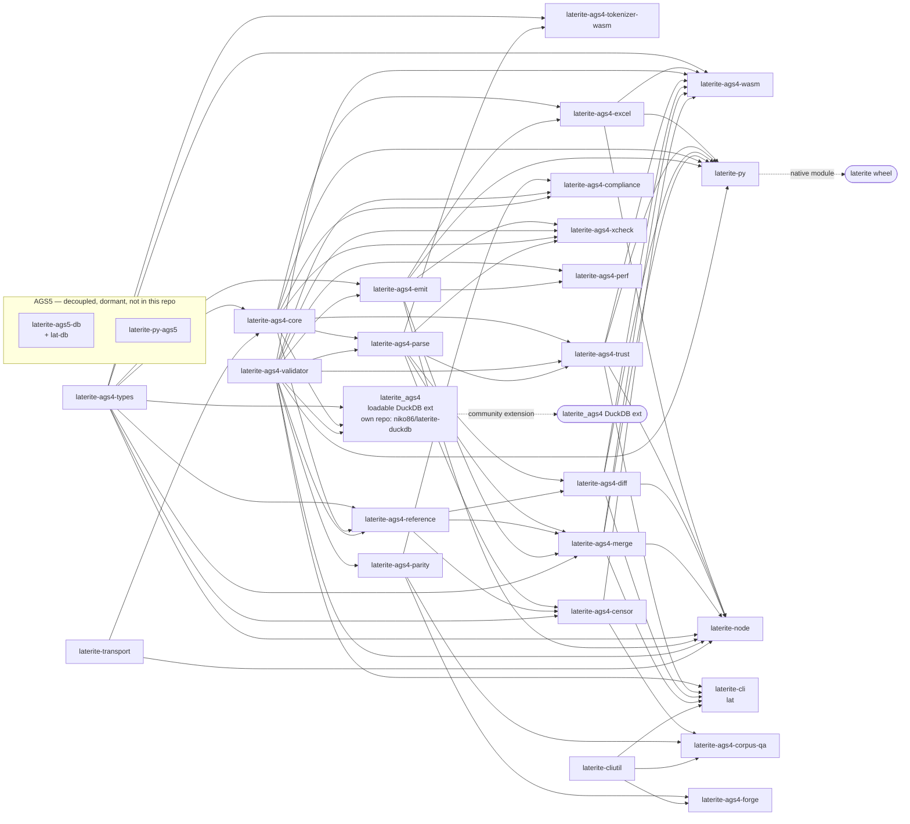

# crate map

## Definition

The Rust side of the **shipped AGS4 toolkit** is **one Cargo workspace of
twenty-five crates** (`repo:rust-packages/Cargo.toml` members) feeding **one
published Python wheel** — the base [[laterite]] — plus a **loadable DuckDB
extension** that ships outside the wheel entirely (the
[[dec-duckdb-extension|laterite-duckdb]], via DuckDB Community Extensions).

The experimental AGS5 (`.ags5db` / `.agsx`) crates and wheels —
`laterite-ags5-db` (the `lat-db` CLI), `laterite-py-ags5`, and the
`laterite-ags5` / `laterite-ags5x` Python packages — were **decoupled and are no
longer in this repo** (2026-06-21): preserved intact
elsewhere, out of the Cargo workspace and the shipped product, for a future
AGS5 strand to re-link against the shared libs (`laterite-ags4-types` /
`laterite-ags4-core` / `laterite-ags4-validator`). A clean side-effect: the
kept workspace now links **no bundled DuckDB** (that left with the AGS5 crates).

The authoritative role table + dependency graph live in
[[crate-dependency-graph]]; this page ties the crates to their *why* (the
`design` decisions) and groups them by **audience** — public contract vs.
shipped product vs. internal implementation detail. For the zoom-*out* — what
every top-level *directory* in the repo is for — see [[repo-layout]]. For the
zoom-*in* — the **complete machine-generated dependency graph** (every edge,
regenerated from the manifests and faithfulness-gated) plus the verified
structural findings — see [[crate-dependency-graph]]; this page stays the
curated, readability-first view.

The organising rule: **`laterite-ags4-validator` is the engine; everything
depends *on* it, never the reverse.** Its lean `phf + thiserror + chrono
+ encoding_rs` dep-graph is the guarantee that keeps it embeddable in a
CLI, a PyO3 cdylib, and a wasm bundle alike — see
[[dec-rust-drives-python]].

## Why it matters

Five questions a cold session re-derives from source unless this map
exists: **why twenty-five crates** (the engine/CLI/QA/bindings/leaf split);
**why AGS5 is decoupled** (the shipped product is AGS4-only; `.ags5db`/`.agsx`
sit dormant outside this repo); **the wasm path**
([[tech-stack-wasm]]); **the PyO3 boundary** ([[pyo3-boundary]]); and **why the
`laterite_ags4` DuckDB extension lives in its own repo, not this workspace** (the
loadable-vs-bundled DuckDB clash + the Path-B carve-out — [[dec-duckdb-extension]]).
This page is the index into those answers.

## Crates by audience

**Public contract — the published Python wheel** (external-dev API; treat
as stable):
- [[laterite]] — the AGS4 base wheel (python-ags4 drop-in). The only shipped
  wheel since the AGS5 decouple; the `[ags5]` extra is gone.

**Shipped product — the Rust binary:**
- [[laterite-ags4-validator]] (lib) + `lat` (its CLI front-end) — the
  validator engine. `lat` is the shipped CLI; the `.ags5db` `lat-db` binary
  was decoupled out of this repo (see *Decoupled AGS5* below).

**Internal implementation — crates with no external audience** (free to churn):
- [[laterite-ags4-types]] — the wasm-safe typing leaf ([[dec-laterite-ags4-types-leaf]]); an optional
  `arrow` feature adds `arrow_cols` (the shared typed-Arrow column builder the native read
  boundary `laterite-py`+`pyo3-arrow` and the wasm explorer emit through) and `ipc`
  (`build_group_ipc` = that builder + StreamWriter framing — the single parser-agnostic
  composition `laterite-node` and `laterite-ags4-wasm` frame each group's IPC stream with,
  fed a positional `cell(col,row)` so the leaf stays parser-free). Also owns the AGS4 **field
  quoter** (laterite-dev#533, part of the laterite-dev#527 convergence arc): `write_quoted_field`/`quote_field`, added
  beside `ags4_str` as the single write-side authority for wrapping a value in `"…"` and
  doubling an embedded quote. `laterite-ags4-emit`'s byte-faithful `write_row` streams through
  it; the browser reaches it via the new tiny `laterite-ags4-tokenizer-wasm` (below), retiring
  the hand-written copy that used to live in `web/src/lib/agsline.ts`. See
  [[dec-laterite-ags4-types-leaf]] for the home-of-the-quoter decision.
- [[laterite-ags4-parse]] — the shared AGS4 **parse leaf** (#168): one tolerant tokenizer
  (`split_ags_line`/`field_span`) + one source-true byte/line/char walk (`parse_bytes`/`parse_str`/
  `parse_bytes_opts`). A SIBLING leaf to `laterite-ags4-types` (no edge between them); deps `encoding_rs` +
  `memchr` only — wasm-clean, FS-free, returns raw strings (typing stays in `laterite-ags4-types`). The
  convergence target both `laterite-ags4-core::ags4_codec` and `laterite-ags4-validator::parse` fold
  into, so the two historical parsers stop drifting. **Phases 1–5 shipped — convergence COMPLETE**:
  the leaf stands alone (Phase 1); the **validator's `parse` became a thin adapter over it** (Phase 2);
  the **py/node/wasm/perf bindings re-pointed onto the leaf** (Phase 3); **core's `index` sources its
  byte offsets from the leaf** (Phase 4 — source-true `.ags.idx` GROUP offsets, see `O-40`); and
  **core's READ path (`ags4_codec`) became a `from_shared` adapter over the leaf** (Phase 5 — re-trims
  + UNIT/TYPE pads to stay byte-identical; opts into the leaf's new `strict_structure` mode for its
  hard-fails while the validator keeps the lenient default). Both historical parsers are now retired —
  **`csv` is gone from core**. The lean default vs strict opt-in is fork 3; the leaf is lenient so the
  validator can always report a complete findings set (a strict parser stops at the first error).
  Phase 6 (the duckdb ext runs on the converged core) **and Phase 7 shipped — #168 COMPLETE**:
  the now-tautological `parse_parity.rs` gate was retired down to `from_shared_trim.rs` (keeps only
  the real trim-asymmetry guard, fork 1), and the lean non-UTF-8 wording was pinned in
  `error_mapping.rs` and **ratified as `O-46`** (the lean read path rejects non-UTF-8; the validator
  decodes it lossily and flags Rule 1, per `O-32`). See the reliquary (#6). **Gained the shared `scan` core
  (2026-07-24), which retired `tokenize_spans`/`AgsSpan`:** the grammar had grown THREE hand-written
  implementations (`split_ags_line`, `field_span`, `tokenize_spans`) which had drifted apart on five
  behaviours. `scan::scan_line` is the one state machine; what legitimately differs between callers —
  how a token's inner VALUE resolves — is a `ValuePolicy` parameter (`RAW` for anything judging the
  bytes, `DISPLAY` for the browser), and that parameter measures free. `RawField` is a strict superset
  of the old `AgsSpan`, so the display tokenizer is now `scan_line(line, DISPLAY)`; the contract is
  pinned in `repo:rust-packages/laterite-ags4-parse/tests/display_spans.rs`.
  Bounds are **bytes**, not code points — the browser's code-point offsets are a conversion applied by
  the `laterite-ags4-tokenizer-wasm` adapter that actually needs them, so the validator's per-line walk
  stops paying for a requirement it never had. `split_ags_line` and `field_span` still carry their own
  implementations (2 remaining, deliberately: folding `field_span` would cost its short-circuit).
- [[laterite-ags4-reference]] — the AGS4 **reference-data leaf** (laterite-dev#475): the multi-edition dictionary,
  its per-edition `phf` projection, and the rules-catalogue data accessors — everything mechanically
  derived from `ags_dictionary.json`/`rules_meta.json`, single-sourced in one place. Extracted out of
  `laterite-ags4-core` and `laterite-ags4-validator` so reference-data-only consumers (the read-only
  DuckDB extension, `laterite-ags4-diff`) can depend on it without pulling the rest of core or the whole
  validator. **PR1** (laterite-dev#488) shipped the **union registry projection** (`GroupDescriptor`/`Heading`/
  `Registry`/`union_groups`/`ancestor_chain`/`inherited_key_names`, moved out of `core::registry` — now
  a flat re-export, so `laterite_ags4_core::registry::…` is unchanged for every consumer). **PR2**
  (laterite-dev#492) joined it: the **per-edition phf projection** (`build.rs` + `dict.rs` — `Dictionary`/
  `DictVersion`/`DictResolution`, moved out of the validator's own `build.rs`), the **rules-catalogue
  data accessors** (`catalogue.rs` — `RULE_LABELS`/`rule_metadata_json()`, moved from the validator's
  `catalogue.rs`; the `#[cfg(test)]` catalogue↔engine faithfulness gate stays in the validator, since it
  needs `crate::fixes::FIXABLE_RULE_LABELS`), and the **bundled data itself** (`data/ags_dictionary.json`
  + `data/rules_meta.json`, relocated out of `core/data`/`validator/data` — the leaf now owns them
  outright). At the time (laterite-dev#475 PR2) the validator lost its `build.rs` entirely; it re-exports `dict` +
  the two catalogue accessors unchanged, so every downstream path (`laterite_ags4_validator::dict::…`,
  the CLI/py/node/wasm surfaces) keeps resolving. **The validator regained a `build.rs` for an
  unrelated reason** in the `cert-trust-v2` arc's PR 2 (2026-07-14, [[cert-trust-v2]]): a build-time
  SHA-256 `ENGINE_FINGERPRINT` so a `.ags.idx` certificate can name the engine that minted it by what
  it actually is, not a hand-bumped `CARGO_PKG_VERSION`; `sha2` is a build-dependency only. At the time
  it hashed only the rule sources + this leaf's two bundled JSON files — nothing to do with the
  dictionary projection this paragraph otherwise describes — but **laterite-dev#550** (2026-07-16) widened it to
  also hash every in-workspace crate the verdict runs through, discovered by walking `[dependencies]`
  path deps transitively (dev-/build-deps excluded): this leaf's `build.rs` (which *generates* the
  phf tables, not just the JSON it reads), `laterite-ags4-types` (`format_nsf`, Rule 8's verdict) and
  `laterite-ags4-parse` (field-boundary tokenizing) all joined the covered set
  (`repo:rust-packages/laterite-ags4-validator/build.rs`). Near-leaf: `serde`/`serde_json`/`phf` at runtime, `phf_codegen` at build
  time, and — since `keychain::content_hash` (#448) — **one** workspace dep, `laterite-ags4-types`, for
  `parse_value`. That edge is deliberate: the value-hash canonicalises each cell through the SAME
  function `laterite-ags4-merge`'s revision report and `laterite-ags4-diff` already trust to decide two
  cells are equal, so "are these cells the same" has one authority instead of three that agree by luck.
  `laterite-ags4-types` does NOT depend on this crate, so the edge is cycle-free, and it is itself wasm-safe
  — which keeps the reference leaf wasm-clean (wasm consumes `keychain` for `_id`/`_parent_id`). **PR3** (laterite-dev#493, an in-tree follow-up) took half of the
  enabled payoff: `laterite-ags4-diff` now depends on the leaf directly instead of the whole validator
  (diff only ever touched `Dictionary`/`DictVersion`, never the rule engine), and [[laterite-py]]'s
  `build.rs` was repointed onto `union_groups()` for its `#[pyclass]` typed-graph codegen — retiring the
  **third** independent reader of `ags_dictionary.json` (`build.rs` used to hand-parse the JSON itself,
  alongside this leaf's own registry and `tools/generate_pyi.py`); the regenerated `.pyi` verified
  byte-identical, so the retired reconstruction hadn't drifted. Net: the union projection is now
  single-sourced from this leaf across the whole workspace — validator phf, core registry, **and**
  `laterite-py`'s typed-graph codegen all resolve through it. **Remaining payoff**: the DuckDB extension
  (a separate repo, `niko86/laterite-duckdb`) could still take the same repoint later — owner/mirror-gated.
  See [[dec-dictionary-single-source]] · [[core-emit-layering-inversion]]. **Edition-set
  convergence (2026-07-14):** the leaf's `dict.rs` also generates the closed edition enum
  (`DictVersion::{ALL, as_str, from_edition}` + `FALLBACK`), but that didn't stop three
  consumers hand-copying the same five strings anyway — `lat`'s `--dict-version` flag,
  `laterite-py`'s `emit_typed.rs`, and `laterite-ags4-corpus-qa`'s `validate.rs` each carried their
  own `match` table. All three now call `from_edition`; new PyO3/napi projections
  (`registry_editions()`/`registry_fallback_edition()`, `editions()`/`fallbackEdition()`)
  close the host-language half of the same gap. See [[edition-resolution]] ·
  [[data-single-source-audit]] (row 2) · [[surface-census]] (its edition table). **Row-identity
  consolidation (2026-07-12):** the leaf also gained `keychain` (`repo:rust-packages/laterite-ags4-reference/src/keychain.rs`),
  moved out of `laterite-ags4-core` — its `key_heading_names(&GroupDescriptor) -> Vec<&str>` is now
  the ONE definition of "what KEY headings identify a row", shared by the new `laterite-ags4-merge`
  leaf (below) *and* `laterite-ags4-diff` (repointed off its own derivation). Core keeps a flat
  `pub use laterite_ags4_reference::keychain::*;` shim so `laterite_ags4_core::keychain::…` is
  unchanged for every consumer (mirrors the earlier `registry.rs` re-export). Content-addressed
  `_id`/`_parent_id` golden UUIDs are unchanged — behaviour-neutral. **Custom-dictionary overlay
  (laterite-dev#568, 2026-07-18):** the leaf gained the runtime `--dict` reader — `overlay.rs`
  (`parse_dict`/`CustomDict`/`OwnedDelta`/`build_delta`/`detect_base`) and `dict_read.rs` (the
  FIRST runtime `.ags` DICT-group reader; the bundled dictionaries are all compiled in) — and
  `Dictionary` became lifetime-parametric (`Bundled(BundledDict)` vs `Layered { base, delta }`,
  still `Copy`). This is a NEW workspace dependency: the leaf now takes `laterite-ags4-parse` (for
  `dict_read.rs`'s tokenizing) alongside its existing `laterite-ags4-types` edge — both wasm-clean
  sibling leaves, so the reference leaf stays wasm-safe. See [[dec-custom-dict-overlay]].
- `laterite-transport` — the shared transport leaf (#327): the zstd + age passphrase file
  envelope (`pack`/`unpack`/`lock`/`unlock` + byte-level `encrypt`/`decrypt_with_passphrase`), with
  its own `TransportError`. Deps `age` + `zstd` + `thiserror` only — content-agnostic (any file), no
  AGS knowledge. Extracted out of `laterite-ags4-core::transport` so the age/zstd logic lives in ONE
  crate instead of the two byte-identical copies (core + `laterite-node`) the age 0.10→0.11 migration
  had to touch — same convergence-leaf pattern as `laterite-ags4-parse` (#6 in the reliquary). Core
  maps `TransportError → CliError` and re-exports it behind its `transport` feature (so `laterite-py`
  is unchanged); `laterite-node` deps it directly (mapping `TransportError → napi::Error`) and takes
  `laterite-ags4-core` with `default-features = false`. NOT wasm-clean (`age`→getrandom), so it sits
  behind core's `transport` feature and is never in the browser binary — the **browser Tools
  transport surface** (#295) instead reaches the byte-compatible `zstd + age` format via the JS libs
  `@bokuweb/zstd-wasm` + `age-encryption` (Filippo Sottile's official age TS impl), so a
  browser-locked `.zst.age` opens with `lat unlock` / `pyrage` and vice-versa. For that interop `lock`
  pins scrypt `log_N` to 18 (`SCRYPT_LOG_N`, #369) — age's machine-calibrated 20+ is above the ceiling
  conservative decoders like `age-encryption` accept. See the reliquary (#16).
- [[laterite-ags4-core]] — DuckDB-free pure-string core; re-exports `laterite-ags4-types` as `ags_types`.
  Holds the byte-offset `index` module (`index_ags4_bytes` / `parse_group_slice`) and the
  `ags4_codec` read path — **both now leaf-backed** (#168 Phases 4–5; `csv`-free), reused by the
  duckdb extension's read path ([[dec-duckdb-perf-architecture]]). Its own `keychain` module is now
  a flat `pub use laterite_ags4_reference::keychain::*;` re-export — the row-identity consolidation
  moved the real module into [[laterite-ags4-reference]] (below) so `laterite-ags4-merge` and
  `laterite-ags4-diff`, which depend on the reference leaf rather than core, share the SAME
  `key_heading_names` derivation instead of each re-deriving "what identifies a row"; the shim keeps
  every existing `laterite_ags4_core::keychain::…` path unchanged (mirrors the `registry.rs`
  re-export precedent). It is still the SINGLE SOURCE of the content-addressed `_id`/`_parent_id`
  keys on **every** read surface (#303): `laterite-py`, `laterite-node` **and** `laterite-ags4-wasm`
  all dep this crate and prepend the two Arrow key columns via `keychain::group_row_ids`. Its
  `transport` module is now a thin `CliError`-returning face over the shared `laterite-transport`
  leaf (#327) — the zstd+age logic moved out — still behind a default-on `transport` feature so the
  wasm consumer takes `default-features = false` (the leaf's `age`→getrandom won't build on wasm32).
- [[laterite-ags4-excel]] — AGS4 ↔ XLSX (`calamine` reader + `rust_xlsxwriter` writer), extracted out of
  `laterite-ags4-core` (2026-06-18) so those Excel deps stop riding into every core consumer that never
  touches XLSX (the duckdb extension, `laterite-ags5-db`, `laterite-ags4-perf`). Path fns (`ags4_to_excel` /
  `excel_to_ags4`) + **FS-free byte cores** (`ags4_bytes_to_xlsx` / `xlsx_bytes_to_ags4`, #359) the
  path fns wrap. Three consumers now: `laterite-py` (`laterite.compat.AGS4_to_excel` / `excel_to_AGS4`),
  `laterite-node` (`toExcel` / `fromExcel`, #358), and `laterite-ags4-wasm` (`ags4_to_xlsx` /
  `xlsx_to_ags4`, the browser Excel surface, #359). It takes `laterite-ags4-core` with
  `default-features = false` (Excel never needs `transport`; pulling `age`→getrandom blocked wasm32),
  and exposes a `wasm` feature (→ `rust_xlsxwriter/wasm`) so the browser build takes its clock from
  `js_sys::Date::now()` — the default `SystemTime::now()` traps on wasm32 stamping the workbook date.
  calamine + rust_xlsxwriter (+ zip/flate2/zopfli) are wasm-clean. **Flagged for rewrite** into a
  general-purpose Excel library. A second step (after `laterite-ags4-emit`) relieving the
  `laterite-ags4-core` naming/scope smell.
- `laterite-ags4-emit` — the wasm-safe AGS4 *producer* leaf: `write_ags4` (lifted out of `laterite-ags4-core`)
  + the `emit_ags4(groups, opts)` orchestrator (typed cells → valid AGS4 via `ags4_str` +
  per-edition dict UNIT/TYPE fill + Strict/Report/AutoFix). Deps: `laterite-ags4-types` + `laterite-ags4-validator`
  only — both already wasm-safe, so `laterite-ags4-wasm` can reach it without `laterite-ags4-core`'s wasm-hostile
  deps. First step relieving the `laterite-ags4-core` naming/scope smell. See [[ags4-output]]. Its
  byte-faithful `writer.rs::write_row` no longer carries its own quote-doubling logic — it streams each
  cell through `laterite_ags4_types::write_quoted_field` (laterite-dev#533), the same quoter the browser now reaches via
  `laterite-ags4-tokenizer-wasm` (below). The old
  `core → emit` layering inversion (`core` depended on `emit` solely for `From<EmitError> for CliError`) was
  **cut** in #441: that conversion moved to its sole consumer `laterite-ags4-excel`, so `core` no longer depends on
  `emit` — see [[core-emit-layering-inversion]].
- `laterite-ags4-diff` — the wasm-safe **revision-diff leaf** (#204): the KEY-aware, type-aware
  comparison of two parsed AGS4 files (`diff_parsed(a, b, dict, cap) -> RevisionDelta`; rows matched
  by the group's dictionary KEY headings, cells compared through `parse_value` so a formatting-only
  change — `"1.0"` → `"1.00"` — is suppressed). Extracted out of `laterite-ags4-wasm` so PyO3, the CLI
  and `laterite-node` (#294 Batch E/#4) reuse the same diff the browser's Tools tab uses; deps
  `laterite-ags4-parse` + [[laterite-ags4-reference]] + `laterite-ags4-types` (all already wasm-safe). diff
  only ever touched `Dictionary`/`DictVersion` — never the validator's rule engine — so laterite-dev#475's follow-up
  (laterite-dev#493) repointed it at the reference leaf directly, dropping the whole validator as a transitive dep.
  The host parses + resolves the dictionary; the leaf is pure.
- `laterite-ags4-merge` — the wasm-safe **N-way merge leaf** (2026-07-12, new crate): reconciles N AGS4
  *deliveries* of one project into one file (`merge_parsed(files: &[ParsedFile], opts: &MergeOpts) ->
  Result<MergeResult, MergeError>`). Deps `laterite-ags4-parse` + [[laterite-ags4-reference]] +
  `laterite-ags4-emit` + `laterite-ags4-types` + `serde_json` — pulling `emit` (which re-validates its output)
  means merge is not a reference-only leaf like diff, but every one of its deps is already wasm-safe, so
  it stays wasm-clean. Row identity comes from the reference leaf's shared `keychain::key_heading_names`
  (above) — the same definition `laterite-ags4-diff` consumes, so merge never re-derives "what identifies
  a row". Design decisions (union-not-intersection, argument-order-is-authority, the three-way
  TYPE-clash lattice — `on_type_clash`: error/widen/promote, replacing the
  original `lenient: bool` before it ever shipped a release — the KEY-correction-vs-new-row
  limit, the optional merge-TRAN stamp) are in
  [[dec-ags4-merge-semantics]]. Consumers: `lat merge <files...> --out` (N-ary,
  `repo:rust-packages/laterite-cli/src/commands/merge.rs`), `laterite.merge(*sources, …)`
  (N-ary PyO3, `merge_files` in `repo:rust-packages/laterite-py/src/lib.rs`), Node `merge(sources[], …)`
  (N-ary napi, `repo:rust-packages/laterite-node/src/lib.rs` + `ts/index.ts`), and the browser
  **Tools → Merge** tab (2-file only, `repo:rust-packages/laterite-ags4-wasm/src/merge.rs::merge` +
  `repo:web/src/components/tools/MergeTool.tsx`) — one leaf, four surfaces, the CLI/Python/Node paths
  N-ary while the browser UI is deliberately pairwise. The `lat merge` door above is itself one tool
  behind three launchers — the native binary, `uvx --from laterite lat`, and `npx laterite` — and
  when it first shipped (laterite-dev#494) it reached only the native binary: every existing cross-surface gate
  stayed green because none of them could see a verb that simply didn't exist on the other two
  launchers. [[surface-census]] closed that blind spot by reflecting each launcher's own parser
  instead of hand-listing verbs, and `merge` now reaches all three.
- `laterite-ags4-censor` — the wasm-clean **shared scrub-engine leaf** (laterite-dev#581, 2026-07-18, Phase 1 of
  the sibling axis [[dec-laterite-ags4-types-leaf|laterite-dev#533]] left open — both children of the laterite-dev#527 cross-surface
  convergence arc): the five AGS4 anonymisation actions (filehash/pseudonym/blank/token/brackets), the
  two-pass per-heading pseudonym map, custom group/column/orphan-def dropping, and ABBR-of-sensitive
  tokenisation — `censor(text, file_id, &Policy, &CensorOptions) -> (String, Tally)` +
  `Policy::from_sensitive_json`/`Policy::retain_codes`. Extracted out of `laterite-ags4-corpus-qa`'s private
  `censor.rs`, which now depends ON this leaf and keeps only its crawler/manifest/rayon/report wrapper.
  Deps: `laterite-ags4-parse` (tokenizes via the shared `scan_line`, retiring `censor.rs`'s own
  private `parse_fields`/`emit_fields` — the fourth AGS4 tokenizer this convergence arc has now folded
  away), `laterite-ags4-types` (`quote_field` re-quoting scrubbed cells), `laterite-ags4-reference` (standard
  group/heading codes for `drop_custom`, off the dictionary SSOT rather than a re-embedded copy). Proven
  to compile to `wasm32-unknown-unknown` (a CI compile-guard, same shape as the tokenizer wasm's). Three
  behaviour reconciliations landed with the extraction: the `filehash` action is now the full 64-hex
  SHA-256 (a KEY field — collision-safety over brevity), line endings are preserved verbatim
  (anonymise ≠ fix), and the engine is cell-surgical everywhere (an untouched cell in a changed row
  keeps its original bytes). **Both phases are done (2026-07-18):** Phase 1 is this leaf; Phase 2 adds
  a `censor` export to the engine wasm ([[laterite-ags4-wasm]]) — SHA-256-hashes the bytes for
  `PROJ_ID`'s filehash, resolves the classification SSOT into a `Policy` (optionally restricted to the
  browser's selected heading codes via `Policy::retain_codes`), and runs the leaf — so the browser
  Anonymiser's Download action now drives this SAME engine instead of its own TS scrub (deleted). See
  [[dec-ags4-censor-leaf]].
- `laterite-ags4-trust` — the **certificate trust model** (2026-07-14, new crate): the one
  place that answers *"may this `.ags.idx` stand in for a rules pass?"* — `check(Request)`
  (validate, with a certificate given first refusal) and `mint(bytes, …)` (validate and
  record what the rules actually returned). Deps: [[laterite-ags4-core]] (the `.ags.idx`
  format + `Sidecar::decide`) + [[laterite-ags4-validator]] (the engine + `WorldScope` +
  `ENGINE_FINGERPRINT`) + `laterite-ags4-parse`; core is taken `default-features = false`,
  so the crate stays wasm-clean. It exists because the question was being answered in
  **five** places — the `lat` binary, `laterite-py`'s Rust half, `laterite-py`'s *Python*
  half, `laterite-node`'s TypeScript, and the browser — with five hand-written conjunctions
  that did not agree, four of which could report a file **clean that was not**. The model it
  enforces is the CONTENT/WORLD partition: a certificate may only stand in for computations
  that are a pure function of the certified bytes, and Rule 20's on-disk `FILE/` check never
  is, so it re-runs on every call. See [[cert-trust-v2]]. Consumers: all four surfaces
  (`repo:rust-packages/laterite-cli/src/commands/{validate,certify}.rs`,
  `repo:rust-packages/laterite-py/src/lib.rs`, `repo:rust-packages/laterite-node/src/lib.rs`,
  `repo:rust-packages/laterite-ags4-wasm/src/certify.rs`).
- `laterite-py` — the PyO3 cdylib behind the `laterite` wheel ([[pyo3-boundary]]).
- `laterite-ags4-wasm` — the browser cdylib ([[tech-stack-wasm]]).
- `laterite-ags4-tokenizer-wasm` — a SEPARATE, deliberately tiny browser cdylib (laterite-dev#533, part of the
  laterite-dev#527 convergence arc; new crate, 2026-07-17): two `#[wasm_bindgen]` wrappers,
  `tokenize_spans`/`quote_field`, over `laterite-ags4-parse::scan::scan_line` and
  `laterite-ags4-types::quote_field` — nothing else. Deps: `laterite-ags4-parse` + `laterite-ags4-types` only
  (both already wasm-clean, `arrow` OFF), so the compiled artifact is ~30 KB / ~13 KB gzipped versus
  the 6.9 MB engine wasm (`laterite-ags4-wasm`) it deliberately does NOT reuse — a size gate
  (`repo:web/scripts/check-wasm-tokenizer-size.mjs`, 150 KiB ceiling) proves that stays true. Built via
  `wasm-pack --target web` into the gitignored `web/src/wasm-tokenizer/`, same as the engine wasm.
  This is the crate that lets the browser's inline line editor/preview (`web/src/lib/tokenizer.ts`,
  warmed once at boot, and since #353 the app's readiness gate in full — the engine left it) drive off
  the shared tokenizer/quoter **without** loading the engine on the main thread — the option ("B-tiny": a
  dedicated tiny wasm, not gating the TS copy behind a value-gate case, not calling the engine wasm from
  the main thread) chosen over the alternatives laterite-dev#533 considered. Retires the hand-written
  `splitAgsFields`/`quoteAgsField` state machine that used to live in `web/src/lib/agsline.ts`, which now
  keeps only the browser-only GROUP-block/alignment DISPLAY logic. The browser's char-offset span model
  stays surface-specific by design — it has no peer on the other three surfaces, so it is excluded from
  the laterite-dev#555 cross-surface output-value gate the same way wasm's `char_span` is.
  Excluded from the host workspace `cargo clippy/test --workspace` (CI's `--exclude`), same as the engine
  wasm; CI also compile-guards it for `wasm32-unknown-unknown`. **Sibling, not folded in:** laterite-dev#581 tracked
  a *different* axis of the same laterite-dev#527 arc — the browser Anonymiser's redaction engine
  (`web/src/components/tools/Anonymiser.tsx`) re-implemented `laterite-ags4-corpus-qa`'s `censor.rs` scrub logic
  independently of this tokenizer work. Phase 1 (2026-07-18) extracted that scrub logic into its own
  leaf, `laterite-ags4-censor` (above); Phase 2 (also 2026-07-18) added a `censor` export to the engine
  wasm (not this crate — censor has no per-keystroke latency constraint, so it rides the 6.9 MB engine
  bundle rather than paying for a second tiny cdylib) and the browser now drives it. See
  [[dec-ags4-censor-leaf]].
- [[laterite-node]] — the napi-rs cdylib + co-located TS `laterite` package: the
  **Node.js** host binding (the Node analog of `laterite-py`), re-expressing the
  DuckDB-free engine through `#[napi]` as per-group Arrow IPC `Buffer`s (the same
  marshalling `laterite-ags4-wasm` frames for the browser). Deps — ten, per
  `repo:rust-packages/laterite-node/Cargo.toml`, and the diagram below is the
  authority for the edges: `laterite-ags4-validator`, `-parse`, `-diff`,
  `-merge`, `-types` (`arrow`), `-emit` (`arrow`), `-core`, `-trust`,
  `laterite-ags4-excel`, `laterite-transport`. Shipping: P3–P4 landed (DuckDB,
  typed-graph, npm) — `test/p3-*.test.ts` exercise them and `git tag -l
  "node-v*"` runs to `node-v0.10.1`. This paragraph listed three deps and called
  P3–P4 pending long after both stopped being true.
- `laterite_ags4` — the **DuckDB loadable extension** (crate `laterite-duckdb`):
  reads AGS4 files as typed, UUID-keyed tables straight from SQL (`read_ags(path,
  group)` + `ags_groups`/`ags_headings`/`ags_dictionary`/`ags_relationships`) —
  **read-only** as of the 0.7.0 rework (`validate_ags`/`certify_ags` removed; <!-- historical -->
  validation/certification live in the CLI + library, the extension only
  consumes an externally-minted `.ags.idx`). Built on the official **`duckdb`**
  crate over DuckDB's stable C Extension API (migrated off quack-rs <!-- retired: quack-rs -->
  2026-07-08 — the switch also unblocked wasm, see [[dec-duckdb-extension]])
  (zero C++); its `libduckdb-sys` uses `loadable-extension` (a *binding stub*
  against the host DuckDB), **not** the bundled engine the `.ags5db` crates link.
  That clash is load-bearing: the two libduckdb-sys configs are mutually exclusive,
  so co-building them in one `cargo --workspace` routes the bundled crates through
  an uninitialised dispatch table (*"DuckDB API not initialized"*). **It is NOT a
  member of this workspace** — since the Path-B carve-out (2026-06-20) it lives in
  its own canonical repo `niko86/laterite-duckdb` with its own CI (a now-retired
  in-workspace copy drifted; [[dec-duckdb-extension]] → Distribution). It reuses
  the pure-Rust engine wholesale — `laterite-ags4-core`'s codec + the
  deterministic-key `keychain` + `laterite-ags4-types`' typing, pulled via a git
  submodule of the public mirror. **Ships via DuckDB Community Extensions
  from a *dedicated* public repo** (`niko86/laterite-duckdb`, which submodules
  the wheel mirror for its lib deps — community-extensions needs a root-`Cargo.toml`
  extension-repo shape the monorepo mirror can't give; a sanctioned
  [[dec-monorepo-structure]] exception), **NOT the PyPI/npm wheel mirror** — so it
  stays in the `private` set of the wheel-mirror rewriter
  (`tools/release/rewrite-internal-refs.sh`, dev satellite). See
  [[dec-duckdb-extension]].

**Dev / QA — never shipped:**
- `laterite-cliutil` (shared CLI presentation), [[laterite-ags4-parity]] (verdict model + PyOracle), [[laterite-ags4-corpus-qa]] (dogfood crawler + crawler/manifest wrapper around the `laterite-ags4-censor` leaf's `censor` subcommand, above), [[laterite-ags4-forge]] (evolutionary fuzzer), [[laterite-ags4-perf]] (the rust leg of the cross-surface perf matrix — measures validate + parse-to-typed + write, time and peak RSS, over the forge size ladder via the shipped validator-parse-emit paths, emitting the matrix's uniform JSON; `tools/perf-matrix.py` aggregates all surfaces), [[laterite-ags4-compliance]] (the cross-surface findings-agreement harness — runs the numbered-rule verdict across every surface and fails on a regression; deps `laterite-ags4-{parity,validator,core}` only), and [[laterite-ags4-xcheck]] (the separate lean **output-value** gate — `xcheck`/`emit-cases` + the case manifest, kept its own crate so the gate builds without the harness's deps).

**Decoupled AGS5 — dormant, and not in this repo** (preserved elsewhere, out of
the workspace; not built or shipped; a future AGS5 strand re-links them). Named
here only so the crate roster is complete:
- laterite-ags5-db — the `.ags5db`/`.agsx`/AGS4 engine + the `lat-db` CLI
  (the bundled-DuckDB crate; its `high_volume` is the only reader of the retained
  `ags5_dictionary.json` AGS5 record, co-located in the crate's `data/`).
- laterite-py-ags5 — the PyO3 cdylib that was the `laterite-ags5` wheel.
- laterite-ags5 (the `.ags5db` Python surface) + `laterite-ags5x` (the
  `.agsx` inspection package).

## Diagram



## A crate README's example is a doctest

Ten of these crates publish to crates.io, and a published version's README is
**frozen** — `repo:tools/check_doc_refs.py` already treats those pages as a
strict special case for their *links*, with no repo-root fallback, because the
person deciding whether to `cargo add` cannot see this repo. Their *code* was
checked by nothing, and three of the ten did not compile: `laterite-ags4-parse`
iterated a `BTreeMap` as a sequence, `laterite-ags4-core` called
`read_ags4_bytes` with two arguments (it takes one; the two-argument form is
`read_ags4_bytes_with`), and `laterite-transport` called `lock` with four (it
takes five — the scrypt `log_n` was missing).

The convention, three lines in each crate's `src/lib.rs`:

```rust
#[cfg(doctest)]
#[doc = include_str!("../README.md")]
mod readme_doctests {}
```

`cfg(doctest)` is what makes it side-effect-free: the module exists only while
rustdoc collects doctests, so it is absent from a normal build **and** from the
rendered docs.rs page. The crate's own `//!` docs — 82 lines on the facade —
are untouched, and the README stays the single copy of its example. No new CI:
`cargo test --workspace` carries no `--lib` restriction, so it already runs them.

Two constraints worth knowing before editing one:

- **No rustdoc `# ` hidden lines.** A README is also read as plain Markdown on
  crates.io, where `# let x = …` renders as an `<h1>`. Every line of setup is
  visible, which is why each fence carries a `fn main() -> Result<…>` and a
  `const AGS4` literal.
- **`no_run` is fine, `ignore` is not.** Two fences touch the filesystem and are
  compiled but not executed; compiling is what catches the drift above. `ignore`
  compiles nothing, so `repo:tests/test_crate_readme_doctests.py` rejects it —
  along with a fence whose crate lacks the module, or sits outside
  `cargo test --workspace`'s selection where nothing would compile it.

## Where it shows up

Every crate's own tool page links back here for the whole-workspace
view; the wheel-weight rationale is [[dec-laterite-ags4-types-leaf]], the
Rust↔Python direction is [[dec-rust-drives-python]], the typed-graph
generation is dec-registry-driven-generation.

## Related

[[start-here]] · [[tech-stack-wasm]] · [[pyo3-boundary]] · [[laterite-ags4-validator]] · [[laterite-ags4-reference]] · [[laterite-py]] · laterite-ags5-db · laterite-py-ags5 · [[laterite]] · laterite-ags5 · [[laterite-node]] · [[dec-laterite-ags4-types-leaf]] · [[dec-ags4-censor-leaf]] · [[dec-rust-drives-python]] · [[dec-monorepo-structure]] · [[dec-duckdb-extension]] · [[dec-duckdb-per-host-engine]] · [[dec-dictionary-single-source]] · [[dec-ags4-merge-semantics]] · [[dec-custom-dict-overlay]] · [[modality-register]] · [[surface-census]] · [[edition-resolution]] · [[data-single-source-audit]] · [[cert-trust-v2]] · [[laterite-ags4-corpus-qa]]
