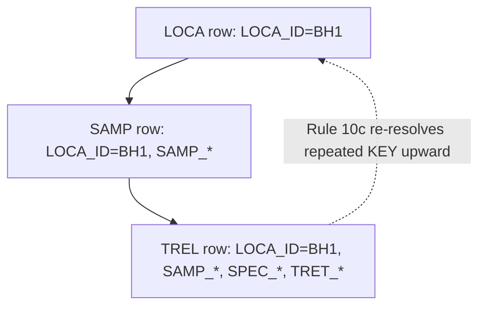

# denormalised child rows

## Definition
> [!quote] `spec:AGS4-4.2-2025.pdf`

AGS files are denormalised: a child group repeats its parent's KEY headings in every row (e.g. SAMP carries LOCA_ID; TREL carries LOCA_ID+SAMP_*+SPEC_*+TRET_*). Rule 10c requires each repeated KEY-tuple to exist in the parent. The model is a flat-file projection of the §3.1 hierarchy.

## Why it matters
AGS is a flat-file projection of a hierarchy: every child row repeats its parent's KEY columns. Rule 10c exists precisely because of this denormalisation — it re-checks the repeated tuple resolves upward. It is why the validator needs an effective-dictionary parent map, not just per-row checks.

## Diagram

## Where it shows up
Load-bearing across the rule families that depend on it — followed end-to-end by the [[traceability-chain]] and surfaced as deltas in [[parity-model]].

## Related
[[start-here]] · [[parity-model]] · [[rule-families]]
