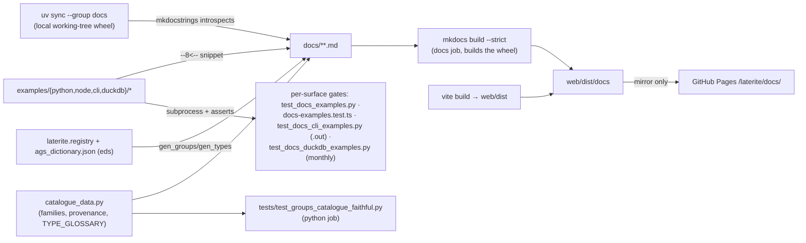

# laterite docs site (MkDocs, example-led)

## Definition

The laterite suite's documentation website (#201): **MkDocs + Material**, sources
under `repo:web/docs-site/`, published at **`/laterite/docs/`** on the *same*
GitHub Pages artifact as the [[validator-site]] app — `mkdocs.yml` sets
`site_dir: ../dist/docs`, so the static site lands under `web/dist` (the dir the
Pages workflow uploads) and rides alongside the validator SPA at `/laterite/`.

Key facts:

- **Example-led / single-sourced.** Every code snippet on a page is
  `--8<--`-included (pymdownx.snippets, `base_path: [examples]`) from
  `repo:web/docs-site/examples/{python,node,cli,duckdb}/` — and each tree has a
  **runtime gate** so page and test are the same bytes (#373 built the three
  non-Python trees; a changed return shape / dtype / printed format / method
  name turns a doc snippet **red in CI** — the example-first analogue of the
  OBSERVATIONS / `.pyi` drift gates):
  - *python* — `repo:tests/test_docs_examples.py` runs each `ex*.py` as a
    subprocess against the installed wheel + the committed
    `repo:examples/sample_site.ags` fixture (`cwd` = repo root, so the literal
    `"examples/sample_site.ags"` path resolves); in-file `assert`s pin outputs.
  - *node* — `repo:rust-packages/laterite-node/test/docs-examples.test.ts`
    (vitest, existing `node` job) runs each `ex*.mjs` the same way; the
    examples' literal `import … from "laterite"` resolves via a gitignored
    `node_modules/laterite` symlink beside them (the pack-smoke trick — ESM
    ignores `NODE_PATH`, and self-reference only works inside the package dir).
  - *cli* — `repo:tests/test_docs_cli_examples.py` runs each `*.sh` with the
    release `lat` on `PATH` (skipif not built, the `test_laterite.py`
    idiom), from a **temp dir** (scripts mint dirty files / certs), asserting
    the `# expect-exit: N` code and **byte-equality of stdout vs a committed
    sibling `.out`** — pages include the `[start:cmd]` section + the `.out`
    verbatim, so even the *output* blocks can't lie (the old hand-typed CLI
    table had already drifted from the binary's real box-drawing output).
  - *duckdb* — `repo:tests/test_docs_duckdb_examples.py`, env-gated on
    `LATERITE_DUCKDB_EXT`; per-PR the `.sql` files are include-checked only
    (`--strict` + `check_paths`), the **monthly `compliance-report.yml`** runs
    them live against the from-source extension (fail-soft: ABI drift = visible
    skip, broken snippet = red). `_`-prefixed files (`_install.sql`) are
    include-only boilerplate.
  Browser tabs are **prose** (the web app has no user-facing code API).
- **Changelog page — generated, version-stamped (#372).** `reference/changelog.md`
  is built by `repo:web/docs-site/scripts/gen_changelog.py` (a `gen-files` script)
  from the repo-root `CHANGELOG.md` plus the shipped version read from
  `packages/laterite/pyproject.toml` — **both derived at build**, so the page
  can't drift and needs no stamping. Repo-relative links are rewritten to the
  public mirror so `--strict` passes. Before this the release notes were invisible
  on the site (root-only `CHANGELOG.md`, no nav); now merging a release republishes
  the docs (deploy-on-master) showing the new version + notes — the docs are part
  of the release without a tag gate (a doc fix still ships immediately).
- **API reference — runtime mkdocstrings against the local wheel.** The
  `reference/api.md` + `reference/modules.md` pages are generated by
  **mkdocstrings**, which **introspects the installed `laterite` wheel** at build
  time. The build wheel is the **local working-tree build** (`uv sync --group
  docs` — so the docs track HEAD, not the last release), the owner's call over a
  published-PyPI wheel. The public-surface docstrings were swept (#215) from
  Sphinx inline roles (`:func:`x``) to mkdocstrings **cross-reference links**
  (`[`x`][laterite.x]`); `show_if_no_docstring` exposes the native PyO3 members
  (e.g. `Report.count`) so their anchors resolve.
- **Group catalogue + AGS data-type glossary (#201), generated not committed.**
  `reference/groups/` is one deep-linkable page per AGS4 group plus a paginated,
  filterable master table; `reference/types.md` is the AGS data-type glossary. Both
  are built at `mkdocs build` (`mkdocs-gen-files`: `gen_groups.py` / `gen_types.py`)
  from two sources: **`laterite.registry`** (the real KEY tuples / inheritance) and
  the **single-source union `ags_dictionary.json`** read directly for **edition
  provenance** — each group/heading carries an `eds` array, so the catalogue derives
  "added in 4.x" / "removed in 4.x" (the registry serves only the latest-edition
  union and drops `eds`/`by_ed`). The shared, side-effect-free
  `repo:web/docs-site/scripts/catalogue_data.py` holds the **family taxonomy**, the
  provenance helpers, and `TYPE_GLOSSARY` (sourced from the standard dictionary's
  `TYPE` group + the `laterite-types` canonical mapping; heading tables deep-link
  each type code to its anchor). Pages are **NOT committed** (no 174-file churn per
  dict edit), so the drift guard is a pytest gate not a snapshot:
  `repo:tests/test_groups_catalogue_faithful.py` (python job) asserts every group
  has a family, every declared family is non-empty, every *used* type code is
  documented, and provenance derives correctly — the catalogue-side analogue of the
  dictionary / OBSERVATIONS faithfulness gates. The paginate / filter / family-card
  / "show all" UX is vanilla JS (`repo:web/docs-site/docs/javascripts/catalogue.js`),
  CDN-free.
- **Two CI gates, both via `ci.yml`'s `changes`-job filter** (see
  ci-and-runners):
  - *Build half* — the `docs` job `uv sync --group docs` (builds the local wheel
    + mkdocs-material + mkdocstrings; Rust toolchain + sccache make it a warm-
    cache hit) then `mkdocs build --strict`, so `--strict` fails on a broken
    internal link, missing nav page, unresolved snippet file, **or a broken
    autodoc cross-reference**. The `docs` filter includes
    `packages/laterite/python/**` so a docstring rename re-runs it.
  - *Runtime half* — `web/docs-site/examples/**` + `examples/sample_site.ags` sit
    in the `code` filter, so editing an example or the shared fixture re-runs
    the python + CLI example gates in the `python` job (which has the compiled
    wheel + `lat`); `web/docs-site/examples/node/**` + the fixture also
    sit in the `node` filter so Node-snippet edits re-run the vitest gate. The
    duckdb gate's per-PR leg is include-check only (runtime is monthly, above).
- **Deploy.** The mkdocs build in
  `repo:.github/workflows/deploy-validator.yml` deploys the docs to the public
  Pages site (`/laterite/docs/`). The build is deliberately **non-strict** — a
  docs link nit must never block the app deploy; the strict gate is the PR-time
  `docs` job above.
- **Structure** (`mkdocs.yml` `nav`): Home · **Learn** (ordered tutorial) ·
  **Cookbook** (task-indexed recipes, grouped Reading/Validating/Querying/
  Producing/Repairing/Sharing) · **Chaining** showcase · **Concepts** ·
  **Reference** (CLI · **Python API** (mkdocstrings) · **AGS data types**
  (glossary) · **Group catalogue** (generated, 174 pages) · **Support modules** ·
  Python cheatsheet). Phase 1 = the MVP (#281); Phase 2 = the 16 per-recipe
  cookbook pages + 7 concept pages (#283); the Python API reference + #215
  docstring sweep, then the group catalogue + type glossary, landed next.

> [!warning] Material wraps tables at runtime — verify docs JS/CSS in a real browser
> Material re-parents every table into a `.md-typeset__table` wrapper **at runtime**,
> so custom docs JS must not assume the table is a direct child of its markdown
> container — `wrap.prepend(node)`, **not** `insertBefore(node, table)` (the latter
> throws `NotFoundError` and silently aborts init). That same wrapper is
> `display: inline-block`, so a table narrower than the content column left-aligns
> and leaves an **asymmetric right-gutter**; the fix is site-wide
> `.md-typeset__table { display: block }` + `> table { min-width: 100% }` (min-width,
> so genuinely wide tables still overflow-scroll). A **static-HTML DOM shim misses
> the runtime wrap** and passes while the live page is broken — verify docs JS/CSS
> against the *served* site with **headless Playwright** (measure computed geometry /
> `getBoundingClientRect`), not a hand-built DOM. `localhost` is blocked in the
> in-browser MCP tool, so Playwright against `mkdocs serve` is the path (restart
> serve after a CSS edit — its file-watch can go stale).

> [!note] Deferred (the Phase-2 tail)
> Done: the **Python** API reference (mkdocstrings), the **group catalogue** +
> **AGS data-type glossary** (generated from the registry/dictionary and
> content-gated), and the **Node / CLI / DuckDB example trees + gates** (#373,
> which tabbed the high-value cookbook recipes). **#380 finished the tail:** the
> remaining recipes (filter-select / borehole / diff / build-from-frames /
> build-from-typed-graph / list-rules) are now tabbed with newly-gated
> Node/DuckDB/CLI examples, and the transport **lock/unlock** round-trip is gated
> too (a scrypt-`log_N`-18 example — the Node docs gate's per-example timeout was
> raised to 90 s for the CI-container KDF thrash, the #369 lesson). So **all 16
> cookbook recipes are tabbed + every published snippet is executed in CI**; the
> #201 `validate-anywhere.md` synced-tabs prototype was retired (its hand-inlined
> snippets superseded by the gated `validate-a-delivery` recipe — [[reliquary]]
> #17). Still pending: **TypeDoc** for Node (static `.d.ts`, no wheel), the
> generated **rules / typed-graph** catalogues, and the **molab** `/try/` embed.

## Why it matters

A born-typed, fluent API is only as good as its discoverability. The example-led +
CI-gated design is the same "the authority enforces its own doc" philosophy as the
dictionary-faithfulness and `OBSERVATIONS` gates: the docs **cannot drift** from
the shipping API because every published snippet is executed in CI, and the strict
link gate stops the prose from rotting. It is a public surface, so it deploys from
the mirror only — keeping the private preview free of the docs.

## Diagram

## Where it shows up

- ci-and-runners — the `docs` job + the `code`/`docs` `changes`-filter entries.
- [[validator-site]] — shares the Pages artifact + `deploy-validator.yml`.
- [[playwright-e2e]] — the sibling "gate the real shipped artifact" pattern.

## Related
- ci-and-runners
- [[validator-site]]
- [[playwright-e2e]]
