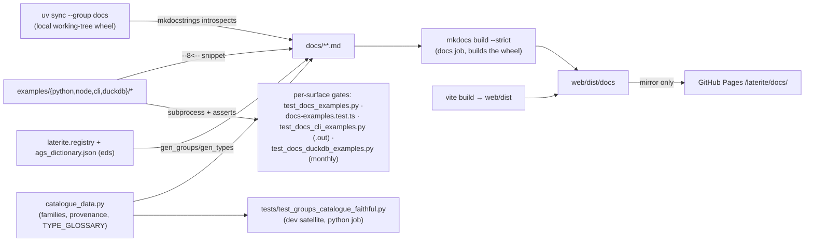

# laterite docs site (MkDocs, example-led)

## Definition

The laterite suite's documentation website (#201): **MkDocs + Material**, sources
under `repo:web/docs-site/`, published at **`/laterite/docs/`** on the *same*
GitHub Pages artifact as the [[validator-site]] app — `mkdocs.yml` sets
`site_dir: ../dist/docs`, so the static site lands under `web/dist` (the dir the
Pages workflow uploads) and rides alongside the validator SPA at `/laterite/`.

Key facts:

- **Example-led / single-sourced — but not universally.** *Most* code on a page is
  `--8<--`-included (pymdownx.snippets, `base_path: [examples]`) from
  `repo:web/docs-site/examples/{python,node,cli,duckdb,wasm}/` — and each tree
  has a **runtime gate** so page and test are the same bytes (#373 built the
  three non-Python trees, #228 added the wasm one; a changed return shape / dtype / printed format / method
  name turns a doc snippet **red in CI** — the example-first analogue of the
  OBSERVATIONS / `.pyi` drift gates):
  - *python* — `repo:tests/test_docs_examples.py` runs each `ex*.py` as a
    subprocess against the installed wheel + the committed
    `repo:examples/sample_site.ags` fixture (`cwd` = repo root, so the literal
    `"examples/sample_site.ags"` path resolves); in-file `assert`s pin outputs.
  - *node* — `repo:rust-packages/laterite-node/test/docs-examples.test.ts`
    (vitest, existing `node` job) runs each `ex*.mjs` the same way; the
    examples' literal `import … from "laterite"` resolves via a gitignored
    `node_modules/laterite` symlink beside them (the pack-smoke trick — ESM
    ignores `NODE_PATH`, and self-reference only works inside the package dir).
  - *cli* — `tests/test_docs_cli_examples.py` (dev satellite) runs each `*.sh` with the
    release `lat` on `PATH` (skipif not built, the `test_laterite.py`
    idiom), from a **temp dir** (scripts mint dirty files / certs), asserting
    the `# expect-exit: N` code and **byte-equality of stdout vs a committed
    sibling `.out`** — pages include the `[start:cmd]` section + the `.out`
    verbatim, so even the *output* blocks can't lie (the old hand-typed CLI
    table had already drifted from the binary's real box-drawing output). It
    drifted the same way a SECOND time, in the blocks this gate never covered
    because no example backed them: `learn/install.md` — the first page a new
    user reads — printed its findings table as plain ASCII pipes, which is what
    the WHEEL's Python `lat` renders, on a page documenting the Rust binary. The
    row's content was right, so somebody ran it once; nothing re-ran it. Wiring
    a block to an example is therefore not bookkeeping, and an *unwired* output
    block is the actual risk surface — see the orphan-block note below.
  - *duckdb* — `tests/test_docs_duckdb_examples.py` (dev satellite), env-gated on
    `LATERITE_DUCKDB_EXT`; per-PR the `.sql` files are include-checked only
    (`--strict` + `check_paths`), the **monthly `compliance-report.yml`** runs
    them live against the from-source extension (fail-soft: ABI drift = visible
    skip, broken snippet = red). `_`-prefixed files (`_install.sql`) are
    include-only boilerplate.
  Browser tabs are **prose** (the web app has no user-facing code API).
- **A Python example is `uv run`-able on its own** — all 18, plus the marimo tour.
  Each carries a PEP 723 `# /// script` header pinning
  `requires-python` and an exact `laterite==<product>`, and the 15 that read a
  file also carry a fixture arm that
  fetches `repo:examples/sample_site.ags` from the raw GitHub URL when the
  repo-relative path is absent — so a reader with `uv` and no checkout gets a
  working run, and the code on the page stays the code you would type in a
  checkout rather than an absolute path. Two details the rollout settled that the
  prototype could not show, because `ex01` is polars-only and reads the fixture:
  `ex09a`, `ex09b` and `ex15` build from frames / a typed graph / inline text and
  get **no** fixture arm (there is nothing to fetch for), and `ex05` + `ex11`
  import pandas — which is NOT in the base install — so they pin
  `laterite[compat]==<product>`. A uniform bare pin makes both die under
  `uv run` on `ModuleNotFoundError: pandas`, the exact failure the header exists
  to prevent. Header and fixture arm live ABOVE a
  `--8<-- [start:code]` marker and the page includes `…py:code`, so the rendered
  snippet is byte-identical to before the header existed; the machinery is in the
  file, not on the page. That is the CLI tree's `[start:cmd]` trick
  (`repo:web/docs-site/examples/cli/validate_clean.sh`) applied to Python.
  The arm is cold in CI (cwd = repo root, the fixture is there), so no gate
  acquires a network dependency. The pin is a CLAIM — "green against this wheel" —
  and `repo:tests/test_version_faithful.py` holds both it and the interpreter
  floor to the shipped values by DISCOVERY over **both** example trees, the
  docs corpus and the root `examples/` where the tour lives. It asserts the whole
  specifier (`==<product>`, extras group allowed), not the version inside a `==`:
  the first cut matched `laterite==(version)`, which silently passes anything that
  is not an exact pin, so the tour's own `>=0.5.0` — five untested minors, the
  defect that motivated the gate — produced no match and therefore no finding.
  `bump-version.sh` restamps with a substitution anchored on the pin *including*
  its optional `[extras]`; the sibling loop that stamps `.out` files rewrites
  every occurrence of the old version in a file, which is safe in generated
  output and would silently rewrite an `assert` in a source.
  Ordering forces `import laterite` to follow the fixture arm, so
  `web/docs-site/examples/**` takes the `E402` per-file-ignore the root
  `examples/**` already has — the alternative is publishing a snippet that omits
  its own import to satisfy a linter.
- **The other 22 fences — hand-written, and gated separately.** The list above is
  the *included* half: 38 of the site's 60 Python fences. The rest are LITERAL —
  fragments a page writes inline (`for group in delta["groups"]:`), which read
  correctly as fragments and would be worse as standalone examples. Every gate
  above keys off the `--8<--`, so all of them were invisible to it, as were
  `repo:README.md`, the PyPI landing page and `repo:COMPAT.md`. What that cost was
  measured on 2026-08-08: `COMPAT.md` documented
  `check_file(..., dictionary=...)` in both blocks of its error-handling section,
  and no such parameter has ever existed in either library
  (`standard_AGS4_dictionary` is the name), so the two snippets illustrating the
  divergence raised `TypeError` on both sides and demonstrated nothing. The prose
  was right; only the code was uncopyable.
  `repo:tests/test_docs_snippets.py` closes it by treating a page as ONE program
  in document order — includes replayed so a fragment inherits the `ags` / `fixed`
  its page established — EXECUTING what can run (85% of literal statements) and
  resolving names + call keywords against the wheel for the rest. It runs from a
  temp dir with the fixture copied under `examples/`, like the CLI gate and for
  the same reason: `surfaces/python.md` and `cookbook/excel.md` WRITE files.
  A `<!-- doc-snippet: skip — reason -->` marker (the shape of `doc-output: skip`,
  reason likewise mandatory) exempts a fence from execution but never from
  resolution — the `dictionary=` typo lived in a block that would carry one.
- **Node's literal fences, and the two-gate split.** The same hole existed one
  surface along: 11 hand-typed fences plus the npm landing page's 4, none
  executed. `repo:rust-packages/laterite-node/test/docs-snippets.test.ts` closes
  it — vitest, not pytest, because executing them needs `dist/` and the
  `node_modules/laterite` symlink that only the `node` job builds; a pytest
  version would skip in CI, which `test_docs_node_api.py` explicitly refused to
  accept. It welds a page into one ESM program (imports unioned per module,
  re-declarations turned into assignment — ESM forbids the rebind Python allows)
  and runs it from a temp cwd with the fixture copied in.
  **The two Node gates catch different things and neither subsumes the other:
  the executor catches CALLS, `repo:tests/test_docs_node_api.py` catches READS.**
  A bare `report.someTypo` evaluates to `undefined` and logs rather than throwing,
  so no amount of executing finds it; `buildAgs4({…})` with the wrong shape throws,
  and no amount of name-resolution finds that. Falsification proved the split and
  exposed a hole in passing — the static gate scanned `docs/node/` only, leaving
  the npm README covered by neither — so its scope now includes that page.
- **Orphan output blocks — down to one, and it is not output.** `--check-pages`
  counts `text` fences that no example backs and prints the number rather than
  absorbing it; that count was **8** and is now **1**. The seven closed were
  hand-written stdout on `learn/install.md`, `concepts/severity-tiers.md` and
  `concepts/one-engine-many-doors.md`, and one of them had drifted into the wrong
  renderer entirely (above). The survivor is `chaining/index.md`'s ASCII flow
  diagram — a `text` fence that is a *drawing*, not the output of anything, so it
  is correctly and permanently unwired. Worth stating so nobody "fixes" it: the
  right target is **zero gateable orphans**, not zero orphans.
- **One nightly leg asks the READER's question.** Every gate above runs against the
  working-tree cdylib, so all of them answer "is the site consistent with HEAD" —
  and the reader is not on HEAD, they are on `pip install laterite`. The
  `docs-vs-released-wheel` job in `repo:.github/workflows/nightly.yml` installs the
  **published** wheel (no pin — whatever PyPI resolves today) and runs the docs
  examples plus `repo:tests/test_docs_snippets.py` against it, printing the
  released version beside this tree's so the run states what it measured.
  Its two steps are calibrated differently and that is the whole design: an
  example that **fails to run** fails the job, because a reader following the live
  site would get a traceback; a committed `.out` that no longer byte-matches is
  reported and **not** fatal, because output drift is the ordinary consequence of
  the tree being ahead of the release. For the same reason the job is deliberately
  **not** in `notify`'s `needs` — the docs track HEAD by decision and the site
  deploys from main, so documenting unreleased API is a chosen state, and a gate
  that files a tracking issue about a choice already made is noise that gets muted.
  GitHub-hosted and toolchain-free: a published wheel needs no Rust and no maturin.
- **Changelog page — generated, version-stamped (#372).** `reference/changelog.md`
  is built by `web/docs-site/scripts/gen_changelog.py` (a `gen-files` script)
  from the repo-root `CHANGELOG.md` plus the shipped version read from
  `packages/laterite/pyproject.toml` — **both derived at build**, so the page
  can't drift and needs no stamping. Repo-relative links are rewritten to the
  public mirror so `--strict` passes. Before this the release notes were invisible
  on the site (root-only `CHANGELOG.md`, no nav); now merging a release republishes
  the docs (deploy-on-master) showing the new version + notes — the docs are part
  of the release without a tag gate (a doc fix still ships immediately).
- **API reference — runtime mkdocstrings against the local wheel.** The
  `reference/api.md` + `reference/modules.md` pages are generated by
  **mkdocstrings**, which **introspects the installed `laterite` wheel** at build
  time. The build wheel is the **local working-tree build** (`uv sync --group
  docs` — so the docs track HEAD, not the last release), the owner's call over a
  published-PyPI wheel. The public-surface docstrings were swept (#215) from
  Sphinx inline roles (`:func:`x``) to mkdocstrings **cross-reference links**
  (`[`x`][laterite.x]`); `show_if_no_docstring` exposes the native PyO3 members
  (e.g. `Report.count`) so their anchors resolve.
- **Group catalogue + AGS data-type glossary (#201), generated not committed.**
  `reference/groups/` is one deep-linkable page per AGS4 group plus a paginated,
  filterable master table; `reference/types.md` is the AGS data-type glossary. Both
  are built at `mkdocs build` (`mkdocs-gen-files`: `gen_groups.py` / `gen_types.py`)
  from two sources: **`laterite.registry`** (the real KEY tuples / inheritance) and
  the **single-source union `ags_dictionary.json`** read directly for **edition
  provenance** — each group/heading carries an `eds` array, so the catalogue derives
  "added in 4.x" / "removed in 4.x" (the registry serves only the latest-edition
  union and drops `eds`/`by_ed`). The shared, side-effect-free
  `repo:web/docs-site/scripts/catalogue_data.py` holds the **family taxonomy**, the
  provenance helpers, and `TYPE_GLOSSARY` (sourced from the standard dictionary's
  `TYPE` group + the `laterite-ags4-types` canonical mapping; heading tables deep-link
  each type code to its anchor). Pages are **NOT committed** (no 174-file churn per
  dict edit), so the drift guard is a pytest gate not a snapshot:
  `tests/test_groups_catalogue_faithful.py` (dev satellite, python job) asserts every group
  has a family, every declared family is non-empty, every *used* type code is
  documented, and provenance derives correctly — the catalogue-side analogue of the
  dictionary / OBSERVATIONS faithfulness gates. The paginate / filter / family-card
  / "show all" UX is vanilla JS (`repo:web/docs-site/docs/javascripts/catalogue.js`),
  CDN-free.
- **Two CI gates, both via `ci.yml`'s `changes`-job filter** (see
  ci-and-runners):
  - *Build half* — the `docs` job `uv sync --group docs` (mkdocs-material +
    mkdocstrings) then `mkdocs build --strict`, so `--strict` fails on a broken
    internal link, missing nav page, unresolved snippet file, **or a broken
    autodoc cross-reference**. It is a **pure Python job**: it downloads the
    cdylib `build-ext` already produced rather than compiling one, so there is no
    Rust toolchain and no sccache in it — `repo:.github/workflows/ci.yml` says so
    at the step ("No Rust toolchain / build-accel here any more"). The `docs` filter includes
    `packages/laterite/python/**` so a docstring rename re-runs it.
  - *Runtime half* — `web/docs-site/examples/**` + `examples/sample_site.ags` sit
    in the `code` filter, so editing an example or the shared fixture re-runs
    the python + CLI example gates in the `python` job (which has the compiled
    wheel + `lat`); `web/docs-site/examples/node/**` + the fixture also
    sit in the `node` filter so Node-snippet edits re-run the vitest gate. The
    wasm tree has its own per-PR leg in the `web` job — `gen_doc_outputs.py
    --check --surface wasm` — on `web/**` + `rust-packages/**`. The duckdb
    gate's per-PR leg is include-check only (runtime is monthly, above).
- **Deploy.** The mkdocs build in
  `repo:.github/workflows/deploy-validator.yml` deploys the docs to the public
  Pages site (`/laterite/docs/`). The build is deliberately **non-strict** — a
  docs link nit must never block the app deploy; the strict gate is the PR-time
  `docs` job above.
- **Structure** (`mkdocs.yml` `nav`): Home · **Learn** (ordered tutorial) ·
  **Cookbook** (task-indexed recipes, grouped Reading/Validating/Querying/
  Producing/Repairing/Sharing) · **Chaining** showcase · **Concepts** ·
  **Reference** (CLI · **Python API** (mkdocstrings) · **AGS data types**
  (glossary) · **Group catalogue** (generated, 174 pages) · **Support modules** ·
  Python cheatsheet). Phase 1 = the MVP (#281); Phase 2 = the 16 per-recipe
  cookbook pages + 7 concept pages (#283); the Python API reference + #215
  docstring sweep, then the group catalogue + type glossary, landed next.

> [!warning] Material wraps tables at runtime — verify docs JS/CSS in a real browser
> Material re-parents every table into a `.md-typeset__table` wrapper **at runtime**,
> so custom docs JS must not assume the table is a direct child of its markdown
> container — `wrap.prepend(node)`, **not** `insertBefore(node, table)` (the latter
> throws `NotFoundError` and silently aborts init). That same wrapper is
> `display: inline-block`, so a table narrower than the content column left-aligns
> and leaves an **asymmetric right-gutter**; the fix is site-wide
> `.md-typeset__table { display: block }` + `> table { min-width: 100% }` (min-width,
> so genuinely wide tables still overflow-scroll). A **static-HTML DOM shim misses
> the runtime wrap** and passes while the live page is broken — verify docs JS/CSS
> against the *served* site with **headless Playwright** (measure computed geometry /
> `getBoundingClientRect`), not a hand-built DOM. `localhost` is blocked in the
> in-browser MCP tool, so Playwright against `mkdocs serve` is the path (restart
> serve after a CSS edit — its file-watch can go stale).

> [!note] Deferred (the Phase-2 tail)
> Done: the **Python** API reference (mkdocstrings), the **group catalogue** +
> **AGS data-type glossary** (generated from the registry/dictionary and
> content-gated), and the **Node / CLI / DuckDB example trees + gates** (#373,
> which tabbed the high-value cookbook recipes). **#380 finished the tail:** the
> remaining recipes (filter-select / borehole / diff / build-from-frames /
> build-from-typed-graph / list-rules) are now tabbed with newly-gated
> Node/DuckDB/CLI examples, and the transport **lock/unlock** round-trip is gated
> too (a scrypt-`log_N`-18 example — the Node docs gate's per-example timeout was
> raised to 90 s for the CI-container KDF thrash, the #369 lesson). So **all 16
> cookbook recipes are tabbed + every published snippet is executed in CI**; the
> #201 `validate-anywhere.md` synced-tabs prototype was retired (its hand-inlined
> snippets superseded by the gated `validate-a-delivery` recipe — [[reliquary]]
> #17). Still pending: **TypeDoc** for Node (static `.d.ts`, no wheel), the
> generated **rules / typed-graph** catalogues, and the **molab** `/try/` embed.

## Why it matters

A born-typed, fluent API is only as good as its discoverability. The example-led +
CI-gated design is the same "the authority enforces its own doc" philosophy as the
dictionary-faithfulness and `OBSERVATIONS` gates: the docs **cannot drift** from
the shipping API because every published snippet is executed in CI, and the strict
link gate stops the prose from rotting. It is a public surface, so it deploys from
the mirror only — keeping the private preview free of the docs.

## Diagram

## Where it shows up

- ci-and-runners — the `docs` job + the `code`/`docs` `changes`-filter entries.
- [[validator-site]] — shares the Pages artifact + `deploy-validator.yml`.
- [[playwright-e2e]] — the sibling "gate the real shipped artifact" pattern.

## Related
- ci-and-runners
- [[validator-site]]
- [[playwright-e2e]]
