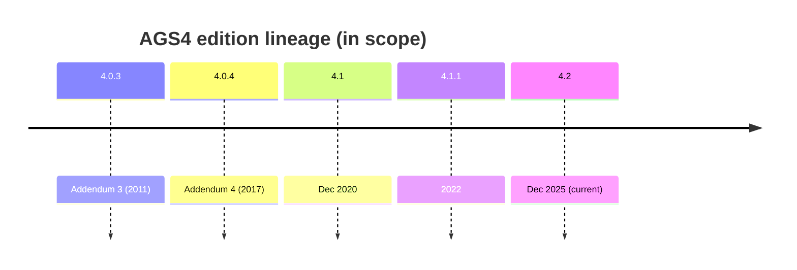

# edition resolution

## Definition
> [!quote] lib.rs::resolve_dict_version(over, tran_ags) → (DictVersion, DictResolution). TRAN_AGS-driven: exact match → ExactTranAgs; major.minor guess → GuessedPatch (bare '4'→4.0.4 newest-patch, O-30); unknown 4.x → Fallback V4_1_1; AGS3 → UnsupportedEdition (refused, O-30). dict_resolution recorded per file so a batch distinguishes genuine vs fallback editions.

## Why it matters
Load-bearing for the test strategy: this is how the validator (or the parity harness) actually behaves — gaps surface as deltas against the spec (Phase A) and python-ags4 (Phase C/D). The full design rationale behind the deliberate python divergences (corpus evidence, rejected alternatives) is [[dec-edition-selection]].

## The generated authority

The edition set itself — `4.0.3, 4.0.4, 4.1, 4.1.1, 4.2` — is not a list
anywhere. `DictVersion::{ALL, as_str, from_edition}` + `FALLBACK` are
emitted by the reference leaf's `build.rs` from `ags_dictionary.json`
(`repo:rust-packages/laterite-ags4-reference/src/dict.rs`, re-exported as
`laterite_ags4_validator::dict`) — the *same* authority
`resolve_dict_version` above resolves a file's `TRAN_AGS` against. The
resolver always asked it correctly; the gap was everywhere else that
needed the closed set of valid `--dict-version` strings.

> [!bug] Until 2026-07 the set was **hand-copied roughly nine times**: three
> separate `match` arms re-listed the five editions instead of asking
> `DictVersion::from_edition` — `lat`'s own `--dict-version` flag
> (`laterite-cli/src/commands/common.rs`), `laterite-py`'s
> `emit_typed.rs` (a *second*, hand-written edition parser sitting in the
> same crate as `lib.rs::parse_dv`, which already asked the authority),
> and `laterite-ags4-corpus-qa`'s `validate.rs`. The sharpest trap was the CLI's:
> its rejection **message** was generated (`editions_joined("|")`) while
> its match **arms** were not — so bundling a new edition would have
> shipped a `lat` that rejects that edition with an error message
> advertising it as one of the values it expects. Nothing failed, because
> nothing compared the two. Fixed by convergence, not policing: all three
> now call `DictVersion::from_edition`; `emit_typed.rs`'s hard-coded
> `auto → V4_1_1` became the generated `FALLBACK` (same value, now
> traceable to its source). New projections close the host-language half
> of the same gap — PyO3 `registry_editions()` /
> `registry_fallback_edition()` and napi `editions()` / `fallbackEdition()`
> both project `DictVersion::ALL`/`FALLBACK`, so `_cli.py`'s
> `_DICT_CHOICES` is now `("auto", *_native.registry_editions())` instead
> of a fourth hand-written tuple. See [[data-single-source-audit]] (row 2,
> extended) for the full register entry, and `test_editions_single_source.py`
> / `every_bundled_edition_is_accepted` for the tests written for the day the
> dictionary bundles another edition — they pass trivially today, but go red
> the moment anyone reintroduces a hand-list.

> [!done] **Extended (#923, 2026-09-05).** The sweep above converged the
> *parsers* but not every *fallback site*, so this page over-claimed the
> close: two `laterite-node` emit doors kept `.unwrap_or(DictVersion::V4_1_1)`
> (in a file that used `dict::FALLBACK` correctly at five other sites), and
> Python's `build_ags4` hand-coded `dict_version = "4.1.1"` while the sibling
> unchecked door passed `None` through. Both were symptoms of the same fork:
> "auto" had grown **two semantics** — the check doors defer it (resolve from
> `TRAN_AGS`), the emit doors collapse it to the fallback — and no shared
> parser could serve both once it had already decided. The fix is the pair in
> `laterite_ags4_emit::hostopts`: `edition()` keeps `auto` deferrable,
> `edition_or_fallback()` collapses to the generated `dict::FALLBACK`; every
> surface (py, node, wasm, the CLI, the facade — and corpus-qa's
> `--dict-version`, whose *error text* was the last hand-written list) now
> calls one of those two. See [[data-single-source-audit]] row 2 for the full
> register entry.

[[surface-census]] is what makes the convergence checkable *across
launchers* rather than just within one crate: it gained a second table
(`editions` + `fallback_edition`) diffing the native binary, `uvx`, and
`npx` against each other, gated by a `census_version` the generator
refuses to trust from an older-schema launcher — a stale-but-answering
`lat` reporting an empty table is otherwise indistinguishable from "no
drift", which is a real failure mode it was built to catch (a release
binary one commit old did exactly that).

> [!done] **Closed 2026-07-17 (laterite-dev#529, the web remainder of laterite-dev#509, part of the
> laterite-dev#527 convergence arc).** The web app doesn't front `lat` at all, so the
> census could never reach it — but the same hand-copy risk existed one
> layer up: the five editions were hand-listed in **four** TS files
> (`web/src/lib/settings.ts`'s `DICTS`, `validator.ts`'s `DictVersionOpt`
> union, `Controls.tsx`'s `DICT_VERSIONS` dropdown array,
> `ExportPane.tsx`'s `EDITIONS`/`Edition`), edited in lockstep by hand — and
> had already drifted: all four had grown a stray `"4.2"` beyond the
> audit's stated `"4.1.1"`, and `ExportPane.tsx`'s list was a different
> length (5 vs 6) from the other three. A new generator,
> `tools/gen_web_editions.py` (dev satellite — the emitted
> `web/src/lib/editions.ts` is committed here, the generator is not), reads
> the union `ags_dictionary.json`'s own
> `editions` array (this same `DictVersion::from_edition` authority) and
> emits a committed `web/src/lib/editions.ts` — **the first generated
> source under `web/src`** — exporting `EDITIONS` (the editions),
> `DICT_VERSIONS` (the web-only `"auto"` sentinel + editions), and the
> derived `Edition`/`DictVersionOpt` types. Generated rather than a runtime
> read on purpose: `web/src/lib/dict.ts` already fetches the union JSON,
> but only asynchronously, and settings validation runs before that fetch
> resolves (and before wasm loads) — the list has to be available
> synchronously. All four sites now import from it (`validator.ts`
> re-exports `DictVersionOpt`, so its ~9 importers are unchanged).
> `tests/test_web_editions_match_generator.py` (dev satellite) re-runs it and
> asserts byte-equality with the committed file, *plus* an independent
> check that the committed file lists exactly the union's editions — so a
> generator bug that drops or reorders an edition can't hide behind
> agreeing with its own buggy output; `web/src/lib/editions.test.ts`
> (vitest) pins the runtime shape the four consumers rely on.

## Diagram

## Where it shows up
Load-bearing across the rule families that depend on it — followed end-to-end by the [[traceability-chain]] and surfaced as deltas in [[parity-model]].

> [!note] `resolve_dict_version` picks *which* edition; [[O-42]]'s `guard_4_0_4`
> can then upgrade that pick based on content. Until 2026-07-14 the guard only
> actually ran on a path read (`check_file_with_dict`) — `laterite-py`/
> `laterite-node`/wasm's bytes/text branches resolved the edition but skipped
> the guard, so the *same* file could resolve differently by modality. Closed
> by [[laterite-ags4-validator]]'s `check_parsed_with_dict`, the door every
> modality now shares for both steps.

## Related
[[start-here]] · [[parity-model]] · [[rule-families]] · [[surface-census]] · [[data-single-source-audit]] · [[laterite-ags4-reference]] · [[dec-edition-selection]] · [[laterite-ags4-validator]] · [[O-42]] · [[dec-custom-dict-overlay]]
