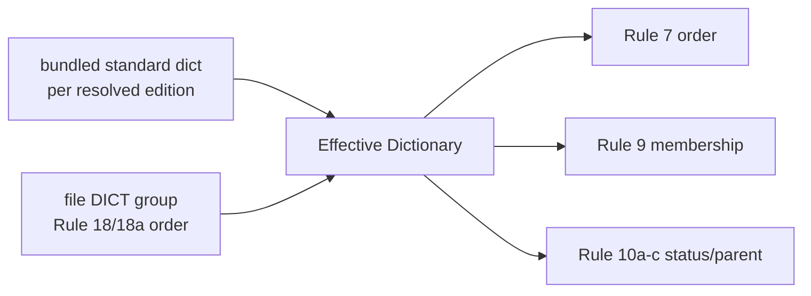

# effective dictionary

## Definition
> [!quote] `spec:AGS4-4.2-2025.pdf`

Validation uses the standard AGS dictionary (§3.6) MERGED with any in-file DICT group (Rule 18/18a) — user-defined groups/headings. The 'effective dictionary' is standard ∪ DICT; Rule 9 keys off this union; Rule 7/19b order off the DICT sequence.

## Why it matters
Rules 7/9/10a-c/19b never validate against the bundled standard dictionary alone — they validate against standard ∪ the file's own DICT group (Rule 18/18a). Mis-merge the DICT overlay and you get false Rule 9s on legitimate user-defined headings (this is exactly the class of false-positive the corpus dogfood guards against).

## Diagram

## Where it shows up
Load-bearing across the rule families that depend on it — followed end-to-end by the [[traceability-chain]] and surfaced as deltas in [[parity-model]].

## Related
[[start-here]] · [[parity-model]] · [[rule-families]]
