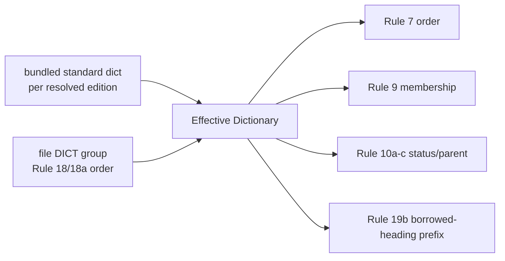

# effective dictionary

## Definition
> [!quote] `spec:AGS4-4.2-2025.pdf`

Validation uses the standard AGS dictionary (§3.6) MERGED with any in-file DICT group (Rule 18/18a) — user-defined groups/headings. The 'effective dictionary' is standard ∪ DICT; Rule 9 keys off this union, Rule 7 orders off the DICT sequence, and Rule 19b resolves a borrowed heading's prefix against the union's *membership* rather than its order.

## Why it matters
Rules 7/9/10a-c/19b never validate against the bundled standard dictionary alone — they validate against standard ∪ the file's own DICT group (Rule 18/18a). Mis-merge the DICT overlay and you get false Rule 9s on legitimate user-defined headings (this is exactly the class of false-positive the corpus dogfood guards against).

**Where each one reads the union**, because one of them is easy to miss: Rules 7 and 9 in `repo:rust-packages/laterite-ags4-validator/src/rules/dictionary.rs`, Rules 10a-c in `repo:rust-packages/laterite-ags4-validator/src/rules/relational.rs` (through its private `EffectiveDict`), and Rule 19b in `repo:rust-packages/laterite-ags4-validator/src/rules/references.rs`, which builds `standard dict ∪ file DICT` per group and again across every group. Rule 19b's *other* half lives in `repo:rust-packages/laterite-ags4-validator/src/rules/naming.rs` and consults no dictionary at all — it is a purely lexical shape check. Reading only the naming module is how a reader concludes 19b does not belong on this list. It does; the dictionary-aware half is one module over.

## Diagram

## Where it shows up
Load-bearing across the rule families that depend on it — followed end-to-end by the [[traceability-chain]] and surfaced as deltas in [[parity-model]].

## Related
[[start-here]] · [[parity-model]] · [[rule-families]]
