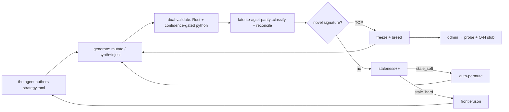

# evolutionary dogfooding

## Definition
> [!quote] The method [[laterite-ags4-forge]] implements: instead of *waiting*
> for a crawl to surface a Rust↔python divergence, **manufacture and
> prove** it. A candidate's *signature* is
> `(parity_tag, rust_rules, python_rules, target_rule)`; **fitness =
> signature novelty** — `RustOnly/PythonOnly/ValidityDisagree`
> (`Parity::is_action`) is TOP and frozen as breeding stock,
> first-seen `KnownDivergence{O-N}` is MED, a seen signature ≈ 0.
> High-fitness specimens breed (re-apply / deepen / crossover) under a
> seeded RNG. A monotone **staleness** counter resets on novelty;
> `stale_soft` → **auto-permute** (escalate operators / rotate the
> target along the [[strat-parity-matrix]] blind-spot backlog);
> `stale_hard` → emit a `frontier.json` and stop. Every TOP finding is
> ddmin-**minimized** to a clean reproducer before it is reported.

## Why it matters
[[strat-parity-matrix]] enumerates **13 rules with zero differential
evidence** (2a, 10a–c, 11a–c, 12, 16/16a, 18/18a, 20-on-disk) — a
direct consequence of [[parity-triage-sampling-bias]] and the minimal
fixtures lacking a relational/ABBR/FILE base. Mode-B synthesis builds
that base then injects exactly one violation, so those rules become
*single-rule-isolable* and provable. The intelligence (which rule,
which operators) is the agent reading this wiki and authoring a
declarative strategy; the binary stays a deterministic, reproducible
executor — "needs a new strategy" is a structured signal, not an
in-binary LLM.

## Diagram

## Where it shows up
[[laterite-ags4-forge]] (`evolve.rs`); pairs with [[parity-confidence-model]]
for *who* reaches the oracle; confirmed findings flow into the
[[strategies/_README|strategies]] register and the §12.5
insight→`OBSERVATIONS.md` O-N path; serves
req-reproducible-conformance-corpus.

## Related
[[parity-model]] · [[parity-confidence-model]] · [[laterite-ags4-forge]] · [[parity-triage-sampling-bias]] · [[parity-cascade-unreconcilable]] · [[strat-parity-matrix]] · req-reproducible-conformance-corpus
