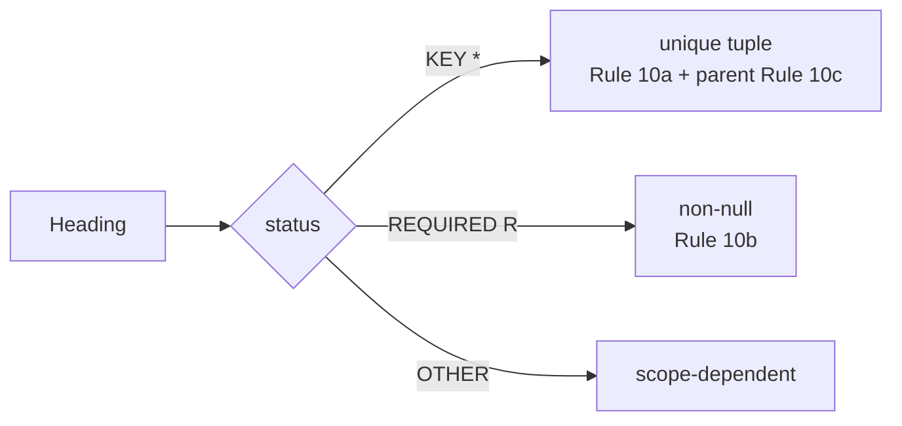

# heading status vocabulary

## Definition
> [!quote] `spec:AGS4-4.2-2025.pdf`

AGS §3.2: status indicator `*` = KEY (all KEY headings present; the KEY-tuple combination per group is unique — Rule 10a); `R` = REQUIRED (data shall not be null — Rules 10b & 12; e.g. TRAN_AGS must carry the edition reference); blank = OTHER (presence dictated by project scope).

## Why it matters
KEY/REQUIRED/OTHER is the spine of Rules 10a/10b/10c — get status wrong and every relational check is wrong. KEY defines identity+parent linkage; REQUIRED defines interpretability; OTHER is scope.

## Diagram

## Where it shows up
Load-bearing across the rule families that depend on it — followed end-to-end by the [[traceability-chain]] and surfaced as deltas in [[parity-model]].

## Related
[[start-here]] · [[parity-model]] · [[rule-families]]
