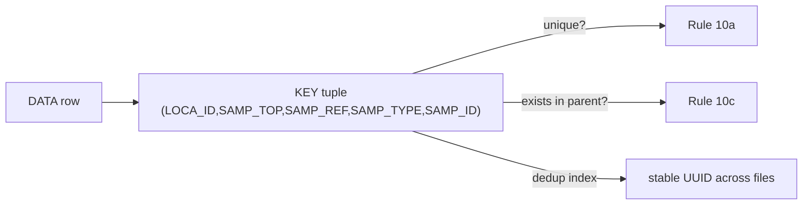

# key tuple pseudo keys

## Definition
> [!quote] `spec:AGS4-4.2-2025.pdf`

AGS §3.2/§3.1 + Rule 10a/10c: each group's identity is the tuple of its KEY (`*`) headings; that combination is unique within the group, and every KEY-tuple must resolve to an equivalent entry in the PARENT group (Rule 10c). This is the relational spine the validator's dedup/parent-resolution implements.

## Why it matters
The KEY-heading tuple is the row's identity (Rule 10a uniqueness) AND its parent link (Rule 10c). The validator/db dedup index keys on this exact tuple — the same tuple resolves to the same UUID across files, which is what makes cross-file merge cheap.

## Diagram

## Where it shows up
Load-bearing across the rule families that depend on it — followed end-to-end by the [[traceability-chain]] and surfaced as deltas in [[parity-model]].

## Related
[[start-here]] · [[parity-model]] · [[rule-families]]
