# parent child graph

## Definition
> [!quote] `spec:AGS4-4.2-2025.pdf`

AGS §3.1: PROJ is the hierarchy root; a group has exactly one parent but many children; child↔parent linked by KEY fields (Rule 10c). **Ten groups are NOT in the hierarchy** (file submission/description): PROJ, TRAN, ABBR, DICT, TYPE, FILE, UNIT, LBSG, PREM, STND. PROJ/TRAN/ABBR/TYPE/UNIT always present (Rules 13-17); DICT if user-defined (Rule 18); FILE if associated files (Rule 20).

## Why it matters
This hierarchy is the model's backbone: [[rule-10c-parent-child]] re-resolves every child's repeated KEY tuple upward through it ([[denormalised-child-rows]]), the validator's `PARENTLESS` set is defined against it ([[non-hierarchy-ten-vs-parentless-list]]), and every cross-edition group add/remove (ERES→ELRG, the 4.2 CPTx series — [[ags4-rules-frozen-dictionary-evolves]]) is a *mutation of this graph while the rules stay frozen*. Read it wrong and Rules 7/9/10a–10c all mis-fire. The diagram is generated mechanically from `ags5_dictionary.json`.

## Diagram

```mermaid
graph TD
  ABBR
  SAMP --> ASDI
  LOCA --> BKFL
  SAMP --> CBRG
  CBRG --> CBRT
  LOCA --> CDIA
  LOCA --> CHIS
  SAMP --> CHOC
  SAMP --> CMPG
  CMPG --> CMPT
  SAMP --> CONG
  SAMP --> CONL
  CONG --> CONS
  LOCA --> CORE
  LOCA --> DCPG
  DCPG --> DCPT
  LOCA --> DETL
  DICT
  LOCA --> DISC
  LOCA --> DOBS
  DPRG --> DPRB
  LOCA --> DPRG
  LOCA --> DREM
  SAMP --> ECTN
  SAMP --> ERES
  LOCA --> FLSH
  LOCA --> FRAC
  SAMP --> GCHM
  LOCA --> GEOL
  SAMP --> GRAG
  GRAG --> GRAT
  LOCA --> HDIA
  LOCA --> HDPH
  LOCA --> HORN
  LOCA --> IPEN
  LOCA --> IPID
  LOCA --> IPRG
  LOCA --> IPRT
  LOCA --> ISAG
  ISAG --> ISAT
  LOCA --> ISPT
  LOCA --> IVAN
  LBSG --> LBST
  SAMP --> LDEN
  SAMP --> LLIN
  SAMP --> LLPL
  SAMP --> LNMC
  PROJ --> LOCA
  SAMP --> LPDN
  SAMP --> LRES
  SAMP --> LVAN
  SAMP --> MCVG
  MCVG --> MCVT
  MONG --> MOND
  LOCA --> MONG
  LOCA --> PIPE
  LOCA --> PLTG
  PLTG --> PLTT
  PMTG --> PMTD
  LOCA --> PMTG
  PMTG --> PMTL
  LOCA --> PTIM
  SAMP --> PTST
  SAMP --> RDEN
  SAMP --> RELD
  SAMP --> RPLT
  SAMP --> RUCS
  SAMP --> RWCO
  LOCA --> SAMP
  SCPG --> SCDG
  SCDG --> SCDT
  LOCA --> SCPG
  SCPG --> SCPT
  SAMP --> SHBG
  SHBG --> SHBT
  TRAN
  SAMP --> TREG
  TRET --> TREL
  SAMP --> TREM
  TREG --> TRET
  SAMP --> TRIG
  TRIT --> TRIL
  TRIG --> TRIT
  TYPE
  UNIT
  SAMP --> WADD
  LOCA --> WETH
  SAMP --> WINS
  WSTG --> WSTD
  LOCA --> WSTG
```

## Where it shows up
Load-bearing across the rule families that depend on it — followed end-to-end by the [[traceability-chain]] and surfaced as deltas in [[parity-model]].

## Related
[[start-here]] · [[parity-model]] · [[rule-families]]
