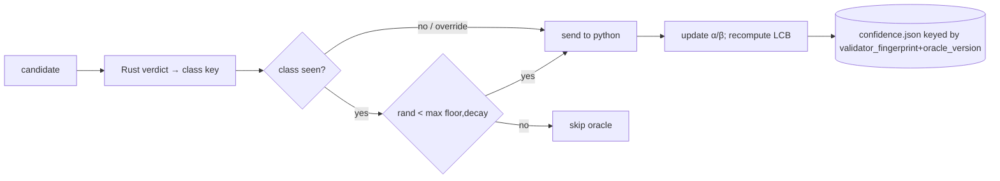

# parity confidence model

## Definition
> [!quote] The adaptive oracle-gating model in [[ags4-forge]]
> (`confidence.rs`) that turns "Rust validates ~10³–10⁴× faster than
> python" into "spend the oracle only where it informs, and **measure**
> how sure we are." Class key = the Rust-side outcome (free for 100%
> of candidates): `(RustResult kind, sorted rust rule-set)`.
> Per-class **Beta–Bernoulli** trust: `α = 1 + agreements`,
> `β = 1 + actions` (agreement = `Agree` or reconciled
> `KnownDivergence`; action = any post-`reconcile` `is_action`).
> Sample probability `p = max(floor, decay(n, lcb))` using the
> **conservative lower credible bound**; an unseen class ⇒ `p = 1`.
> Always-send overrides (`HardError`, `Panic`, unseen class, a
> `force_burst` right after a trust collapse) and the never-zero
> `floor` (default 1%) guarantee it never blinds itself.

## Why it matters
This is the user's "confidence measure, built up over time, with a
sampling floor." It is the adaptive successor to [[O-36]]'s static
triage ([[parity-triage-sampling-bias]]): rather than a fixed sample,
the loop *earns* trust per class and stops paying the oracle for
classes Rust has proven to match — keeping a residual spot-check so a
regression in a "trusted" class still surfaces within ≈ 1/floor of its
candidates. The headline deliverable is a measurable, conservative
**P(Rust≡python) lower bound** per class + overall + `python_calls_saved`.
It is honestly *statistical, never a proof*. **Core safety property:**
the ledger persists across runs keyed by
`(validator_fingerprint, oracle_version)` — a validator change
(dogfooding *will* change it) or an oracle bump
([[oracle-drift-pin]]) **cold-starts** that tuple, because prior
agreement evidence is valid only for the exact build it was earned on.

## Diagram

## Where it shows up
[[ags4-forge]] gates [[ags4-parity-crate]]'s `PyOracle` with it; the
run report + `forge confidence show` expose the bounds; it tightens
the [[parity-model]] limitation that [[O-36]] documents.

## Related
[[parity-model]] · [[O-36]] · [[parity-triage-sampling-bias]] · [[evolutionary-dogfooding]] · [[ags4-forge]] · [[oracle-drift-pin]]
