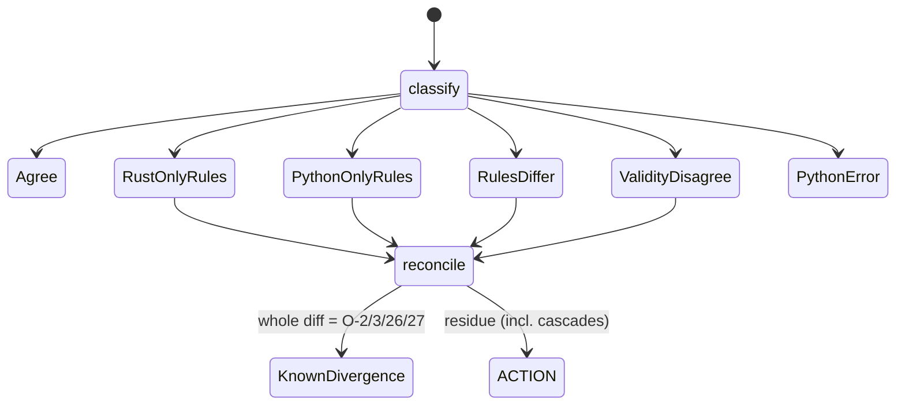

# parity model

## Definition
> [!quote] `repo:rust-packages/laterite-ags4-parity/src/verdict.rs` reduces
> the Rust & python outcomes to **rule-key presence only** (never
> line/group/desc/count — O-3/O-11/O-16/O-22/O-26 attribution
> divergences are invisible by design). `classify` →
> Agree | RustOnlyRules | PythonOnlyRules | RulesDiffer |
> ValidityDisagree | KnownDivergence{O-N} | PythonError. **RulesDiffer**
> is the both-sided residue: one-sided verdicts answer for a difference
> that runs one way, and until #652 the rust-only side answered for both,
> so a rule python raised and we did not went unsaid — the under-detection
> direction, which is the one worth hearing. `reconcile` whittles the
> symmetric diff against documented arms — **O-2** (Rust-only Rule 6,
> python no-op), **O-3** (Rust 5 ↔ python 4), **O-26** (python triple
> 19b) — and only returns an O-N if the *entire* diff is consumed.
> (The O-27 arm is narrow: Rule 20's on-disk half is opt-in
> `--check-files`, ON in the dogfood — where the two AGREE directly and
> the arm is inert — but a harness running with it OFF, like the
> cross-surface compliance matrix, sees python's always-on check fire
> alone, and the arm reconciles that — [[strat-o27-rule20-ondisk]].) `classify`
> HardError maps UnsupportedEdition→O-30, NotAgs4+all-mandatory-absent
> →O-34. Only a fully-explained diff is KNOWN_DIVERGENCE (out of the
> ACTION list / exit code).

## Why it matters
This is the operational definition of the clean-room claim: "Rust ≡
python except for these enumerated, reasoned O-Ns." Every reconcile
arm is a literal assumption about python-ags4 **1.2.0 source** — which
is why the oracle is now pinned and version-asserted
([[oracle-drift-pin]]).

## Diagram

## Limitations (campaign findings — read before trusting a run)
> [!divergence]
> - **Cascade-unreconcilable**: python's parse layer fans one defect
>   into many rules (embedded-CR→2a/3/5; unquoted→Rule 3; valid-extended
>   →∅). Presence-only `reconcile` cannot whittle a *set*, so a *known*
>   root cause becomes a false ACTION — [[parity-cascade-unreconcilable]].
> - **Triage-biased sampling**: default `--parity-sample 0` cross-checks
>   only files Rust already found odd; confidently-wrong files never
>   reach the oracle — [[parity-triage-sampling-bias]].
> - **Presence-only**: per-rule attribution/count divergences are
>   structurally invisible (intended — see the module header).
> - **No per-rule coverage**: the [[strat-parity-matrix]] is the
>   isolate-which-rule complement (+ the 13-rule zero-evidence list).
> - **Different domain, same structural blind spot**: this model diffs
>   *rule verdicts* between Rust and python-ags4, never CLI surfaces —
>   [[surface-census]] is the sibling gate for `lat`'s three launchers
>   (native/uvx/npx), and shares the same root lesson: a *value*-level
>   comparison can only diff what both sides actually produce, so a
>   whole missing capability (a rule neither side raises, a verb one
>   launcher never implemented) is invisible to it by construction.

## Where it shows up
Followed end-to-end by the [[traceability-chain]]; surfaced as the
dogfood ACTION list; the spine of [[rust-vs-python-ags4-parity]] and
[[observations-coverage-map]]. `classify`/`reconcile` are extracted
into [[laterite-ags4-parity]] so [[laterite-ags4-forge]] manufactures divergences
against the *identical* verdict semantics ([[evolutionary-dogfooding]]),
with [[parity-confidence-model]] tightening the triage-bias limitation
below. The parity arc's deliberate non-closures (residual `compat`
gaps we have a position on but haven't actioned) are parked in
[[compat-decisions-held]].

## Related
[[start-here]] · [[parity-cascade-unreconcilable]] · [[parity-triage-sampling-bias]] · [[oracle-drift-pin]] · [[strat-parity-matrix]] · [[strat-o27-rule20-ondisk]] · [[rust-vs-python-ags4-parity]] · [[observations-coverage-map]] · [[laterite-ags4-parity]] · [[laterite-ags4-forge]] · [[evolutionary-dogfooding]] · [[parity-confidence-model]] · [[laterite]] · [[surface-census]] · [[demo-state-sweep]]
