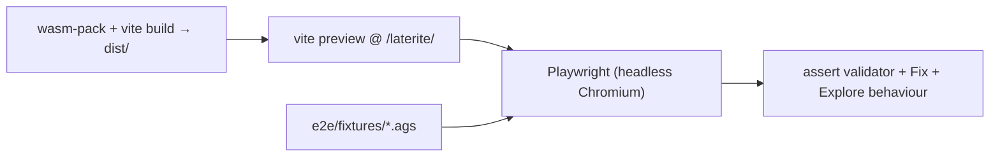

# Playwright e2e harness (web app)

## Definition

End-to-end browser tests that drive the **real** AGS4 validator web app —
the Rust-wasm validator running in a Web Worker plus DuckDB-wasm — in headless
Chromium, against a local `vite preview` of the production build. This replaces
the previous "verify only on the deployed Pages site" loop with a
deterministic, synthetic-fixture suite (`repo:web/e2e/app.spec.ts`).

Key facts:

- **Runs against the production artifact.** The `webServer` in
  `repo:web/playwright.config.ts` serves `dist/` at the deploy base
  `/laterite/`, so the specs exercise the same bundle that ships — a wrong
  base path (the [[validator-site]] failure mode) would surface here, not in
  production.
- **Requires a prior build.** `vite preview` serves an existing `dist/` but
  does NOT build it; CI's `e2e.yml` runs `wasm-pack build` then `npm run build`
  first. (The npm `e2e` script is just `playwright test`.)
- **Isolated workflow.** `repo:.github/workflows/e2e.yml` is separate from
  `ci.yml` (rust/python) and `deploy-validator.yml` so an e2e change or flake
  never blocks a merge or a deploy — see ci-and-runners. Default runner is
  the self-hosted `ags5-portainer`; a dispatch can pick `github`.
- **The sandbox can run it.** `npx playwright install chromium` + headless
  Chromium work on darwin, so the suite is runnable locally before pushing, not
  only in CI.

The suite is split by intent across two spec files (shared helpers in
`repo:web/e2e/helpers.ts`):

- **`app.spec.ts` — engine output on fixtures:** the four tabs render; the clean
  sample validates to zero findings; an unknown-heading sample surfaces a Rule 9
  finding; an FYI-only file shows the amber informational banner (not red) while
  a mixed error+FYI file stays red; a fixable file offers a safe fix that clears
  on apply while the persistent download stays; Explore ingests a file into
  DuckDB-wasm; and a Tools → Dictionary per-edition check. The **PWA** block
  additionally asserts installability, a full offline reload+validate tied to
  SW *precache provenance* rather than Chromium's HTTP cache, and — since
  #339 — that the DuckDB engine genuinely **lands in its runtime cache**. That
  last one is here rather than in a unit test because it is the direction that
  fails silently: a `CacheFirst` rule that stopped accepting the response would
  raise nothing, and simply re-download ~36 MB on every page load. It waits for
  the service worker to take control *before* Explore, since a rule only sees
  fetches the worker intercepts. Since #356 the same block covers the **tier-2
  idle warm**, which is invisible in the UI in all three of its failure
  directions — never firing, compiling what it was only meant to fetch, or
  priming a URL the worker does not load. Those tests pose as a **capable
  device** first (`hardwareConcurrency` / `deviceMemory` / `connection`): a
  runner that fingerprints low-end skips the warm by design, so without the pose
  they would pass for the wrong reason.
- **`validate-ui.spec.ts` — UI *behaviours* of the Validate page** (the
  interactions, not just rule output): search filtering + the **clear-box-
  restores-all** regression; severity chips show/hide their findings; the
  **encoding toggle** re-decodes the *same bytes* (a raw Windows-1252 `é` reads
  as a Rule 1 error under UTF-8 but an FYI under cp1252) and re-validates; the
  dictionary-edition selector re-validates; and the findings list **virtualizes**
  (only a window of `[data-index]` rows mounts — scrolling mounts higher-indexed
  ones).

Since #523 the harness also drives the **landing page**, which is a separate
build with its own preview server (one dependency set, two builds — see
[[dec-landing-build-shared-tokens]]): the `landing` Playwright project runs
`repo:web/e2e/landing.spec.ts` at a **strict 390 px viewport — no mobile
emulation**, because emulation absorbs a too-wide layout into zoom and hides
exactly the overflow it exists to catch. It pins the no-page-overflow contract:
the document stays viewport-wide and each group table pans inside its own
scroller. CI builds the landing (`npm run build:landing`) alongside the app
before the Playwright run.

Fixtures (`repo:web/e2e/fixtures`) include `cp1252.ags` (one raw `0xE9` byte —
the encoding-toggle case) and `many_findings.ags` (~250 unknown headings → a
large report for the search + virtualization tests).

There is also an **opt-in corpus check**, `repo:web/e2e/pyags4-corpus.spec.ts`,
that drives **every python-ags4 `.ags` test fixture** (~85 rule-named files)
through the wasm Validate page and logs which rules each surfaces vs the rule
its filename implies (report → `/tmp/pyags4_report.json`). The `.ags` files are
**not vendored** (upstream's, large) — the spec **skips cleanly** unless
python-ags4 is cloned next to the repo
(`git clone https://gitlab.com/ags-data-format-wg/ags-python-library ../ags-python-library`,
or set `PYAGS4_DIR`), so the normal e2e run / CI is unaffected. Its durable
assertion is only that the validator **processes the whole corpus without
crashing**; rule-match is logged, not asserted, because the residual mismatches
(~55/71 match) are documented engine-vs-python-ags4 divergences (`OBSERVATIONS.md`)
and deliberately-OK fixtures, not regressions — the byte-exact engine parity is
the separate `tools/run_python_ags4_tests.sh` oracle (~122/9).

## Why it matters

The web stack has failure modes that unit tests can't see: the wasm worker
failing to load under the Pages base path, DuckDB-wasm not instantiating from a
`?url` bundle, an Arrow `bigint` cell crashing a Solid render. A headless run of
the real bundle is the cheapest honest signal that a deploy will actually work,
and it is gated on every web PR rather than discovered post-deploy.

## Diagram

## Where it shows up

- ci-and-runners — the `e2e.yml` workflow row + runner policy.
- [[validator-site]] — the deploy/base-path contract these specs guard.
- [[tech-stack-wasm]] — the wasm worker + DuckDB-wasm the specs exercise.

## Related
- ci-and-runners
- [[validator-site]]
- [[tech-stack-wasm]]
- [[docs-site]]
- [[dec-web-test-altitude]] — why `web/` has no layer between this suite and
  the unit lane, and what to do instead when a guard wants pinning lower.
