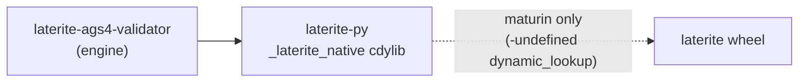

# the PyO3 boundary: where Rust stops and Python starts

## Definition

PyO3 appears in exactly **one** workspace crate — the only crate that links
`pyo3` — producing an `extension-module` cdylib loaded by CPython:

- **AGS4 lane**: `laterite-ags4-validator` engine → `laterite-py`
  (`crate-type = ["cdylib"]`, lib name `_laterite_native`) → the public
  [[laterite]] wheel, returning **polars** frames from a `polars` + `duckdb`
  base install.
  `repo:rust-packages/laterite-py/Cargo.toml`

`laterite-py`'s own manifest states the invariant on its first line — "This is
the ONLY crate in the workspace that links pyo3" — which is what makes the
boundary a single place rather than a policy.

> [!note] There was a second lane here
> This page described an AGS5 lane (`laterite-py-ags5`, bundling DuckDB, pulled
> by an `[ags5]` extra) as a live parallel pipeline, with a diagram. None of it
> is in this tree: no such crate, no such extra, and no tracked file matching
> `ags5`. AGS5 is a **dormant concept** held in the private satellite, never a
> shipped feature — see `CLAUDE.md`. The lane is described here in the past
> tense so the diagrams below read against one boundary, not two.

The boundary's **read path carries typed Apache Arrow** (the 0.3 DuckDB-engine
redesign): the Rust parser builds one `RecordBatch` per group via
`laterite-ags4-types::arrow_cols` (the *same* emitter the wasm explorer frames as IPC)
and hands it to Python **zero-copy as an Arrow PyCapsule** through `pyo3-arrow`,
**pyarrow-free and born-typed** (a 2DP heading is `Float64`, not `str`). That
Arrow is built **lazily, per group, on first touch** (`Reading::table_for`)
rather than eagerly in the parse loop, then loaded into the Python-owned
in-memory **DuckDB** engine (CTAS), from which `ags[code]` materialises a polars
or pandas frame and `ags.sql(...)` runs cross-group SQL. The raw parse is
retained Rust-side in the `Reading` handle so `write()` re-emits byte-faithfully
— **no per-cell PyObject dict crosses the boundary** (a big win over the old
O(cells) primitives path). The **dict-resolution path and most of `compat` still
carry plain primitives** via `parse_primitives` — `AGS4_to_dict`, `check_file`,
and the rarely-used `get_line_numbers=True` arm of `AGS4_to_dataframe` (no
shipped caller) all still cross that way. But **`compat.AGS4_to_dataframe`'s
common path moved onto its own Arrow builder (2026-07-20 perf pass)**:
`parse_compat_arrow` (`repo:rust-packages/laterite-py/src/lib.rs`) drives
`laterite-ags4-types::arrow_cols::build_record_batch_compat`
(`repo:rust-packages/laterite-ags4-types/src/arrow_cols.rs`) — same "no per-cell
`PyObject`" property as the typed read path, but the python-ags4 frame *shape*
(a leading `HEADING` tag column, `UNIT`/`TYPE`/`DATA` rows, raw-string cells,
no type casting) rather than the typed path's born-typed columns. python-ags4
frames are raw-string either way, so this is a transport-cost fix, not a shape
change: measured **~2× faster than python-ags4** (was ~2–7× slower — the old
path reshaped Python primitives per cell; reproducible via
`tools/bench_compat_dataframe.py`, dev satellite). Each backend then takes its cheapest
hop off that one table (`_frames.py::compat_materializer`): pyarrow's
`to_pandas` when pyarrow happens to be importable (also the only route to
`string_dtype="string"`, pandas' Arrow-backed `str`), else DuckDB's NumPy
`.df()` — **pyarrow stays an optional accelerator, never a `[compat]`
dependency** (`compat` remains `pandas<3` only; `[compat,pyarrow]`/`[all]` add
it). Crucially this is
**NOT** pyo3-polars Arrow-FFI handles — it's the **stable Arrow C Data
Interface** (capsules), which is why abi3 still holds.

The **emit path runs that boundary in reverse** (the AGS4-output feature,
[[ags4-output]]): `laterite.emit_ags4(groups)` hands each frame's **Arrow
C-stream PyCapsule** (`__arrow_c_stream__`) straight to `pyo3_arrow::PyTable`,
which consumes it zero-copy in `emit_ags4_from_arrow`. polars exposes the
capsule **pyarrow-free**, so emit stays a *base* feature.
**Correction (2026-06-16, #111 base-surface audit):** the original code routed
every frame through `duckdb.register(...)` on the belief DuckDB's own scanner
kept it pyarrow-free for both backends — but an import-blocked test proved
`con.register(polars_df)` calls polars `.to_arrow()` → **pyarrow**, leaking
`[compat]` into a base call. The fix is to bypass DuckDB and pass the capsule
directly; only an *old* pandas (pre-2.2, no capsule) falls back to DuckDB, and
pandas only ships via `[compat]` anyway. compat's all-Rust write
(`emit_ags4_compat`) already took the polars-capsule shape (no engine).

A **pandas** frame's capsule is additionally normalised through `pl.from_pandas`
before the native call. That guard is **not** a memory-safety measure — it copies
nothing on the pyarrow path, and the heap corruption it was once credited with
preventing was a mimalloc bug, fixed by pinning v2 (#301). It earns its place on
**dep shape**: pandas' `__arrow_c_stream__` calls
`import_optional_dependency("pyarrow")`, so without it a pyarrow-free `[compat]`
install raises `ImportError` — the same "pyarrow is an accelerator, never a
`[compat]` dependency" invariant this section turns on. Who owns and frees the
buffers crossing here, and why a foreign `#[global_allocator]` cannot endanger
them, is [[arrow-c-ffi-allocator-ownership]].

Because the read boundary uses that **stable Arrow C Data Interface**, not
pyo3-polars' per-CPython ABI coupling, the cdylib builds **abi3**
(`abi3-py312` on the `pyo3` dep; `pyo3-arrow` 0.19 compiles clean under it):
ONE `cp312-abi3` wheel per platform
serves **Python 3.12+** (proven green on 3.12 / 3.13 / 3.14). The floor is
**3.12**, not lower, because the 174 generated `#[pyclass(dict)]` typed-graph
classes (the AGS4 union) need the 3.12 limited API (`dict` isn't exposed below
it). The dev workspace declares the same floor — `requires-python = ">=3.12"` in
the root `pyproject.toml` — so the build env and the shipped wheel agree. This
paragraph previously claimed the workspace required 3.14, justified by an
unshipped `laterite-ags5x` crate that is not in this tree.
A stale comment once claimed the wheels *couldn't* be abi3 "because pyo3-polars
couples the wheel"; that was wrong on both counts (no pyo3-polars; abi3 works).
abi3's runtime cost here is ~5 ns per object construction and **nil on real
operations** (and a higher floor like `abi3-py314` buys nothing) — measured in
[[abi3-perf]].

## Why it matters

This cdylib is an `extension-module` build (no libpython at link time),
so it **must** be built by maturin (`uv sync`, or the package's
`[tool.maturin]`), which supplies the `-undefined dynamic_lookup` link
args. A bare `cargo build --workspace` deliberately **excludes** it and
will fail to link it on macOS — by design, not a regression. This is
why the workspace Rust build excludes it — `--exclude laterite-py`, as
`.github/workflows/ci.yml` does — and `uv sync` builds it through maturin
instead.

The boundary is also **directional**: *Rust drives Python, never the
reverse* — the shipped artefact is the Rust binary, and this wheel is
the scoped exception where a Python library imports the Rust engine, not
where Python becomes a runtime prerequisite of the tool. See
[[dec-rust-drives-python]] and the scoped exception
[[dec-python-imports-rust-library]].

## Diagram

## Where it shows up

This is the Python edge of the [[crate-map]]: the PyO3 cdylib is the
"internal implementation" crate behind the public wheel. The
direction principle is [[dec-rust-drives-python]]; the library-imports-
engine exception is [[dec-python-imports-rust-library]].

## Related

[[crate-map]] · [[laterite-py]] · [[laterite]] · [[dec-rust-drives-python]] · [[dec-python-imports-rust-library]] · [[dec-monorepo-structure]] · [[abi3-perf]] · [[arrow-c-ffi-allocator-ownership]]
