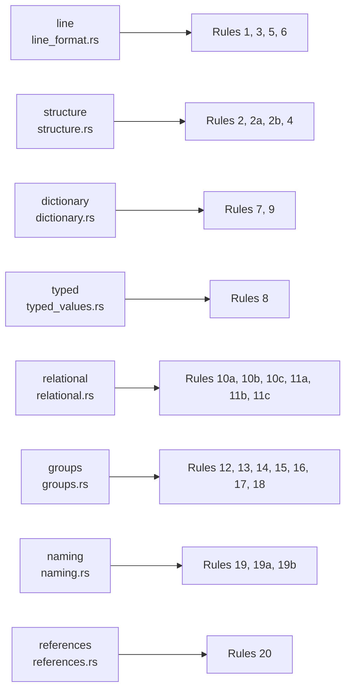

# rule families

## Definition
> [!quote] The 8 rules/*.rs modules each own a rule family, wired in mod.rs::run_all in spec-numbering order: line_format (1,3,5,6) · structure (2,2a,2b,4) · naming (19,19a,19b_1) · dictionary (7,9) · typed_values (8) · relational (10a–10c,11a–11c) · references (19b_2/19b_3,20) · groups (12–18; 12 no-op). Built V1–V8.

## Why it matters
Load-bearing for the test strategy: this is how the validator (or the parity harness) actually behaves — gaps surface as deltas against the spec (Phase A) and python-ags4 (Phase C/D). Each numbered rule/sub-rule has its own page under `rules/` (e.g. the `line` family's [[rule-03-descriptors]], which enforces the GROUP/HEADING/UNIT/TYPE/DATA row-descriptor prefix).

**One exception to "wired in `run_all`", since 2026-07-14 ([[cert-trust-v2]] PR 2):** Rule 20's on-disk half (does the sibling `FILE/` tree exist?) is not a pure function of the parsed bytes, so it does not run inside `run_all` at all — it lives in a separate module, `src/world.rs`, and is reached only through `check_parsed`, the crate's one public entry point for a caller holding bytes/text. `run_all` itself became `pub(crate)` in the same change; nothing outside the crate calls it directly any more.

## Diagram

## Where it shows up
Load-bearing across the rule families that depend on it — followed end-to-end by the [[traceability-chain]] and surfaced as deltas in [[parity-model]].

## Related
[[start-here]] · [[parity-model]] · [[rule-families]] · [[cert-trust-v2]]
