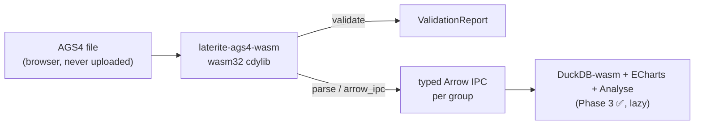

# tech stack: the browser wasm path

> [!note] Two browser wasm modules, not one
> This page describes the **engine** wasm (`laterite-ags4-wasm`, ~6.9 MB) —
> `validate`/`parse`/`diff`/`merge`/`to_ags4`, run in a Web Worker. Since
> #533 (part of the #527 convergence arc) the browser also loads a SEPARATE,
> deliberately tiny sibling — `laterite-ags4-tokenizer-wasm` (~30 KB / ~13 KB
> gzipped) — instantiated once on the **main thread** at boot, purely for the
> inline line editor/preview's synchronous tokenize/quote calls
> (`web/src/lib/tokenizer.ts`). It shares no code with this crate; both
> depend on `laterite-types`, and the tokenizer additionally depends on
> `laterite-ags4-parse`. See [[crate-map]] and [[dec-laterite-types-leaf]]
> for the full picture — this page's build/worker/Arrow-IPC detail is about
> the engine wasm only.

## Definition

The **fully client-side** AGS4 path: file bytes never leave the browser.
A dropped AGS4 file is handed to the `laterite-ags4-wasm` crate — a
`wasm32-unknown-unknown` cdylib built by `wasm-pack build … --target web`
(`repo:.github/workflows/deploy-validator.yml`) and loaded by the SolidJS
app in `repo:web/`. The release build's `wasm-opt` pass needs
`wasm-opt = ['-O', '-all']` in the crate's
`[package.metadata.wasm-pack.profile.release]`
(`repo:rust-packages/laterite-ags4-wasm/Cargo.toml`): modern Rust/LLVM emits
`bulk-memory` + `nontrapping-fptoint` by default, which the older binaryen
wasm-pack downloads rejects unless every feature is enabled.

> [!important] The generated bindings are **gitignored** — regenerate on a
> fresh clone. `wasm-pack` writes the JS glue, the `.d.ts`, and `_bg.wasm`
> into `repo:web/src/wasm/`, which `.gitignore` excludes (the directory
> also carries its own `*` ignore). They are **never committed, only
> built** — so a fresh checkout has *no* bindings and `web/` won't
> typecheck, build, or run until they're regenerated:
> `wasm-pack build rust-packages/laterite-ags4-wasm --target web --release --out-dir web/src/wasm`
> (the exact command CI's `deploy-validator.yml` runs; do it once locally
> after cloning). **Corollary:** a Rust-side `validate`/`parse` signature
> change is invisible to `web/` — and to the `.d.ts` `tsc` checks against —
> until the bindings are rebuilt. The Rust crate is the source of truth;
> the checked-out `.d.ts` can be stale or absent (this is exactly why
> `compute_fixes`/`apply_fixes` — live in the crate — were once missing from
> an old checked-in `.d.ts` until it was regenerated).

The crate exposes **seven** `#[wasm_bindgen]` entry points
(`repo:rust-packages/laterite-ags4-wasm/src/lib.rs`):

- `validate(bytes, dict_version, include_fyi, encoding, max_per_rule)` → a
  `ValidationReport` JS object — the whole clean-room rule engine run
  in-browser with `source = None` (no filesystem). `max_per_rule` caps how
  many findings per rule are **serialized** (every rule still runs over
  every line); `finding_count`/`RuleGroup.total` keep the true totals and
  `shown_count` reports what crossed the boundary. This is a UI safety
  ceiling — a pathologically dirty file can yield millions of findings
  (hundreds of MB of JSON) — and is **wasm-only**: the CLI's `--json` is
  built independently in `repo:rust-packages/laterite-ags4-check/src/main.rs`.
- `parse(bytes, encoding)` → a `ParsedDataset` exposing `group_codes()`,
  `meta(code)` (`{headings, units, types, sql_types}`), and
  `arrow_ipc(code)` — one **typed Apache Arrow IPC stream per group**,
  built lazily so peak residency is a single batch.
- `compute_fixes(bytes, dict_version, encoding)` → the safe/risky `Fix[]` for
  a file (the Fix tab's oracle; a **separate** surface from the findings — see
  [[tools/laterite-ags4-wasm]]).
- `apply_fixes(bytes, encoding, fixes)` → `Result<Vec<u8>, JsError>` (the patched
  file as **UTF-8 bytes**; thrown as a JS exception on failure since 2026-07-14 —
  it used to be infallible). Decodes with the given encoding then re-encodes UTF-8,
  so applying a fix to a cp1252 file also normalises its encoding.
- `diff(a_bytes, b_bytes, encoding, max_rows_per_group)` → a type-aware,
  KEY-matched `RevisionDelta` between two files (the Tools revision-diff),
  engine-consistent because it parses both to the typed graph via [[laterite-types]].
  The dictionary edition is derived **internally** from the new (B) file's
  `TRAN_AGS` (not a parameter); `max_rows_per_group` caps how many per-row
  deltas are serialized per group (the counts stay true totals).
- `to_ags4(groups_json, edition, mode)` → `{ text, findings, fixes_applied }` —
  the **AGS4 *producer*** (the read path reversed): a JSON array of
  `{code, headings, units?, types?, rows}` → valid AGS4 `text` (UTF-8, CRLF) for
  a `Blob` download, via the shared `laterite-ags4-emit` orchestrator (dict UNIT/TYPE
  fill + AutoFix). The browser/offline half of the data→AGS4 feature
  ([[ags4-output]]).
- `to_ags4_ipc(groups, edition, mode)` → same `{ text, findings, fixes_applied }`,
  but **columnar**: `groups` is a JS array of `{code, ipc: Uint8Array}` Arrow IPC
  streams (e.g. a duckdb-wasm result), decoded via `StreamReader` and the *same*
  shared `laterite-ags4-emit` Arrow→Value transpose the native host uses — the read path's
  per-group Arrow IPC, reversed. Avoids the per-cell JSON round-trip for large data.

> [!bug] Until 2026-07-14 every `encoding`-taking export above resolved an
> unrecognised label by silently falling back to UTF-8
> (`resolve_encoding(label).unwrap_or(UTF_8)`) — a corruption vector, not
> leniency: the bytes `C3 A9` decode cleanly as `é` in UTF-8 and as `é` in
> cp1252, so a caller who mistyped a label got the wrong text and a clean bill
> of health (`apply_fixes` would then rewrite the file from that mis-decode).
> Python raised on the same input; the crate's own test suite *codified* the
> asymmetry ("an unknown label falls back to UTF-8, not an error") rather than
> catching it. Now every export raises instead (`validate`/`parse`/`diff`/
> `merge`/`read`/`certify`/`apply_fixes` throw a `JsError`; `compute_fixes`, which
> has no error channel, returns no fixes) — matching Python. The browser's own
> encoding `<select>` only offers UTF-8/Windows-1252 (a closed union), so the UI
> itself could never trigger the old fallback, but a direct wasm caller could.
> See [[data-single-source-audit]] and [[surface-census]]'s `encodings` table.

Phase 3 (Explore + Fix + Tools) is **delivered** (PR series #27–#38) — the
explorer (Arrow IPC → DuckDB-wasm + ECharts + an Analyse view), the Fix tab,
and the Tools suite (incl. a second wasm export `diff()` and a proj4
coordinate tool — now with an opt-in **OSTN15** sub-metre mode, via a
committed BSD-licensed NTv2 grid, plus GeoJSON export). See [[validator-site]]
for the phase table + the OSTN15 note (linked, not duplicated here).

## Why it matters

The casting in `parse()` shares the [[laterite-types]] leaf crate, so the
browser casts a file **identically** to a native `.ags5db` — parity by
construction, not a second implementation that can drift
([[dec-laterite-types-leaf]]). Arrow type mapping (off the file's TYPE row):
[[DT]] → `Timestamp(µs)` (tz-naive), [[0DP]] → `Int64`,
`2DP/RL/nSF/nSCI` → `Float64`, [[YN]] → `Boolean`, `ID/X/PA/…` → `Utf8`.

`getrandom` is a **host** proc-macro (`const-random` bakes ahash's seed
at compile time via `arrow`); it never runs in the wasm runtime, so no
`js`-feature workaround is needed.

The module is instantiated and called **inside a dedicated Web Worker**
(`repo:web/src/lib/validator.worker.ts`, since Phase 1.5), not on the main
thread — `validate()` is synchronous and can churn for tens of seconds on
a dirty file, so running it off-thread is what keeps the UI from freezing.
The main thread holds no wasm; it talks to the worker through an
id-correlated client. The "Download full report" path re-runs `validate`
uncapped *in the worker* and gzips the JSON there (streaming
`CompressionStream`), transferring back compressed bytes so the big string
never reaches the main thread. See [[validator-site]] Phase 1.5.

> [!note] DuckDB-wasm asset loading (resolved)
> DuckDB-wasm + ECharts + proj4 **lazy-load on their views only** (confirmed:
> separate chunks; the entry chunk stays ~150 kB). The EH DuckDB wasm is
> ~36 MB raw / ~8 MB gzipped, fetched + instantiated on first *Explore* use
> (a few seconds on mobile), then HTTP-cached. The mvp/eh workers + wasm are
> shipped via Vite `?url` so they're fingerprinted + base-path-correct under
> `/laterite/` (an `import.meta.url` fetch would 404 under a non-root
> base). **Known-benign 404 (fixed at source):** the prebuilt DuckDB worker
> carries a `//# sourceMappingURL=…worker.js.map` comment but we never emit
> the .map, so the browser logged a harmless 404 for it (noticed first on
> iOS). A build-only Vite plugin (`stripDuckdbWorkerSourcemaps` in
> `repo:web/vite.config.ts`) strips that comment from the emitted worker
> assets. Source maps for a third-party prebuilt worker aren't useful anyway.

> [!note] DuckDB-wasm is the browser's per-host DuckDB — read **and** write
> `duckdb-wasm` is **not** a special case: it plays the same role as pip-`duckdb`
> (Python) and `@duckdb/node-api` (node) in the one cross-surface model
> ([[dec-duckdb-per-host-engine]]). The wasm crate stays DuckDB-free and emits typed
> Arrow IPC (`arrow_ipc(code)`); `duckdb-wasm` ingests it to **query** *and* to
> **persist/materialise** — an OPFS-backed database or a `COPY`/`EXPORT` to a
> downloadable file. So "materialise AGS4 → a queryable `.duckdb`" works in the
> browser too, via `duckdb-wasm`. The genuinely native-only pieces are the
> *Rust-side* persistence accelerators (the `.ags.idx` byte-index sidecar, the parse
> cache), which need Rust filesystem access wasm-Rust doesn't have
> ([[dec-duckdb-perf-architecture]]) — not the materialise itself.

> [!todo] Deferred E2E parity
> End-to-end value parity against a *live* native `.ags5db` was not run.
> The "identical to `.ags5db`" claim rests on both sides calling the one
> shared [[laterite-types]] crate; host unit tests prove the casting logic.
> Tracked in [[validator-site]].

## Diagram

## Where it shows up

`laterite-ags4-wasm` is the browser arm of the [[crate-map]] (validator → wasm
cdylib + the shared [[laterite-types]] leaf). The roadmap, phase status, and
verification notes live in [[validator-site]]; the single-typing-source
rationale is [[dec-laterite-types-leaf]].

## Related

[[crate-map]] · [[validator-site]] · ci-and-runners · [[dec-laterite-types-leaf]] · [[dec-rust-drives-python]] · [[dec-duckdb-per-host-engine]] · [[laterite-types]] · [[DT]] · [[0DP]] · [[YN]] · [[surface-census]] · [[data-single-source-audit]]
