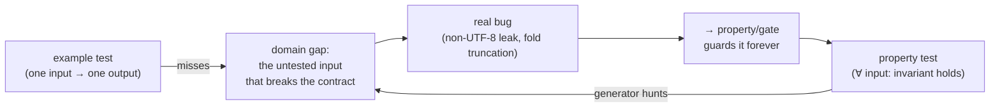

# testing strategy — invariant-first hardening

## Definition

The doctrine this repo tests by: **prove invariants across the input domain, not features on chosen examples.** An example-based test asserts that one input produces one expected output; a property/invariant test asserts a *relationship that must hold for every input* (round-trip, fixpoint, cell-preservation, cross-serialisation agreement) and lets a generator hunt the domain for a counterexample. Example tests answer "does the happy path work"; property tests answer "can any input break the contract" — and the second is where the bugs that survive a large suite actually live.

The three test layers, by what only they can reach:
- **Rust engine properties** (`proptest`) — hammer the fix/parse/emit internals (cell-preservation, the ASCII fold over the whole `char` domain, bounded fixpoint) directly, with no host in the way.
- **Python API properties** (`hypothesis`) — the *public fluent-API* surface across encodings the engine tests can't see (the `read().fix().validate()` chain, `None`-vs-explicit encoding, the DuckDB frame doors).
- **Cross-surface value gates** — pin that node/py/wasm/CLI agree on *values* (accepted edition strings, the error-kind→exit-code table, severity tokens), not just param *shapes* (see [[modality-register]] for the I/O-form axis, [[parity-model]] for the finding-verdict axis). The narrowest instance of this class is **cross-modality**, not cross-surface: does `read(path)`/`read(text)`/`read(bytes)` on the *same* language return the *same* verdict for identical bytes, not just offer the same knobs — [[modality-register]] tri-states form presence but is silent on this; bug 4 below is why it now has its own gate. The *general* form of this layer landed as ags4-output-value-gate: a committed (op × input) case manifest pushed through every surface **leg**, compared as OUTPUT VALUES with the in-process Rust leaf as an authority column (not a peer) — where the modality gate above pins one narrow axis (I/O form), this one pins the full door set the census enumerates.

## Why it matters — the post-mortem that motivated it

Three real bugs slipped past a ~500-test suite in a single session, and all three had the same structural cause: **the suite proved features exist, prose contracts lived only as prose, and cross-surface gates compared shape not value.**

1. **Rule-1 risky transliteration truncated fields** — the smart-quote→ASCII fold produced a `"` that was never re-escaped; no test *re-parsed* the fix output, so a fold that corrupted the row passed. Fixed + guarded by the fold-totality scan and the reparse tail (`repo:rust-packages/laterite-ags4-validator/src/fixes.rs`).
2. **`fix()` no-op path leaked non-UTF-8** — the "always UTF-8" contract had no executable adjudicator; the no-op test used an *ASCII* fixture, so it **enshrined** the bug instead of catching it. The Rust and Python docstrings even contradicted each other with nothing running between them. The Python fix-chain property (sweeping the corpus × `{None, cp1252}`) caught the residual gap on the default `encoding=None` path. See `repo:OBSERVATIONS.md#o-46` for the non-UTF-8 handling contract.
3. **encoding-label resolution diverged three ways across surfaces** (`latin-1` errored / silent-UTF-8'd / worked) — a value-domain divergence a shape-comparing gate can't see. Single-sourcing `resolve_encoding` (#417) turned out to close only the *common* labels, not the story: the CLI kept a private label table wider than the shared leaf's (`latin9`/`latin-9` worked only on `lat`), an unresolved label still silently became UTF-8 on Node and in the browser while Python alone raised, and the npx launcher's per-verb handlers accepted `--encoding` and dropped it on the floor — a knob-*name* gate sees the flag on every surface, spelled identically, and calls that agreement. Genuinely closed 2026-07-14: the two extra aliases were promoted into the leaf and the CLI's private table deleted, an unresolved label now raises everywhere (`bad_args`, exit 5 — the wasm crate's own test used to *codify* the fallback as intended behaviour; it now asserts the opposite), the npx handlers thread the flag through (or refuse it, on `read`/`excel`, which have nothing to decode), and [[surface-census]] gained a third table (`encodings`) asking each launcher's *own* resolver against a fixed probe list (`repo:packages/laterite/tests/test_encoding_single_source.py`).
4. **a mislabelled-edition file resolved to a different dictionary by modality** — `laterite-py`/`laterite-node`/wasm each hand-assembled "resolve `TRAN_AGS`, then run the rules" for their bytes/text branches and every one of them skipped the O-42 `guard_4_0_4` content guard in the middle, so `read(path)` judged a `TRAN_AGS=4.0.3` file using a 4.0.4-only heading against 4.0.4 while `read(bytes)`/`read(text)` judged the *same file* against 4.0.3 — two phantom Rule 9 findings, on every bytes/text read, that were findings about the validator, not the file. Every gate this repo owned compared knob *names* (`test_cross_surface_parity`) or capability *presence* ([[modality-register]]) — none compared an *answer*, so the knob names matched perfectly while the verdicts differed. Fixed 2026-07-14 by [[laterite-ags4-validator]]'s `check_parsed_with_dict`, one door every modality now shares (the same "surfaces reach past the door" pattern as [[cert-trust-v2]]'s `check_files` bug), and pinned by the first **output-value** gate: `repo:packages/laterite/tests/test_modality_output_parity.py` / `repo:rust-packages/laterite-node/test/modality-output-parity.test.ts` assert `read(path)`/`read(text)`/`read(bytes)` return the identical `dict_version`, `resolution`, and finding list for the same bytes — not just that each offers the same knobs.

The lesson, stated once: **a "no exception" or "it runs" assertion is the weakest possible test; push every contract to the strongest property it can carry.** (Strength ladder: no-exception → type-preservation → invariant → idempotence/fixpoint → round-trip.)

## The property catalog (what each layer actually asserts)

| Property | Where | Statement |
|---|---|---|
| fold totality | `repo:rust-packages/laterite-ags4-validator/src/fixes.rs` (test mod) | `ascii_fold` over `char::MIN..=MAX` is ASCII and CR/LF-free |
| cell preservation | `repo:rust-packages/laterite-ags4-validator/tests/fix_properties.rs` | every field not touched by an applied `SpanEdit` is byte-identical after reparse |
| bounded fixpoint | rust + `repo:packages/laterite/tests/test_fix_properties.py` | re-fixing converges byte-stable in ≤4 passes (single-pass idempotence is **false** — nSF decade-crossers + deep dup-headings need a 2nd pass) |
| fix output is UTF-8 | `repo:packages/laterite/tests/test_fix_properties.py` | `fix()` output is always valid UTF-8 + reparses, over the corpus × `{None, cp1252}` (the property that caught bug 2) |
| writer round-trip | `repo:rust-packages/laterite-ags4-emit/tests/writer_roundtrip.rs` | `write_row` → `split_ags_line` == original cells (escaping invariant) |
| diff algebra | `repo:packages/laterite/tests/test_fix_properties.py` | reflexive (`diff(p,p)=∅`) + antisymmetric (add↔remove under swap, matched by KEY) |
| serialisation agreement | `repo:packages/laterite/tests/test_contract_pins.py` | `to_json` (by-rule) and `to_ndjson` (per-occurrence) describe the same findings |
| value-domain SSOT | `repo:packages/laterite/tests/test_error_domain_parity.py` | error-kind→exit-code, severity, edition list have one Rust producer; surfaces delegate |
| encoding-label SSOT | `repo:packages/laterite/tests/test_encoding_single_source.py` | every launcher's *own* resolver agrees on a fixed probe list; an unresolved label (`cp1252x`) is refused, never a silent UTF-8 fallback |
| CLI argument-declaration SSOT | `repo:rust-packages/laterite-cli/src/commands/census.rs::census_knows_which_flags_take_a_value` | every launcher's own parser agrees, per verb, on which flags/positionals it accepts and whether each **eats the next token** — the census's own authority answer was wrong (`get_num_args()` vs the action) before this pinned it |
| `--index` cert-skip output shape | `repo:packages/laterite/tests/test_cli_index.py` | a certified `validate()` reports `report.certified` and the *same* `--json` shape a full engine run does — not merely "it exits 0" (the property that caught the `--dict-version auto` sentinel silently disarming the skip). `certified` used to be a *value of* `resolution` (`"certified"` in place of `"exact"`), which conflated two questions — WHICH dictionary judged the file, and WHETHER the engine ran; [[cert-trust-v2]] split them |
| modality output-value agreement | `repo:packages/laterite/tests/test_modality_output_parity.py`, `repo:rust-packages/laterite-node/test/modality-output-parity.test.ts` | `read(path)`, `read(text)`, and `read(bytes)` return the identical `dict_version`/`resolution`/`count`/`is_valid`/`exit_code`/finding-list for the same bytes, across three fixtures × three severity-tier combinations — the property that caught bug 4 (the O-42 guard reaching path but not bytes/text) |
| 4-laterite finding-tuple floor | `repo:rust-packages/laterite-ags4-compliance/src/main.rs` | rust/python-laterite/node/wasm's finding FLOOR compared as full TUPLES (`rule`, `line`, `group`, `desc`, `field_index`) in a count-sensitive sorted multiset, not a deduplicated rule-LABEL set — so surfaces agreeing on *which* rules fired but disagreeing on *where*/*how many*/*what* is caught (a `field_index`-only divergence splits a tuple gate, is invisible to a label gate). The python-ags4 leg stays label-based (`classify` is defined over labels; python-ags4 emits only labels) |
| cross-surface output-value agreement | `repo:rust-packages/laterite-ags4-xcheck/src/bin/xcheck.rs` | committed (op × input) cases across 8 legs (rust-leaf / python / python-compat / node / wasm-engine / cli-native / cli-uvx / cli-npx) agree on OUTPUT VALUES — with the in-process Rust leaf as an authority column (not a peer), plus an `emit_reparses` spec invariant and a cross-path equivalence check. The general form of the layer above; the `fix_dest` leg pins the repaired *bytes* (CRLF-preserving), not just the filename. See ags4-output-value-gate |
| xcheck verb-coverage ratchet (dev satellite) | driven against the public gate above | every `lat` verb (from the census SSOT) either has a case in the gate above or sits in a shrink-only `_UNCOVERED` allowlist with a reason — a covered verb left in the allowlist fails, so adding a case forces its own removal. Stops the value gate from silently under-covering the verb set (only verbs proven non-deterministic or npx-absent — `certify`/`lock`/`unlock`/`excel` — stay uncovered) |

## Test-quality ruleset (cross-language)

The property catalog above is *this repo's* invariants, named after the files that
hold them; below is the **portable** distillation — the answer to "does this work
across languages?" is **the principles port, the enforcement doesn't.** The
checklist (situation → strongest assertion) is language-independent; the tooling
that enforces it is a per-language stack, because no linter scores "meaningful
assertion" — the hard part, "is this assertion tautological *in its context*?", is
semantic, not syntactic.

**The checklist** — for each shape, the weak test to reject and the strongest
property the contract can carry (the Definition's ladder, applied). The property
catalog above is where this repo discharges each row:

| Situation | Weak (reject) | Strongest the contract carries |
|---|---|---|
| pure function / codec | "runs without panic" | round-trip `f⁻¹(f(x)) == x` over a generated domain |
| a fix / normaliser | "output differs" | idempotence *and* the named defect is gone on re-check |
| an error path | "raises something" | the *specific* error / exit-code / message named |
| multi-format render | "each format parses" | every format describes the *same* set |
| a flag / option | "the flag parses" | the flag *changes the observable outcome* |
| cross-surface / modality | "same knobs offered" | same *values* returned for identical input |
| a redirect / tee | "the file exists" | written bytes == what stdout would carry |
| a generated artifact | (none) | `committed == render(SSOT)` |

**The enforcement ladder** — each rung catches only what the one below cannot, so
the strong signal lives near the top:

| Rung | Catches | Gameable? | Here |
|---|---|---|---|
| coverage | what *executed* | yes — a zero-assertion test scores 100% | llvm-cov / pytest-cov / vitest-v8, floored in CI |
| smell linters | *syntactic* fluff (no-assert, `assert True`, skipped, conditional-in-test) | partly | ruff `PT`+`B` (Python), `@vitest/eslint-plugin`'s `expect-expect` (JS); Rust: convention only |
| **mutation testing** | assertions that *cannot fail* — weak/missing, and coverage-blind | **no** | `cargo-mutants` (Rust), `mutmut`/`cosmic-ray` (Python), Stryker (JS) — run scoped, never per-commit |
| human review | is this the *right* invariant | n/a | this doctrine + PR review |

Only the bottom rung (coverage) and the top (review) are standing CI gates here;
the middle two are the fit tooling for this stack but currently run **ad-hoc, not
yet wired as gates**. Mutation testing is the automated form of the *manual*
mutation checks this page already leans on.
The transferable lesson: **coverage says the line ran; only a
surviving mutant proves a bug in that line would have failed the suite** — the
Definition's strength ladder made falsifiable. It earns its keep in practice: a
`cargo-mutants` run on the `lat`-verb CLI tests survived a green-covered mutant
where a flag's wiring executed but went unasserted — a gap the coverage number
could not see, now closed. One durable gotcha: cargo-mutants mutates *source
text* blind to `cfg`, so feature-gated code (`#[cfg(feature = "tui")]`) shows
false survivors unless you build the feature in.

## Faithfulness gates (generated artifacts)

The invariant-first doctrine covers every committed artifact rendered from a
single source of truth: **a generated file ships a paired
`committed == render(SSOT)` test**, so the checked-in view can never silently
drift from its canon. "Just generate it" is *not* enough — the wiki-reliability
audit found the one generator lacking such a gate (`gen_modality.py`) was
exactly the page (`modality-register.md`) that had gone stale. The registry:

| SSOT | Generator | Committed artifact | Faithfulness gate |
|---|---|---|---|
| `observations.json` *(dev satellite)* | `gen_observations.py` *(dev satellite)* | `repo:OBSERVATIONS.md` | dev-satellite faithfulness test |
| `repo:rust-packages/laterite-ags4-validator/data` (5 official `.ags`) | `gen_dictionary.py` *(dev satellite)* | `repo:rust-packages/laterite-ags4-reference/data/ags_dictionary.json` | dev-satellite faithfulness test |
| `repo:rust-packages/laterite-ags4-reference/data/ags_dictionary.json` | `gen_sensitive_headings.py` *(dev satellite)* | `repo:rust-packages/laterite-ags4-core/data/sensitive_headings.json` | dev-satellite faithfulness test |
| `repo:rust-packages/laterite-ags4-reference/data/ags_dictionary.json` | `repo:tools/generate_pyi.py` | `repo:packages/laterite/python/laterite/_laterite_native.pyi` | `repo:packages/laterite/tests/test_pyi_stubs_match_generator.py` |
| the vault filesystem | `repo:ags-wiki/.bootstrap/reindex.py` | `repo:ags-wiki/index.md` | `repo:.github/workflows/wiki-lint.yml` (`reindex.py --check`) |
| `repo:modality.json` | `repo:tools/gen_modality.py` | `repo:ags-wiki/concepts/modality-register.md` | dev-satellite faithfulness test (the DATA is gated on public — `repo:packages/laterite/tests/test_modality_parity.py`) |
| `repo:rust-packages/laterite-cli/README-cli.md` (== `lat --readme`) | `repo:tools/gen_wiki_cli.py` | `repo:ags-wiki/tools/laterite-cli.md` (verb-table block) | `repo:.github/workflows/wiki-lint.yml` (`gen_wiki_cli.py --check`) |
| `repo:rust-packages/laterite-ags4-reference/data/ags_dictionary.json` | `repo:tools/gen_reference_groups.py` | `repo:ags-wiki/groups/*.md` (one page per dict group; the whole reference tier, D6) | `repo:.github/workflows/wiki-lint.yml` (`gen_reference_groups.py --check`) |
| `repo:rust-packages/Cargo.toml` (+ each member manifest) | `repo:tools/gen_crate_graph.py` | `repo:ags-wiki/concepts/crate-dependency-graph.md` (the complete crate graph; its Cargo-dep read is also asserted `== lint.py::_crate_deps()` so the two manifest readers can't drift) | `repo:.github/workflows/wiki-lint.yml` (`gen_crate_graph.py --check`) |
| `repo:rust-packages/laterite-ags4-reference/data/ags_dictionary.json` | — (shipped group count pinned, not rendered) | keystone pages' "N groups / typed-graph classes" facts (`repo:ags-wiki/start-here.md`, `repo:ags-wiki/AGS-WIKI.md`, `repo:ags-wiki/tools/laterite-ags4-core.md`, `repo:ags-wiki/tools/laterite-node.md`, `repo:ags-wiki/sources/repo-authorities/ags-dictionary-json.md`) | dev-satellite faithfulness test |
| `tools/vendor/laterite-duckdb-functions.json` *(dev satellite — a pinned vendored copy of the `laterite_ags4` extension's own `functions.json`, gated upstream against its `register_table()` calls)* | — (docs gated, not rendered) | `repo:web/docs-site/docs/reference/duckdb-functions.md` + `repo:modality.json` duckdb cells | dev-satellite faithfulness test |

A faithfulness gate guards *render drift* (the artifact can't diverge from its
SSOT); it does **not** assert the SSOT's *data* is correct — that's a separate
content gate (e.g. `repo:packages/laterite/tests/test_modality_parity.py` checks
`modality.json`'s cells against the real cross-surface capabilities). The CLI
verb table carries a second guard of that kind — `test_wiki_cli_faithful.py` also
cross-checks the README's verb list against `cli.rs`'s `SUBCOMMANDS`, so a verb
can't reach the tool without reaching the (hand-`include_str!`'d) guide the docs
render from.

Row 2's five `.ags` files needed the same split, and didn't have it until it
was measured (#558): appending a fabricated group to `Standard_dictionary_v4_2.ags`
and regenerating moved the union 174 → 175 groups with `test_dictionary_faithful.py`
still `5 passed` — that gate only proves the union agrees with *whatever the
files currently say*. The content gate for that row is the
**vendored-authority-faithful** check (dev satellite): the five files byte-for-byte
against the `python-ags4` copies installed as the dev-dependency oracle, the
file *set*, `fallback_edition` against upstream's `LATEST_DICT_VERSION`, and
four hand-written `1.2.0` version claims across the tree. See
[[vendored-authority-faithful]].

## Deliberately-dropped invariants (and why)

Property tests are only trustworthy if the invariant is *true*. Two plausible ones are **false** and are documented at their generators rather than asserted:
- **single-pass idempotence** — replaced by bounded fixpoint (above).
- **monotonicity** (fixing never adds a finding) — **false**: `StripEmbeddedCr` unmasks previously-hidden content findings (Rule 8) when it deletes a CR, so the error-key set can grow. Legitimate behaviour, not a bug — the fix-properties generator excludes the case rather than assert a false invariant.

## Latent bugs the pass surfaced (inventory-first)

The property generators exclude their trigger with a citing comment (so the exclusion is honest, not a silent cap):
- **StripEmbeddedCr welded lone-CR (Mac-classic) terminators**, merging rows on a *fix* — issue #422, **fixed**: line-finding is now quote-aware + universal-newline (`laterite-ags4-parse::line_spans`, the ONE splitter shared by the parser AND `apply_fixes` so their line numbering agrees by construction). A lone `\r`/`\n` *outside* quotes is a terminator (→ Rule 2a); a CR/LF *inside* a quoted field is embedded content (→ Rule 6, widened to catch LF as well as CR, and `StripEmbeddedCr` now strips either). `StripEmbeddedCr` can no longer receive a terminator-CR, so the weld is impossible by construction, and old-Mac files parse into proper rows (O-47). The splitter's boundaries are pinned to agree with `split_ags_line` by a property test (`line_split.rs`).
- **`write_row` emitted raw `\r`/`\n` inside a cell verbatim**, splitting it into extra rows on re-parse — issue #423, **fixed**: the writer now *rejects* a cell carrying a CR/LF (`EmitError::EmbeddedNewline`, row-atomic — no partial row is flushed) rather than silently folding it, since AGS4 (Rule 6) has no in-field newline escape. The `writer_roundtrip.rs` generator still excludes `\r`/`\n` because a rejected cell has no round-trip; the rejection itself is pinned by `writer::tests::embedded_newline_in_a_cell_is_rejected_by_flavour`. On the *read* side the complement is #422's `StripEmbeddedCr`, which strips an embedded CR/LF — read reports, fix repairs, the writer never mutates silently.

A third finding — `registry.GROUPS` was a *mutable* module dict (`GROUPS['ZZZZ']=1` polluted the shared process-global instance) — was surfaced rather than asserted, because the "registry is immutable" contract did not actually hold, and asserting a false invariant is the anti-pattern this page exists to prevent. It was then **fixed** (after a multi-agent design pass weighed `MappingProxyType` vs a `dict` subclass vs doing nothing): `GROUPS` is now a `dict` subclass whose mutators raise — the Python analogue of `laterite-node`'s `Object.freeze`, keeping `isinstance(dict)` + pickle intact — and the invariant is now a *passing* test (`test_registry.py::test_groups_is_read_only_but_still_a_dict`). The sequence — surface the false invariant, don't assert it, fix the code, *then* pin it — is the pattern.

## Diagram

## Where it shows up

- The fix engine (`repo:OBSERVATIONS.md#o-46` non-UTF-8; the risky/safe tier now per-value — unambiguous datetimes canonicalise by default).
- Cross-surface parity: value-domain gates complement the finding-verdict [[parity-model]] and the I/O-form [[modality-register]].
- CI: Rust properties run in the `coverage`/`rust` jobs; Python properties + `pyrage` interop in the `python`/`coverage` jobs (a real `age` oracle, hard dev-dep, not `importorskip`).

## Related

- [[parity-model]] — the finding-verdict axis of cross-surface agreement
- [[parity-confidence-model]] — how much a passing gate actually proves
- [[modality-register]] — the I/O-form axis these value gates don't cover
- [[surface-census]] — the encoding-label value-domain table (`encodings`) this page's bug 3 pins; its per-verb *arguments* table (2026-07-14) is the same "shape not value" gap one layer down — a verb-name gate saw `validate` on all three launchers and called that agreement while npx honoured none of three flags on it, and uvx lacked `--index` outright
- [[data-single-source-audit]] — the fuller history of the encoding-label divergence
- [[laterite-ags4-validator]] — `check_parsed_with_dict`, the door bug 4's fix consolidated onto
- [[cert-trust-v2]] — the sibling "surfaces reach past the door" bug (WORLD, not CONTENT) that motivated this page's framing
- [[O-42]] — the content guard bug 4's modalities disagreed on whether to run
- ags4-output-value-gate — the general cross-surface output-VALUE gate (#519–525), sharing a crate with laterite-ags4-compliance
- [[vendored-authority-faithful]] — the content gate that closes the "Faithfulness gates" table's row-2 gap: `test_dictionary_faithful.py` proved render-drift, not that the vendored `.ags` files match their claimed source
- [[pyo3-boundary]] · [[crate-map]] — the surfaces the properties run across
- [[playwright-e2e]] — the browser end of the test pyramid
- [[core-perf-baseline]] — the criterion benches: what the core data path costs, and the rule-family attribution. A perf regression is a correctness-adjacent failure the test suite cannot see
- [[coverage-campaign]] — the ranked work-list for raising every language's line floor to 95%, and the useful-not-gamed doctrine that governs it
- [[start-here]]
