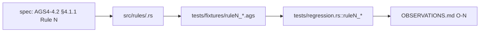

# traceability chain

## Definition
> [!quote] Every rule traces: spec §4.1.1 → src/rules/<family>.rs::rule_N → tests/fixtures/ruleN_*.ags → tests/regression.rs::ruleN_*_flagged → OBSERVATIONS O-N. Lint enforces the triad; a missing leg is a gap.

## Why it matters
Load-bearing for the test strategy: this is how the validator (or the parity harness) actually behaves — gaps surface as deltas against the spec (Phase A) and python-ags4 (Phase C/D).

## Diagram

## Where it shows up
Load-bearing across the rule families that depend on it — followed end-to-end by the [[traceability-chain]] and surfaced as deltas in [[parity-model]].

## Related
[[start-here]] · [[parity-model]] · [[rule-families]]
