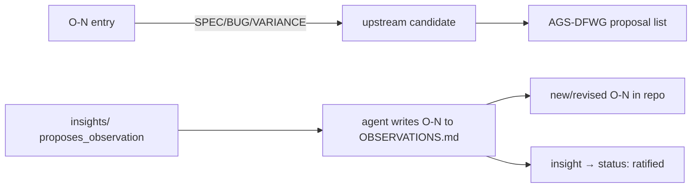

# upstream reporting

## Definition
> [!quote] OBSERVATIONS entries tagged [VARIANCE]/[SPEC]/[BUG] are candidates to report to the AGS Data Format Working Group; a `Reported: <ref> (date)` line prevents double-filing. The wiki's `insights/` with proposes_observation:true draft the entry, which the agent then writes into OBSERVATIONS.md directly (deliberate, house-style — AGS-WIKI §12.5).

## Why it matters
The campaign's whole point: turn observations into AGS-DFWG action. [VARIANCE]/[SPEC]/[BUG] O-Ns are candidates; a `Reported:` line prevents double-filing. The wiki's proposes_observation insights feed this — the agent writes the drafted O-N into the repo authority deliberately (§12.5); the wiki and OBSERVATIONS.md stay consistent (the insight flips to `ratified`). The consolidated, actionable output of this process is [[strat-ags-dfwg-upstream-list]] — the register drawn from the upstream-reportable O-Ns.

## Diagram

## Where it shows up
Load-bearing across the rule families that depend on it — followed end-to-end by the [[traceability-chain]] and surfaced as deltas in [[parity-model]].

## Related
[[start-here]] · [[parity-model]] · [[rule-families]]
