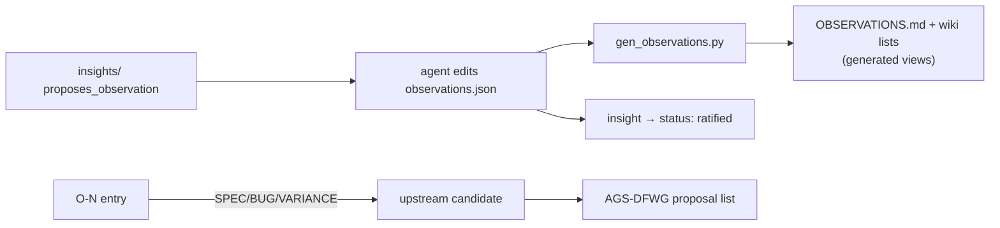

# upstream reporting

## Definition
> [!quote] Observations tagged [VARIANCE]/[SPEC]/[BUG] are candidates to report to the AGS Data Format Working Group; a `Reported: <ref> (date)` line prevents double-filing. The wiki's `insights/` with proposes_observation:true draft the entry, which the agent then writes into **`observations.json`** — the code SSOT — and regenerates the rendered views.

## Why it matters
The campaign's whole point: turn observations into AGS-DFWG action. [VARIANCE]/[SPEC]/[BUG] O-Ns are candidates; a `Reported:` line prevents double-filing. The wiki's proposes_observation insights feed this — the agent writes the drafted O-N into the repo authority deliberately; the wiki and the catalogue stay consistent (the insight flips to `ratified`). The consolidated, actionable output of this process is [[strat-ags-dfwg-upstream-list]] — the register drawn from the upstream-reportable O-Ns.

> [!warning] `OBSERVATIONS.md` is generated — never hand-edit it
> The SSOT is `repo:observations.json` at the repo root. `OBSERVATIONS.md` and
> the wiki's coverage-map lists are its rendered views. Add or change an O-N by
> editing the JSON, then regenerate with
> `uv run --no-sync python tools/gen_observations.py`. Writing into the rendered
> file directly fails `gen_observations.py --check`, which is a gate on both
> `ci.yml` and `nightly.yml`. Every O-N also needs its own zero-padded
> `ags-wiki/observations/O-NN.md` page, held in agreement by `--check-wiki`.

## Diagram

## Where it shows up
Load-bearing across the rule families that depend on it — followed end-to-end by the [[traceability-chain]] and surfaced as deltas in [[parity-model]].

## Related
[[start-here]] · [[parity-model]] · [[rule-families]]
