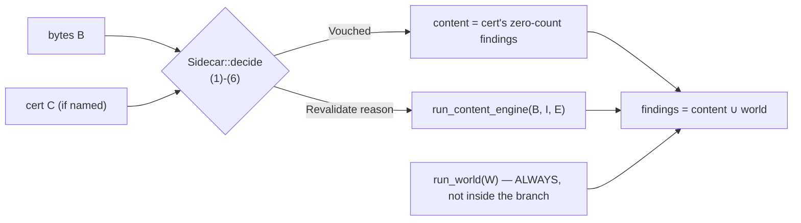

# `.ags.idx` v2 — content-sealed certificates, world-live checks, one door

> [!done] **Shipped — this is the model, not a plan.** PRs 1–7 of the rollout
> landed as four PRs: **#512** (core format v2), **#513** (validator: engine
> fingerprint + the WORLD module), **#514** (an unplanned sibling — the one-door
> resolve+run, below), and **#515** (the `laterite-ags4-trust` crate + the migration
> of all four surfaces onto it, which could not be split further: the format change
> deletes the predicates every surface calls, so the workspace does not compile until
> they have all moved). This page is the durable record of the 31-agent adversarial
> design workflow (2026-07-14) that produced the model, and of what shipping it taught
> — §8's tracking table carries the per-PR "as shipped" deltas, several of which
> contradict the original plan. Still open: the **owner-gated** DuckDB-extension
> follow-up in `niko86/laterite-duckdb` (§8, PR 8).

> [!note] **A sibling bug, same pattern, fixed alongside PR 2 (2026-07-14,
> branch `fix/edition-guard-modality`).** The CONTENT half had its own
> "surfaces reach past the door" hole, one layer above the WORLD one this
> page is about: `laterite-py`/`laterite-node`/wasm each hand-assembled
> `resolve_dict_version` + the O-42 `guard_4_0_4` content guard for their
> bytes/text branches instead of calling one door, and each skipped the
> guard — a file whose `TRAN_AGS` declared 4.0.3 while using a 4.0.4-only
> heading was judged against 4.0.4 from a path and 4.0.3 from bytes/text.
> Fixed by a new door, `check_parsed_with_dict`
> (`repo:rust-packages/laterite-ags4-validator/src/lib.rs`), one layer above
> `check_parsed` — see [[laterite-ags4-validator]] and [[O-42]]. Also the
> occasion for the first cross-surface **output-value** gate
> (`test_modality_output_parity.py` / `modality-output-parity.test.ts`):
> every gate this arc and the surface census own compares knob *names* or
> capability *presence*, never an *answer* — see [[modality-register]].

## Context

The v1 certificate (`Sidecar`, `repo:rust-packages/laterite-ags4-core/src/index.rs`)
conflates two different kinds of question behind one `check_files: bool` and one
`checker_matches` label comparison. Five concrete false-clean bugs fall out of that
conflation (proven below, §"Bugs this closes") — and a **sixth** was found in the fix
itself, see §2a: a cert can report "clean" for a file
whose declared attachments were deleted, `check_files=true` can silently no-op with
no cert involved at all, two of three `lat` launchers refuse to certify a file the
binary certifies correctly, every Python-minted cert lies about having measured
warnings/fyi, and a cert survives a rule-logic fix because the engine identity is a
hand-bumped semver, not a content hash. This document is the fix: a formal
CONTENT/WORLD partition, enforced not by convention but by deleting the fields and
parameters that would let a caller ask the wrong question.

## 1. The trust rule (formal)

Let:

- **B** = the source `.ags` bytes.
- **E** = the engine: the compiled rule logic + bundled dictionary + rules catalogue,
  identified by `EngineId = (validator, validator_version, engine_fingerprint, compat)`
  where `engine_fingerprint` is a **build-time SHA-256** (§4.4 of the source plan), not
  a hand-bumped semver. As shipped in PR 2 it hashed only the validator crate's own
  rule sources + the two bundled dictionary JSON files; **#550** found that left three
  verdict-determining paths uncovered and widened it to hash every **in-workspace**
  crate the verdict is expressed through, discovered by walking `[dependencies]` path
  deps transitively (`repo:rust-packages/laterite-ags4-validator/build.rs`) — see
  residual 3 in §10.
- **I** = the **content inputs**: every element of `CheckOptions` other than the bytes
  that can change a byte-pure verdict. Today: `edition` (`Auto{resolved}` |
  `Forced{v}`), `encoding` (WHATWG label), and — since **#568** shipped the runtime
  `--dict` overlay — `custom_dict` (`Option<CustomDictRef>`, `{name, hash}`). A custom
  dictionary is parsed once at the surface boundary into an owned, base-resolved
  `CustomDict` whose identity is a pure function of the dictionary itself, independent
  of the delivery file — so it earned a place in **I** rather than staying the
  `Unsupported`, always-forces-a-full-run knob this design originally anticipated. See
  [[dec-custom-dict-overlay]].
- **T** ⊆ {Errors, Warnings, Fyi} = the severity tiers the request wants. (Tiers gate
  *rule execution*, not post-filtering — so a tier is either measured or it isn't.)
- **W** = the **world dimensions** the request wants. Today: `OnDiskFiles(dir)` (Rule
  20's on-disk half).
- **C** = a certificate (`Sidecar` v2), if one was explicitly named (`--index` /
  `index=`).

**Partition axiom.** Every rule outcome is exactly one of:
- **CONTENT** — a total, deterministic function of `(B, I, E)`. Nothing else. No
  filesystem, clock, env, network.
- **WORLD** — depends on mutable state outside `(B, I, E)`.

**The rule.**

> **A certificate may substitute for a computation iff that computation is CONTENT,
> and all of:**
> 1. `C.version == SIDECAR_VERSION` ∧ `C.file.size == |B|` ∧ `C.file.sha256 ==
>    sha256(B)` *(bytes identical)*
> 2. `C.engine == E` — **including `engine_fingerprint`** equality, and `compat`
>    equality *(same engine, proven by content hash, not by a label someone
>    remembered to bump)*
> 3. `C.inputs == I` — **field-for-field**, where the field set is derived from
>    `CheckOptions` by an exhaustive destructure that **fails to compile** if a knob
>    is added *(same question)*
> 4. `C.errors == Measured{0}` *(a cert only ever exists for an error-clean file —
>    now a checked field, not an unenforced mint-time convention)*
> 5. For every requested advisory tier `t ∈ T`: `C.t == Measured{0}`. `NotMeasured`
>    ⇒ revalidate. `Measured{n>0}` ⇒ revalidate. **There is no "trust the count,
>    print it, skip the rows" path.**
> 6. If `W ≠ ∅`, the cert's group index must be **unambiguous** for every group the
>    world checks read (exactly one span per code, §4.5); otherwise revalidate.
>
> **A certificate NEVER substitutes for a WORLD computation. Under no condition.
> There is no field it could be trusted from — `check_files` is deleted from the
> format.** Every requested world dimension is executed **live, against current
> state, on every call**, whether a cert is present, whether the content half was
> vouched, whether the file is 4 KB or 400 MB.
>
> If any of (1)–(6) fails, the **entire** content half is recomputed by the engine.
> There is no partial-tier trust and no partial-rule trust.

### Why this is sound

- **Content half.** If (1) holds, B is byte-identical (SHA-256 collision
  resistance). If (2) holds, E is identical (the fingerprint hashes the actual rule
  source + dictionary bytes, so a rule fix or dictionary edit with no version bump —
  this repo's *normal* practice, 45 commits since the last bump — changes the
  fingerprint and invalidates the cert). If (3) holds, I is identical. A CONTENT rule
  is by the partition axiom a total function of `(B, I, E)`; all three are pinned ⇒
  its output is exactly what a fresh run would produce. (4)+(5) mean the cert's
  recorded output for every requested tier is "zero findings", so replaying it as an
  empty `Findings` set is faithful. (6) removes the one case where the cached
  *index* — which the world check reuses — is not a faithful locator.
- **World half.** Never trusted, never persisted, always executed. The false-clean it
  enabled cannot be reconstructed, because the state it was reconstructed *from* no
  longer exists in the type or on disk.
- The predicate is total: every failure mode routes to `Revalidate(reason)`, which is
  byte-for-byte the no-cert path.

## 2. The general principle (not a Rule-20 patch)

> **A certificate may substitute ONLY for computations that are a pure function of
> the certified bytes. Anything depending on external state must be re-checked,
> never skipped.**

Enforced three ways, in descending strength:

1. **No field to lie with.** `ValidationStamp` v2 has no `check_files`, no FILE-tree
   fingerprint, no world snapshot of any kind. There is nothing a future predicate
   could read to conclude "the outside world is still as it was." A hash/fingerprint
   of the FILE/ tree was **considered and rejected**: it re-opens a TOCTOU window,
   invites symlink/permission/recursion edge cases, and buys nothing over just
   running the (cheap) stat.
2. **No parameter to ask it with.** The request type is
   ```rust
   pub enum WorldScope { None, OnDisk(PathBuf) }   // no `bool`, no Option<Path> beside a bool
   ```
   > [!note] **Shipped in PR 2, one crate over from where this section originally assumed.**
   > `WorldScope` lives in `repo:rust-packages/laterite-ags4-validator/src/world.rs`, not the
   > (not-yet-existing) trust crate from PR 3 — the validator is what *executes* world checks,
   > so it owns the type. PR 3 re-exports it rather than defining it.

   A world check cannot be requested without supplying the thing to check against.
   This also closes the *pre-existing, undisclosed* bug the design workflow found:
   today `check_files=true` with `source: None` (any bytes/text-modality read, and
   wasm always) **silently no-ops and reports 0 Rule-20 findings** — a false clean
   with no cert involved at all. Under v2, `WorldScope::OnDisk` is unconstructible
   without a path, and the bytes/text API returns `Err(WorldCheckRequiresSource)`
   rather than quietly answering a question it never asked.
3. **No route around it.** In the one consume door, world execution is
   *unconditional on the cert*:
   ```rust
   let content = match cert.map(|c| c.decide(bytes, &question, &engine)) {
       Some(Decision::Vouched(v)) => v.into_findings(),
       _ => run_content_engine(...),
   };
   let world = run_world(&req.world, ...);        // <-- not inside any branch
   findings = content ∪ world;
   ```
   The next knob added to `CheckOptions` is caught because **adding it breaks the
   build** (the exhaustive `split_options` destructure) and the author must classify
   it CONTENT / WORLD before it compiles. `custom_dict` — the deferred [[O-28]]
   external dictionary this section once named as the obvious untested case — landed
   in **#568** and exercised exactly this defence: it classified CONTENT (its identity
   is a pure function of the parsed dictionary, not the delivery file), so the
   destructure required no loosening to accommodate it. See [[dec-custom-dict-overlay]].
   A future WORLD-classified knob wires into `run_world`, which is never skipped.

## 2a. CONTENT is not the same as SEALED (the sixth false clean, found in the fix)

The CONTENT/WORLD partition above is sound, and it is not sufficient. It answers *"may a
certificate speak for this?"* — it does **not** answer *"does the certificate actually
SAY enough to speak for it?"* Those came apart in the shipped implementation, and produced
a false clean inside the very PR that was removing false cleans.

`encoding` is CONTENT, correctly: the text is a pure function of the bytes and the decoder
label, so it is byte-pure in the sense §1 means. It was therefore allowed onto the fast
path. But the certificate sealed only the **bytes**, and the label is the other half of
that function — so a certificate minted under one decoder answered a question asked under
another.

It is exploitable, and was proven so on the shipped build, not argued (see [[O-48]]):

```
plain validate (utf-8):   1 finding(s), is_valid = False
certified under cp1252:   omega.ags.idx      <- mints: no ERROR under that decoder
validate --index (utf-8): count = 0 | certified = True | is_valid = True
```

A UTF-8 file carrying `Ω` (bytes `CE A9`) is **one** code point read as UTF-8 — 937, above
the extended-ASCII range Rule 1 tolerates, so a Rule 1 **error**. Read as windows-1252
those same two bytes are **two** code points, 206 and 169, both inside it — so only an
**FYI**. One file, two decoders, two verdicts, differing in the **error** tier: the one
thing a certificate asserts. Both validators behave this way ([[O-48]] probes python-ags4
too), so this is a property of the rule, not a bug in ours.

**How it got in is the instructive part.** §1's formalism has an **I** term — the *content
inputs*, "every element of `CheckOptions` other than the bytes that can change a byte-pure
verdict. Today: `edition` … and `encoding`." The implementation collapsed `ContentInputs`
into `Question` on the grounds that it "proved unnecessary" (§8, PR 3's as-shipped note —
now corrected), and in collapsing it, carried `edition` across and **dropped `encoding`**.
The design said it. The code did not. Nothing failed, because no gate compared a verdict
across decoders — the same blind spot, one level down, that the surface census was built
to close: *every gate we own compares knob names, not output values.*

**The rule the model was missing, now stated:**

> **Every input the findings depend on must be IN the certificate.** CONTENT earns a knob
> a place on the fast path; it does not excuse the certificate from recording it. A
> certificate that omits a content input is not a smaller certificate — it is a wrong one.

Enforced as a seventh gate in `Sidecar::decide`: `ValidationStamp.encoding` records what
the bytes were READ as, `Question.encoding` carries what the caller is reading them as, and
a mismatch is `RevalidateReason::EncodingDiffers` — the engine runs. The decoder a
certificate *was* minted under still gets the fast path: a match, not a ban.

**Residual (declared):** unlike the WORLD partition, this one has **no compile-time
enforcement**. `split_options`'s exhaustive destructure forces a new `CheckOptions` knob to
be *classified*, but nothing forces a knob classified CONTENT to be *recorded in the
stamp*. A future content knob can repeat this exact bug. The honest mitigation is a
convention plus a gate: when you add a CONTENT knob, add it to `ValidationStamp` and
`Question` in the same commit, and add an output-value test that mints under one value and
reads under another. Stated plainly rather than papered over — it is the same class of
residual as the world-partition one below.

**Residual (declared):** the partition itself is a human judgement made once per
rule, enforced at the *knob* level (compile error) and at the *I/O* level (a CI gate
greps `rules/*.rs` for `std::fs`/`std::env`/`SystemTime::now`/`Utc::now`/network calls
outside the sanctioned world module). Rust has no effect system; a rule that performs
ambient I/O *and* passes the grep (e.g. via a helper crate) would be misclassified.
This is discipline, not a type. Stated plainly.



## Bugs this closes

| # | Bug | Evidence |
|---|---|---|
| 1 | **Rule 20 cert false-clean.** `certify --check-files` on a delivery, then `rm -rf FILE/` — the `.ags` bytes are byte-identical, the SHA matches, and `lat validate --check-files --index` reports "clean (0 findings)" exit 0 where the truth is 1 finding, exit 1. | **VERIFIED** |
| 2 | **`check_files=true` with no source path silently no-ops.** `validate(path, check_files=True)` → 1 finding; `validate(bytes, check_files=True)` → 0 findings — same bytes, same flag. wasm **always** hits this (it never has a path). This is a false clean **with no certificate involved at all**. | **VERIFIED — fixed by PR 2**: `check_parsed` now refuses (`WorldCheckRequiresSource`, exit 5) instead of reporting clean. |
| 3 | **uvx and npx `certify` refuse an error-clean file that carries a warning** (exit 1) where the binary correctly mints it — a file cannot be certified on 2 of 3 launchers. | **VERIFIED** |
| 4 | **Every Python-library-minted cert records `warnings: 0` without ever measuring.** PyO3's `assemble` defaults `warnings=0, fyi=0`, and `_mint_cert` never passes them. | **VERIFIED** |
| 5 | **Engine identity is `CARGO_PKG_VERSION`** — a hand-bumped semver that does **not** change when a rule's logic changes, so a cert survives a rule fix. (Spot-checked against this repo's own git history: 45 commits since the last version bump.) | **VERIFIED** (spot-check) |
| 6 | **TOCTOU in `certify`**: the file is read twice — once to validate, once to hash — so a cert can bind to bytes that were never validated. | FROM-WORKFLOW (not yet reproduced) |
| 7 | **Redeclared-`GROUP` index truncation**: `index_ags4_bytes` maps each code to one range because `parse::group_order` de-duplicates (first-seen wins), so a file with `FILE … LOCA … FILE` (again) gets a `FILE` span truncated to the first section while the full parser *merges* both — a false clean through the very mechanism meant to make the general principle impossible. | **VERIFIED — fixed by PR 1**: `GroupIndex` now maps a code to `Vec<Range>`; `range()` refuses to guess for a redeclared code. |
| 8 | **A fifth un-inventoried trust site**, `packages/laterite/python/laterite/_cli.py`'s own `is_valid` certify gate — separate from the library's `_require_clean_validation`. | FROM-WORKFLOW (not yet reproduced) |

## §7 — P4, the forged cert: honest position

A hand-edited `.ags.idx` whose `sha256` matches the *real* (broken) file and whose
`validation` claims clean **defeats every predicate above**. Nothing in this design
signs the sidecar. This is real and is **not** fixed by v2.

> [!divergence] **Vocabulary change, load-bearing.** An `.ags.idx` is a
> **validation cache**, trusted exactly as much as the directory it sits in. It is
> **not an attestation** and must not be relied on across a trust boundary until
> signing lands. The word "certificate" oversells it — docs, `--help`, and this page
> use "validation cache" going forward.

**Position: acceptable today, with three enforced conditions and one type-level
guard.**

Why acceptable: an attacker who can write `f.ags.idx` in the delivery directory can,
with the same permission, write `f.ags` itself. In the *local-optimisation* threat
model — the only one this design ships for — the cert grants no authority the
attacker did not already have. It is a cache, and a cache in a directory you already
control is not a privilege boundary.

Where it would **not** be acceptable: any use where the cert crosses a trust boundary
— a client shipping `.ags` + `.ags.idx` to a consultant who "verifies" by trusting
the cert; a registry attesting deliveries. That is **attestation**, not caching, and
this design does not support it.

Enforced conditions:
1. **`--index` stays opt-in with no autodiscovery.** A sibling `f.ags.idx` is
   *never* consulted unless explicitly named. (Verified true on all three
   launchers today; a test pins it in v2.)
2. **Vocabulary** — as above.
3. **The format reserves signing now**, so it lands without another break:
   `ValidationStamp.signature: Option<Signature>` (v2, `None` today) and
   ```rust
   pub enum TrustPolicy { LocalCache, RequireSigned }
   ```
   `decide()` under `RequireSigned` returns `Revalidate(Unsigned)` for **every**
   unsigned cert — the strict policy exists and is **fail-closed by construction
   from day one**; implementing signatures only widens what it accepts. A caller
   that needs attestation today gets a full engine run, never a false clean.

## Performance: what the skip is worth (and why it survives being made honest)

| file size | v1/v2 content-only skip (read + SHA-256) | full engine | speedup |
|---|---|---|---|
| 8.5 MB | 20 ms | 125 ms | 6× |
| 42 MB | 34 ms | 559 ms | 16× |
| 102 MB | 56 ms | 1 459 ms | 26× |
| 407 MB | 172 ms | 6 210 ms | 36× (saves 6.0 s) |

The engine runs at roughly **70 MB/s**; the cert-skip path is just a read + a
SHA-256. SHA-256 itself runs at **3.44 GB/s** with hardware acceleration (SHA-NI) and
**~0.65 GB/s** software-only — and because *both* paths (skip and full engine) are
CPU-bound, the **ratio holds** even on hardware with no SHA acceleration (a floor of
roughly **9×** per-byte), and the **absolute saving grows** with file size regardless.
The default, content-only path (the overwhelming majority of calls — no
`--check-files`) keeps this 6×–36× speedup **exactly**: `decide()` costs the same SHA
plus a handful of string/enum compares. What changes is the on-disk path: v1's
`--check-files` was free *and false*; v2's costs `O(FILE-group bytes) +
O(#attachments) syscalls` (typically sub-millisecond to low-single-digit ms; even on
the 407 MB case the content skip still saves ~6.0 s of the total). That is a
correctness cost, not a regression — v1 was reporting a wrong exit code for free.

## §10 — residual risk the owner is accepting

Nine risks, none hidden:

1. **P4 (forgery) is open.** A hand-edited `.ags.idx` with a matching `sha256` still
   produces a false clean when explicitly named with `--index`. Mitigated only by:
   opt-in, no autodiscovery, the "validation cache, not attestation" reframing, and a
   fail-closed `RequireSigned` policy that today accepts nothing. **Signing remains
   deferred.** If a workflow ever ships `.ags` + `.ags.idx` across a trust boundary,
   this design does not cover it and signing must land first.
2. **Purity classification is discipline at the I/O level.** The compile-error gate
   catches a new *knob*; the CI grep catches ambient `std::fs`/clock/network *in
   `rules/*.rs`*. Neither catches a rule that reaches external state through a helper
   crate. No effect system, no proof.
3. **The engine fingerprint covers the validator's own source + data, and — since
   #550 — every in-workspace crate the verdict is expressed through; it does not
   cover external crates, the compiler, or `Cargo.lock`.** #550
   (`repo:rust-packages/laterite-ags4-validator/build.rs`) replaced the original
   hand-listed rule-source hash with a derivation that walks `[dependencies]` path
   deps transitively — dev-/build-deps are **not** followed, so
   `laterite-ags4-core` (a dev-dep here) stays out — closing three previously
   uncovered verdict-determining paths: `laterite-ags4-types` (owns `format_nsf`, which
   computes Rule 8's verdict), `laterite-ags4-parse` (the tokenizer that decides
   field boundaries), and `laterite-ags4-reference`'s `build.rs` (which *generates*
   the per-edition dictionary tables the JSON projects into — the data was hashed,
   the code projecting it was not). `build.rs` never reads `Cargo.lock`, and there
   is no CI test asserting the shipped artefacts include it — this residual
   previously claimed both, and neither held up under inspection. So a
   semver-compatible bump of an EXTERNAL dependency can still change behaviour
   without moving the fingerprint — that residual is real and stays open. What
   changed is the reasoning, not the conclusion, for external deps: hashing the
   whole *resolved* dependency tree would still invalidate every certificate on any
   unrelated `cargo update` — upstream churn nobody here controls — so external
   deps stay uncovered on purpose. That argument was a false dichotomy applied to
   **in-workspace** path deps, though: no `cargo update` ever touches them, they
   move only when this repo edits them, and #550 closed exactly that gap for the
   crates that actually decide a verdict.
4. **`checked_at` still never expires.** A cert is trusted regardless of age; only
   bytes/engine/inputs invalidate it. Correct given (1)–(3) pin everything a CONTENT
   verdict depends on — but it is a deliberate choice, stated.
5. **TOCTOU.** The world check is true at the instant it stats. Nothing prevents the
   FILE/ tree changing microseconds later. Rule 20 also only ever checked
   *existence*, never content — a byte-swapped-but-present attachment was never
   caught and still isn't.
6. **`MintToken` is not unforgeable** against a determined in-workspace Rust author;
   it stops the accidental bypass (what actually happened, four times), not a
   deliberate one.
7. **The external DuckDB extension is a different repository.** Its compliance with
   the one-door rule is contractual and owner-gated, not compiler-enforced. It
   currently consumes only the *location* claim, which keeps the blast radius to a
   wrong-slice bug (fixed by PR 8), not a false clean — but nothing in this tree can
   stop that repo from hand-rolling a verdict predicate again.
8. **Redeclared-group files lose the skip** on `--check-files`. Conservative,
   deliberate, rare.
9. **`certify()`'s contract changes** on the Python and Node libraries: it now runs
   its own check instead of vouching for a prior `validate()`. A user-visible
   behaviour and cost change, justified by the fact that the old contract is the
   exact mechanism by which bug 4 and the stale-profile bug existed.

## 8. Implementation plan (ordered; each step is its own PR)

Tracking table — resume state for a future session. As of 2026-07-14: **PR 1** is merged
(#512, `feat/cert-trust-v2-core`) with a **narrower shipped scope than first drafted
here** — see its row; **PR 2** is merged (#513, `feat/cert-trust-v2-world`); an
**unplanned PR** landed between them (#514, `fix/edition-guard-modality`) — the one-door
resolve+run that fixed the bytes/text edition-guard drift, and the arc's first
cross-surface **output-value** gate; and **PRs 3–7 ship together** in
`feat/cert-trust-crate`, because they cannot ship apart: PR 3 changes the `.ags.idx`
format and deletes the predicates (`checker_matches`, `profile_covers`) the four surfaces
call, so the workspace does not compile until every consumer has moved. Splitting them
would have meant either a commit that does not build or a temporary
compatibility shim — a second trust path, which is the exact thing this arc exists to
remove. PRs 8–9 remain `todo`. Flip a row's status as its PR lands.

| PR | Scope | Status |
|---|---|---|
| **PR 1** | **Core: locator honesty — multi-span `GroupIndex`, format v2.** **Re-scoped from the original plan (below) to just the byte-index fix; everything else this row used to list moved to PR 3.** `laterite-ags4-parse`: new `GroupRecord { code, byte_offset, line }` + `ParsedFile.group_records` — every occurrence of a GROUP, not the first-seen-wins dedup `groups`/`group_order` keep for the typed view. `rust-packages/laterite-ags4-core/src/index.rs`: `GroupIndex` now maps a code to a `Vec<Range>` (all spans), with `spans()` / `range()` (`None` for a redeclared group rather than guessing) / `is_unambiguous()`; `Sidecar.groups` is `HashMap<String, Vec<Range>>`; `SIDECAR_VERSION` bumped 1→2; `index_ags4_bytes` walks `group_records`. `laterite-py`: `Sidecar.index()` returns `{code: [(start, end), …]}`. Fixes bug 7 (redeclared-`GROUP` index truncation). **Deferred to PR 3** (where the trust crate is their only consumer, so they can be designed together with it): `TierCoverage`, `ContentInputs`, `EditionInput`, `EngineId`, `Decision`, `RevalidateReason`, `TrustPolicy`, `MintToken`, `Sidecar::decide`, private fields + accessors, deleting `check_files` from `ValidationStamp`. | open (#512) |
| **PR 2** | **Validator: engine fingerprint + world module + loud pathless failure.** New `laterite-ags4-validator/build.rs` emits `LATERITE_ENGINE_FINGERPRINT` — a build-time SHA-256 (16 hex chars) over the rule sources (`src/rules/**`, `lib.rs`, `parse.rs`, `findings.rs`, `world.rs`, `catalogue.rs`) plus the two bundled reference-leaf JSON files — exposed as `pub const ENGINE_FINGERPRINT`; `sha2` is a **build-dependency only** (`lean_dep_graph` still passes, since it checks `-e normal`). Declared residual, in the `build.rs` header: a dependency bump that changes rule behaviour without touching those files is not caught — hashing the whole resolved dep tree was rejected as it would invalidate every cert on any unrelated `cargo update`. **Coverage later widened by #550** (residual 3 in §10, below): the hand-listed file set left three verdict-determining paths uncovered — `laterite-ags4-types` (owns `format_nsf`, which computes Rule 8's verdict), `laterite-ags4-parse` (the tokenizer deciding field boundaries), and `laterite-ags4-reference`'s `build.rs` (which *generates* the per-edition dictionary tables from the JSON that was hashed) — so editing any of them left a stale cert reading `Vouched`. #550 replaced the hand list with a derivation over `[dependencies]` path deps, walked transitively (dev-/build-deps excluded); the `cargo update` argument above still holds, but only for genuinely external deps, not in-workspace ones. New `src/world.rs`: `pub enum WorldScope { None, OnDisk(PathBuf) }` + `pub fn run` — houses `rule_20_on_disk`, moved out of `rules/references.rs` (with its 3 tests; `WorldScope` lives in the validator, not the not-yet-existing PR-3 trust crate, a deviation from §2 above). `rules::run_all` is now CONTENT-only and `pub(crate)` (lost its `source` param and the on-disk call — nothing outside the crate can reach the rule engine directly any more). New `pub fn check_parsed(parsed, dict, opts, world) -> Result<Findings, ValidatorError>` — **the one door**: refuses (`WorldCheckRequiresSource`, exit 5 — the bad-*arguments* code) when `check_files` is set and `world` is `None`, else runs CONTENT ∪ WORLD, the world call sitting outside any branch a future cert-skip could hide behind. All four out-of-crate `run_all` callers now go through it: `laterite-ags4-emit`, `laterite-py` (text+bytes), `laterite-node` (text+bytes), `laterite-ags4-wasm` (3 sites). Surface plumbing: `_errors.py`/`errors.ts` gain `WorldCheckRequiresSourceError`, `cli.ts` maps it to exit 5, `laterite-ags4-parity`/`laterite-ags4-corpus-qa` name it in their exhaustive matches. `lat` is unaffected (`check_file` always has a path). **Closes bug 2**, the headline: `check_files=true` on bytes/text — every non-`lat` surface, wasm always — silently reported Rule 20 clean; now refuses instead. | done |
| **PR 3** | **The trust crate.** New `laterite-ags4-trust`: `Request`, `DictRequest`, `Outcome`, `CheckedRun`, `split_options` (exhaustive destructure), `check()`, `mint()`, `engine_id()` — plus the `TierCoverage`/`ContentInputs`/`EditionInput`/`EngineId`/`Decision`/`RevalidateReason`/`TrustPolicy`/`MintToken`/`Sidecar::decide` work re-scoped out of PR 1 (its row). `WorldScope` is **re-exported from the validator** (PR 2 defined it there, not here — see §2's note). `mint` forces both tiers, refuses iff `errors > 0`. `check` = `decide()` → (vouched ? empty : engine) ∪ `run_world` (unconditional). **As shipped:** `TrustPolicy` and `MintToken` proved unnecessary — `Question` (what is being asked) + `EngineId` (who is asking) carry everything `decide` needs, and the mint takes no verdict to token-guard. **`ContentInputs` was ALSO collapsed into `Question`, and that was a mistake**: `edition` came across and `encoding` did not, which is the sixth false clean (§2a — caught before merge, fixed in the same PR, gated at three levels). The lesson is in §2a; the correction here is that this row once read "`ContentInputs` … proved unnecessary", and a future reader should see what that sentence cost. `MintError` (validate / not-certifiable / not-indexable) is its own type: squeezing "cannot certify: 3 errors" into `ValidatorError::NotAgs4` produced the sentence *"not a parseable AGS4 file: cannot certify…"* about a file that parsed perfectly. | done (with PRs 4–7) |
| **PR 4** | **`lat`.** `repo:rust-packages/laterite-ags4-check/src/commands/cert.rs`: delete `try_certified_skip`/`mint_index`/`report_certified_skip`; `commands/certify.rs`/`commands/validate.rs` build a `Request` and call `trust::{mint, check}`. `--check-files` on a stdin/bytes input now errors loudly. **As shipped:** `report_certified_skip` was KEPT (a certified run must say the engine was skipped, and say that a `--check-files` half still ran); `--check-files` was **removed from `certify`** on all three launchers — a certificate is a statement about bytes, and the directory beside them is not one. | done |
| **PR 5** | **`laterite-py`.** Remove `PySidecar::assemble` and its `warnings=0, fyi=0` defaults; add `trust_check`/`trust_mint` natives. `repo:packages/laterite/python/laterite/__init__.py`: delete the skip conjunction, `Report.from_cert`, `_mint_cert`, `_require_clean_validation`, `_last_check_files`, `_last_forced`; `certify()` now runs a fresh full-tier check. **`repo:packages/laterite/python/laterite/_cli.py`: delete its own `is_valid` certify gate** (bug 8, the fifth site). **As shipped:** `Report.resolution` no longer carries `"certified"` as a value — it says which dictionary judged the file, and the new `Report.certified` says whether the engine ran. One field, one question. | done |
| **PR 6** | **`laterite-node`.** Mirror of PR 5: drop the `assemble` factory and its `unwrap_or(0)` defaults; add `checkWithCert`/`mintCert`; delete the ~line-240 conjunction, `#mintCert`, `#requireCleanValidation`, `#lastCheckFiles`, `#lastForced` in `ts/ags4-file.ts`. Node CI typechecks separately (`tsc --noEmit`) — remember to run it. **As shipped:** `Report.fromCert` deleted for `get certified()`; `Ags4File.validate()` calls the native door directly (the certificate is a handle-scoped fact, not a public `ValidateOptions` knob); the node CLI's certified note moved to **stderr**, matching the binary and uvx, and its test harness moved to `spawnSync` because a stdout-only harness cannot see it. | done |
| **PR 7** | **wasm.** `repo:rust-packages/laterite-ags4-wasm/src/lib.rs::certify` calls `trust::mint` with `WorldScope::None` — which it **cannot** construct otherwise (no filesystem, no path) — so the browser can no longer mint a cert asserting a world check it never performed, nor claim `warnings:0`/`fyi:0` without measuring. | done |
| **PR 8** | **External DuckDB extension** (`niko86/laterite-duckdb`, owner-gated, separate repo). `src/cert.rs::sliced_group` must fall back to a whole-file parse when `group_spans(code).len() != 1` (today it would silently read a truncated first section — a real bug fix, not just a rebuild). If a verdict surface ever returns there, it must depend on `laterite-ags4-trust` and call `check()` — contractual, not compiler-enforced, because it is a different repository. | todo |
| **PR 9** | **Wiki.** [[dec-ags-idx-certificate]] rewritten to this document (flips its `status` to `superseded`, `superseded_by: [cert-trust-v2]`); [[crate-map]] gains `laterite-ags4-trust`; new `observations.json` entries for (a) the encoding-dependent Rule 1 severity flip as a cert input, (b) redeclared-`GROUP` index truncation (bug 7), (c) `check_files` silently no-op'ing without a source (bug 2). `reindex.py` + `lint.py` (LINT CLEAN) + `log.md`. | todo |

## Related
[[dec-ags-idx-certificate]] · [[crate-map]] · [[laterite-ags4-trust]] · [[laterite-ags4-core]] · [[laterite-ags4-validator]] · [[laterite-ags4-reference]] · [[laterite-ags4-check]] · [[laterite-py]] · [[laterite-node]] · [[laterite-ags4-wasm]] · [[surface-census]] · [[data-single-source-audit]] · [[dec-dictionary-single-source]] · [[strat-o27-rule20-ondisk]] · [[rule-20-file-fset]] · [[rule-families]] · [[O-42]] · [[modality-register]] · [[testing-strategy]] · [[dec-custom-dict-overlay]] · [[O-28]]
