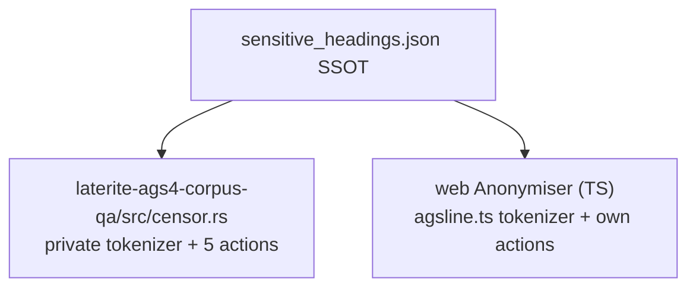

# laterite-ags4-censor: extracting the AGS4 scrub engine into a shared leaf

## Context

Two client tools independently "anonymise" AGS4 files. `laterite-ags4-corpus-qa`'s
`censor` subcommand (pre-#581: `laterite-ags4-corpus-qa/src/censor.rs` in full) scrubs
real client data before a corpus can be shared/committed for dogfooding the
validator. The browser `Anonymiser`
(`repo:web/src/components/tools/Anonymiser.tsx`) lets a site visitor redact
their own file client-side before sending it elsewhere. Both read the SAME
classification — `sensitive_headings.json` (which AGS4 heading → which
category → default action) was already single-sourced on 2026-06-21 (see
[[data-single-source-audit]]'s "New single source: sensitive headings") — but
each hand-implemented its own scrub *actions* and its own AGS4 field
tokenizer to apply them: the corpus tool's private `parse_fields`/
`emit_fields`, and the browser's `splitAgsFields`/`quoteAgsField`
(`repo:web/src/lib/agsline.ts`). That private tokenizer was a **fourth**
independent AGS4 line tokenizer, alongside the three `laterite-ags4-parse`
had already converged onto ([[dec-laterite-types-leaf]], #168, #533) — exactly
the drift shape the #527 cross-surface convergence arc exists to close.

## Options considered

1. **Leave both as-is.** The classification (the higher-value half) was
   already single-sourced, so the actions looked like "just" five small
   string transforms not worth a crate. Rejected — see the Reframe below:
   they weren't as small as they looked, and a fourth private tokenizer is
   the exact anti-pattern #168/#533 spent two arcs eliminating.
2. **Port the Rust logic to TypeScript, keeping two hand-synced copies.**
   Rejected for the same reason [[dec-laterite-types-leaf]]'s Option 2 was:
   guarantees drift the first time one side changes and the other doesn't.
3. **Move the engine into `laterite-ags4-core` or `laterite-ags4-validator`.**
   Rejected: neither is wasm-clean (core carries `age`/`zstd`/`calamine`; the
   validator is the rule half of the 6.9 MB engine wasm) — reaching either
   from a browser surface would re-import wasm-hostile deps or force every
   Anonymiser call through the full engine bundle regardless.
4. **Extract a dedicated leaf**, the same shape as `laterite-ags4-parse`
   (#168), `laterite-types` (this decision), `laterite-ags4-diff` (#204) and
   `laterite-ags4-merge`: wasm-clean, depending only on other already
   wasm-clean leaves.

## Decision

Option 4, split into two phases so each is independently reviewable.

**Phase 1 (done, 2026-07-18):** extract the scrub engine into
`laterite-ags4-censor` (`repo:rust-packages/laterite-ags4-censor/src/lib.rs`).
Public API: `censor(text, file_id, &Policy, &CensorOptions) -> (String,
Tally)`, `Policy::from_sensitive_json(json, include_freetext)`,
`Policy::retain_codes(keep)`, `CensorOptions`, `Tally`. It holds the five
scrub actions (filehash / pseudonym / blank / token / brackets), the two-pass
per-heading pseudonym map, custom group/column/orphan-def dropping, and the
ABBR-of-sensitive tokenisation. Deps — all already wasm-clean:
`laterite-ags4-parse` (tokenizes via the shared `tokenize_spans`, retiring the
corpus tool's own private tokenizer), `laterite-types` (`quote_field`
re-quoting scrubbed cells), `laterite-ags4-reference` (standard group/heading
codes for `drop_custom`, off the dictionary SSOT rather than a re-embedded
copy of `ags_dictionary.json`). `laterite-ags4-corpus-qa` now depends ON the leaf and
keeps only its crawler/manifest/rayon/report wrapper
(`repo:rust-packages/laterite-ags4-corpus-qa/src/censor.rs`). Added to the workspace
members, the public-tree allowlist (`repo:tools/release/public-allowlist.txt`)
and a CI `wasm32-unknown-unknown` compile-guard — proven to compile for the
browser target even though nothing consumes it there yet.

**Phase 2 (done, 2026-07-18):** a `censor` export on the engine wasm
([[laterite-ags4-wasm]]): `censor(data, sensitiveJson, selectedCodes, token,
dropCustom, includeFreetext) -> { text, tally }`. It SHA-256-hashes the input
bytes for `PROJ_ID`'s filehash (the full 64-hex — the same digest the leaf's
`filehash` action always used), lossily decodes the bytes (matching the
browser's existing `TextDecoder({fatal:false})` policy), resolves the
classification SSOT (`sensitive_headings.json`) into a `Policy`, optionally
restricts it to the user's ticked heading codes via `Policy::retain_codes`,
and runs the leaf. The engine wasm's own dependency graph gained
`laterite-ags4-censor` + `sha2` + `hex` (all already wasm-clean / already in
its dep graph via the keychain) — the wasm grew ~6.6→6.64 MB, still under
the 8 MiB PWA precache cap. The validator worker
(`web/src/lib/validator.worker.ts`) and its client
(`web/src/lib/validatorClient.ts`) gained a `censor` RPC op, async/batch like
`diff`/`merge`, off the render path (unlike the #533 tokenizer wasm, which is
on it) — the right fit for a Download action, not a boot-critical instance.
`web/src/components/tools/Anonymiser.tsx`'s hand-written TS scrub (a `sha16`
file id, a pseudonym pass, a per-cell `redact` switch, `redactLine`,
canonical-CRLF re-emit) is **deleted**; it now calls `censorFile(bytes, …)`
at Download. The selection/preset/token UI stays; the per-(group,heading)
selection collapsed to heading **codes** so a pseudonym for a shared code
stays consistent across groups (`Policy::retain_codes` takes codes, not
group/heading pairs). `agsline.ts`'s `splitAgsFields`/`quoteAgsField` are
untouched — they stay for the browser's own GROUP-block/alignment DISPLAY
use, per [[dec-laterite-types-leaf]]'s description of what `agsline.ts`
keeps; the scrub tokenizer was always the leaf's `laterite-ags4-parse`
dependency, never `agsline.ts`.

## The reframe

`censor.rs` and the browser `Anonymiser` were not one duplicated engine
wearing two faces — they are two different tools that happen to share a
five-action vocabulary applied to the same classification. `censor.rs` is a
private corpus-prep tool: it lets real client `.ags` files be crawled,
scrubbed, and safely committed/shared for dogfooding the validator against
real-world structure (feeding O-30..O-34, per [[laterite-ags4-corpus-qa]]). The
Anonymiser is user-facing: a site visitor drops their own file in a browser
tab and downloads a redacted copy; nothing leaves the client. Different
audiences, different call sites, same underlying transform.

Because the classification half was already single-sourced, only two things
were genuinely duplicated: the tokenizer, and the five scrub actions
themselves. The Rust engine turned out to be the more complete of the two —
it also does custom-group/column/orphan-def dropping and
ABBR-of-sensitive tokenisation, neither of which the browser had. So Phase 1
makes the Rust engine the single authority, and Phase 2 is the browser
*gaining* capability (structural scrub, preserved line endings, full 64-hex),
not losing anything — the same "engine is the ground truth, surfaces adopt
it" shape [[dec-laterite-types-leaf]] and [[dec-ags4-merge-semantics]]
already established, applied to a different feature.

## Behaviour reconciliations (four decisions)

Extracting one engine from one implementation meant choosing, once, between
behaviours that had never been directly compared before:

1. **`filehash` is the full 64-hex SHA-256**, not a truncated form.
   `PROJ_ID` (the field this action fills) is a KEY heading — truncating
   trades collision-safety for brevity for no real benefit (the value is
   machine-generated, never hand-typed), so the leaf keeps the full digest.
2. **Line endings are preserved verbatim.** Anonymise ≠ fix: a file's
   CRLF/LF mix (even a Rule-2a-breaching one) is a structural property the
   scrub has no mandate to normalise. Changing it would make a "clean" corpus
   artificially cleaner than the client's real files, defeating the corpus
   tool's own defect-preserving purpose — dogfooding wants realistic input,
   not sanitised input.
3. **The engine is cell-surgical everywhere.** Only DATA cells whose action
   actually changes them are rewritten; every other byte on an untouched row
   — and every untouched cell *within* a changed row — passes through
   verbatim rather than being re-quoted canonically. This is strictly more
   faithful than the pre-extraction corpus behaviour on pathological rows (a
   stray quote, non-canonical spacing), while staying byte-identical on
   well-formed input: converging two implementations turned up a case the
   older one handled less carefully than it could have.
4. **Reach the browser via the existing engine wasm, not a new tiny crate.**
   #533 chose a dedicated tiny cdylib (`laterite-ags4-tokenizer-wasm`) for
   the tokenizer/quoter specifically because that pair is needed
   synchronously on every keystroke of the inline line editor — loading the
   6.9 MB engine wasm for that would be the wrong trade
   ([[dec-laterite-types-leaf]]'s "B-tiny" framing). Censor has no such
   latency constraint: the Anonymiser's Download button is a one-shot,
   per-file, already-async action, so Phase 2 reaches `laterite-ags4-censor`
   through the engine wasm ([[laterite-ags4-wasm]]) that Anonymiser's
   neighbouring Tools (Revision diff, Merge) already load, rather than
   paying for a second wasm artifact and a second load-order dependency.

## Consequences

- `laterite-ags4-corpus-qa` no longer owns any scrub logic of its own; changing an
  anonymisation action is now a one-crate edit (`laterite-ags4-censor`), the
  same shape every other #168/#533/#204-style leaf extraction left behind.
- A fourth private AGS4 tokenizer is retired (`censor.rs`'s old
  `parse_fields`/`emit_fields`) — every Rust surface that tokenizes an AGS4
  line now goes through `laterite-ags4-parse`, in one of its two established
  shapes (`split_ags_line`/`field_span` for the line-by-line rule walk,
  `tokenize_spans` for span-preserving editing/scrubbing).
- Corpus output is byte-identical to the pre-extraction tool on well-formed
  input, and strictly more faithful (cell-surgical) on pathological rows — a
  behaviour-neutral-or-better migration, not a re-tuning.
- The browser Anonymiser's hand-written TS scrub is retired; it now calls the
  same engine `censor.rs` and the corpus tool call, so a changed scrub action
  is a one-crate edit reaching all three call sites, not two of three. The
  browser also *gained* capability it lacked (custom-group/column dropping,
  ABBR-of-sensitive tokenisation, preserved line endings, the full 64-hex
  filehash) rather than losing anything — the reframe above holds through
  both phases, not just Phase 1.
- `crate-dependency-graph.md` (generated by `repo:tools/gen_crate_graph.py`)
  and `crate-map.md`'s curated mermaid both gained the new crate and its
  `parse`/`reference`/`types` → `censor` → `laterite-ags4-corpus-qa` **and**
  `censor` → `laterite-ags4-wasm` edges (the wasm crate's `Cargo.toml` now
  depends on `laterite-ags4-censor` + `sha2` + `hex`).

## Crate graph

**Before** — two independent scrub implementations, sharing only the
classification data:



**After** — one engine leaf both surfaces depend on (both phases done):

```mermaid
graph TD
  parse[laterite-ags4-parse] --> censor[laterite-ags4-censor]
  reference[laterite-ags4-reference] --> censor
  types[laterite-types] --> censor
  ssot[sensitive_headings.json SSOT] -. Policy::from_sensitive_json .-> censor
  censor --> corpusqa[laterite-ags4-corpus-qa]
  censor --> wasm[laterite-ags4-wasm]
  wasm -. censor RPC op, validator.worker.ts .-> web["web Anonymiser"]
```

## Related

[[dec-laterite-types-leaf]] · [[crate-map]] · [[crate-dependency-graph]] ·
[[laterite-ags4-corpus-qa]] · [[data-single-source-audit]] · [[laterite-ags4-wasm]] ·
[[dec-ags4-merge-semantics]]
