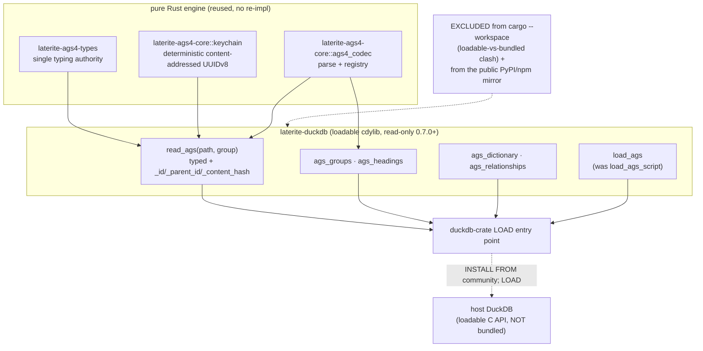

# laterite-duckdb — a DuckDB loadable extension reading AGS4 from SQL

## Context

The toolkit could already turn an AGS4 file into typed tables, but only by
going *through* a heavy host: the `.ags5db` writer
(`ags5/rust-packages/laterite-ags5-db/src/convert.rs`) ingests a file into a
DuckDB database, minting **random UUID7 surrogate keys** + a content-hash
lookup table to resolve parent links (exp-uuid7-surrogate-keys). That is
the right shape for a *persisted, merge-able* store, but it is the wrong shape
for "I have a `.ags` on disk and want to `SELECT` from it" — it requires the
bundled ~50 MB DuckDB (dec-ags5db-submarine) and a write step.

DuckDB's own idiom for "read a foreign file as a table" is a **table
function** — `read_csv('f.csv')`, `read_parquet('f.parquet')`. The question:
can AGS4 get the same first-class `read_ags('site.ags','LOCA')` surface, with
**born-typed** columns and **joinable** parent links, without re-implementing
the engine and without shelling out to `.ags5db`?

A second, sharper problem sits underneath it. A table function is called
**per group** — `read_ags(f,'SAMP')` and `read_ags(f,'LOCA')` are two
independent `bind`/`scan` invocations with **no shared state**. For a join
like `SAMP._parent_id = LOCA._id` to work, the two calls must *agree on every
key* without ever talking to each other. The `.ags5db` writer's clock+RNG
UUID7 **cannot** do this — its keys are minted from `now()` + entropy, so two
runs over the same bytes disagree. That is exactly why the writer needs the
lookup table.

## Options considered

1. **A C++ `ATTACH`-style storage extension** — the heaviest DuckDB extension
   shape (a custom storage backend mounted as a schema). Idiomatic for a
   *database*, but AGS4 is a flat text file, not a queryable store; it would
   mean C++ and a far larger surface for a read-only need.
2. **Re-use the `.ags5db` writer** behind a thin SQL veneer — pulls the bundled
   DuckDB + a write step into every read; defeats the "lightweight reader"
   goal and re-introduces the clock/RNG keys that can't join statelessly.
3. **A Rust loadable extension with a `read_ags(...)` table function**, reusing
   the existing pure-Rust engine and minting **deterministic, content-addressed**
   keys so cross-group joins work with no shared state.

## Decision

**Option 3.** A new crate **`laterite-duckdb`**
(`ext:niko86/laterite-duckdb`) builds a DuckDB **loadable** extension —
the `laterite_ags4` community extension — that reads AGS4 files as typed,
UUID-keyed tables straight from SQL:

```sql
INSTALL laterite_ags4 FROM community;
LOAD laterite_ags4;
SELECT loca_id, loca_gl FROM read_ags('site.ags','LOCA') WHERE loca_gl > 50.0;
-- join across groups via the deterministic keys, no shared state:
SELECT s.samp_ref, l.loca_gl
FROM read_ags('site.ags','SAMP') s
JOIN read_ags('site.ags','LOCA') l ON s._parent_id = l._id;
```

It was originally built on **quack-rs 0.14** — a Rust SDK over DuckDB's <!-- retired: quack-rs -->
**stable C Extension API** (forward-compatible ABI, **zero C++**), with
`libduckdb-sys`'s `loadable-extension` feature giving a *binding stub*
against the host DuckDB's extension C API — **not** the bundled ~50 MB
engine — so the build stayed light. **Migrated 2026-07-08 to the official
`duckdb` crate** (same binding-stub/loadable shape, zero C++ unchanged);
the switch also **unblocked wasm** — quack-rs's 1.87 MSRV forced LLVM-20 to <!-- retired: quack-rs -->
emit `--enable-bulk-memory-opt`, which the community wasm CI's older
binaryen rejected, while the `duckdb` crate builds on rustc 1.86 (no such
flag), so the extension now builds all three wasm variants (`wasm_mvp`,
`wasm_eh`, `wasm_threads`). *(The exact post-migration `LOAD` entry-point
wiring — the `duckdb`-crate analog of quack-rs's `entry_point_v2!` macro — <!-- retired: quack-rs -->
isn't verified here; the extension crate lives in the external
`niko86/laterite-duckdb` repo, not this workspace.)* Distribution is via
DuckDB **Community Extensions**, **not** the PyPI/npm mirror — so this
never enters the wheel-weight split ([[crate-map]]). The community-side
0.7.0 wasm release (PR #2197) is **pending the DuckDB maintainers' merge**
as of this writing — the migration itself is done and repo-side wasm
builds green, but the public wasm *publish* is not yet live.

It reuses the pure-Rust engine wholesale: `laterite-ags4-core`'s AGS4 codec
(`ags4_codec::read_ags4_bytes`, via
`ext:niko86/laterite-duckdb:src/source.rs`), the deterministic-key
**keychain** (below), and `laterite-ags4-types`' single typing authority
([[dec-laterite-ags4-types-leaf]]) — no re-implementation.

### The crown jewel — deterministic content-addressed keychain

The keys are not minted by a clock or RNG. They are **derived purely from the
row's identifying keys** (`repo:rust-packages/laterite-ags4-reference/src/keychain.rs`
— the row-identity consolidation moved the module out of `laterite-ags4-core`
into the reference leaf, re-exported unchanged at the historical
`laterite-ags4-core::keychain` path, so this citation's home moved but not its
resolution):

- A row's `_id` = `UUIDv8(SHA-256(injective length-prefixed encoding of the
  row's spec key-chain))`. The key-chain is `g.key_headings()` — already
  *denormalised* (ancestor KEYs first, then own: `SAMP` →
  `[LOCA_ID, SAMP_TOP, SAMP_REF, SAMP_TYPE, SAMP_ID]`).
- A row's `_parent_id` = the **same function** over the *parent's* key-chain,
  read by name from the child's denormalised row (an AGS4 child repeats every
  ancestor KEY).

So **`child._parent_id == parent._id` by construction** — two independent
`read_ags(...)` calls agree on every id with **no shared state**, which is
exactly what lets the `SAMP`↔`LOCA` join above work across separate table-
function invocations. The function is **pure** (registry + strings + `sha2` +
`uuid` — no DuckDB, no clock, no RNG), so it is exhaustively unit-testable and
shareable by every host.

Two correctness details the module pins:

- **Hash the raw AGS4 string, never the parsed value.** A `2DP` `SAMP_TOP`
  arrives as the bytes `"1.50"`; the child denormalises the *same* bytes.
  Hashing the parsed `f64` would split identity (`1.5` vs `1.50`) and disagree
  across formatters/editions. The key is the producer's bytes, trimmed —
  matching `convert.rs::encode_shared_tuple`.
- **Injective encoding.** Every string is length-prefixed (`u32` LE length +
  UTF-8 bytes) and the group code + chain length are folded in, so no field's
  content (NUL, newline, commas — whatever a hostile file carries) can be
  misread as a separator and no `("ab","c")` can alias `("a","bc")`. A
  round-trip decoder in the test module *proves* this is lossless.

This **replaces** the `.ags5db` writer's random-UUID7 + lookup-table approach
*for this read path*, and is a **reusable primitive**: applying it in the
writer would make `.ags5db` **cross-delivery merge stateless** (same content →
same id, with no reconciliation table) — a follow-up, not done here. Key drift
(e.g. `MOND` keys on `MOND_REF` where its parent `MONG` keys on `PIPE_REF`) is
surfaced via `keychain::shared_keys` (the child↔parent KEY intersection) rather
than fabricating a dangling `parent_id`.

> [!note] Why UUIDv8, not v7
> UUID7 is *time-ordered* — minted from the clock,
> right for a writer that wants rows to land in insertion order for segment
> pruning. The keychain wants the opposite: an id that is a pure function of
> content, identical across calls. `Uuid::new_v8` is RFC 9562's
> custom/application version — the correct choice for an app-defined
> deterministic UUID. The two are complementary, not in conflict.

### SQL surface

Implemented + merged (P1 + P2, PR #144):

| function | what | source |
|---|---|---|
| `read_ags(path, group)` | typed columns from the file's **own TYPE row** via `laterite_ags4_types::parse_value` (the single typing authority); `_id` + `_parent_id` columns first, trailing always-on `_content_hash`; lazy vector-chunk (≈2048-row) streaming | `ext:niko86/laterite-duckdb:src/read_ags.rs`, `typing.rs` |
| `ags_groups(path)` | the file's group list (rows, headings, parent) | `ext:niko86/laterite-duckdb:src/meta.rs` |
| `ags_headings(path)` | per-heading unit/type from the file's UNIT/TYPE rows, enriched with registry KEY status | `ext:niko86/laterite-duckdb:src/meta.rs` |
| `ags_dictionary()` | the embedded single-source dictionary as a table | `ext:niko86/laterite-duckdb:src/dict_fns.rs` |
| `ags_relationships()` | the spec relationship graph (`child`/`parent`/`shared_keys`) `_parent_id` follows | `ext:niko86/laterite-duckdb:src/dict_fns.rs` |

**`_content_hash` — the value twin of `_id`, always-on (laterite-duckdb#28,
merged).** `read_ags`/`read_ags_text` emit a trailing `_content_hash` VARCHAR
column, minted from the **same** `laterite_ags4_core::keychain::content_hash`
leaf (`repo:rust-packages/laterite-ags4-reference/src/keychain.rs`) that
Python/Node/wasm use, so a row hashes **byte-identically across every
surface** (`ext:niko86/laterite-duckdb:src/read_ags.rs`; the SQL test pins
the wheel's own literals for `mini.ags` as the parity proof). Where `_id` is
row *identity*, `_content_hash` is row *value* — it enables `SELECT DISTINCT
ON (_content_hash)` **value-dedup** in SQL, collapsing genuinely-identical
rows while a *revised* row (same KEY, different content) keeps a different
hash and survives; contrast `DISTINCT ON (_id)`, which collapses on identity
alone regardless of content. It ships **always-on** here — unlike Python's
opt-in `read(content_hash=…)` or Node's opt-in `{contentHash}` — because
`read_ags` is a SQL query surface with no clean-default-frame promise to
protect; a caller who wants it gone drops it with `SELECT * EXCLUDE
(_content_hash)`. This **completes** the #448 `_content_hash` cross-surface
rollout (Python #499/#536, Node #537, wasm #538, now the extension) — every
read surface carries it. See [[dec-ags4-merge-semantics]] for the
TYPE-canonicalised hash semantics themselves (`0.002` == `0.00200` under a
`2DP` column).

Typing is the flagship (`Emit::of`,
`ext:niko86/laterite-duckdb:src/typing.rs`): **`2DP` → DOUBLE**, **`ID`
→ VARCHAR**, **`0DP` → BIGINT**, **`YN` → BOOLEAN**; a non-conforming numeric
cell is NULL, never an error (the born-typed behaviour `laterite.read` gives).
Temporal families (`DT`/date/time) pass through as their canonical **VARCHAR**
string for now — native `TIMESTAMP`/`DATE`/`TIME` typing is a deliberate
follow-up (the `VectorWriter` methods exist; the canonical-string → epoch-unit
conversion is deferred so P1 stays tight). Because both the dictionary and the
relationship graph are the **embedded** registry, there is **no sidecar DuckDB
file**.

P3 (PR #147) shipped `validate_ags(path)` and `load_ags_script(path)`, but <!-- retired: validate_ags -->
neither survives in the current (0.7.0, read-only) surface:

- `validate_ags(path)` wrapped the clean-room [[laterite-ags4-validator]]'s <!-- retired: validate_ags -->
  `check_file` — opt-in, never a gate on `read_ags`, no repair surface
  (mutation stayed in `lat`, [[laterite-cli]]). **Removed** in the
  0.7.0 read-only rework; validation is a CLI/library operation now, the
  extension only consumes an externally-minted `.ags.idx`.
- `load_ags_script(path)` — generated a `CREATE TABLE ags_<g> AS SELECT *
  FROM read_ags(...)` + index script for the caller to run (DDL can't run
  from inside a table function). **Renamed to `load_ags`** as part of the
  same 0.7.0 rework.

## The load-bearing architecture decision — loadable-vs-bundled isolation

`laterite-duckdb`'s `libduckdb-sys` is built with `loadable-extension`
(host-resolved C API via a dispatch table). The **rest of the workspace links a
*bundled* DuckDB** (`laterite-ags5-db`, `laterite-py-ags5`). These two
libduckdb-sys configurations are **mutually exclusive**: co-building them in one
`cargo --workspace` invocation **unifies** the libduckdb-sys feature and routes
the bundled crates' calls through an **uninitialised dispatch table** → a
runtime panic *"DuckDB API not initialized"* (8 `laterite-ags5-db` tests fail).

So while it briefly lived in-workspace, `laterite-duckdb` was **excluded from
the workspace clippy / test / llvm-cov** — the same treatment
`laterite-ags4-wasm` (a wasm32 cdylib) still gets — and built + tested **in
isolation**: `--exclude laterite-duckdb` on the `cargo clippy` / `cargo test` /
`cargo llvm-cov` steps, plus a dedicated *"laterite-duckdb (clippy +
load/read_ags E2E)"* step running `cargo clippy -p laterite-duckdb` + the
in-workspace `tools/test-duckdb-ext.sh` (`-p` kept libduckdb-sys on the
loadable subgraph). **That mechanism no longer exists in this repo** — the
Path B carve-out below retired both the in-workspace copy and the script, so
today's `repo:.github/workflows/ci.yml` carries no `laterite-duckdb`
exclusion at all (the crate isn't a workspace member to exclude); see
"## Testing" below for how the dedicated repo tests it now. See
ci-and-runners.

It is also dropped from the **public *wheel* mirror** workspace: the `private`
set in `tools/release/rewrite-internal-refs.sh` lists `laterite-duckdb`
alongside the three dev/QA crates, so the public `cargo build --workspace` never
sees it. That is correct — it does **not** ship through the wheels — but it is
not the whole story: a community extension is built from a **public repo with a
root `Cargo.toml` and a stable ref**, and the wheel mirror (a whole-workspace
tree, force-pushed, with this crate dropped) is none of those. How it *does*
ship is the **Distribution** section below.

## Testing

Tested exclusively in the dedicated `niko86/laterite-duckdb` repo now (not
this monorepo — see Path B below) — its own `ci.yml` builds the loadable
cdylib once, then proves it two ways:

1. **The functional gate — DuckDB's own SQL test harness.** `make configure`
   provisions the matching DuckDB + a Python venv, `make debug` builds the
   loadable cdylib and metadata-stamps it via `extension-ci-tools`, `make
   test_debug` runs DuckDB's `sqllogictest` against
   `ext:niko86/laterite-duckdb:test/sql/laterite_ags4.test` — real `LOAD` /
   `SELECT` statements against the built `.duckdb_extension` (born-typed
   columns, the deterministic `_id`/`_parent_id` join, `ags_groups`, …).
   This is what `extension-ci-tools`' `rust.Makefile` wires (see
   Distribution below), and it's what actually proves the extension
   end-to-end today.
2. **A Rust `ext:niko86/laterite-duckdb:tests/e2e.rs`** also exists: CI
   freezes the loadable artifact after step 1, then runs `cargo test --test
   e2e -- --nocapture` against it. But per that file's own module doc, an
   in-process *bundled* `duckdb::Connection` can't coexist with the
   *loadable-extension* `libduckdb-sys` feature under `cargo test`'s feature
   unification (the same "DuckDB API not initialized" clash the isolation
   section above describes) — so its flagship assertion
   (`ags_groups_bundled_host`) is `#[ignore]`d pending a later-phase
   in-process host, and the file names the sqllogictest path in (1) as "the
   functional Phase-0 gate." (Its `LATERITE_AGS4_EXT` env var also doesn't
   match the `LATERITE_AGS4_DYLIB` name `ci.yml` sets when it invokes this
   step — an upstream naming mismatch, not verified further here.)

The **512-byte DuckDB metadata footer** this section used to describe a
bespoke script appending is real, but it's `extension-ci-tools`'
`build_extension_with_metadata_debug` target (step 1 above) that stamps it
now, not a hand-rolled script. `tools/test-duckdb-ext.sh` — the two-step
build→freeze→append-footer→LOAD script this section used to cite — does
**not** exist in that repo; it was retired along with the in-workspace copy
(see Path B below).

## Distribution — Community Extensions via a dedicated repo

DuckDB's community-extensions CI builds an extension by cloning a **public repo
at a pinned commit** with `submodules: 'recursive'`
(`ext:duckdb/extension-ci-tools` `_extension_distribution.yml`) and running
`extension-ci-tools`, whose `rust.Makefile` runs `cargo build` from the repo
root — i.e. it requires a `Cargo.toml` **at the root**. The monorepo's public
wheel mirror is the wrong shape for that (whole-workspace tree, force-pushed so
no stable ref, `laterite-duckdb` dropped). So the extension ships from its **own
dedicated public repo** — `niko86/laterite-duckdb` — laid out as
`extension-ci-tools` expects:

- the `laterite_ags4` **glue crate at the root** (the `read_ags`/`ags_*` bindings);
- the four lib crates (`laterite-ags4-core`/`-types`/`-ags4-validator`/`-ags4-emit`)
  pulled from the **`laterite` mirror as a git submodule** pinned to a release
  tag — **not** crates.io (the crates stay `publish = false`) and **not**
  vendored/copied; community-extensions' *recursive* checkout makes them present,
  and the root `Cargo.toml` path-deps into the submodule. (Proven: a standalone
  crate outside the workspace path-depping into the lib crates builds a loadable
  cdylib; `laterite-ags4-emit` comes transitively via `laterite-ags4-core`.)
- `description.yml` (`build: cargo`, verified against real Rust community
  extensions), `Makefile`, `extension_config.cmake`, `test/sql/*.test`.

**Why this is a sanctioned exception, not a contradiction.** It is the first time
[[dec-monorepo-structure]]'s revisit triggers fire — **#1** (a component with a
distinct audience + distribution channel) and **#3** (an open-source subset must
ship while the rest stays private *and* the **file-level** public/private gate is
insufficient: community-extensions needs an extension-repo shape and a stable ref
the force-pushed mirror can't provide). The monorepo decision **permits** exactly
this: it is not absolute — it carries those triggers and an explicit Option-4
"carve out one component to its own repo" escape hatch. The dictionary
single-source is preserved (it lives in `laterite-ags4-core`, consumed via the
submodule).

**Update — Path B (2026-06-20): the carve-out went all the way; the dedicated repo
is now the _canonical source of truth_, not a generated artifact.** The original
plan kept the glue developed in-monorepo (a copy under `rust-packages/laterite-duckdb`)
and synced to the dedicated repo, so it would "keep its in-monorepo dev + CI." In
practice the sync was by hand and **drifted**: the parse cache, the native-only
v0.4.1 rework, and the `.ags.idx` cert consumer all landed *only* in the dedicated
repo, leaving the in-workspace copy a stale fossil whose monorepo CI was
false-green. So the in-workspace copy and its `tools/test-duckdb-ext.sh` CI step were
**retired**, and `niko86/laterite-duckdb` is now the single place the extension is
developed, built, and tested (its own CI is the gate). The monorepo keeps the
**library crates** (consumed by the dedicated repo via the mirror submodule); only
the thin extension glue lives outside. Net: the exception fired narrow
(distribution-only) and, once development actually moved, matured into a full
*component* carve-out — still scoped (only the glue leaves; libraries + dictionary
single-source stay in the monorepo).

## Decisions made (and why)

- **Rust over C++** — the C Extension API is forward-compatible and the
  existing engine is already Rust; zero C++ to maintain. (Binding crate:
  quack-rs at the time of this decision, migrated to the official `duckdb` <!-- retired: quack-rs -->
  crate 2026-07-08 — the "Rust over C++" call itself is unaffected.)
- **Table-function-first (`read_ags(...)`) over a C++ `ATTACH`** — idiomatic,
  matching `read_csv`/`read_parquet`; AGS4 is a flat file, not a store.
- **Opt-in validation, no repair** — `read_ags` assumes a valid file and never
  gates on validation; repair/mutation stays in `lat`.
- **Dictionaries reused from the embedded crates, not a sidecar `.duckdb`** —
  `ags_dictionary`/`ags_relationships` surface the *single-source* registry, so
  the extension can't drift from the rest of the toolkit.
- **Deterministic content-addressed keys over random UUID7** — the property
  that makes stateless cross-group joins (and, later, stateless merge) possible.

## Consequences

- A new **loadable DuckDB extension** as a first-class read surface for AGS4,
  reachable from any DuckDB host (CLI, Python, wasm) via `INSTALL … FROM
  community; LOAD`.
- `laterite-duckdb` joins `laterite-ags4-wasm` as a crate **excluded from the
  workspace** build/test and **isolated** in CI — a standing rule, not drift;
  don't "fix" it back into `--workspace`.
- It is **out of the wheel-weight split** entirely: it ships through Community
  Extensions from its **own dedicated repo** (`niko86/laterite-duckdb`, which
  submodules the wheel mirror for its lib deps — see Distribution), so it stays
  in the `private` set of the wheel-mirror rewriter and never reaches PyPI/npm.
- The keychain is now a **reusable primitive** — moved into [[laterite-ags4-reference]]
  (re-exported at the historical `laterite-ags4-core::keychain` path); adopting it in
  the *dormant* `.ags5db` writer would make cross-delivery merge stateless — still a
  named follow-up, unrelated to the *shipped* `laterite-ags4-merge` below. Its
  `key_heading_names` fn is the same one the new AGS4 file-merge leaf consumes for
  row identity — the keychain paid off twice from one relocation.
- **AGS4 file merge shipped** (`laterite-ags4-merge`, 2026-07-12): reconciles N AGS4
  *deliveries* of one project into one file (KEY-aware, union semantics, argument-order
  recency) — a different problem from the `.ags5db` writer stateless-merge follow-up
  above (that's cross-delivery row dedup *inside* a persisted store; this is
  file-to-file reconciliation with no store at all). See
  [[dec-ags4-merge-semantics]].
- **DuckDB unified on 1.5.3 across the whole stack** (2026-06-17, owner decision;
  also closes the "lock the exact DuckDB version" item). The remote/httpfs path
  needs DuckDB 1.5's virtual filesystem (`file_system`, C Extension API ≥ 1.5;
  originally gated behind quack-rs's `duckdb-1-5` feature — the equivalent <!-- retired: quack-rs -->
  gate on the official `duckdb` crate post-migration isn't verified here).
  But `laterite-ags5-db` +
  `laterite-py-ags5` (the bundled `.ags5db` engine) share **one** workspace
  `Cargo.lock` with `laterite-duckdb`, and Cargo unifies same-major deps to a
  single version — so the extension couldn't move to 1.5.3 while the engine held
  the deliberate `~1.4` pin (`<1.5.0` ∩ `≥1.5.3` = ∅). Rather than decouple the
  lock, the owner chose to move the whole stack: all three crates now pin
  `duckdb`/`libduckdb-sys` `~1.10503` (engine 1.5.3). The engine's 43 Rust tests,
  the `laterite-ags5` Python suite, and the extension E2E all pass on 1.5.3; the
  bump also pulls duckdb-rs's *internal* arrow 56→58 (harmless — the engine uses
  duckdb-rs's row API, never its arrow, so it never meets the workspace's arrow 59).

## Roadmap

- **P1 `read_ags` + P2 metadata** — **MERGED** (PR #144).
- **P3 `validate_ags` + `load_ags_script`** — **MERGED** (PR #147); the <!-- retired: validate_ags -->
  `validate_ags(path, edition := …)` override follows in PR #150. <!-- retired: validate_ags -->
- **DuckDB 1.5.3 stack unification** — the prerequisite floor for remote (see the
  Consequences bullet above); its own PR.
- **Remote / httpfs** (`file_system`) — **done**: every read in `source.rs` now
  goes through DuckDB's virtual filesystem (`FileSystem::from_client_context` →
  `open` → `read`), so `read_ags`/`ags_groups`/`ags_headings`/`load_ags_script`
  serve local paths, `http(s)://`, and `s3://` (with `LOAD httpfs`) on one code
  path. (The `validate_ags` local-only caveat this once carried no longer <!-- retired: validate_ags -->
  applies — `validate_ags` was removed in the 0.7.0 read-only rework.) <!-- retired: validate_ags -->
- **P4 Community-Extension packaging** — **shipped.** `niko86/laterite-duckdb`
  exists (its own PR-tier `ci.yml`), and the `duckdb/community-extensions` PR
  (#2079) is live at `v0.4.1`; releases go out via `scripts/release.sh`. Its
  **release is now automated + unified onto the laterite version (#372):**
  `scripts/release.sh <version>` takes the version as a **required arg** (it
  tracks the laterite release number), and a tag-driven `.github/workflows/release.yml`
  builds + tests the release artifact, pins the community descriptor to the tag's
  commit (resolving the old tag-vs-HEAD ambiguity), and — if a
  `COMMUNITY_EXTENSIONS_TOKEN` secret is wired — updates the community PR fork;
  `ci.yml` asserts `Cargo.toml` == `description.yml`. The number-tracks-laterite
  rule is a runbook convention (`repo:RELEASING.md`), not an enforced drift-gate — the extension is a separate repo that legitimately lags between
  releases. (Automation: laterite-duckdb PR #11.) **wasm is no longer
  excluded** — the quack-rs→official-`duckdb`-crate migration (2026-07-08) <!-- retired: quack-rs -->
  unblocked it (quack-rs's 1.87 MSRV forced an LLVM-20 wasm flag the <!-- retired: quack-rs -->
  community CI's binaryen rejected; the `duckdb` crate's rustc 1.86 floor
  avoids it), so the extension now builds all three wasm variants
  (`wasm_mvp`/`wasm_eh`/`wasm_threads`). The repo-side migration + wasm
  builds are done; the **community-side 0.7.0 wasm publish (PR #2197) is
  still pending the DuckDB maintainers' merge** as of this writing — the
  `#2079`/`v0.4.1` community-PR reference above predates this and likely
  needs its own re-check (not verified in this pass). musl status unverified.

## Diagram



## Related

dec-ags5db-submarine ·
[[dec-python-imports-rust-library|laterite: the Python→Rust exception]] ·
[[dec-laterite-ags4-types-leaf|laterite-ags4-types: one typing source]] ·
[[dec-rust-drives-python]] ·
dec-rust-engine-staged-adoption ·
UUID7 surrogate keys (the writer's contrast) ·
[[crate-map]] · ci-and-runners · laterite-ags5-db ·
[[dec-duckdb-perf-architecture|read-path performance: cache · index · sidecar · materialise]] ·
[[dec-ags4-merge-semantics]] ·
AGS5 experiment: dual dedup (raw-string _content_hash contrast) ·
[[design/_README\|AGS5 register]]
