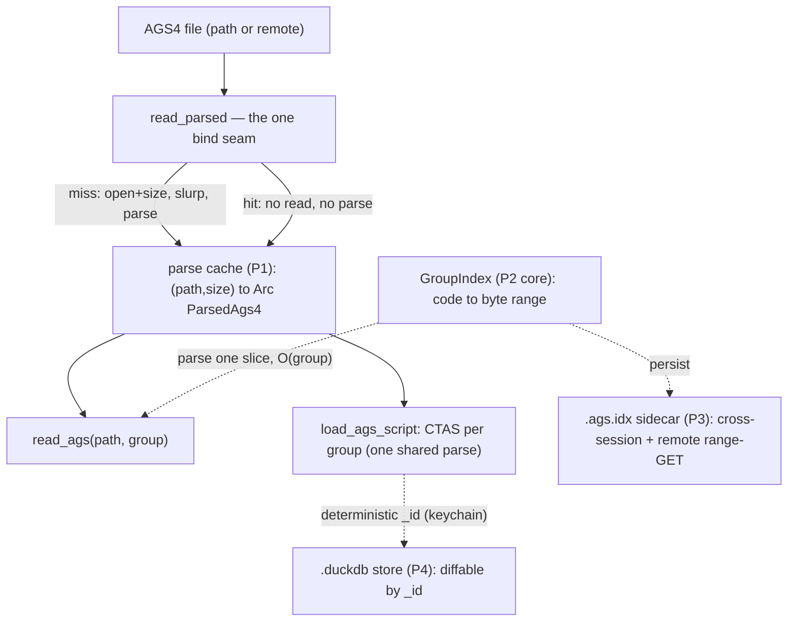

# laterite_ags4 read-path performance

## Context

[[dec-duckdb-extension]] shipped `read_ags(path, group)` as a lazy, born-typed,
UUID-keyed table function. But its "turn an AGS4 file into a queryable in-memory
DB" promise had an inefficient load path. Every path-based bind funnels through a
single resolver (`source::read_parsed`, in the dedicated `niko86/laterite-duckdb`
repo) that **slurps + fully parses the whole file on every call**, and
`read_ags` returns one group per call. So:

- materialising a file (`load_ags_script` emits one `read_ags` per group)
  re-parsed it **once per group** — O(groups × size);
- a notebook re-querying the same file re-parsed it **every query**.

That's why the [[dec-duckdb-extension]] cross-surface perf run showed duckdb at
~5 MB/s for `parse-to-typed` while the in-memory surfaces hit 100–148 MB/s
(`repo:docs/history/perf-matrix-2026-06-18.md`). The ~5 MB/s was a property of
the per-group access, not an engine limit.

Two facts made the fix cheaper than first assumed:

- the deterministic **content-addressed keychain is already implemented in
  core** (`repo:rust-packages/laterite-ags4-core/src/keychain.rs`, since moved
  to [[laterite-ags4-reference]] with a re-export shim at that same path,
  exp-uuid7-surrogate-keys) and the read path already emits `_id` /
  `_parent_id` — so a diffable persisted store is *almost free*; and
- the parser is a line-oriented `csv::Reader`
  (`repo:rust-packages/laterite-ags4-core/src/ags4_codec.rs:96`), so a byte
  index can reuse its exact record boundaries.

## Options considered

The lens that collapsed the choices: there are **two primitives** — *locate* a
group's bytes, and *materialise* its typed rows — each kept either **in memory**
(this kernel) or **on disk** (persisted). One byte-offset index is the substrate
under all of it.

| | in memory (this kernel) | on disk (persisted) |
|---|---|---|
| **locate** | in-session byte-index → lazy single-group parse | `.ags.idx` sidecar → cross-session + remote range-GET |
| **materialise** | parse cache → instant repeat queries | `.duckdb` store → full DB, diffable by `_id` |

## Decision

Build the full native stack as a phased, independently-green-lit arc:

1. **P1 — in-process parse cache** (extension). A process-global, byte-capped LRU
   keyed by `(path, size)` → `Arc<ParsedAgs4>`. `read_parsed` does the cheap VFS
   `open` + `size()` (a `stat` locally, a `HEAD` remotely), so a hit skips the
   read *and* the parse. Cap default 256 MB, `LATERITE_AGS_CACHE_BYTES` override.
2. **P2 — byte-offset index** (core) + lazy single-group read (extension).
   `index_ags4_bytes` / `parse_group_slice` in
   `repo:rust-packages/laterite-ags4-core/src/index.rs`.
3. **P3 — `.ags.idx` sidecar** (core serialise + extension consult) + remote
   range-GET of one group's byte range.
4. **P4 — persistent `.duckdb` materialise** (generated SQL / CTAS), diffable by
   `_id`.
5. **P5 — wasm subset** (a content-keyed cache over `read_ags_text`, the only
   wasm-possible win) + perf finalisation + this page.

**Runtime: native-first.** Every mechanism targets the **vfs (native)** build.
The wasm build keeps its stable `read_ags_text` + dictionary subset — wasm has no
host filesystem and the stable C API exposes no VFS, so these **Rust-side
accelerators** — the byte-index, the `.ags.idx` sidecar, the parse cache, and
*this extension's* CTAS materialise — are **native-only** by construction.

> [!note] "Native-only" here ≠ "the browser can't persist." It scopes the
> *Rust-side* accelerators above. The library's general **materialise → a queryable
> `.duckdb`** is *not* native-only: it goes through the per-host DuckDB, and in the
> browser that host is `duckdb-wasm`, which persists (OPFS / `COPY`/`EXPORT`). See
> the cross-surface model in [[dec-duckdb-per-host-engine]].

## Why

- **The workload is data-science notebooks** — a long-lived kernel hits the same
  file many times, often large/remote, sometimes reopened across sessions. That's
  exactly what caching, an index, and a persisted store are for.
- **The index agrees with the parser by construction.** `index_ags4_bytes` drives
  the *same* `csv::Reader` config as `ags4_codec::parse_reader` and takes each
  GROUP record's byte offset from `StringRecord::position()`, and
  `parse_group_slice` reuses `read_ags4_bytes` on the slice — no second parser.
- **Diffable `.duckdb` is nearly free** because `_id` / `_parent_id` are already
  deterministic (exp-uuid7-surrogate-keys): two materialised versions of a
  dataset share ids for unchanged rows, so a version diff is an anti-join on `_id`.
- **Materialise stays generated SQL (CTAS), never an Appender** — the extension's
  stable C-ABI can't open a DuckDB connection, so `load_ags_script` emits a script
  (the cache is what makes its N statements share one parse). This is the
  load-bearing isolation from [[dec-duckdb-extension]].
- **The locating primitive lives in core, DuckDB-free** — reusable by every host
  and unit-testable without a database ([[crate-map]], [[laterite-ags4-core]]).

## Consequences

- **The fix is visible in the matrix** (`repo:docs/history/perf-matrix-2026-06-19.md`):
  with the cache, duckdb `parse-to-typed` (50 MB) rose **5 → 65 MB/s** (one parse,
  not 53), `query-filter` **193 → 3307 MB/s** (a repeat query is a cache hit, not a
  re-parse), and a new `query-loaded` op (materialise once, then scan the table)
  reads as effectively free.
- **`(path, size)` is the cache's IO-free change detector**; a same-size in-place
  edit is the documented blind spot (a content-hash key is the upgrade path).
- **Spin-offs / follow-ons** (recorded, not built here):
  - **Lift the pure DDL generators** (`table_ddl` / `index_ddl` / `view_ddl`,
    `repo:ags5/rust-packages/laterite-ags5-db/src/ddl.rs`) into core so the writer and
    the extension single-source them, rather than the extension re-emitting CTAS.
  - **Writer-keychain → stateless `.ags5db` merge.** The writer still mints random
    UUID7 (`repo:ags5/rust-packages/laterite-ags5-db/src/convert.rs`,
    exp-uuid7-surrogate-keys); adopting the already-in-core deterministic
    keychain would let separately-written `.ags5db` files merge by `UNION` /
    `ON CONFLICT` instead of reconciliation. This is the [[dec-duckdb-extension]]
    crown-jewel applied to the write path — tracked as a follow-on.
  - **Publish the `.ags.idx` alongside a remote object** so a first-touch remote
    reader can range-GET without first downloading the whole file to build it.

## Implementation status

| Phase | Where | State |
|---|---|---|
| P1 parse cache | `niko86/laterite-duckdb` (`src/cache.rs`, `src/source.rs`) | **done** — verified 17× repeat-read, sqllogictest + unit tests |
| P2 byte-index (core) | `repo:rust-packages/laterite-ags4-core/src/index.rs` | **done** — slice-parity tests green |
| P2 lazy read (ext) · P3 · P4 | `niko86/laterite-duckdb` | planned — ext side blocked until core `index.rs` reaches the mirror submodule |
| P5 wasm cache · perf · wiki | mixed | perf + this page done |

## Diagram

## Related
[[dec-duckdb-extension]] · [[dec-ags-idx-certificate]] · [[dec-duckdb-per-host-engine]] · [[crate-map]] · [[laterite-ags4-core]] · laterite-ags5-db · exp-uuid7-surrogate-keys
