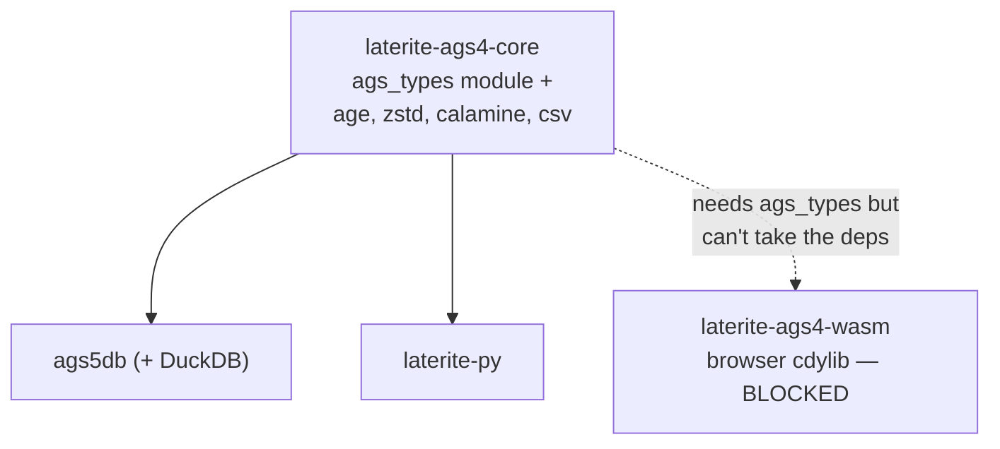
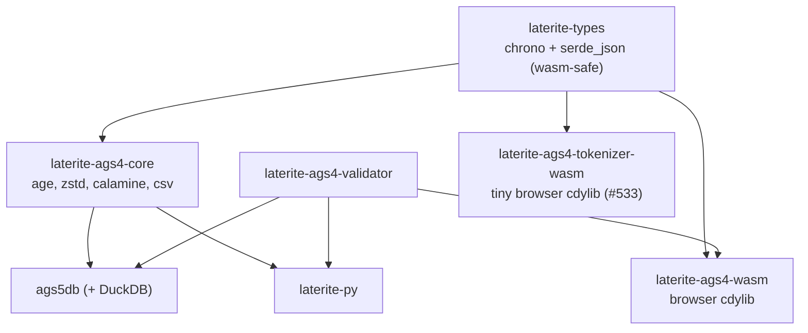

# laterite-types as a wasm-safe leaf crate

## Context
The AGS type system — `canonical_type(code)`, `parse_value(raw, code)`,
`ags4_str`, the `CanonicalType` enum and SQL-type mapping
(`repo:rust-packages/laterite-types/src/lib.rs`) — was a module inside
`laterite-ags4-core` (`ags_types.rs`). `laterite-ags4-core` is DuckDB-free but still
heavy: it carries `age`, `zstd`, `calamine`, `rust_xlsxwriter`, `csv`,
`rpassword` — none of which belong in (or cross-compile cleanly to) a
browser wasm bundle.

The browser **data explorer** (see [[validator-site]] Phase 2) must cast
an AGS4 file's cells to typed columns *exactly* as the native `.ags5db`
conversion does (`repo:ags5/rust-packages/laterite-ags5-db/src/convert.rs` casts off the
file's TYPE row via the same functions) — otherwise the in-browser table
and a real `.ags5db` would disagree on types/values. That casting logic
*is* `ags_types`. So the explorer needs it without `laterite-ags4-core`'s
wasm-hostile deps.

## Options considered
1. **Feature-gate `laterite-ags4-core` for wasm.** Cargo features are additive and
   can't easily *remove* `age`/`zstd`/`calamine` for one consumer — the
   graph stays hostile.
2. **Duplicate the casting logic inside `laterite-ags4-wasm`.** Fast, but
   guarantees drift: the explorer would silently diverge from `.ags5db`
   the first time a type rule changed. Defeats the single-source goal of
   dec-registry-driven-generation.
3. **Depend on `ags5db` from the wasm crate.** Pulls DuckDB into the
   browser. Non-starter.
4. **Extract a tiny leaf crate both sides depend on.**

## Decision
Option 4. Extract the type system into a leaf crate **`laterite-types`** with
a deliberately minimal, wasm-safe dependency set: `chrono`
(`default-features = false`, `features = ["std"]` — no `clock`, no
`wasmbind`) and `serde_json`. `laterite-ags4-core` keeps the module path working
via a re-export — `pub use laterite_types as ags_types;`
(`repo:rust-packages/laterite-ags4-core/src/lib.rs`) — so every existing consumer
(`ddl.rs`, `ags5db`'s convert/query/spec_tables, the `ags5db::ags_types`
second-hop re-export, `laterite-py`) compiles unchanged. Both the native
engine (`laterite-ags4-core` → `ags5db`) and the browser explorer (`laterite-ags4-wasm`)
now depend on the **same** `laterite-types`.

Typed parsers ride alongside `parse_value`. `parse_datetime(s) ->
Option<NaiveDateTime>` came first — the *typed* datetime the Arrow
`Timestamp` column needs (the string-returning `parse_value` can't fill a
typed Arrow column) — and `parse_date` / `parse_time` / `parse_bool` joined
it in #531. All four own the single `DATETIME_FORMATS` / `DATE_FORMATS` /
`TIME_FORMATS` tables and back `parse_value`'s own Datetime/Date/Time/Bool
arms, so the leaf has one parser per category. `laterite-py`'s PyO3 wrapper
(`repo:rust-packages/laterite-py/src/ags_types_fns.rs`) now calls the same
four instead of re-implementing them — the second copy that fed
`_content_hash` and risked the #503 canonicalisation drift is gone.

The same shape landed for the **write** side in #528: `ags4_str`'s inline
nDP / nSF / nSCI arms became `format_ndp` / `format_nsf` / `format_nsci`
(`pub`, taking `(f64, n)`), and `laterite-ags4-validator`'s Rule 8 + fixes
engine re-export those instead of the hand-port they carried — so the
formatter that *judges* a typed value is the same one that *writes* it.
`ags4_str` keeps its separate truncating `0DP` path in front of the nDP arm;
that stays deliberate. The validator gained a direct `laterite-types` edge for
this at zero build cost — it was already transitive via
[[laterite-ags4-reference]], and the generated [[crate-dependency-graph]]
records its transitive count unmoved (3) while direct deps went 2→3.
`laterite-excel` keeps a deliberately divergent copy (uppercase `E`, bare
`"0"` for SF-of-zero), pinned by-design and bounded by its own
formatter-authority matrix — see ags4-output-value-gate.

A third line primitive joined the leaf in #533 (the last child of the #527
convergence arc): `write_quoted_field<W: Write>`/`quote_field`, added beside
`ags4_str` — the inverse of a tokenizer's inner-value unescape, and the single
authority for AGS4 field quoting (wrap in `"…"`, double an embedded `"`,
Rule-1 escaping). Its **home** was itself a small ultracode-panel decision:
Option C, `laterite-types` next to `ags4_str`, over the alternatives (a new
standalone quoting crate, or leaving it hand-copied per surface) — it adds
**zero new dependency edges** (`laterite-ags4-emit` already depends on
`laterite-types`) and matches the #528 precedent directly above: the sibling
value→AGS4-string formatter already lives here, so the field-level wire-form
authority does too. `laterite-ags4-emit`'s byte-faithful `writer.rs::write_row`
now streams every cell through `write_quoted_field` instead of its own inline
copy (byte-identical — proven by the existing writer round-trip proptest +
`embedded_quotes_are_doubled`; the Rule-6 CR/LF reject deliberately stays
row-level in emit, since a field primitive can't reject what it can't see).

The browser reaches both new primitives — `laterite-ags4-parse::tokenize_spans`
(the offset-preserving line tokenizer the browser's editor/preview needs,
ported verbatim from the hand-written TS state machine that used to live in
`web/src/lib/agsline.ts`) and `quote_field` — through a **new, deliberately
tiny** wasm crate, `laterite-ags4-tokenizer-wasm` (deps: `laterite-ags4-parse`
+ `laterite-types` only, both already wasm-safe). This is "approach B-tiny" in
#533's own framing: a dedicated tiny cdylib (~30 KB / ~13 KB gzipped, proven by
a size gate — `repo:web/scripts/check-wasm-tokenizer-size.mjs`), not gating the
old TS copy behind a value-gate case and not calling the 6.9 MB engine wasm
(`laterite-ags4-wasm`) on the main thread just for line tokenizing. `agsline.ts`
now keeps only the browser-only GROUP-block/alignment DISPLAY logic; the
tokenizer/quoter seam lives in `web/src/lib/tokenizer.ts`, warmed once at boot
behind the app's existing readiness gate. See [[crate-map]] for the crate's
full dependency listing. The browser's char-offset span model (`AgsSpan`'s
`start`/`end`/`valueStart`/`valueEnd`) stays surface-specific *by design* — it
is excluded from the #555 cross-surface output-value
gate the same way wasm's own `char_span` already is, since neither has a peer
on the other three surfaces. **Sibling, not folded in:** #581 is a
*different* axis of the same #527 arc — the browser Anonymiser's redaction
*engine*, not a tokenizer/quoter concern, and was deliberately out of #533's
scope. Its Phase 1 (2026-07-18) extracted `ags4-corpus-qa`'s `censor.rs` scrub
logic into its own leaf, `laterite-ags4-censor` (see [[crate-map]]); Phase 2
(also 2026-07-18) routed the browser Anonymiser through a `censor` export on
the engine wasm, retiring its hand-written TS scrub. See
[[dec-ags4-censor-leaf]] for the full decision.

## Why
One source of truth for typing, shared by the shipped engine and the
browser. `laterite-ags4-wasm`'s `parse()` and `ags5db`'s `convert` both call
`laterite-types::{canonical_type, parse_value, parse_datetime}` off the
file's TYPE row, so the explorer casts a file **identically** to a
`.ags5db` — parity by construction, not by a fragile second
implementation.

> [!note] `getrandom` is a non-issue
> `arrow` pulls `getrandom` only through `const-random-macro`, a *host*
> proc-macro (it bakes ahash's seed at compile time). It never runs in
> the wasm runtime, so no `js`-feature workaround is needed.

## Consequences
- Commits the toolchain to `laterite-types` as the canonical typing crate;
  `concepts` and tool pages that cited `ags5db/src/ags_types.rs` now
  point at `laterite-types/src/lib.rs`.
- Non-breaking: the `pub use` keeps `laterite_ags4_core::ags_types`;
  `laterite-types`/`laterite-ags4-core`/`ags5db` cargo suites stay green.
- Allowlist + workspace/rewriter headers updated for the new crate
  (`repo:tools/release/public-allowlist.txt`,
  `repo:tools/release/rewrite-internal-refs.sh`).

## Crate graph

**Before** — the type system lived inside `laterite-ags4-core`, so any consumer of
the casting logic inherited `laterite-ags4-core`'s wasm-hostile deps:

**After** — `laterite-types` is a leaf both the native engine and the browser
explorer depend on; `laterite-ags4-core` re-exports it as `ags_types`:

## Related
[[validator-site]] · single-JSON dictionary generation ·
[[dec-rust-drives-python]] · laterite-ags5-db · [[laterite-ags4-check]] · [[DT]] · [[0DP]] ·
[[effective-dictionary]] · [[dec-duckdb-extension|laterite-duckdb reuses this typing authority]] ·
[[design/_README\|AGS5 register]] · [[crate-map|laterite-ags4-tokenizer-wasm's full crate listing]] ·
the #555 gate the browser's char-offset span is excluded from ·
[[dec-ags4-censor-leaf|#581, the sibling scrub-engine convergence]]
