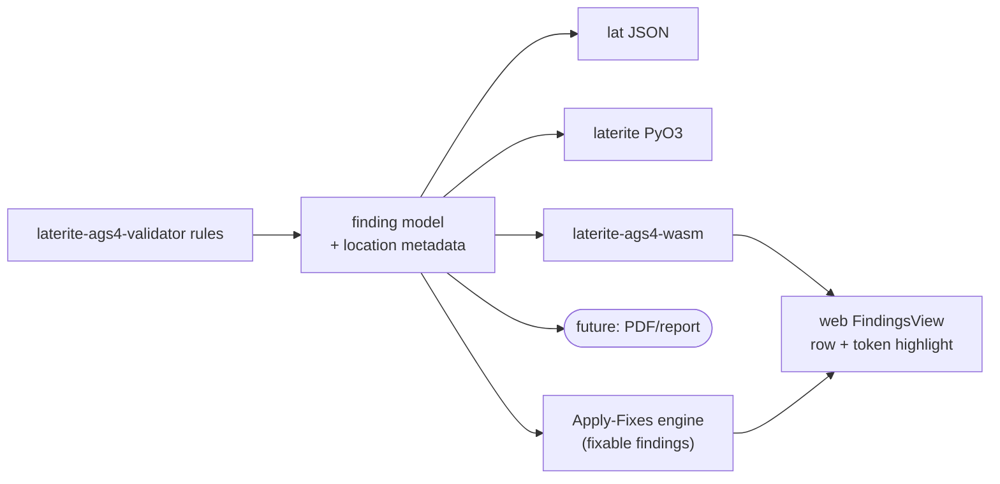

# Validator finding UX: rule-aware highlighting + an Apply-Fixes tab

Continuation of [[validator-site]] (the client-side wasm validator, Phases
0–3). Two workstreams that evolve how validation findings are **shown**
and **acted on**, planned in stages with decisions surfaced to the user
and recorded here.

> [!note] Status legend
> ✅ done · 🚧 in progress · ⏳ next · ❓ awaiting user decision

## Why

Today a finding renders the whole **hit line** highlighted (see
`repo:web/src/components/validate/FindingsView.tsx`). Two gaps observed
on-device:
1. the row highlight stops at the visible width, not the full scrolled
   line (a rendering bug — see Workstream A / quick fix);
2. the **specific offending element** isn't pinpointed — e.g. Rule 9
   flags heading `LOCA_ID` / `SAMP_TOP` but only the line is lit, not the
   token. Users can't see *what* in the line is wrong.

And there is no way to **apply** the fixes the validator implies.

## Design principles (load-bearing — set by the user)

1. **Location metadata is an engine concern, emitted once, consumed
   everywhere.** The "what is wrong and *where*" (offending heading,
   field/column index, char span) belongs in the **Rust `laterite-ags4-validator`
   finding model**, not the web layer — so the *same* data drives the
   `lat` CLI JSON, the `laterite` Python wheel, the `laterite-ags4-wasm`
   browser app, and any future report/PDF renderer. The web is one
   consumer. See [[pyo3-boundary]] / [[crate-map]] / [[dec-rust-drives-python]].
2. **Two-level, non-obscuring highlight.** A soft, full-width **row**
   highlight gives context ("the tool flagged this line"); a stronger
   **token** highlight pinpoints the offending element on top — the row
   must not obscure the token.
3. **Column-aligned rendering where it helps.** AGS rows are positional
   CSV (`GROUP`/`HEADING`/`UNIT`/`TYPE`/`DATA`); misaligned fields are
   hard to eyeball, so an aligned render mode is in scope where a rule's
   issue is about a column position.

## Workstream A — rule-aware finding display & highlighting

| stage | what | status |
|---|---|---|
| A0 | Scaffold this roadmap | ✅ |
| A1 | **Doc pair:** (i) finding data-model across Rust→CLI/PyO3/wasm + what location data to add as engine-level; (ii) per-rule "what to highlight" matrix + where column-alignment helps | ✅ |
| A2 | Synthesise → **user decisions** (engine payload + char-span + serde + severity + alignment + per-rule strategy) — see Decisions below | ✅ |
| A3 | **Architect pair:** implementation plan (engine+bindings / web rendering) — see Build plan below | ✅ |
| A4 | Implement + deploy, slice by slice (P0–P4) | ✅ |

The **row-highlight-width** bug (gap 1) is batched here (A4); the user
wants it fixed *with* token highlighting so the layered highlight is
designed coherently (row context must not obscure the token).

_Per-rule highlighting matrix → filled from the A1 doc pair._

## Workstream B — "Apply Fixes" third tab

| stage | what | status |
|---|---|---|
| B1 | **Doc pair:** which rules are auto-fixable vs not; the fix per rule; determinism/ambiguity/safety; engine location (Rust shared vs JS); python-ags4 autofix prior art | ✅ |
| B2 | Synthesise → **user decisions** (which fixes, engine location, UX for ambiguous fixes) | ✅ |
| B3 | **Architect pair:** tab plan (list fixable → preview diff → apply → re-validate → export; engine; integration) | ✅ |
| B4 | Implement + deploy | ✅ shipped (PR #13) |

**B2 decisions (locked 2026-05-31):** engine in **Rust**; **full safe fix set**;
UX **preview-diff then apply**. (All three the B1-recommended path.)

**B3 architecture (locked 2026-05-31):**
- **Separate wasm exports `compute_fixes` / `apply_fixes`** — NOT a `fix`
  field on `Finding`. This keeps `Finding`/`ValidationReport` JSON
  byte-identical, so the parity oracle (`ags4-parity`,
  `line_only_finding_serializes_minimally`) cannot regress. Fixes are
  computed on demand (only when the user opens the Fixes panel), not on the
  hot `validate` path.
- **Fix model** (`rust-packages/laterite-ags4-validator/src/fixes.rs`, new):
  `Fix { kind, label, rule, line, edits: Vec<SpanEdit> }`; `SpanEdit {
  line, start, end, replacement, expected }` with `expected` as an
  abort-guard (refuse the edit if the current span text ≠ expected →
  protects against a stale finding after an earlier edit shifted offsets).
  Char offsets share the `parse::field_span` / `Location.char_span` space.
- **Two apply layers:** in-line char-span edits (Rule 6/7/8/11a/11b) use
  `SpanEdit`; **byte-level** fixes (Rule 2a CRLF, Rule 1 BOM) carry
  `edits: []` and are handled by a whole-file byte transform — because
  `RawLine.text` already has the terminator/BOM stripped, so they can't be
  expressed as in-line char spans.
- **Apply algorithm:** in-line edits first, grouped by line, **right-to-left**
  (descending `start`) so offsets stay valid; `expected` guard skips a stale
  edit; overlapping spans on one line → apply first, defer rest to the next
  validate→compute pass; then byte-level CRLF/BOM; re-encode to UTF-8 (apply
  always emits UTF-8 — also normalises a cp1252 input, Rule-1-friendly).
  `apply_fixes` returns **new bytes only**; the web loop re-runs the existing
  `validate` + a fresh `compute_fixes` reactively (bounded iteration cap).
- **B1 mismatch caught:** no `convert_to_text` exists in Rust. Rule 8
  reformat reuses the validator's own `typed_values::format_nsf` (+ new
  sibling `format_ndp`/`format_nsci`) rather than pulling in `laterite-types`
  (`ags4_str` needs a typed `Value` and lives in a crate the validator
  doesn't depend on) — keeps the lean dep-graph.
- **Conditional-safe flags** (surface in the UI): Rule 7 `X`→`X_1` may then
  trip Rule 9 (unknown heading) if `X` was a dictionary KEY; Rule 8 only
  reformats values that parse as `f64`, never non-numeric cells.

**B4 commit sequence:** (1) Rust fix model + `compute`/`apply` + per-fix unit
tests [host-only, no wasm]; (2) wasm `compute_fixes`/`apply_fixes` exports;
(3) wasm rebuild (the heavy/fragile step — `rm -rf target/*/incremental`
first, reuse workspace target dir per the disk caveat); (4) TS bindings +
export `highlightSpan`; (5) `FixesPanel.tsx` + ValidatePane wiring.

**B4 shipped (2026-05-31, PR #13).** Built as planned; `FixesPanel` placed
as an in-pane Findings/Apply-Fixes sub-toggle (shares the
`bytes`/`encoding`/`dictVersion`/`text` signals). 145 Rust tests green
(101 validator + 30 regression + 14 fixes); the
`line_only_finding_serializes_minimally` oracle guard stayed green,
confirming the separate-export design protected byte-faithful JSON.
**Two CI-toolchain gaps surfaced post-open and are worth remembering**
(both invisible to a local repro on an older toolchain):
- `cargo fmt --all --check` is a hard CI gate — the fix engine landed
  unformatted. Always `cargo fmt` before pushing a new Rust file.
- CI's `dtolnay/rust-toolchain@stable` tracks the *latest* stable
  (1.96.0 at ship), which carries clippy lints a pinned-older local
  toolchain (1.94.1 here) won't emit — `clippy::unnecessary_sort_by`
  fired only on CI. When a clippy `-D warnings` failure can't be
  reproduced locally, `rustup update stable` to match the runner before
  assuming it's spurious. (See `concepts/ci-and-runners.md`.)

Sequenced **after A**: A's deep rule survey + finding/location model is
the foundation a fix engine builds on.

### B5 — Fix-tab severity transparency (web-only, 2026-06-06)

Owner hit the seam left by the deliberate **no-severity-on-`Fix`** decision
(B3): on a BOM file the validator emits a Rule 1 finding (the fixable, error
one) **plus** a sibling `FYI (Related to Rule 1)` advisory
(`repo:rust-packages/laterite-ags4-validator/src/rules/line_format.rs` `has_bom` block),
so the single safe fix ("strip the BOM") also clears an FYI. Since Validate
hides FYI by default, a fix appeared to touch something the list wasn't showing
— "shows one item, fixes FYI items."

Key realisation that shaped the fix: **no safe fix is *purely* FYI-targeted**
(every v1 safe fix — Rule 2a/6/7/8/11a/b + the Rule 1 BOM — resolves an
error/warning finding; the only FYI-only Rule 1 fix, typographic→ASCII
substitution, is already RISKY/opt-in). So an "exclude FYI from Fix-all-safe"
toggle would gate nothing — dead UI. The honest fix is **transparency, not
exclusion**, kept entirely in the web layer (the Rust `Fix` model stays
severity-free, protecting the parity oracle):
- `FixPane` runs a parallel `validate(…, includeFyi:true)` purely to **map each
  fix → the severity of the finding it resolves** (join on rule + line;
  most-severe wins on a tie, so a fix is only "FYI" when unambiguously so).
- Each fix card gets a **severity badge** (`FixesPanel` `severityOf` prop).
- A one-line **explainer** appears when a safe fix also touches an FYI advisory:
  fixing changes the *file*; the Validate severity filter only narrows the
  *list*, it doesn't gate fixing.
Behaviour of fix-all-safe / fix-until-clean is unchanged. e2e `fix-severity.spec`
(BOM fixture `bom_only.ags`) guards the badge + explainer.

## Decisions — Workstream A (locked 2026-05-30)

From the A1 (data-model) + A2 (rule matrix) doc pair → user decisions:

- **Engine finding payload:** add a `Default`-valued `Location { target,
  field_index, heading, data_row, char_span }` **and** a structured
  `Severity { Error, Warning, Fyi }` to `Finding`
  (`repo:rust-packages/laterite-ags4-validator/src/findings.rs`). **char_span is
  IN** (needs a span-aware line tokenizer / on-demand `field_span` helper,
  since `split_ags_line` discards offsets today) — so Rules 1/6
  (bad code point / embedded CR) can pinpoint the character, not just the
  field. Rules already hold the column index at detection time; migrate
  them to populate `Location` incrementally (un-migrated rules stay
  `target: Line`).
- **serde on the engine:** **add `serde` (derive feature) unconditionally**
  and `#[derive(Serialize)]` the finding types — NOT feature-gated. serde
  is lean by every metric that the engine's guarantee actually protects
  (wasm-safe, net-zero new wasm weight since the bindings already link
  serde, compile-time-only derive); strict avoidance only triplicates the
  CLI/PyO3/wasm serializers and invites drift as the schema grows. Keep
  `serde_json` OUT of the engine (bindings own serialization). Update the
  dep-contract comment to record serde as a deliberate lean inclusion.
- **Output compat:** new fields omitted when unset → CLI/PyO3 JSON stays
  byte-identical for line-only findings; python-ags4 count-parity oracle
  untouched. See [[parity-model]].
- **Per-rule highlight strategy:** adopt the A2 matrix (token-precise /
  multi-token KEY·REQ / row+aligned / rule-level), with the row+token
  coexistence model (soft full-width row band; drop the blanket
  `text-amber-300` foreground recolor so the token reads as foreground).
- **Column-aligned render mode:** **build it as a toggle** (raw ↔ aligned)
  for the rules where alignment is the diagnostic (7-order, 4-count,
  8-cell, 10b-empty).
- The **row-highlight-width** fix is part of A4 (full-width band).

## Build plan (A3) — engine ⇄ web, interleaved, slice-first

**Reconciled contract** (the two cross-architect items):
- **`field_index` is tag-stripped** (= the `ci` the rules already hold;
  `headings[ci]`). Raw-line field 0 is the `DATA`/`HEADING` tag, so the
  web wraps raw field `field_index + 1` (document the +1 once).
  `char_span`, when present, is absolute raw-line offsets and supersedes
  `field_index`.
- **`char_span` = char offsets (not byte), content-only (inside the
  quotes), half-open**, computed lazily in wasm via a
  `field_span(line, idx)` helper. JS slices UTF-16; for all valid AGS
  (BMP) content `char` == UTF-16 unit so they match — the only divergence
  is astral-plane chars, which Rule 1 flags as invalid anyway.

**Guarantees:** parity can't drift (the oracle `repo:rust-packages/ags4-parity/src/verdict.rs`
compares rule-label *presence* only); JSON stays byte-identical when
fields unset (`skip_serializing_if` + `line,group,desc`-first order,
golden-tested); serde is derive-only, no `serde_json` in the engine,
wasm32-green (P0 adds a `cargo build --target wasm32-unknown-unknown`
check).

| phase | engine | web | ships | status |
|---|---|---|---|---|
| **P0** | `Location`/`Severity`/`Target` on `Finding` + serde derive + `add_at`; Cargo note | extend `FindingDto` TS optionals | nothing (additive, behaviour-neutral) | ✅ PR #8 |
| **P1** | migrate **Rule 9** (`field_index`+`heading`) → wasm DTO | `agsline.ts` splitter + token-wrap + **row-band full-width fix** + **severity bands** | **first slice: Rule 9 token highlight live** | ✅ PR #8 |
| **P2** | token-index rules (8, 11c, 19/19a/b, 20-data) + multi-token KEY/REQ (7, 10a/b/c); FYI sites → `Severity::Fyi` | inner-value highlight (graceful-degrades) | breadth of cell/heading highlighting | ✅ PR #10 |
| **P3** | `field_span` helper + Rules 1/6 char spans; wasm injects `char_span` | char_span sub-field slicing | char-precise highlighting | ✅ PR #10 |
| **P4** | collapse CLI/PyO3 hand-built JSON → `to_value(&finding)` (byte-identical for line-only; CLI byte-parity test green) | aligned-columns toggle (web-only group reconstruction) | dedup + aligned mode | ✅ PR #10 |

Each phase is a PR; **P0+P1 was the first deployable increment** (PR #8,
proves the path engine→wasm→web on one rule). **P2–P4 shipped together in
PR #10** (combined to avoid redundant deploys). The web fallback path
means the engine migrates rules incrementally without breaking the UI.

**Resolved in P2/P3:** the highlight-span bug (the field token had been
lighting its surrounding quotes + trailing comma, e.g. `"ERES_LAB",`) —
fixed by highlighting only the field's **inner value** via
`agsline.ts` `valueStart/valueEnd`; `char_span` (Rules 1/6, or the
wasm-computed field span) supersedes when present. **Resolved in P4:** a
wasm perf nit (per-finding linear raw-line lookup → one-time `HashMap`).

**Known limitation:** in aligned-columns mode, `char_span` (which indexes
the raw line) doesn't survive padding, so the highlight falls back to the
field's inner value within its padded cell — still precise at field
granularity. Acceptable; revisit only if sub-field aligned highlighting
is requested.

## Workstream C — findings-list navigation (collapse + filtering)

Added 2026-05-31 (user-requested, after on-device feedback on finding
volume). Folds into `FindingsView` — not a separate engine concern.

| stage | what | status |
|---|---|---|
| C1 | Doc scope: render-volume risk + pagination/filtering options | ✅ |
| C2 | Implement: collapse + lazy-render + full filter bar | ✅ this PR |

- **The real cliff was eager render**, not list length: every `
`
  was hard-`open` and every `FindingRow` rendered up-front (+ per-finding
  aligned re-tokenisation). Fix: controllable `
` with the inner
  `<For>` gated behind open-state (`<Show>`), so a collapsed group mounts
  zero rows. Groups with >20 findings default collapsed; expand/collapse-all.
- **Full filter bar** (new `FilterBar.tsx`, absorbed the old `Legend`):
  rule toggles (+ jump, all/none), severity chips, group chips, debounced
  free-text over desc/heading, live "showing N of M". Filtering is a pure
  `filteredReport` memo in `ValidatePane` (rule mute → per-item
  severity/group/text → drop empty groups).
- **FYI unified into the severity filter:** wasm now always emits FYI
  (`validate(..., includeFyi: true)` always); the old `includeFyi` toggle
  is gone, fyi chip defaults off (preserves the prior default view).
- Deferred: within-rule virtualization (only if one rule routinely >500
  findings); per-block aligned memo (moot now collapsed groups don't
  tokenize). The aligned-mode DATA-row **windowing** fix (header rows +
  bounded data window + "N more" marker) shipped alongside.

## Workstream B — B1 doc-pair findings (recommendations; await B2 ratification)

The B1 doc pair (fixability survey + fix-engine architecture) reported:

- **Engine in Rust, in `laterite-ags4-validator` beside `findings`** (recommended),
  surfaced via wasm/CLI/PyO3 — one fix model, every consumer, mirroring
  findings. Reject JS-only. Parity oracle + byte-faithful JSON untouched
  (a `fix: Option<Fix>` field that `skip_serializing_if` at default).
- **Mechanism: targeted raw-line span edits** keyed on `Location`/`char_span`
  (uses `parse::field_span` + `RawLine.had_crlf`) — NOT a parse→serialize
  round-trip (which would reformat untouched data, breaking byte-faithfulness).
  Reserve round-trips for rare structural fixes (defer past v1).
- **Loop:** list `fix != null` → preview diff (reuse `highlightSpan`) →
  apply (wasm) → **re-validate** (existing `validate`) → export; client-side.
  Apply edits right-to-left per line; overlapping spans defer to the next
  re-validate pass; cap iterations. `Fix` carries `kind`, `label`, `edits`
  (each with an `expected` abort-guard), `safe_default`, and `options` for
  the ambiguous class.
- **v1 safe fix set** (deterministic, low-risk, ranked): Rule 2a (normalise
  CRLF), Rule 1 (strip BOM), Rule 8 (reformat numeric to declared
  nDP/nSCI/nSF — prior art in `compat.convert_to_text`), Rule 7-dup
  (`X→X_1`), Rule 6 (strip embedded CR), Rule 11a/b (insert spec-default
  `TRAN_DLIM`/`TRAN_RCON`). **Engine caveat:** column-affecting fixes
  (7-order, 9-delete) MUST move the whole column across all rows in lockstep
  or they corrupt the file.
- **Forks for the user (B2):** engine location (Rust vs JS); apply-all scope
  for ambiguous fixes; the ambiguous classes (Rule 9 rename/delete/DICT,
  Rule 5 quoting, Rule 8 rounding) — all deferred past v1 until the
  options-in-model UX is settled.

## Related

[[validator-site]] · [[tech-stack-wasm]] · [[pyo3-boundary]] · [[crate-map]] · [[laterite-ags4-check]] · [[parity-model]] · [[dec-rust-drives-python]]
