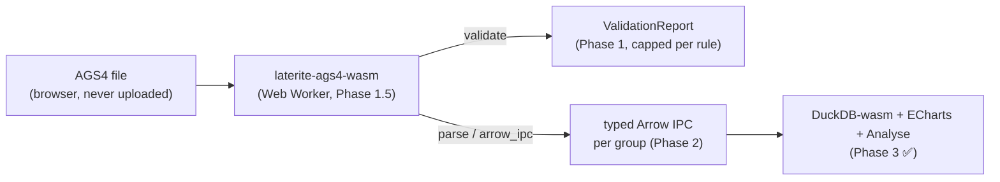

# The AGS4 validator + data-explorer web site

A fully client-side web app: drop an AGS4 file in the browser and (a)
validate it against the clean-room rule engine and (b) explore its data
in typed tables/charts — **nothing uploaded**, the whole engine runs in
wasm. This page is the multi-phase roadmap and the **handoff record**
between work sessions (see cli-cloud-workflow).

> [!note] Status legend
> ✅ done & verified · 🚧 in progress · ⏳ deferred/next. A phase is
> "done" only when the stated verification actually ran. When you advance
> a phase, update the table, the verification notes, and `log.md`.

## Phases

| Phase | What | Status |
|-------|------|--------|
| 0 | Split `lat` CLI out of `laterite-ags4-validator` so the validator is a lean, wasm-safe leaf | ✅ |
| 1 | Client-side validator: `laterite-ags4-validator` → `laterite-ags4-wasm` cdylib + SolidJS UI in `web/` | ✅ |
| 1.5 | Performance + UX hardening: Web Worker, per-rule serialization cap, virtualized findings, gzip download, dark/light theme | ✅ |
| 2 | Typed-Arrow `parse()`: cast an AGS4 file to typed columns in-browser, parity with `.ags5db` | ✅ (Rust) |
| 3 | Explore + Fix + Tools UI: DuckDB-wasm query/charts/analyse, the Fix tab (safe/risky), the Tools suite (incl. the wasm `diff()` revision diff + a proj4 coordinate converter), shareable settings (PR series #27–#38) | ✅ |

## Phase 0 — CLI split ✅
`laterite-ags4-validator` became a pure, filesystem-free library (the CLI lives in
[[laterite-ags4-check]]). This is what lets the same engine compile to wasm with
no CLI/TUI deps. Commit `6794f2e`.

## Phase 1 — client-side validator ✅
`laterite-ags4-wasm` exposes `validate(bytes, dict_version, include_fyi,
encoding, max_per_rule)` → a `ValidationReport` JS object; it replicates
`check_file_with_dict` from in-memory bytes with `source = None` (no
filesystem). The SolidJS app lives in `repo:web/`; deploy via
`repo:.github/workflows/deploy-validator.yml`
(`wasm-pack build … --target web`). Commit `f349d39`; the `max_per_rule`
arg + worker plumbing landed in Phase 1.5.

## Phase 1.5 — performance + UX hardening ✅
A pathologically dirty AGS4 file can produce **millions** of findings; the
Phase-1 UI marshalled every one across the wasm→JS boundary (hundreds of
MB of JSON) on the **main thread**, inside a synchronous `createMemo`, and
then mounted a DOM node per finding — so a dirty file froze the tab. Five
changes, each its own commit on the validator-site branch,
make the UI never-freeze and never hide an error:

1. **Serialization cap (`laterite-ags4-wasm`).** `validate()` gains `max_per_rule:
   Option<u32>` — it clips how many findings per rule are *serialized*,
   while every rule still runs over every line. `RuleGroup.total` and
   `ValidationReport.finding_count` always carry the true, uncapped
   counts; new `shown_count` is what actually crossed the boundary, so the
   UI says "showing N of M". **Wasm-only by construction**: the CLI builds
   its `--json` independently in `repo:rust-packages/laterite-ags4-check/src/main.rs`,
   so its shape is untouched. The interactive UI passes 10k/rule
   (`DEFAULT_MAX_PER_RULE`); the download passes `None`.
2. **Web Worker.** wasm instantiation + `validate()` moved off the main
   thread (`repo:web/src/lib/validator.worker.ts`), driven by an
   id-correlated client (`validatorClient.ts`); the report is now a
   `createResource`. wasm `validate()` is synchronous/uninterruptible, so
   "cancellation" = discard the superseded result, not abort mid-rule —
   but it runs off-thread, so a superseded run never blocks a paint.
3. **Virtualized findings.** `FindingsView` flattens group headers + their
   (capped) findings into one row array windowed with
   `@tanstack/solid-virtual` — only the ~visible slice mounts, so tens of
   thousands render smoothly. (Virtualizing *within* native `
`
   wouldn't help: millions can land in a single rule.) Legend chips jump
   by virtualizer index since off-screen headers have no DOM node.
4. **Streamed gzip download.** "Download full report" re-runs `validate`
   uncapped *in the worker*, which `JSON.stringify`s + gzips there via a
   streaming `CompressionStream('gzip')` and transfers back compressed
   bytes — the multi-hundred-MB string never reaches the main thread.
   gzip not zstd (no native browser zstd encoder; the report is a
   throwaway artifact, not re-ingested by laterite). Above 500k findings
   the UI points at the native [[laterite-ags4-check]] CLI instead.
5. **Dark/light theme.** Tailwind v4 `@custom-variant dark` + semantic
   CSS-variable tokens (`surface`/`line`/`fg` tiers + `ok/warn/err/accent`)
   that flip once under `.dark`; a `theme.ts` store ↔ `localStorage` and a
   no-flash inline script in `index.html`; a header toggle.

**Verified:** `cargo build -p laterite-ags4-wasm --target wasm32-unknown-unknown`
+ the 6 host unit tests green; `wasm-pack build … --target web`
regenerates the 5-arg `validate` bindings (and, at this Phase-1.5 point,
drops `compute_fixes`/`apply_fixes` that then existed only in a stale
gitignored `.d.ts` — they ship for real from Phase 3's Fix tab);
`web/` `tsc --noEmit` + `vite build` green, with the worker
emitted as its own chunk and the token utilities compiled into the CSS.
Browser-level smoke (worker thread under DevTools, theme persistence,
deploy `base` path) is owed as a manual pass — the wasm-opt step can't run
here (binaryen download is network-blocked), but CI has it and
`web/src/wasm/` is gitignored/regenerated.

## Phase 2 — typed-Arrow `parse()` ✅ (Rust)
The browser must show a file's data *typed* (numbers as numbers, dates as
dates) and agree with what a native `.ags5db` would store. Approach:
**build typed Apache Arrow in Rust and hand DuckDB-wasm one IPC stream
per group** — no per-cell JS objects, no `TRY_CAST` in the browser.

- The casting logic lives in the shared `laterite-types` leaf crate so the
  native engine and the wasm explorer cast identically — see
  [[dec-laterite-types-leaf]].
- `laterite-ags4-wasm::parse(bytes, encoding)` → `ParsedDataset` with
  `group_codes()`, `meta(code)` (`{headings, units, types, sql_types}`),
  and `arrow_ipc(code)` (one typed Arrow IPC stream, built lazily).
- Casting goes through `laterite-types::{canonical_type, parse_value,
  parse_datetime}` off the file's TYPE row, exactly as
  `repo:ags5/rust-packages/laterite-ags5-db/src/convert.rs` does.
- Arrow mapping: [[DT]] → `Timestamp(µs)` (tz-naive; full datetime,
  date-only → midnight, blank → null), [[0DP]] → `Int64`,
  `2DP/RL/nSF/nSCI` → `Float64`, [[YN]] → `Boolean`, `ID/X/PA/…` →
  `Utf8`.

**Verified:**
- `laterite-types` / `laterite-ags4-core` / `ags5db` cargo suites green (the
  re-export is non-breaking).
- `cargo build -p laterite-ags4-wasm --target wasm32-unknown-unknown` green; the
  wasm-pack release module loads under Node.
- 6 host unit tests in `laterite-ags4-wasm` drive `build_column` directly and
  assert the Arrow `DataType` + cast values for every canonical category
  (datetime full/date-only/null with a `chrono` oracle, `0DP`→Int64,
  `2DP`→Float64+null, `YN`→Bool, `ID/X`→Utf8) + a ragged-short-row
  null-not-panic guard. `repo:.github/workflows/ci.yml` runs them in a
  dedicated step (the workspace test job excludes `laterite-ags4-wasm` only to
  dodge wasm-bindgen-under-`-D warnings` fragility).

Commit `6b3bb17` on branch the validator-site branch.

> [!todo] Owed (carried into Phase 3 or a follow-up)
> End-to-end value parity against a *live* native `.ags5db` was **not**
> run. The read CLI laterite-ags5-db has no `convert` subcommand — AGS4 →
> `.ags5db` is the Python path (`laterite.ags5db.convert`). A proper E2E
> check would convert a fixture both ways and diff the typed cell values.
> The host unit test proves the casting *logic*; the "identical to
> `.ags5db`" claim currently rests on both sides calling the one shared
> crate ([[dec-laterite-types-leaf]]).

## Phase 3 — Explore + Fix + Tools UI ✅ (delivered)
Delivered as an incremental PR series (#27–#37, one PR per branch, merged
individually) off the approved 12-PR Explore/Fix/Tools roadmap, with PR-12
(#38) the polish finale. The app is four tabs: **Validate | Fix | Explore |
Tools**, plus persisted + shareable settings.

- **Explore** — `parse()` → DuckDB-wasm: for each `group_codes()`,
  `db.insertArrowFromIPCStream(arrow_ipc(code))` (the table arrives
  already typed, no staging/cast). Schema/table browser from `meta(code)`,
  a SQL console with typed cross-group JOINs + CSV/JSON/Parquet export,
  **ECharts** views (LOCA plan plot from `LOCA_NATE/NATN`, SPT-vs-depth,
  presence-guarded off `meta()`), and an **Analyse** view (referential-
  integrity orphan finder via DuckDB anti-joins + dictionary parent/KEY,
  column completeness + "why typed as X", LOCA×group coverage matrix).
  Live-verified on the real 23 MB / 69-group file.
- **Fix** — the fix engine promoted to its own tab (fix-all-safe /
  iterate-to-clean / undo / revert), an aligned per-fix GROUP-block preview,
  an original-vs-fixed unified diff (pure-TS Myers), and a **safe/risky
  split** (PR-11 `Fix.risk`): risky fixes (typographic→ASCII, duplicate-
  heading rename) are opt-in, excluded from fix-all-safe.
- **Tools** — Dictionary browser, rule/O-N explainer, Template generator,
  Anonymiser, Formatter, a tile-less **Coordinate** converter (LOCA
  NATE/NATN → WGS84 via `proj4`, OSGB36 / Irish Grid; export to CSV or
  **GeoJSON**, with an opt-in **OSTN15** sub-metre mode — see the OSTN15
  note below; no basemap), and the **Revision diff** — a *wasm export*
  `diff(a, b)` ([[laterite-ags4-wasm]]): KEY-aware, type-aware two-file comparison
  in the engine.
- **Settings** — dictionary edition / encoding / aligned view / active tab
  persist to localStorage + encode into the URL hash; a header "Share"
  button copies a config-restoring link (the lint-profile / view-spec).

Resolved open questions:
- DuckDB-wasm + ECharts + proj4 **lazy-load** only on their views (confirmed:
  separate chunks; the entry chunk stays ~150 kB while the 36/41 MB DuckDB
  wasm + echarts + proj4 load on demand).

Deferred (offered as follow-ups, not dropped):
- **PWA / offline service worker** — **no longer deferred; it shipped** (the
  cache-size handling it needed is exactly the precache-vs-runtime split below;
  see "## PWA / offline").
- **More Rust fixers** — land incrementally on the `Fix.risk` schema.
  **DATETIME canonicalisation shipped** (`FixKind::CanonicalizeDatetime` in
  `fixes.rs`): a DT cell in an ISO-declared (`yyyy-mm-dd…`) column whose value
  parses as a recognisable date but isn't ISO gets rewritten to ISO 8601. The
  risk is now **per-value, not per-fix** (#420, "Option A"): only a genuinely
  ambiguous slash date — day-first-numeric with `day ≤ 12 ∧ day ≠ month`, where
  the dd/mm-vs-mm/dd read is a real guess — stays **risky**/opt-in; an
  unambiguous date (`18/08/2020` day>12, `05/05/2020` day==month, `2020-8-1`
  year-first) canonicalises in the **safe** default set. So `fix()` /
  `lat fix` now normalise the unambiguous majority by default. chrono
  validates so an impossible date is never "fixed". Ships to the Fix tab via the
  wasm `compute_fixes`. Row-count padding also shipped (below).
- The end-to-end `.ags5db` parity check remains owed (carried from Phase 2).

## Phase 3 follow-ups (post-#38 hardening)

Work after the 12-PR delivery, from live mobile testing + a multi-agent
"anything overlooked" audit. Merged on `master`:

- **#40 — Fix-tab UX:** a *persistent* "Download .ags" (the old export lived
  inside the fixes list and vanished the moment the file went clean, exactly
  when you'd want to save it).
- **#41 — Playwright e2e harness:** headless-Chromium specs against a
  `vite preview` of the production bundle — see [[playwright-e2e]].
- **#42 — pad-short-row fixer (Rule 4):** the first of the previously-deferred
  fixers — pads a DATA row with fewer fields than its HEADING. (Its trailing-
  comma overshoot + malformed-quote data-loss masking were hardened in a
  follow-up; see `log.md`.)

In review (open PRs, the "fixes + tests first" sweep before the next features):

- **#43** — FYI-only files show an **amber** informational banner (not red);
  Tools regrouped by file-dependency (Reference / This file / Compare);
  **idle prefetch** of the heavy lazy assets (DuckDB/echarts/arrow/proj4 +
  the dictionary) via `requestIdleCallback`, guarded by
  `navigator.connection` save-data/effective-type, so a later Explore/Tools
  open is instant without slowing first paint; plus an Explore overlapping-
  load race fix, audit correctness fixes, and a **vitest** unit suite + a fast
  CI `unit` job.
- **#44** — Rust pad-short-row hardening (trailing-comma + malformed-quote) +
  the cp1252/UTF-8 encoding round-trip tests.
- **#45** — dictionary: correct the TRIL `(AGS 4.2)` mislabel + flag
  CONL/TREL/TRIL as **AGS-L** draft, with an auto-sync of the web copy.

## Coordinate v2 — OSTN15 sub-metre + GeoJSON

The Coordinate tool originally did a Helmert 7-parameter transform (`+towgs84`,
~5 m). That is fine for a *map pin* but wrong for **data exported for use**: a
GeoJSON consumed in a GIS bakes the 5 m error in. So the tool gained an opt-in
**Precise (OSTN15)** mode and a **GeoJSON export**.

- **OSTN15 grid, committed (not fetched).** `proj4` (≥2.7 has `nadgrid`) loads
  the official OS **OSTN15 NTv2** grid via `proj4.nadgrid()` + `+nadgrids=`,
  giving the rigorous **sub-metre** OS transform. The ~14.5 MB
  `OSTN15_NTv2_OSGBtoETRS.gsb` is **committed** at `web/public/grids/` and
  served same-origin from Pages — deliberately *not* fetched/unzipped at build
  time (the OS download URL has moved before; a build-time external fetch is a
  deploy fragility). Provenance + SHA-256 + licence in `web/public/grids/README.md`.
- **Licence: OSI BSD.** The OSTN15 transformation is BSD-licensed (OS user
  guide, Oct 2016) — redistributable provided the OS copyright notice travels
  with it. That notice (`OS_ATTRIBUTION`) is shown in-tool when OSTN15 is active
  and embedded in the GeoJSON `metadata`.
- **Verified against OS's own vectors.** The `proj4` `+nadgrids` path reproduces
  all 40 of OS's published `OSTN15_TestInput/Output_OSGBtoETRS` points to a
  **max 7.8 mm** residual — guarded by a `coords.test.ts` case (skips when the
  grid binary isn't checked out, mirroring the Python `large.ags` skip).
- **Lazy + privacy.** The grid downloads only when **Precise** is ticked (a
  one-time ~14.5 MB from the app's own origin — never a third party), and
  `proj4` itself stays in a lazy chunk (entry unchanged). Irish Grid stays
  Helmert (no NTv2 grid bundled for it); the toggle disables for non-GB grids.
- Projection maths + GeoJSON emit factored into `web/src/lib/coords.ts` (pure,
  unit-tested); the component (`CoordinateTool.tsx`) just wires the lazy fetch
  and UI. This was the previously-deferred *coord v2* feature.
- **Consent-gated OpenStreetMap basemap** (the remaining coord-v2 piece): an
  opt-in Leaflet/OSM map plotting the converted points, **off by default and
  behind an explicit consent gate** — OSM tile requests reveal the viewport
  (≈ the site location) + the user's IP to a third-party server, which would
  otherwise break the app's "nothing leaves the browser" contract. Consent
  (acknowledging tiles load from OSM) persists in `localStorage` with a "forget
  consent" control; "show map" is a per-session toggle. Leaflet + its CSS are
  **dynamically imported** (own `leaflet-src` chunk, entry unchanged) so neither
  the lib nor a single tile loads until the user confirms. Markers are vector
  `circleMarker`s (no PNG icon assets → no bundler workaround); host is
  `web/src/components/tools/CoordinateMap.tsx`.

## UI-advisory polish (theme + layout)

A multi-agent UI advisory (layout/IA + colour, grounded on disk + WCAG) verdict
was **keep the four-tab IA, minor tweaks** — so this was polish, not a rework:

- **Theme retune** (the standing "dark too harsh / light too light" feedback).
  A value-only swap of the `app.css` tokens (names + `@theme` wiring unchanged):
  dark lifted off near-black (Primer-style) with body text slate-100→slate-200
  (white-on-black ~16:1→~14:1, no halation) and status/accent dimmed 300→400;
  light off pure-white with the page a step *below* the surface so cards lift;
  a real canvas<surface<raised ladder both modes. Then **finished the
  tokenisation** — raw `sky-*`/`slate-*` across ~16 components (notably
  FilterBar + FindingsView/FixesPanel, whose hardcoded slate *backgrounds* made
  the findings list render dark-on-light in light mode) → semantic tokens, so
  the theme flips everywhere. WCAG-checked (light `--accent` sky-600→sky-700).
- **Load-flow loop closed:** Fix/Explore empty states gained a `goTo("validate")`
  button (no longer dead ends).
- **Sub-view state shareable:** Explore's view, Fix's view and the selected
  Tools tool joined `lib/settings` (seed hash>localStorage>default + `shareUrl`),
  so a link restores `#tab=tools&tool=coords`, not just the tab.
- **DRY:** the three in-pane pill selectors → one `web/src/components/PillToggle.tsx`
  (the top tab bar stays a distinct underlined `role="tab"`); dead Tabs `hint`
  branch removed; tab-bar `overflow-x-auto` guard.

## PWA / offline

Installable + offline, via `vite-plugin-pwa` (Workbox `generateSW`). The whole
design is the **cache split**, dictated by the asset weights:

- **Precache (install-time, ~5.85 MiB, then offline):** the *full* app shell —
  every JS/CSS chunk (including the Explore/Charts/Coordinates UI + DuckDB
  *worker* glue), the reference JSONs, the sample files, and the **2.2 MB
  validator wasm**. So Validate/Fix/the dictionary work fully offline after one
  visit; the Explore/Charts/Coordinates UIs render offline too — only their
  heavy *engines* are deferred.
- **Never precached → runtime-cached `CacheFirst` on first fetch:** the DuckDB
  engine wasm (36 MB EH + 41 MB MVP) and the 15 MB OSTN15 grid — **92 MB** we
  refuse to pull on every install. `globIgnore`d (+ a 3 MiB
  `maximumFileSizeToCacheInBytes` as belt-and-braces) and matched by per-asset
  `CacheFirst` rules (`maxEntries:2`, `purgeOnQuotaError`). This dovetails with
  the existing idle-warm (`lib/prefetch.ts` only fetches DuckDB on a fast,
  non-metered link); the SW adds **no** new proactive heavy download.

Update flow is `registerType:'prompt'` — never reload a user out from under a
live validate/query. `PwaUpdater.tsx` (registers via `virtual:pwa-register/solid`)
shows a dismissible "new version → Reload" toast and an honestly-scoped
"Validate & Fix now work offline" notice; `onRegisteredSW` polls hourly + on
tab refocus (re-fetching only the ~4 KB `sw.js`) so a fresh Pages deploy
surfaces in a long single-tab session. Base-path safe (`navigateFallback` +
manifest scope/start_url track Vite's `base`; a `404.html` = `index.html` copy
covers cold pre-SW visits). Icons are the laterite brand mark.

Hardened by a 4-lens adversarial review (caching budget · base-path/scope ·
update lifecycle · graceful-degradation/privacy), each finding verified — all
landed `low`/`nit`. Outcomes folded in: the offline e2e now asserts SW-precache
**provenance** (so a precache-glob regression can't pass green off the HTTP
cache); a first-Explore-while-offline degrades to a clear message, not a raw
fetch error. Privacy stance intact — the SW caches nothing cross-origin (OSM
tiles still pass through, consent-gated) and no user file data.

## Low-end / slow-hardware perf hardening

"Fast on my Mac, bad on a slower computer." A 7-dimension perf assessment (a
fan-out workflow, every finding adversarially verified) returned **39 confirmed
hotspots** — the theme being large, often *file-size-independent* fixed costs
that are invisible on a 16/32 GB Mac but punishing on a 2-core / 2 GB machine.
Measured with an **opt-in CPU-throttled harness** (`web/e2e/perf.spec.ts`,
`PERF=1`): CDP CPU throttle 1×/4×/6× + low `deviceMemory`/`hardwareConcurrency`
overrides to emulate weak hardware, timing each flow + two optimisation-tracking
metrics (idle DuckDB pull, Explore revisit).

Shipped (PR-A, pure web):
- **Never compile DuckDB on idle (the headline).** The prefetch used to fully
  instantiate+compile the 36 MB engine on every cold load, gated only on
  network — so a weak machine paid a multi-second wasm compile + a worker +
  ~38 MB RAM **even for a validate-only session**. New `lib/device.ts`
  `isLowEndDevice()` (Data Saver / slow link / ≤ 2 GB / ≤ 2 cores; unknown ⇒
  capable). Low-end ⇒ warm *nothing*; capable ⇒ *warm-fetch* only (cache-prime,
  no compile, via `duck.ts` `warmFetch`). The compile always defers to real
  Explore intent. **Measured: idle DuckDB pull 34.1 MB → 0 MB** at 4×/6×.
- **Cold-engine UX (perceived performance).** Since the compile now lands on the
  Explore click, a low-end + cold Explore asks first (`EngineGate.tsx`:
  download/compile warning, wording tailored when the wasm is SW-cached; capable
  devices + repeat visits + "don't ask again" proceed silently), and bring-up
  shows **staged progress** (Starting → Parsing → Loading tables i/n). A shared
  `Spinner` gives every op > ~300 ms ("Running…", "Querying…", "Validating…")
  visible "working, not hung" feedback.
- **No Explore re-parse on tab switch.** `duck.ts` caches the computed
  `GroupInfo[]`; a re-mount returns it instead of re-parsing the file in wasm +
  re-running `count(*)` per group (a multi-second freeze per flick-back on a
  23 MB / 69-group file).
- **Bounded query result + ECharts large-mode.** `arrowResult(table, cap)`
  materialises ≤ cap rows (500 low-end / 2000) and reports the true `total`
  (banner; export stays uncapped) — no more ~600k formatCell calls + DOM nodes
  on a big result. Charts gain scatter `large`, line `sampling:'lttb'`,
  `animation:false`, `lazyUpdate`, and a 2000-row plot cap on low-end.

Shipped (PR-B, the lone wasm rebuild):
- **Global finding-serialization cap.** On top of the per-rule cap, a 30k
  *global* budget bounds the TOTAL findings crossing the worker boundary in the
  interactive mode (`laterite-ags4-wasm` `MAX_SHOWN_TOTAL`), so a file with hundreds of
  dirty rules can't structured-clone 100k–300k objects (a multi-second freeze /
  OOM on a weak machine). `finding_count` stays the true total → the existing
  "showing N of M" UI reflects it; the download path (`max_per_rule = None`)
  stays uncapped. As a bonus this shrinks the main-thread passes over the report.
- **Memoised search split.** The findings search filters against a once-split
  source (`searchLines`) instead of re-splitting the whole file per keystroke.

Deferred: moving the per-report aggregate walks (FilterBar chip counts + default
selected-sets) into the worker — the 30k cap shrinks `n` enough that the
remaining main-thread passes are tolerable.

## Relationship-aware Explore (cross-group joins + GEOL stratum)

The Explore SQL/chart builders were single-table, hiding what makes AGS data
useful — the relationships. **No data work was needed**: the wasm Explore tables
keep the *denormalised* AGS layout (every child carries its parent's KEY
columns; depth cols are `2DP`→DOUBLE), so equi-joins on shared keys AND the GEOL
depth-range join already work in SQL. This is a **UI + sqlgen** feature driven
off the dictionary (`web/public/ags5_dictionary.json`, already loaded by
`analytics.ts`/`AnalyseView`).

- **`lib/relationships.ts`** (new) — dict-driven derivation, all pure/unit-
  tested: `relatedGroups` (loaded ancestors + descendants + **key-sharing
  siblings** — the latter is what makes GEOL reachable from SAMP, since they're
  siblings under LOCA, not ancestor/descendant), `joinKeys` (the parent's KEY
  headings ∩ the columns BOTH tables carry — drift-safe, so MOND/MONG's
  MOND_REF/PIPE_REF mismatch simply isn't in the join), `depthRangeOf` /
  `depthColumnFor` (structural GEOL detection + `SPEC_DPTH`→`SAMP_TOP` depth
  pick), and the flagship **"× GEOL stratum"** template.
- **`lib/sqlgen.ts`** — `JoinSpec` (equi `on` pairs + an optional half-open
  depth `range`), qualified-column SELECT with output-name dedupe, and LIKE
  **wildcard** placement (`likeLiteral` → `contains`/`starts`/`ends`/`exact`,
  user `% _ \` escaped + `ESCAPE '\'`). The single-table path stays byte-
  identical (LIKE excepted, which now applies the wildcard).
- **Range semantics:** LEFT JOIN + **half-open `[top, base)`** — a depth on a
  stratum boundary belongs to the *lower* stratum (no double-match), and a
  sample below all strata still shows with a NULL stratum. Clean GEOL ⇒ exactly
  one stratum per sample; overlaps (a data error) honestly produce duplicates.
- **UI:** `SqlBuilder` gains a related-group picker (auto ON; joining a depth-
  range group auto-adds the band with a note) + a per-LIKE wildcard select;
  `SqlConsole`'s example chips are now generated `CHILD ⋈ PARENT` joins + the
  GEOL template (replacing the hard-coded `SAMP ⋈ LOCA`).
- **Verified:** vitest 85 (relationships + sqlgen join/LIKE incl. the MOND/MONG
  drift + half-open SQL); 4 e2e on a new hand-authored `web/e2e/fixtures/
  strata.ags` (3 GEOL strata; samples at 1/4/9.5/**12** m; specimens at 4.2 &
  **6.0** m) — the template enriches with geology + specimen description, the
  6.0 m boundary resolves to SAND (half-open), the 12 m sample survives the LEFT
  join, and the builder's depth-band join + LIKE injection generate the right
  SQL. (The GEOL fixture is hand-authored — forge stays shelved.)
- **Charts over related tables:** `ChartBuilder` gained the same related-group
  picker + auto depth-band, so X/Y/colour can come from a base group + a related
  one — e.g. a base column vs depth **coloured by `GEOL_LEG`** (the stratum, via
  the range join). Columns are keyed by `alias.col` so toggling a join doesn't
  churn the X/Y picks; the ECharts output aliases (x/y/c) are unchanged.

### Review + CI hardening (post-merge pass)

An adversarial multi-agent review of the above, plus a real e2e failure, turned
up edges that slipped:

- **e2e cold-engine gate (the CI red).** Every DuckDB e2e — including the
  pre-existing `app.spec.ts` ingest tests — assumed a *capable* device: they
  clicked Explore and waited for "data rows" without dismissing the
  `EngineGate`. On a CPU/RAM-constrained runner Chromium reports ≤2 cores /
  <4 GB, so `engineGateNeeded()` fires, the 36 MB engine is never downloaded,
  and they hang to timeout. (This — not a code regression — is why the degraded
  self-hosted runner failed where the fast #59/#60 runners passed.) Fix: a
  shared **`enterExplore(page)`** helper races the dashboard against the gate
  and dismisses it; a capable runner pays no extra wait. Reproduced under a
  spoofed `hardwareConcurrency=2` fingerprint (old pattern hung, helper
  recovered) before wiring it into both specs.
- **`SqlBuilder` single-table filter-column desync** — the `<select>` value was
  `c.COL` while its options were bare `COL`, so the dropdown never reflected the
  chosen column (the SQL was correct — display only). Bind the value bare in
  single-table mode.
- **Join-fallback leak** — a related group with no shared *physical* key
  (`joinPairs` empty) let a picked related-table column be emitted unqualified
  against the base table (a DuckDB "column not found"); the single-table
  fallback now keeps base-alias refs only.
- **`depthRangeOf` was dictionary-only** — it would emit a range predicate on a
  `*_BASE` column the ingested table lacks (SAMP + ~16 groups declare one real
  files omit) and could pair an inherited `SAMP_TOP` with an unrelated
  `SPEC_BASE`. Now **cols-aware** (both band columns must be physically present)
  and **same-prefix** (TOP/BASE share a prefix); the builders pass the related
  group's live columns.
- **Sibling tightening** — `relatedGroups` offered *any* `LOCA_ID`-sharing
  sibling, so a non-depth sibling meant a per-borehole fan-out. A lone-key
  sibling is now offered only when it's a depth-range group (the band
  disambiguates); otherwise a compound (≥2-key) overlap is required.
- **Tests:** `geologyTemplate` (the flagship, previously untested), `dedupeOut`
  3-way numeric-suffix branch, `joinKeys` sibling-direction + empty-key
  fallback, `depthRangeOf` cols/same-prefix, `chartSql` count+colour,
  `likeLiteral` backslash. tsc 0, vitest 93, 9 Explore e2e green.

## UI / layout responsive pass

A layout-only pass (no behaviour change) so the app "feels good" on phone and
desktop. Anchored on owner complaints — the Validate/SQL **examples balloon**,
and the Explore→Browse **sidebar runs ~1960px** while the dashboard table
**duplicates it** — plus a general mobile polish. The design system was healthy
(semantic tokens in `app.css`); the gap was that only `sm:`/`lg:` were used and
several regions had fixed heights / always-expanded chip rows.

- **New primitives** (`web/src/components/`): **`Disclosure`** (the existing
  `
` idiom as one component + a count badge), **`ControlGrid`**
  (responsive 1→2→3 control grid replacing ragged `flex-wrap` rows),
  **`Card`** (the repeated panel wrapper), and a **`.scroll-region`** class
  (`60dvh`/`70dvh@lg`) replacing four inline `60/70vh` styles (FindingsView,
  ResultsGrid, AnalyseView, CoordinateTool).
- **Examples → collapsible.** `SampleLoader`, `SqlConsole` Examples + Saved, and
  the whole `FilterBar` ("Filters" with an active-count badge) are now
  `Disclosure`s — open on desktop, collapsed on a phone (samples auto-open only
  when the editor is empty). Reclaims the ballooned vertical space.
- **Explore Browse.** The group sidebar is height-capped + internally scrollable
  + **type-to-filter**, shown only at `md+`; on a phone it's a compact group
  `<select>`. The `Dashboard` is reframed as the survey/overview (stats in a
  `Card`), so the sidebar (jump/filter) and the table (survey) serve distinct
  roles instead of being twin lists.
- **Mobile feel.** Textarea `min-w-0`; header subtitle hidden below `sm`; `md:`
  added to the Browse split; builder controls stack predictably via `ControlGrid`.
- **Verified.** tsc 0, vitest 93, build OK; a new viewport-aware
  `web/e2e/layout.spec.ts` runs under a new **390px `mobile` Playwright project**
  AND `chromium` — asserts no horizontal page scroll at either width, samples
  collapse on load, the sidebar/dropdown swap, SQL examples collapse on a phone.
  Full e2e green (34 passed); screenshots reviewed at 390px + 1280px.

### Follow-up polish (SqlBuilder redesign + arrows + PWA + footer)

A second owner pass on the same surface — concrete fit-and-finish, again
demonstrated with a temp HTML mockup screenshotted in both themes before wiring,
then verified live (Playwright drives the real app to the builder and screenshots
it — Playwright's own Chromium isn't subject to the owner's managed-Chrome
`localhost`/`file://` block).

- **One disclosure arrow everywhere** (`web/src/components/Chevron.tsx`). Panels
  were a mix of a tiny `▸` glyph (`text-xs`) and the browser's default
  `
` marker — same gesture, different size. `Chevron` is one ~14px
  GitHub-like SVG that rotates on `group-open`; adopted by `Disclosure`,
  `SqlBuilder`, `DataTable`, `DictionaryBrowser`, and ChartBuilder's SQL toggle
  (each `
` gets `group` + `list-none [&::-webkit-details-marker]:hidden`).
- **SqlBuilder "Build a query with controls" redesign.** The four look-alike
  selects (Table / Join / Order by / Limit) in one flat grid are regrouped into
  labelled sections: a **Source** block reading like SQL (`FROM …` / `JOIN …`)
  and a separate **Output** block (Order by + Limit) at the bottom, so shaping no
  longer competes with the source for the eye. The Table + related-group
  dropdowns now show **`CODE — Full name`** (the dictionary `contents`, newly
  carried through `loadDict`/`DictMap`) truncated to the viewport (44/26/16 chars
  at lg/sm/xs, reactive to resize) so a long name can't blow out the control on a
  phone.
- **PWA "Reload" no longer a silent no-op** (`PwaUpdater.tsx`). It leaned on the
  plugin's implicit controllerchange reload, which could do nothing (no waiting
  worker / no controllerchange). Now `applyUpdate` owns the reload: skipWaiting
  via `updateServiceWorker(false)`, reload on `controllerchange`, plus a 3s
  fallback — guarded so it fires exactly once.
- **Footer advertises the engine.** Links to `github.com/niko86/laterite` +
  `pypi.org/project/laterite` with "the same laterite Rust engine runs this app".
- **Wording.** Tools → Rules no longer calls python-ags4 "legacy" (it isn't).
- **Verified.** tsc 0, vitest 93, build OK; e2e **28 passed** across the suites
  touching the changed components (`explore-relationships` drives the rebuilt
  SqlBuilder; `layout` runs at 1280 + 390; `app`'s SQL-builder tests pass — all
  functional hooks/aria-labels preserved). Live builder screenshotted at desktop
  + mobile.

### UI quirks pass (positioning / scroll / dropdowns)

Owner: "odd little bugs with positioning and scrolling in dropdowns, and some
odd quirks." Reviewed exhaustively — a 6-lens adversarial Workflow over the code
(dropdowns / scroll / positioning / responsive / state / polish) plus a live
Playwright screenshot sweep at 390 + 1280 (Playwright's own Chromium dodges the
owner's managed-Chrome `localhost`/`file://` block). 53 candidate findings →
~12 distinct real ones, fixed:

- **Stray tiny arrows.** FindingsView (rule group headers) and AnalyseView
  (Completeness rows) still used the pre-Chevron `▾/▸` glyph — the exact
  inconsistency the Chevron pass was meant to kill. `Chevron` gained an optional
  `open` prop (rotate off a boolean for `<button>`-driven toggles, vs CSS
  `group-open` for `
`); both now use it. Arrows are uniform everywhere.
- **`truncate` on native `<select>`** (SqlBuilder FROM/JOIN). `overflow:hidden`
  clipped the UA drop-arrow / squared the corner, and `text-overflow:ellipsis`
  is inert on a native select's painted value. Dropped `truncate`; the control
  is now `min-w-0 flex-1 max-w-md` — stable width that no longer jumps when a
  longer "CODE — Full name" is chosen; JS `nameCap()` still bounds the label.
- **Stale `matchMedia`.** FilterBar + SqlConsole computed `wide` ONCE at mount,
  so Filters / Examples stayed open after the window was narrowed (confirmed in
  the 390 sweep). New `lib/media.ts` `createMediaQuery()` (reactive, listener +
  onCleanup); both now re-assert the breakpoint default on resize/rotate.
- **Two-axis sticky** (AnalyseView coverage matrix). Inconsistent z-index/bg let
  the pinned column/header overlap on scroll. Now corner z-30 > header row /
  frozen column z-20/z-10 > data, all opaque (matched `bg-surface-raised`), +
  `min-w-full`.
- **Sticky result headers** (ResultsGrid, CoordinateTool) gained `z-10` + a
  bottom-border seam so the first row can't merge into / paint over the header.
- **Browse sidebar.** `items-start` (no stretch dead-space); the sticky filter
  input wrapped in an opaque `bg-canvas` band so group buttons scroll cleanly
  under it (a bare sticky input leaked a sliver through its gap + rounded
  corners); the sidebar↔mobile-dropdown swap moved `md`→`sm` so small tablets /
  landscape phones get the rail; the active group stays listed even when the
  type-filter excludes it.
- **SqlBuilder polish.** Un-joining now drops any picked column / filter that
  referenced the dropped join table (no stale row pointing at a vanished
  column); the "Use this SQL" button stacks above the multi-line preview on a
  phone instead of cramping beside it.
- **Footer** separators bound to their links (`whitespace-nowrap`) so a `·`
  can't orphan at the start of a wrapped line.
- **Verified.** tsc 0, vitest 93, build OK; e2e **29 passed** (explore-
  relationships / app SQL-builder / layout at 1280 + 390); re-screenshotted —
  Examples collapses on narrow, chevrons uniform, selects show full names with a
  visible arrow.

### Deferred-polish follow-ups

The lower-priority items from the quirks-pass triage, picked up after the owner
asked for them:
- **PWA toast on mobile** — was a cramped `bottom-4 right-4 max-w-xs` card that
  crowded the right edge of content on a phone. Now `inset-x-4` (spans the
  bottom) clear of the home-indicator (`mb-[env(safe-area-inset-bottom)]`),
  reverting to the right-anchored card at `sm+`. Verified at 390px.
- **Tap targets** — FilterBar chips bumped `py-0.5`→`py-1` (~24→28px) so the
  rule chips (which nest a toggle + a jump button) are less fiddly on touch.
- **SqlBuilder Limit = 0** — the generator omits `LIMIT` when 0 (an unbounded
  query); an emptied box now shows a "no limit" hint + tooltip so it doesn't
  look like a stuck 100.
- **Initially deferred, then done on owner request:**
  - **Control-size unification.** `lib/controls.ts` now exports one
    `controlClass` (standard `<select>`/`<input>`: `px-2 py-1.5 text-sm` +
    `focus:border-accent`) and `controlCompact` (dense `text-xs` rows). Adopted
    by SqlBuilder (the `ctrl` const + the WHERE filters), ChartBuilder, Controls,
    DictionaryBrowser, CoordinateTool, TemplateGenerator, the ExplorePane mobile
    group select + sidebar filter, SqlConsole's snippet box, Anonymiser — so the
    same control stops drifting `py-1`↔`py-1.5` / `text-sm`↔inherited and all get
    a consistent focus ring. The larger prominent search boxes (Rule/Dictionary/
    Template) were already consistent and stay their own role.
  - **Phone scroll-region stacking.** New `.scroll-region-soft` (CSS) caps height
    only from `md` up; below it the region flows with the page. ResultsGrid gains
    a `flowOnMobile` prop and SqlConsole opts in, so on a phone the results grid
    grows with the page instead of nesting a 70dvh scroll under the editor (one
    page-scroll, not scroll-within-scroll). `.scroll-region` (and the
    virtualised FindingsView that depends on its stable bounded height) is
    untouched.

## Pipeline

## Related
[[dec-laterite-types-leaf]] · cli-cloud-workflow · ci-and-runners · [[playwright-e2e]] · [[docs-site]] · [[validator-finding-ux]] · [[laterite-ags4-check]] ·
laterite-ags5-db · [[parity-model]] · [[effective-dictionary]] ·
[[design/_README\|AGS5 register]]
