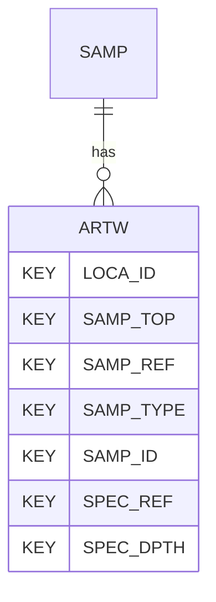

# ARTW — Aggregate Determination of the Resistance to Wear (micro-Deval)

## Purpose
> [!quote] The **ARTW** group — Aggregate Determination of the Resistance to Wear (micro-Deval). It is a **child of [[SAMP]]** in the PROJ-rooted hierarchy. See [[parent-child-graph]].

## Position in the model

- Parent: [[SAMP]]
- Children: _none_
- See [[parent-child-graph]] · [[key-tuple-pseudo-keys]] · [[heading-status-vocabulary]]

## Headings
> [!quote] Rendered from `repo:rust-packages/laterite-ags4-reference/data/ags_dictionary.json groups[code=ARTW]` (the repo's model authority — AGS edition 4.2). Suggested UNITs + worked examples are in the cited spec PDF, not duplicated here.

24 heading(s) — `**KEY**` = pseudo-key tuple, `*REQ*` = REQUIRED (non-null, Rule 10b), `DEP` = deprecated, OTHER = scope-dependent.

| Heading | Status | Type | Description |
|---|---|---|---|
| `LOCA_ID` | **KEY** | `ID` | Location identifier |
| `SAMP_TOP` | **KEY** | `2DP` | Depth to top of sample |
| `SAMP_REF` | **KEY** | `X` | Sample reference |
| `SAMP_TYPE` | **KEY** | `PA` | Sample type |
| `SAMP_ID` | **KEY** | `ID` | Sample unique identifier |
| `SPEC_REF` | **KEY** | `X` | Specimen reference |
| `SPEC_DPTH` | **KEY** | `2DP` | Depth to top of test specimen |
| `SPEC_DESC` | OTHER | `X` | Specimen description |
| `SPEC_PREP` | OTHER | `X` | Details of specimen preparation including time between preparation and testing |
| `ARTW_FRAC` | OTHER | `X` | Size fraction on which sample obtained |
| `ARTW_TYPE` | OTHER | `PA` | Type of test |
| `ARTW_MD1` | OTHER | `1DP` | Micro-Deval coefficient for test specimen one |
| `ARTW_MD2` | OTHER | `1DP` | Micro-Deval coefficient for test specimen two |
| `ARTW_MDE` | OTHER | `0DP` | Mean micro-Deval value (dry) |
| `ARTW_MDS` | OTHER | `0DP` | Mean micro-Deval value (wet) |
| `ARTW_DATE` | OTHER | `DT` | Date control 2 polished stone value first run |
| `ARTW_REM` | OTHER | `X` | Remarks |
| `ARTW_METH` | OTHER | `X` | Test method |
| `ARTW_LAB` | OTHER | `X` | Name of testing laboratory/organization |
| `ARTW_CRED` | OTHER | `X` | Accrediting body and reference number (when appropriate) |
| `TEST_STAT` | OTHER | `X` | Test status |
| `FILE_FSET` | OTHER | `X` | Associated file reference (e.g. test result sheets) |
| `SPEC_BASE` | OTHER | `2DP` | Depth to base of specimen |
| `ARTW_DEV` | OTHER | `X` | Deviation from the specified procedure |

Full cross-edition heading deltas: AGS Change Log (see [[ags4-rules-frozen-dictionary-evolves]]).

## Relational notes
KEY tuple: `LOCA_ID`, `SAMP_TOP`, `SAMP_REF`, `SAMP_TYPE`, `SAMP_ID`, `SPEC_REF`, `SPEC_DPTH`. Children (0): _none_. As a child it **denormalises** its parent's KEY columns into every row; [[rule-10c-parent-child]] re-resolves that repeated tuple upward to [[SAMP]]. See [[key-tuple-pseudo-keys]] · [[denormalised-child-rows]].

## Variations
No group-level change at 4.2 (present across the in-scope editions). Granular per-heading edition deltas live in the AGS online **Change Log** — the spec's own cited delta source (`spec:AGS4-4.2-2025.pdf` Foreword → ags.org.uk/.../change-log). Heading-level archaeology is deferred to a targeted Ingest if a rule/O-N interaction needs it (per [[ags4-rules-frozen-dictionary-evolves]]).

## Related
[[parent-child-graph]] · [[key-tuple-pseudo-keys]] · [[heading-status-vocabulary]] · [[rule-10c-parent-child]] · [[SAMP]]
