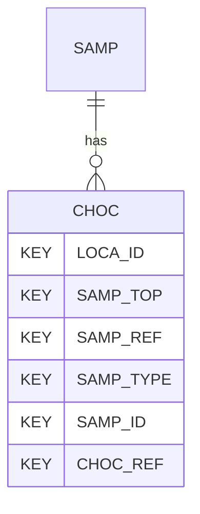

# CHOC — Chain of Custody Information

## Purpose
> [!quote] The **CHOC** group — Chain of Custody Information. It is a **child of [[SAMP]]** in the PROJ-rooted hierarchy. See [[parent-child-graph]].

## Position in the model

- Parent: [[SAMP]]
- Children: _none_
- See [[parent-child-graph]] · [[key-tuple-pseudo-keys]] · [[heading-status-vocabulary]]

## Headings
> [!quote] Rendered from `repo:rust-packages/laterite-ags4-reference/data/ags_dictionary.json groups[code=CHOC]` (the repo's model authority — AGS edition 4.2). Suggested UNITs + worked examples are in the cited spec PDF, not duplicated here.

13 heading(s) — `**KEY**` = pseudo-key tuple, `*REQ*` = REQUIRED (non-null, Rule 10b), `DEP` = deprecated, OTHER = scope-dependent.

| Heading | Status | Type | Description |
|---|---|---|---|
| `LOCA_ID` | **KEY** | `ID` | Location identifier |
| `SAMP_TOP` | **KEY** | `2DP` | Depth to top of sample |
| `SAMP_REF` | **KEY** | `X` | Sample reference |
| `SAMP_TYPE` | **KEY** | `PA` | Sample type |
| `SAMP_ID` | **KEY** | `ID` | Sample unique identifier |
| `CHOC_REF` | **KEY** | `X` | Chain of custody reference |
| `CHOC_FROM` | OTHER | `X` | Samples despatched from |
| `CHOC_TO` | OTHER | `X` | Samples despatched to |
| `CHOC_DDIS` | OTHER | `DT` | Date dispatched |
| `CHOC_BTCH` | OTHER | `X` | Batch reference |
| `CHOC_REM` | OTHER | `X` | Remarks |
| `CHOC_CONT` | OTHER | `0DP` | Number of sample containers |
| `FILE_FSET` | OTHER | `X` | Associated file reference (chain of custody sheets) |

Full cross-edition heading deltas: AGS Change Log (see [[ags4-rules-frozen-dictionary-evolves]]).

## Relational notes
KEY tuple: `LOCA_ID`, `SAMP_TOP`, `SAMP_REF`, `SAMP_TYPE`, `SAMP_ID`, `CHOC_REF`. Children (0): _none_. As a child it **denormalises** its parent's KEY columns into every row; [[rule-10c-parent-child]] re-resolves that repeated tuple upward to [[SAMP]]. See [[key-tuple-pseudo-keys]] · [[denormalised-child-rows]].

## Variations
No group-level change at 4.2 (present across the in-scope editions). Granular per-heading edition deltas live in the AGS online **Change Log** — the spec's own cited delta source (`spec:AGS4-4.2-2025.pdf` Foreword → ags.org.uk/.../change-log). Heading-level archaeology is deferred to a targeted Ingest if a rule/O-N interaction needs it (per [[ags4-rules-frozen-dictionary-evolves]]).

## Related
[[parent-child-graph]] · [[key-tuple-pseudo-keys]] · [[heading-status-vocabulary]] · [[rule-10c-parent-child]] · [[SAMP]]
