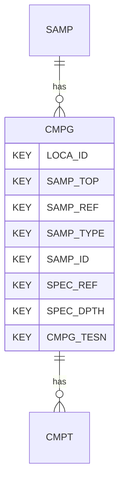

# CMPG — Compaction Tests - General

## Purpose
> [!quote] The **CMPG** group — Compaction Tests - General. It is a **child of [[SAMP]]** in the PROJ-rooted hierarchy. See [[parent-child-graph]].

## Position in the model

- Parent: [[SAMP]]
- Children: [[CMPT]]
- See [[parent-child-graph]] · [[key-tuple-pseudo-keys]] · [[heading-status-vocabulary]]

## Headings
> [!quote] Rendered from `repo:rust-packages/laterite-ags4-reference/data/ags_dictionary.json groups[code=CMPG]` (the repo's model authority — AGS edition 4.2). Suggested UNITs + worked examples are in the cited spec PDF, not duplicated here.

28 heading(s) — `**KEY**` = pseudo-key tuple, `*REQ*` = REQUIRED (non-null, Rule 10b), `DEP` = deprecated, OTHER = scope-dependent.

| Heading | Status | Type | Description |
|---|---|---|---|
| `LOCA_ID` | **KEY** | `ID` | Location identifier |
| `SAMP_TOP` | **KEY** | `2DP` | Depth to top of sample |
| `SAMP_REF` | **KEY** | `X` | Sample reference |
| `SAMP_TYPE` | **KEY** | `PA` | Sample type |
| `SAMP_ID` | **KEY** | `ID` | Sample unique identifier |
| `SPEC_REF` | **KEY** | `X` | Specimen reference |
| `SPEC_DPTH` | **KEY** | `2DP` | Depth to top of test specimen |
| `CMPG_TESN` | **KEY** | `X` | Test number |
| `SPEC_PREP` | OTHER | `X` | Details of specimen preparation including time between preparation and testing |
| `SPEC_DESC` | OTHER | `X` | Specimen description |
| `CMPG_TYPE` | OTHER | `PA` | Compaction test type |
| `CMPG_MOLD` | OTHER | `PA` | Compaction mould type |
| `CMPG_375` | OTHER | `0DP` | Weight percent of material retained on 37.5mm sieve |
| `CMPG_200` | OTHER | `0DP` | Weight percent of material retained on 20mm sieve |
| `CMPG_PDEN` | OTHER | `XN` | Particle density with prefix # if value assumed |
| `CMPG_MAXD` | OTHER | `2DP` | Maximum dry density |
| `CMPG_MCOP` | OTHER | `2SF` | Water/moisture content at maximum dry density (Optimum) |
| `CMPG_STAB` | OTHER | `2SF` | Amount of stabiliser added |
| `CMPG_STYP` | OTHER | `X` | Type of stabiliser added |
| `CMPG_REM` | OTHER | `X` | Remarks including commentary on effect of specimen disturbance on test result |
| `CMPG_METH` | OTHER | `X` | Test method |
| `CMPG_LAB` | OTHER | `X` | Name of testing laboratory/organization |
| `CMPG_CRED` | OTHER | `X` | Accrediting body and reference number (when appropriate) |
| `TEST_STAT` | OTHER | `X` | Test status |
| `FILE_FSET` | OTHER | `X` | Associated file reference (e.g. equipment calibrations) |
| `SPEC_BASE` | OTHER | `2DP` | Depth to base of specimen |
| `CMPG_DEV` | OTHER | `X` | Deviation from the specified procedure |
| `CMPG_ZONE` | OTHER | `X` | Grading zone |

Full cross-edition heading deltas: AGS Change Log (see [[ags4-rules-frozen-dictionary-evolves]]).

## Relational notes
KEY tuple: `LOCA_ID`, `SAMP_TOP`, `SAMP_REF`, `SAMP_TYPE`, `SAMP_ID`, `SPEC_REF`, `SPEC_DPTH`, `CMPG_TESN`. Children (1): [[CMPT]]. As a child it **denormalises** its parent's KEY columns into every row; [[rule-10c-parent-child]] re-resolves that repeated tuple upward to [[SAMP]]. See [[key-tuple-pseudo-keys]] · [[denormalised-child-rows]].

## Variations
No group-level change at 4.2 (present across the in-scope editions). Granular per-heading edition deltas live in the AGS online **Change Log** — the spec's own cited delta source (`spec:AGS4-4.2-2025.pdf` Foreword → ags.org.uk/.../change-log). Heading-level archaeology is deferred to a targeted Ingest if a rule/O-N interaction needs it (per [[ags4-rules-frozen-dictionary-evolves]]).

## Related
[[parent-child-graph]] · [[key-tuple-pseudo-keys]] · [[heading-status-vocabulary]] · [[rule-10c-parent-child]] · [[SAMP]] · [[CMPT]]
