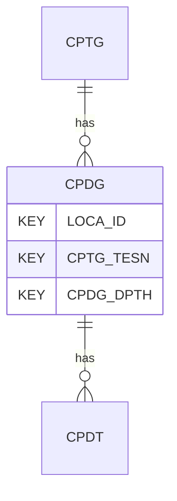

# CPDG — Pore Pressure Dissipation Tests (PPDT) - General

## Purpose
> [!quote] The **CPDG** group — Pore Pressure Dissipation Tests (PPDT) - General. It is a **child of [[CPTG]]** in the PROJ-rooted hierarchy. See [[parent-child-graph]].

## Position in the model

- Parent: [[CPTG]]
- Children: [[CPDT]]
- See [[parent-child-graph]] · [[key-tuple-pseudo-keys]] · [[heading-status-vocabulary]]

## Headings
> [!quote] Rendered from `repo:rust-packages/laterite-ags4-reference/data/ags_dictionary.json groups[code=CPDG]` (the repo's model authority — AGS edition 4.2). Suggested UNITs + worked examples are in the cited spec PDF, not duplicated here.

22 heading(s) — `**KEY**` = pseudo-key tuple, `*REQ*` = REQUIRED (non-null, Rule 10b), `DEP` = deprecated, OTHER = scope-dependent.

| Heading | Status | Type | Description |
|---|---|---|---|
| `LOCA_ID` | **KEY** | `ID` | Location identifier |
| `CPTG_TESN` | **KEY** | `X` | Test reference or push number |
| `CPDG_DPTH` | **KEY** | `2DP` | Inclination corrected depth of dissipation test |
| `CPDG_IR` | OTHER | `1DP` | Rigidity index used in analysis |
| `CPDG_RCMP` | OTHER | `YN` | Were the rods clamped during test? |
| `CPDG_UI` | OTHER | `3DP` | Measured, corrected or assumed initial pore water pressure (u_i) |
| `CPDG_UIP` | OTHER | `PA` | Procedure to define initial pore water pressure |
| `CPDG_M` | OTHER | `3DP` | Gradient of extrapolation line on square root time graph |
| `CPDG_UEQ` | OTHER | `3DP` | Measured or assumed equilibrium pore water pressure (u_o) |
| `CPDG_UEP` | OTHER | `PA` | Procedure to define equilibrium pore water |
| `CPDG_DDIS` | OTHER | `0DP` | Degree of dissipation for analysis |
| `CPDG_T` | OTHER | `1DP` | Time to achieve degree of dissipation stated in CPDG_DDIS |
| `CPDG_CH` | OTHER | `2SCI` | Coefficient of consolidation (horizontal), c_h |
| `CPDG_CHMT` | OTHER | `X` | Method(s) used to determine horizontal coefficient of consolidation |
| `CPDG_CV` | OTHER | `2SCI` | Coefficient of consolidation (vertical), c_v |
| `CPDG_CVMT` | OTHER | `X` | Method(s) used to determine vertical coefficient of consolidation |
| `CPDG_REM` | OTHER | `X` | Remarks, note if data is recorded as whole seconds |
| `CPDG_DATE` | OTHER | `DT` | Test date and time |
| `CPDG_OPER` | OTHER | `X` | Name of test operator |
| `CPDG_ANBY` | OTHER | `X` | Name(s) of analyser / person responsible for data quality and correctness |
| `TEST_STAT` | OTHER | `X` | Test status |
| `FILE_FSET` | OTHER | `X` | Associated file reference (e.g. equipment calibrations) |

Full cross-edition heading deltas: AGS Change Log (see [[ags4-rules-frozen-dictionary-evolves]]).

## Relational notes
KEY tuple: `LOCA_ID`, `CPTG_TESN`, `CPDG_DPTH`. Children (1): [[CPDT]]. As a child it **denormalises** its parent's KEY columns into every row; [[rule-10c-parent-child]] re-resolves that repeated tuple upward to [[CPTG]]. See [[key-tuple-pseudo-keys]] · [[denormalised-child-rows]].

## Variations
No group-level change at 4.2 (present across the in-scope editions). Granular per-heading edition deltas live in the AGS online **Change Log** — the spec's own cited delta source (`spec:AGS4-4.2-2025.pdf` Foreword → ags.org.uk/.../change-log). Heading-level archaeology is deferred to a targeted Ingest if a rule/O-N interaction needs it (per [[ags4-rules-frozen-dictionary-evolves]]).

## Related
[[parent-child-graph]] · [[key-tuple-pseudo-keys]] · [[heading-status-vocabulary]] · [[rule-10c-parent-child]] · [[CPTG]] · [[CPDT]]
