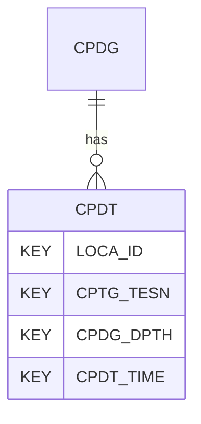

# CPDT — Pore Pressure Dissipation Tests (PPDT) - Data

## Purpose
> [!quote] The **CPDT** group — Pore Pressure Dissipation Tests (PPDT) - Data. It is a **child of [[CPDG]]** in the PROJ-rooted hierarchy. See [[parent-child-graph]].

## Position in the model

- Parent: [[CPDG]]
- Children: _none_
- See [[parent-child-graph]] · [[key-tuple-pseudo-keys]] · [[heading-status-vocabulary]]

## Headings
> [!quote] Rendered from `repo:rust-packages/laterite-ags4-reference/data/ags_dictionary.json groups[code=CPDT]` (the repo's model authority — AGS edition 4.2). Suggested UNITs + worked examples are in the cited spec PDF, not duplicated here.

13 heading(s) — `**KEY**` = pseudo-key tuple, `*REQ*` = REQUIRED (non-null, Rule 10b), `DEP` = deprecated, OTHER = scope-dependent.

| Heading | Status | Type | Description |
|---|---|---|---|
| `LOCA_ID` | **KEY** | `ID` | Location identifier |
| `CPTG_TESN` | **KEY** | `X` | Test reference or push number |
| `CPDG_DPTH` | **KEY** | `2DP` | Inclination corrected depth of dissipation test |
| `CPDT_TIME` | **KEY** | `1DP` | Elapsed time since start of test |
| `CPDT_QC` | OTHER | `3DP` | Cone resistance (q_c) |
| `CPDT_TF` | OTHER | `3DP` | Total force or thrust |
| `CPDT_FS` | OTHER | `4DP` | Sleeve friction (f_s) |
| `CPDT_U1` | OTHER | `4DP` | Face porewater pressure (u_1) |
| `CPDT_U2` | OTHER | `4DP` | Shoulder porewater pressure (u_2) |
| `CPDT_U3` | OTHER | `4DP` | Top of sleeve porewater pressure (u_3) |
| `CPDT_TMPI` | OTHER | `1DP` | Cone internal temperature. If multiple temperature sensors exist, then the sensor closest to the pore pressure sensors should be used. |
| `CPDT_REM` | OTHER | `X` | Comments |
| `FILE_FSET` | OTHER | `X` | Associated file reference (e.g. test result sheets) |

Full cross-edition heading deltas: AGS Change Log (see [[ags4-rules-frozen-dictionary-evolves]]).

## Relational notes
KEY tuple: `LOCA_ID`, `CPTG_TESN`, `CPDG_DPTH`, `CPDT_TIME`. Children (0): _none_. As a child it **denormalises** its parent's KEY columns into every row; [[rule-10c-parent-child]] re-resolves that repeated tuple upward to [[CPDG]]. See [[key-tuple-pseudo-keys]] · [[denormalised-child-rows]].

## Variations
No group-level change at 4.2 (present across the in-scope editions). Granular per-heading edition deltas live in the AGS online **Change Log** — the spec's own cited delta source (`spec:AGS4-4.2-2025.pdf` Foreword → ags.org.uk/.../change-log). Heading-level archaeology is deferred to a targeted Ingest if a rule/O-N interaction needs it (per [[ags4-rules-frozen-dictionary-evolves]]).

## Related
[[parent-child-graph]] · [[key-tuple-pseudo-keys]] · [[heading-status-vocabulary]] · [[rule-10c-parent-child]] · [[CPDG]]
