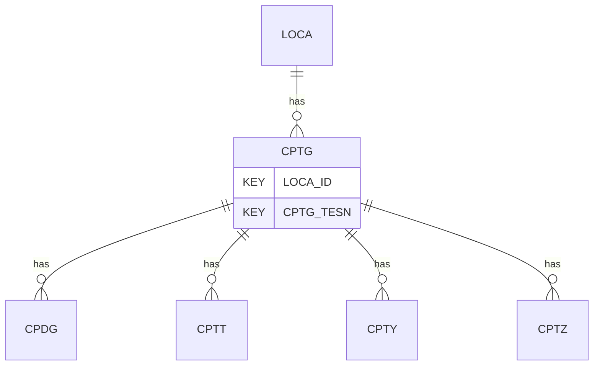

# CPTG — Cone Penetration Test (CPT/CPTu) - General

## Purpose
> [!quote] The **CPTG** group — Cone Penetration Test (CPT/CPTu) - General. It is a **child of [[LOCA]]** in the PROJ-rooted hierarchy. See [[parent-child-graph]].

## Position in the model

- Parent: [[LOCA]]
- Children: [[CPDG]] [[CPTT]] [[CPTY]] [[CPTZ]]
- See [[parent-child-graph]] · [[key-tuple-pseudo-keys]] · [[heading-status-vocabulary]]

## Headings
> [!quote] Rendered from `repo:rust-packages/laterite-ags4-reference/data/ags_dictionary.json groups[code=CPTG]` (the repo's model authority — AGS edition 4.2). Suggested UNITs + worked examples are in the cited spec PDF, not duplicated here.

51 heading(s) — `**KEY**` = pseudo-key tuple, `*REQ*` = REQUIRED (non-null, Rule 10b), `DEP` = deprecated, OTHER = scope-dependent.

| Heading | Status | Type | Description |
|---|---|---|---|
| `LOCA_ID` | **KEY** | `ID` | Location identifier |
| `CPTG_TESN` | **KEY** | `X` | Test reference or push number |
| `CPTG_TYPE` | OTHER | `PA` | Cone test type |
| `CPTG_DATE` | OTHER | `DT` | Date time at beginning of test or push |
| `CPTG_PED` | OTHER | `2DP` | Pre-drilled depth |
| `CPTG_RATE` | OTHER | `0DP` | Nominal rate of penetration of the cone |
| `CPTG_ORNT` | OTHER | `0DP` | Orientation of inclination X from North |
| `CPTG_RLOC` | OTHER | `PA` | The location where the reference reading (pretest zero) of the test was performed |
| `CPTG_WAT` | OTHER | `2DP` | Depth to groundwater level, z_w at time of test. Negative for water levels above the location where the reference reading was performed. |
| `CPTG_WATA` | OTHER | `X` | Origin of groundwater level in CPTG_WAT |
| `CPTG_TERM` | OTHER | `PA` | Termination reason(s) |
| `CPTG_REF` | OTHER | `X` | Cone reference |
| `CPTG_MAN` | OTHER | `X` | Manufacturer of cone penetrometer |
| `CPTG_FILL` | OTHER | `PA` | Filter location(s) |
| `CPTG_CSA` | OTHER | `1DP` | Cross sectional area of cone tip, Ball and T-Bar |
| `CPTG_CSAN` | OTHER | `0DP` | Nominal cross sectional area of cone tip, Ball and T-Bar |
| `CPTG_CAR` | OTHER | `3DP` | Cone area ratio used to calculate qt, also use for Ball and T-Bar |
| `CPTG_SLA` | OTHER | `1DP` | Friction sleeve area |
| `CPTG_SLAN` | OTHER | `0DP` | Nominal friction sleeve area |
| `CPTG_SHA` | OTHER | `0DP` | Cross-sectional area of the connecting shaft for Ball and T-Bar |
| `CPTG_SLAR` | OTHER | `3DP` | Sleeve area ratio used to calculate ft |
| `CPTG_CFOS` | OTHER | `0DP` | Shoulder of cone to centre of friction sleeve offset (physical measurement) |
| `CPTG_CFOA` | OTHER | `0DP` | Shoulder of cone to centre of friction sleeve offset used by analysis |
| `CPTG_TBL` | OTHER | `1DP` | T-Bar length |
| `CPTG_TBD` | OTHER | `1DP` | T-Bar diameter |
| `CPTG_CPC` | OTHER | `1DP` | Nominal cone maximum tip pressure capacity (assumed zero load on sleeve for subtraction cones and purely axial load) |
| `CPTG_FPC` | OTHER | `1DP` | Nominal friction maximum pressure capacity |
| `CPTG_UPC` | OTHER | `1DP` | Nominal porewater pressure maximum pressure capacity |
| `CPTG_CPCL` | OTHER | `PA` | Cone penetrometer class |
| `CPTG_CRDT` | OTHER | `DT` | Date of last calibration of cone |
| `CPTG_CDDT` | OTHER | `DT` | Date of last calibration of data logger (applicable to analogue cones) |
| `CPTG_LCA` | OTHER | `PA` | Load cell arrangement |
| `CPTG_FILT` | OTHER | `X` | Type of filter material used |
| `CPTG_FRIC` | OTHER | `YN` | Friction reducer used |
| `CPTG_FRID` | OTHER | `0DP` | Friction reducer distance behind the shoulder of the cone tip |
| `CPTG_FRIS` | OTHER | `0DP` | Friction reducer diameter |
| `CPTG_SAT` | OTHER | `X` | Method of saturation of pore pressure system and type of fluid used |
| `CPTG_EQPT` | OTHER | `X` | Mass, reaction and equipment geometry |
| `CPTG_APCL` | OTHER | `PA` | Test application class or category described in the standard |
| `CPTG_DAZV` | OTHER | `X` | Description of application of zero values |
| `CPTG_CORR` | OTHER | `X` | Corrections applied during data processing (e.g. depth corrections, removal of rod change spikes, zeros) |
| `CPTG_REM` | OTHER | `X` | Comments on testing and basis of any interpreted parameters included in CPTT |
| `CPTG_OPER` | OTHER | `X` | Name of test operator |
| `CPTG_ANBY` | OTHER | `X` | Name(s) of analyser / person responsible for data quality and correctness |
| `CPTG_ENV` | OTHER | `X` | Details of weather and environmental conditions during test |
| `CPTG_METH` | OTHER | `X` | Standard followed for testing |
| `CPTG_DEV` | OTHER | `X` | Deviations from the standard followed |
| `CPTG_CONT` | OTHER | `X` | Subcontractor name |
| `CPTG_CRED` | OTHER | `X` | Accrediting body and reference number (when appropriate) |
| `TEST_STAT` | OTHER | `X` | Test status |
| `FILE_FSET` | OTHER | `X` | Associated file reference (e.g. cone calibration records) |

Full cross-edition heading deltas: AGS Change Log (see [[ags4-rules-frozen-dictionary-evolves]]).

## Relational notes
KEY tuple: `LOCA_ID`, `CPTG_TESN`. Children (4): [[CPDG]] [[CPTT]] [[CPTY]] [[CPTZ]]. As a child it **denormalises** its parent's KEY columns into every row; [[rule-10c-parent-child]] re-resolves that repeated tuple upward to [[LOCA]]. See [[key-tuple-pseudo-keys]] · [[denormalised-child-rows]].

## Variations
No group-level change at 4.2 (present across the in-scope editions). Granular per-heading edition deltas live in the AGS online **Change Log** — the spec's own cited delta source (`spec:AGS4-4.2-2025.pdf` Foreword → ags.org.uk/.../change-log). Heading-level archaeology is deferred to a targeted Ingest if a rule/O-N interaction needs it (per [[ags4-rules-frozen-dictionary-evolves]]).

## Related
[[parent-child-graph]] · [[key-tuple-pseudo-keys]] · [[heading-status-vocabulary]] · [[rule-10c-parent-child]] · [[LOCA]] · [[CPDG]] · [[CPTT]] · [[CPTY]] · [[CPTZ]]
