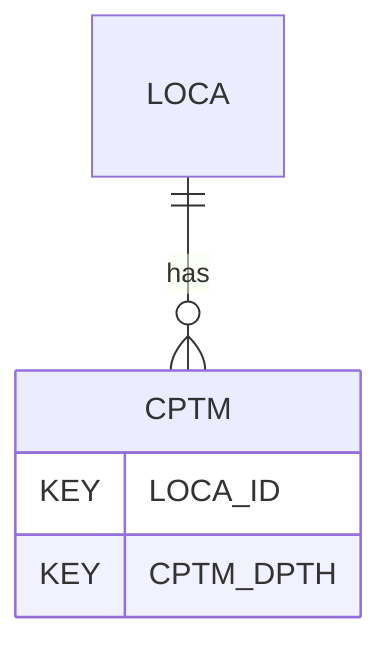

# CPTM — Cone Penetration Test (CPT/CPTu) - Methods/references for Correlated Parameters

## Purpose
> [!quote] The **CPTM** group — Cone Penetration Test (CPT/CPTu) - Methods/references for Correlated Parameters. It is a **child of [[LOCA]]** in the PROJ-rooted hierarchy. See [[parent-child-graph]].

## Position in the model

- Parent: [[LOCA]]
- Children: _none_
- See [[parent-child-graph]] · [[key-tuple-pseudo-keys]] · [[heading-status-vocabulary]]

## Headings
> [!quote] Rendered from `repo:rust-packages/laterite-ags4-reference/data/ags_dictionary.json groups[code=CPTM]` (the repo's model authority — AGS edition 4.2). Suggested UNITs + worked examples are in the cited spec PDF, not duplicated here.

29 heading(s) — `**KEY**` = pseudo-key tuple, `*REQ*` = REQUIRED (non-null, Rule 10b), `DEP` = deprecated, OTHER = scope-dependent.

| Heading | Status | Type | Description |
|---|---|---|---|
| `LOCA_ID` | **KEY** | `ID` | Location identifier |
| `CPTM_DPTH` | **KEY** | `2DP` | Depth to top of Method |
| `CPTM_BASE` | OTHER | `2DP` | Depth to base of Method, optional, if empty then method applies to maximum depth of LOCA_ID |
| `CPTM_SBT1` | OTHER | `X` | Method for Soil Behaviour Type |
| `CPTM_SU1` | OTHER | `X` | Method for Undrained Shear Strength (s_u) 1, could be used for lower estimate; fine soils |
| `CPTM_SU2` | OTHER | `X` | Method for Undrained Shear Strength (s_u) 2, could be used for upper estimate; fine soils |
| `CPTM_DR1` | OTHER | `X` | Method for Relative density (D_r) 1, could be used for lower estimate; coarse soils |
| `CPTM_DR2` | OTHER | `X` | Method for Relative density (D_r) 2, could be used for upper estimate; coarse soils |
| `CPTM_PHI1` | OTHER | `X` | Method for Internal Friction Angle; coarse soils |
| `CPTM_IC1` | OTHER | `X` | Method for Soil Behaviour Type Index (I_c) |
| `CPTM_N601` | OTHER | `X` | Method for Equivalent SPT N_60 value |
| `CPTM_E1` | OTHER | `X` | Method for Young's Modulus, E |
| `CPTM_MV1` | OTHER | `X` | Method for Coefficient of Volume Change, m_v |
| `CPTM_G01` | OTHER | `X` | Method for Small strain shear modulus, G_0 |
| `CPTM_VS1` | OTHER | `X` | Method for Shear wave velocity (correlated), V_s |
| `CPTM_DUW1` | OTHER | `X` | Method for Dry unit weight, gamma_d |
| `CPTM_SUW1` | OTHER | `X` | Method for Saturated unit weight, gamma_s |
| `CPTM_M1` | OTHER | `X` | Method for Constrained modulus, M |
| `CPTM_CC1` | OTHER | `X` | Method for Compression index, C_C |
| `CPTM_P01` | OTHER | `X` | Method for Preconsolidation stress, p_0' |
| `CPTM_ST1` | OTHER | `X` | Method for Sensitivity, S_t |
| `CPTM_K01` | OTHER | `X` | Method for Coefficient of lateral earth pressure, K_0 |
| `CPTM_IR1` | OTHER | `X` | Method for Rigidity index, I_r |
| `CPTM_K1` | OTHER | `X` | Method for Permeability, k |
| `CPTM_FC1` | OTHER | `X` | Method for Fines content, FC |
| `CPTM_CSR1` | OTHER | `X` | Method for Cyclic stress ratio, CSR |
| `CPTM_CRR1` | OTHER | `X` | Method for Cyclic resistance ratio, CRR |
| `CPTM_REM` | OTHER | `X` | Remarks |
| `FILE_FSET` | OTHER | `X` | Associated file reference |

Full cross-edition heading deltas: AGS Change Log (see [[ags4-rules-frozen-dictionary-evolves]]).

## Relational notes
KEY tuple: `LOCA_ID`, `CPTM_DPTH`. Children (0): _none_. As a child it **denormalises** its parent's KEY columns into every row; [[rule-10c-parent-child]] re-resolves that repeated tuple upward to [[LOCA]]. See [[key-tuple-pseudo-keys]] · [[denormalised-child-rows]].

## Variations
No group-level change at 4.2 (present across the in-scope editions). Granular per-heading edition deltas live in the AGS online **Change Log** — the spec's own cited delta source (`spec:AGS4-4.2-2025.pdf` Foreword → ags.org.uk/.../change-log). Heading-level archaeology is deferred to a targeted Ingest if a rule/O-N interaction needs it (per [[ags4-rules-frozen-dictionary-evolves]]).

## Related
[[parent-child-graph]] · [[key-tuple-pseudo-keys]] · [[heading-status-vocabulary]] · [[rule-10c-parent-child]] · [[LOCA]]
