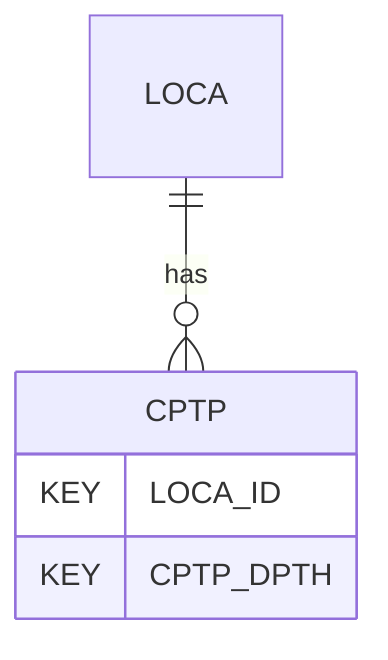

# CPTP — Cone Penetration Test (CPT/CPTu) - Correlated Parameters

## Purpose
> [!quote] The **CPTP** group — Cone Penetration Test (CPT/CPTu) - Correlated Parameters. It is a **child of [[LOCA]]** in the PROJ-rooted hierarchy. See [[parent-child-graph]].

## Position in the model

- Parent: [[LOCA]]
- Children: _none_
- See [[parent-child-graph]] · [[key-tuple-pseudo-keys]] · [[heading-status-vocabulary]]

## Headings
> [!quote] Rendered from `repo:rust-packages/laterite-ags4-reference/data/ags_dictionary.json groups[code=CPTP]` (the repo's model authority — AGS edition 4.2). Suggested UNITs + worked examples are in the cited spec PDF, not duplicated here.

29 heading(s) — `**KEY**` = pseudo-key tuple, `*REQ*` = REQUIRED (non-null, Rule 10b), `DEP` = deprecated, OTHER = scope-dependent.

| Heading | Status | Type | Description |
|---|---|---|---|
| `LOCA_ID` | **KEY** | `ID` | Location identifier |
| `CPTP_DPTH` | **KEY** | `2DP` | Depth of each reading (CPTT_DPTH) or depth to top of layer |
| `CPTP_BASE` | OTHER | `2DP` | Depth to base of layer, optional |
| `CPTP_SBT1` | OTHER | `X` | Soil Behaviour Type |
| `CPTP_SU1` | OTHER | `1DP` | Undrained Shear Strength (s_u) 1, could be used for lower estimate; fine soils |
| `CPTP_SU2` | OTHER | `1DP` | Undrained Shear Strength (s_u) 2, could be used for upper estimate; fine soils |
| `CPTP_DR1` | OTHER | `1DP` | Relative density (D_r) 1, could be used for lower estimate; coarse soils |
| `CPTP_DR2` | OTHER | `1DP` | Relative density (D_r) 2, could be used for upper estimate; coarse soils |
| `CPTP_PHI1` | OTHER | `1DP` | Internal Friction Angle; coarse soils |
| `CPTP_IC1` | OTHER | `1DP` | Soil Behaviour Type Index (I_c) |
| `CPTP_N601` | OTHER | `0DP` | Equivalent SPT N_60 value |
| `CPTP_E1` | OTHER | `1DP` | Young's Modulus, E |
| `CPTP_MV1` | OTHER | `2SCI` | Coefficient of Volume Change, m_v |
| `CPTP_G01` | OTHER | `1DP` | Small strain shear modulus, G_0 |
| `CPTP_VS1` | OTHER | `1DP` | Shear wave velocity (correlated), V_s |
| `CPTP_DUW1` | OTHER | `1DP` | Dry unit weight, gamma_d |
| `CPTP_SUW1` | OTHER | `1DP` | Saturated unit weight, gamma_s |
| `CPTP_M1` | OTHER | `1DP` | Constrained modulus, M |
| `CPTP_CC1` | OTHER | `2SCI` | Compression index, C_C |
| `CPTP_P01` | OTHER | `1DP` | Preconsolidation stress, p_0' |
| `CPTP_ST1` | OTHER | `1DP` | Sensitivity, S_t |
| `CPTP_K01` | OTHER | `1DP` | Coefficient of lateral earth pressure, K_0 |
| `CPTP_IR1` | OTHER | `1DP` | Rigidity index, I_r |
| `CPTP_K1` | OTHER | `1SCI` | Permeability, k |
| `CPTP_FC1` | OTHER | `1DP` | Fines content, FC |
| `CPTP_CSR1` | OTHER | `3DP` | Cyclic stress ratio, CSR |
| `CPTP_CRR1` | OTHER | `3DP` | Cyclic resistance ratio, CRR |
| `CPTP_REM` | OTHER | `X` | Remarks |
| `FILE_FSET` | OTHER | `X` | Associated file reference |

Full cross-edition heading deltas: AGS Change Log (see [[ags4-rules-frozen-dictionary-evolves]]).

## Relational notes
KEY tuple: `LOCA_ID`, `CPTP_DPTH`. Children (0): _none_. As a child it **denormalises** its parent's KEY columns into every row; [[rule-10c-parent-child]] re-resolves that repeated tuple upward to [[LOCA]]. See [[key-tuple-pseudo-keys]] · [[denormalised-child-rows]].

## Variations
No group-level change at 4.2 (present across the in-scope editions). Granular per-heading edition deltas live in the AGS online **Change Log** — the spec's own cited delta source (`spec:AGS4-4.2-2025.pdf` Foreword → ags.org.uk/.../change-log). Heading-level archaeology is deferred to a targeted Ingest if a rule/O-N interaction needs it (per [[ags4-rules-frozen-dictionary-evolves]]).

## Related
[[parent-child-graph]] · [[key-tuple-pseudo-keys]] · [[heading-status-vocabulary]] · [[rule-10c-parent-child]] · [[LOCA]]
