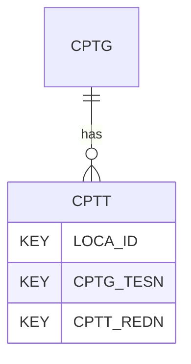

# CPTT — Cone Penetration Test (CPT/CPTu) - Data

## Purpose
> [!quote] The **CPTT** group — Cone Penetration Test (CPT/CPTu) - Data. It is a **child of [[CPTG]]** in the PROJ-rooted hierarchy. See [[parent-child-graph]].

## Position in the model

- Parent: [[CPTG]]
- Children: _none_
- See [[parent-child-graph]] · [[key-tuple-pseudo-keys]] · [[heading-status-vocabulary]]

## Headings
> [!quote] Rendered from `repo:rust-packages/laterite-ags4-reference/data/ags_dictionary.json groups[code=CPTT]` (the repo's model authority — AGS edition 4.2). Suggested UNITs + worked examples are in the cited spec PDF, not duplicated here.

49 heading(s) — `**KEY**` = pseudo-key tuple, `*REQ*` = REQUIRED (non-null, Rule 10b), `DEP` = deprecated, OTHER = scope-dependent.

| Heading | Status | Type | Description |
|---|---|---|---|
| `LOCA_ID` | **KEY** | `ID` | Location identifier |
| `CPTG_TESN` | **KEY** | `X` | Test reference or push number |
| `CPTT_REDN` | **KEY** | `0DP` | Sequence number, incrementing number defining order of records |
| `CPTT_DPTH` | OTHER | `2DP` | Depth of result corrected for inclination |
| `CPTT_PLEN` | OTHER | `U` | Recorded penetration length; Recommend types: 2DP or 3DP |
| `CPTT_QC` | OTHER | `3DP` | Cone resistance (q_c), or measured Ball and T-Bar resistance (q_m) |
| `CPTT_FS` | OTHER | `4DP` | Sleeve friction (f_s) |
| `CPTT_U1` | OTHER | `4DP` | Face porewater pressure (u_1) |
| `CPTT_U2` | OTHER | `4DP` | Shoulder porewater pressure (u_2) |
| `CPTT_U3` | OTHER | `4DP` | Top of sleeve porewater pressure (u_3) |
| `CPTT_INCX` | OTHER | `1DP` | Inclination X |
| `CPTT_INCY` | OTHER | `1DP` | Inclination Y |
| `CPTT_TIME` | OTHER | `DT` | Clock time during the test |
| `CPTT_DUR` | OTHER | `1DP` | Duration since start of test |
| `CPTT_TF` | OTHER | `3DP` | Total force or thrust |
| `CPTT_RF` | OTHER | `2DP` | Friction ratio (R_f) |
| `CPTT_BDEN` | OTHER | `2DP` | Bulk density of material (measured or assumed) |
| `CPTT_CPO` | OTHER | `4DP` | Total vertical stress (based on CPTT_BDEN) |
| `CPTT_ISPP` | OTHER | `4DP` | In situ pore pressure (u_o) (measured or assumed where not simple hydrostatic based on CPTG_WAT) |
| `CPTT_CPOD` | OTHER | `4DP` | Effective vertical stress (calculated from CPTT_CPO and CPTT_ISPP or CPTG_WAT) |
| `CPTT_QT` | OTHER | `3DP` | Corrected cone resistance (q_t) piezocone only |
| `CPTT_FT` | OTHER | `4DP` | Corrected sleeve resistance (f_t) piezocone only |
| `CPTT_QNET` | OTHER | `3DP` | Net cone resistance (q_n), or net Ball and T-bar resistance (q_ball and q_T-bar) |
| `CPTT_QE` | OTHER | `3DP` | Effective cone resistance (qe) piezocone only |
| `CPTT_RFT` | OTHER | `2DP` | Corrected friction ratio (R_ft) piezocone only |
| `CPTT_EXPP` | OTHER | `4DP` | Excess pore pressure (u-u_o) piezocone only |
| `CPTT_BQ` | OTHER | `4DP` | Pore pressure ratio (B_q) piezocone only |
| `CPTT_NQT` | OTHER | `2DP` | Normalised cone resistance (Q_t) |
| `CPTT_NFR` | OTHER | `2DP` | Normalised friction ratio (F_r) |
| `CPTT_MAGX` | OTHER | `0DP` | Magnetic flux - X |
| `CPTT_MAGY` | OTHER | `0DP` | Magnetic flux - Y |
| `CPTT_MAGZ` | OTHER | `0DP` | Magnetic flux - Z |
| `CPTT_MAGT` | OTHER | `1DP` | Magnetic flux - Total (calculated) |
| `CPTT_MAGG` | OTHER | `1DP` | Magnetic flux - Gradient (calculated) |
| `CPTT_CON` | OTHER | `0DP` | Conductivity |
| `CPTT_TEMP` | OTHER | `1DP` | Soil temperature |
| `CPTT_TPQC` | OTHER | `1DP` | Temperature associated with tip sensor. Use this heading if there is one temperature sensor. |
| `CPTT_TPFS` | OTHER | `1DP` | Temperature associated with sleeve sensor |
| `CPTT_TPU` | OTHER | `1DP` | Temperature associated with pore pressure sensor |
| `CPTT_PH` | OTHER | `1DP` | pH reading |
| `CPTT_REDX` | OTHER | `2DP` | Redox potential |
| `CPTT_SMP` | OTHER | `1DP` | Soil moisture |
| `CPTT_NGAM` | OTHER | `1DP` | Natural gamma radiation |
| `CPTT_FFD1` | OTHER | `0DP` | Fluorescence intensity 1 |
| `CPTT_FFD2` | OTHER | `0DP` | Fluorescence intensity 2 |
| `CPTT_PID` | OTHER | `0DP` | Photo ionization detector |
| `CPTT_FID` | OTHER | `0DP` | Flame ionization detector |
| `CPTT_REM` | OTHER | `X` | Remarks |
| `FILE_FSET` | OTHER | `X` | Associated file reference (e.g. raw field data) |

Full cross-edition heading deltas: AGS Change Log (see [[ags4-rules-frozen-dictionary-evolves]]).

## Relational notes
KEY tuple: `LOCA_ID`, `CPTG_TESN`, `CPTT_REDN`. Children (0): _none_. As a child it **denormalises** its parent's KEY columns into every row; [[rule-10c-parent-child]] re-resolves that repeated tuple upward to [[CPTG]]. See [[key-tuple-pseudo-keys]] · [[denormalised-child-rows]].

## Variations
No group-level change at 4.2 (present across the in-scope editions). Granular per-heading edition deltas live in the AGS online **Change Log** — the spec's own cited delta source (`spec:AGS4-4.2-2025.pdf` Foreword → ags.org.uk/.../change-log). Heading-level archaeology is deferred to a targeted Ingest if a rule/O-N interaction needs it (per [[ags4-rules-frozen-dictionary-evolves]]).

## Related
[[parent-child-graph]] · [[key-tuple-pseudo-keys]] · [[heading-status-vocabulary]] · [[rule-10c-parent-child]] · [[CPTG]]
