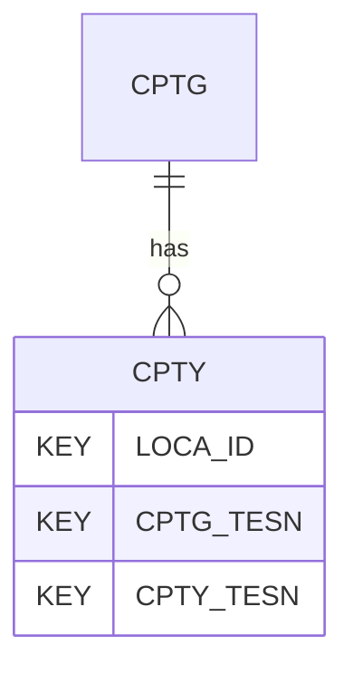

# CPTY — Cone Penetration Test (CPT/CPTu) - Cyclic Tests

## Purpose
> [!quote] The **CPTY** group — Cone Penetration Test (CPT/CPTu) - Cyclic Tests. It is a **child of [[CPTG]]** in the PROJ-rooted hierarchy. See [[parent-child-graph]].

## Position in the model

- Parent: [[CPTG]]
- Children: _none_
- See [[parent-child-graph]] · [[key-tuple-pseudo-keys]] · [[heading-status-vocabulary]]

## Headings
> [!quote] Rendered from `repo:rust-packages/laterite-ags4-reference/data/ags_dictionary.json groups[code=CPTY]` (the repo's model authority — AGS edition 4.2). Suggested UNITs + worked examples are in the cited spec PDF, not duplicated here.

12 heading(s) — `**KEY**` = pseudo-key tuple, `*REQ*` = REQUIRED (non-null, Rule 10b), `DEP` = deprecated, OTHER = scope-dependent.

| Heading | Status | Type | Description |
|---|---|---|---|
| `LOCA_ID` | **KEY** | `ID` | Location identifier |
| `CPTG_TESN` | **KEY** | `X` | Test reference or push number |
| `CPTY_TESN` | **KEY** | `X` | Cyclic test number |
| `CPTY_DPTH` | OTHER | `2DP` | Top depth of cyclic test corrected for inclination |
| `CPTY_DINT` | OTHER | `2DP` | Depth Interval of cyclic test |
| `CPTY_NUMC` | OTHER | `0DP` | Number of full cycles in cyclic test |
| `CPTY_REDI` | OTHER | `0DP` | Initial reading number of cyclic test |
| `CPTY_REDF` | OTHER | `0DP` | Final reading number of cyclic test |
| `CPTY_TIMI` | OTHER | `1DP` | Initial elapsed time (CPTT_TIME) of cyclic test |
| `CPTY_TIMF` | OTHER | `1DP` | Final elapsed time (CPTT_TIME) of cyclic test |
| `CPTY_REM` | OTHER | `X` | Remarks, including early termination reason |
| `FILE_FSET` | OTHER | `X` | Associated file reference (e.g. raw field data) |

Full cross-edition heading deltas: AGS Change Log (see [[ags4-rules-frozen-dictionary-evolves]]).

## Relational notes
KEY tuple: `LOCA_ID`, `CPTG_TESN`, `CPTY_TESN`. Children (0): _none_. As a child it **denormalises** its parent's KEY columns into every row; [[rule-10c-parent-child]] re-resolves that repeated tuple upward to [[CPTG]]. See [[key-tuple-pseudo-keys]] · [[denormalised-child-rows]].

## Variations
No group-level change at 4.2 (present across the in-scope editions). Granular per-heading edition deltas live in the AGS online **Change Log** — the spec's own cited delta source (`spec:AGS4-4.2-2025.pdf` Foreword → ags.org.uk/.../change-log). Heading-level archaeology is deferred to a targeted Ingest if a rule/O-N interaction needs it (per [[ags4-rules-frozen-dictionary-evolves]]).

## Related
[[parent-child-graph]] · [[key-tuple-pseudo-keys]] · [[heading-status-vocabulary]] · [[rule-10c-parent-child]] · [[CPTG]]
