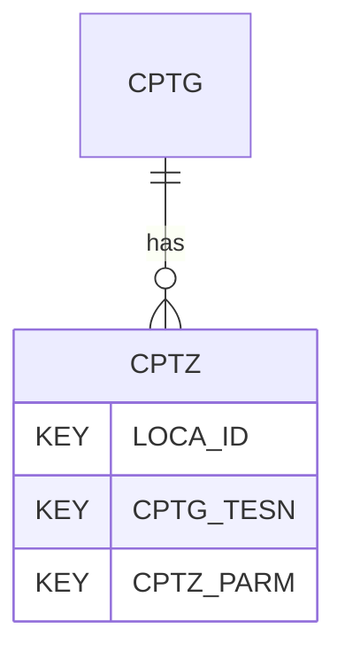

# CPTZ — Cone Penetration Test (CPT/CPTu) - Zeros

## Purpose
> [!quote] The **CPTZ** group — Cone Penetration Test (CPT/CPTu) - Zeros. It is a **child of [[CPTG]]** in the PROJ-rooted hierarchy. See [[parent-child-graph]].

## Position in the model

- Parent: [[CPTG]]
- Children: _none_
- See [[parent-child-graph]] · [[key-tuple-pseudo-keys]] · [[heading-status-vocabulary]]

## Headings
> [!quote] Rendered from `repo:rust-packages/laterite-ags4-reference/data/ags_dictionary.json groups[code=CPTZ]` (the repo's model authority — AGS edition 4.2). Suggested UNITs + worked examples are in the cited spec PDF, not duplicated here.

18 heading(s) — `**KEY**` = pseudo-key tuple, `*REQ*` = REQUIRED (non-null, Rule 10b), `DEP` = deprecated, OTHER = scope-dependent.

| Heading | Status | Type | Description |
|---|---|---|---|
| `LOCA_ID` | **KEY** | `ID` | Location identifier |
| `CPTG_TESN` | **KEY** | `X` | Test reference or push number |
| `CPTZ_PARM` | **KEY** | `PA` | Measured Parameter |
| `CPTZ_ZBD` | OTHER | `U` | Zero before at deck/surface (for over water testing where CPTG_RLOC is BB or SB) |
| `CPTZ_ZB` | OTHER | `U` | Zero before at reference/test level |
| `CPTZ_ZA` | OTHER | `U` | Zero after at reference/test level |
| `CPTZ_ZAD` | OTHER | `U` | Zero after at deck/surface (for over water testing where CPTG_RLOC is BB or SB) |
| `CPTZ_ZAC` | OTHER | `U` | Zero after test when cone has been cleaned at test level/deck/surface |
| `CPTZ_ZD` | OTHER | `4DP` | Zero drift between reference readings, CPTZ_ZA - CPTZ_ZB |
| `CPTZ_ZDD` | OTHER | `4DP` | Zero drift between deck/surface readings, CPTZ_ZAD - CPTZ_ZBD |
| `CPTZ_ZDC` | OTHER | `4DP` | Zero drift between before and cleaned, CPTZ_ZAC - first of CPTZ_ZBD or CPTZ_ZB |
| `CPTZ_CD` | OTHER | `4DP` | Calibration drift between calibration or first test, and first of CPTZ_ZBD or CPTZ_ZB |
| `CPTZ_ZS` | OTHER | `4DP` | Zero output stability, the difference between maximum and minimum values recorded for one minute |
| `CPTZ_ZSS` | OTHER | `X` | Origin of zero output stability |
| `CPTZ_ZVUC` | OTHER | `U` | Zero value used in calculation |
| `CPTZ_EGUT` | OTHER | `PU` | Engineering unit for CPTZ_ZBD, CPTZ_ZB, CPTZ_ZA, CPTZ_ZAD, CPTZ_ZAC, CPTG_ZD, CPTG_CD and CPTG_ZS |
| `CPTZ_REM` | OTHER | `X` | Remarks |
| `FILE_FSET` | OTHER | `X` | Associated file reference |

Full cross-edition heading deltas: AGS Change Log (see [[ags4-rules-frozen-dictionary-evolves]]).

## Relational notes
KEY tuple: `LOCA_ID`, `CPTG_TESN`, `CPTZ_PARM`. Children (0): _none_. As a child it **denormalises** its parent's KEY columns into every row; [[rule-10c-parent-child]] re-resolves that repeated tuple upward to [[CPTG]]. See [[key-tuple-pseudo-keys]] · [[denormalised-child-rows]].

## Variations
No group-level change at 4.2 (present across the in-scope editions). Granular per-heading edition deltas live in the AGS online **Change Log** — the spec's own cited delta source (`spec:AGS4-4.2-2025.pdf` Foreword → ags.org.uk/.../change-log). Heading-level archaeology is deferred to a targeted Ingest if a rule/O-N interaction needs it (per [[ags4-rules-frozen-dictionary-evolves]]).

## Related
[[parent-child-graph]] · [[key-tuple-pseudo-keys]] · [[heading-status-vocabulary]] · [[rule-10c-parent-child]] · [[CPTG]]
