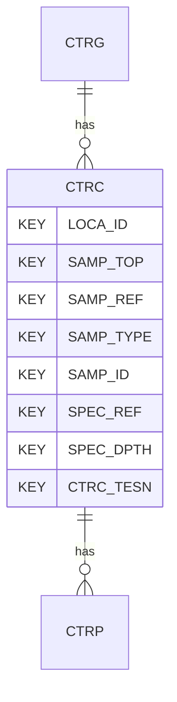

# CTRC — Cyclic Triaxial Tests - Consolidation

## Purpose
> [!quote] The **CTRC** group — Cyclic Triaxial Tests - Consolidation. It is a **child of [[CTRG]]** in the PROJ-rooted hierarchy. See [[parent-child-graph]].

## Position in the model

- Parent: [[CTRG]]
- Children: [[CTRP]]
- See [[parent-child-graph]] · [[key-tuple-pseudo-keys]] · [[heading-status-vocabulary]]

## Headings
> [!quote] Rendered from `repo:rust-packages/laterite-ags4-reference/data/ags_dictionary.json groups[code=CTRC]` (the repo's model authority — AGS edition 4.2). Suggested UNITs + worked examples are in the cited spec PDF, not duplicated here.

42 heading(s) — `**KEY**` = pseudo-key tuple, `*REQ*` = REQUIRED (non-null, Rule 10b), `DEP` = deprecated, OTHER = scope-dependent.

| Heading | Status | Type | Description |
|---|---|---|---|
| `LOCA_ID` | **KEY** | `ID` | Location identifier |
| `SAMP_TOP` | **KEY** | `2DP` | Depth to top of sample |
| `SAMP_REF` | **KEY** | `X` | Sample reference |
| `SAMP_TYPE` | **KEY** | `PA` | Sample type |
| `SAMP_ID` | **KEY** | `ID` | Sample unique identifier |
| `SPEC_REF` | **KEY** | `X` | Specimen reference |
| `SPEC_DPTH` | **KEY** | `2DP` | Depth to top of test specimen |
| `CTRC_TESN` | **KEY** | `X` | Test / Stage Number |
| `CTRC_CELL` | OTHER | `1DP` | Final cell pressure |
| `CTRC_BPWP` | OTHER | `1DP` | Base porewater pressure |
| `CTRC_MPWP` | OTHER | `1DP` | Mid-height porewater pressure |
| `CTRC_MPB` | OTHER | `2DP` | Mid-height B value |
| `CTRC_BB` | OTHER | `2DP` | Base B value |
| `CTRC_TYPE` | OTHER | `PA` | Type of consolidation |
| `CTRC_BACF` | OTHER | `1DP` | Final back pressure |
| `CTRC_ELAP` | OTHER | `T` | Duration of test/stage number |
| `CTRC_CHGT` | OTHER | `2DP` | Specimen height at end of stage |
| `CTRC_DIAE` | OTHER | `2DP` | Specimen diameter at end of stage |
| `CTRC_MCE` | OTHER | `X` | Water content at end of stage |
| `CTRC_BDE` | OTHER | `2DP` | Bulk density at end of stage |
| `CTRC_DDE` | OTHER | `2DP` | Dry density at end of stage |
| `CTRC_RDE` | OTHER | `1DP` | Relative density index of sand at end of stage |
| `CTRC_INCE` | OTHER | `3DP` | Voids ratio at end of stage |
| `CTRC_ASE` | OTHER | `1DP` | Effective axial stress at end of stage |
| `CTRC_RSE` | OTHER | `1DP` | Effective radial stress at end of stage |
| `CTRC_SSE` | OTHER | `1DP` | Shear stress at end of stage |
| `CTRC_DEVE` | OTHER | `1DP` | Deviatoric stress at end of stage |
| `CTRC_MNSE` | OTHER | `1DP` | Mean effective stress at end of stage |
| `CTRC_RTOE` | OTHER | `2DP` | Ratio of radial to axial effective stress at end of stage |
| `CTRC_EASE` | OTHER | `3DP` | External axial strain at end of stage |
| `CTRC_VLSE` | OTHER | `3DP` | Volumetric strain from measured volume change at end of stage |
| `CTRC_RDSE` | OTHER | `3DP` | Radial strain from measured volume change at end of stage |
| `CTRC_B` | OTHER | `1DP` | B value |
| `CTRC_BETS` | OTHER | `X` | Bender element test sequence |
| `CTRC_BEAX` | OTHER | `PA` | Bender element axis of measurement |
| `CTRC_BEDS` | OTHER | `2DP` | Distance between bender elements |
| `CTRC_MAT` | OTHER | `4DP` | Measured arrival time of propagated wave |
| `CTRC_MATM` | OTHER | `X` | Method of measuring arrival time of propagated wave |
| `CTRC_SWV` | OTHER | `0DP` | Calculated shear wave velocity |
| `CTRC_SMGM` | OTHER | `1DP` | Shear modulus Gmax |
| `CTRC_REM` | OTHER | `X` | Remarks |
| `FILE_FSET` | OTHER | `X` | Associated file reference |

Full cross-edition heading deltas: AGS Change Log (see [[ags4-rules-frozen-dictionary-evolves]]).

## Relational notes
KEY tuple: `LOCA_ID`, `SAMP_TOP`, `SAMP_REF`, `SAMP_TYPE`, `SAMP_ID`, `SPEC_REF`, `SPEC_DPTH`, `CTRC_TESN`. Children (1): [[CTRP]]. As a child it **denormalises** its parent's KEY columns into every row; [[rule-10c-parent-child]] re-resolves that repeated tuple upward to [[CTRG]]. See [[key-tuple-pseudo-keys]] · [[denormalised-child-rows]].

## Variations
No group-level change at 4.2 (present across the in-scope editions). Granular per-heading edition deltas live in the AGS online **Change Log** — the spec's own cited delta source (`spec:AGS4-4.2-2025.pdf` Foreword → ags.org.uk/.../change-log). Heading-level archaeology is deferred to a targeted Ingest if a rule/O-N interaction needs it (per [[ags4-rules-frozen-dictionary-evolves]]).

## Related
[[parent-child-graph]] · [[key-tuple-pseudo-keys]] · [[heading-status-vocabulary]] · [[rule-10c-parent-child]] · [[CTRG]] · [[CTRP]]
