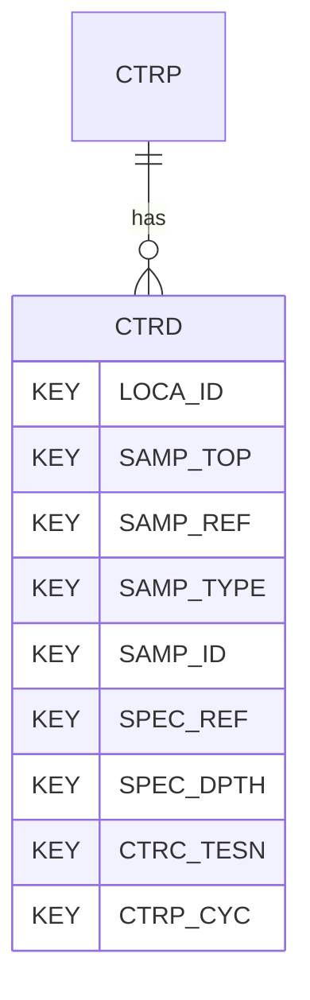

# CTRD — Cyclic Triaxial Tests - Data

## Purpose
> [!quote] The **CTRD** group — Cyclic Triaxial Tests - Data. It is a **child of [[CTRP]]** in the PROJ-rooted hierarchy. See [[parent-child-graph]].

## Position in the model

- Parent: [[CTRP]]
- Children: _none_
- See [[parent-child-graph]] · [[key-tuple-pseudo-keys]] · [[heading-status-vocabulary]]

## Headings
> [!quote] Rendered from `repo:rust-packages/laterite-ags4-reference/data/ags_dictionary.json groups[code=CTRD]` (the repo's model authority — AGS edition 4.2). Suggested UNITs + worked examples are in the cited spec PDF, not duplicated here.

37 heading(s) — `**KEY**` = pseudo-key tuple, `*REQ*` = REQUIRED (non-null, Rule 10b), `DEP` = deprecated, OTHER = scope-dependent.

| Heading | Status | Type | Description |
|---|---|---|---|
| `LOCA_ID` | **KEY** | `ID` | Location identifier |
| `SAMP_TOP` | **KEY** | `2DP` | Depth to top of sample |
| `SAMP_REF` | **KEY** | `X` | Sample reference |
| `SAMP_TYPE` | **KEY** | `PA` | Sample type |
| `SAMP_ID` | **KEY** | `ID` | Sample unique identifier |
| `SPEC_REF` | **KEY** | `X` | Specimen reference |
| `SPEC_DPTH` | **KEY** | `2DP` | Depth to top of test specimen |
| `CTRC_TESN` | **KEY** | `X` | Test / Stage Number |
| `CTRP_CYC` | **KEY** | `0DP` | Cycle number |
| `CTRD_TIME` | OTHER | `DT` | Date/time of reading |
| `CTRD_COND` | OTHER | `PA` | Test conditions |
| `CTRD_SDIA` | OTHER | `2DP` | Specimen diameter |
| `CTRD_HIGH` | OTHER | `2DP` | Specimen height |
| `CTRD_CELL` | OTHER | `1DP` | Cell pressure |
| `CTRD_BPWP` | OTHER | `1DP` | Base porewater pressure |
| `CTRD_MPWP` | OTHER | `1DP` | Mid-plane porewater pressure |
| `CTRD_EAS` | OTHER | `3DP` | External axial strain |
| `CTRD_LAS1` | OTHER | `3DP` | Local axial strain 1 |
| `CTRD_LAS2` | OTHER | `3DP` | Local axial strain 2 |
| `CTRD_VOL` | OTHER | `3DP` | Volumetric strain |
| `CTRD_RAD` | OTHER | `3DP` | Radial strain |
| `CTRD_SHSN` | OTHER | `3DP` | Shear strain |
| `CTRD_SHST` | OTHER | `1DP` | Shear stress |
| `CTRD_DEV` | OTHER | `1DP` | Deviatoric stress |
| `CTRD_PSD` | OTHER | `1DP` | Principal stress difference |
| `CTRD_MEES` | OTHER | `1DP` | Mean effective stress |
| `CTRD_SECE` | OTHER | `1DP` | Secant Young's Modulus (Local) |
| `CTRD_TANE` | OTHER | `1DP` | Tangent Young's Modulus |
| `CTRD_FREQ` | OTHER | `2SF` | Loading frequency |
| `CTRD_CSTS` | OTHER | `1DP` | Cyclic amplitude |
| `CTRD_ACVS` | OTHER | `1DP` | Average cyclic axial stress |
| `CTRD_DAVS` | OTHER | `3DP` | Double amplitude axial strain |
| `CTRD_CESR` | OTHER | `2DP` | Compression/Extension stress ratio |
| `CTRD_EMPR` | OTHER | `1DP` | Excess mid-plane pore pressure ratio |
| `CTRD_EBPR` | OTHER | `1DP` | Excess base pore pressure ratio |
| `CTRD_REM` | OTHER | `X` | Remarks |
| `FILE_FSET` | OTHER | `X` | Associated file reference (e.g. test result sheets) |

Full cross-edition heading deltas: AGS Change Log (see [[ags4-rules-frozen-dictionary-evolves]]).

## Relational notes
KEY tuple: `LOCA_ID`, `SAMP_TOP`, `SAMP_REF`, `SAMP_TYPE`, `SAMP_ID`, `SPEC_REF`, `SPEC_DPTH`, `CTRC_TESN`, `CTRP_CYC`. Children (0): _none_. As a child it **denormalises** its parent's KEY columns into every row; [[rule-10c-parent-child]] re-resolves that repeated tuple upward to [[CTRP]]. See [[key-tuple-pseudo-keys]] · [[denormalised-child-rows]].

## Variations
No group-level change at 4.2 (present across the in-scope editions). Granular per-heading edition deltas live in the AGS online **Change Log** — the spec's own cited delta source (`spec:AGS4-4.2-2025.pdf` Foreword → ags.org.uk/.../change-log). Heading-level archaeology is deferred to a targeted Ingest if a rule/O-N interaction needs it (per [[ags4-rules-frozen-dictionary-evolves]]).

## Related
[[parent-child-graph]] · [[key-tuple-pseudo-keys]] · [[heading-status-vocabulary]] · [[rule-10c-parent-child]] · [[CTRP]]
