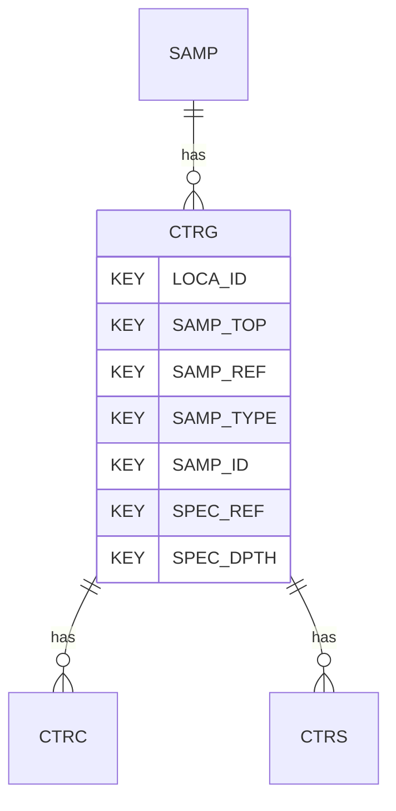

# CTRG — Cyclic Triaxial Test - General

## Purpose
> [!quote] The **CTRG** group — Cyclic Triaxial Test - General. It is a **child of [[SAMP]]** in the PROJ-rooted hierarchy. See [[parent-child-graph]].

## Position in the model

- Parent: [[SAMP]]
- Children: [[CTRC]] [[CTRS]]
- See [[parent-child-graph]] · [[key-tuple-pseudo-keys]] · [[heading-status-vocabulary]]

## Headings
> [!quote] Rendered from `repo:rust-packages/laterite-ags4-reference/data/ags_dictionary.json groups[code=CTRG]` (the repo's model authority — AGS edition 4.2). Suggested UNITs + worked examples are in the cited spec PDF, not duplicated here.

35 heading(s) — `**KEY**` = pseudo-key tuple, `*REQ*` = REQUIRED (non-null, Rule 10b), `DEP` = deprecated, OTHER = scope-dependent.

| Heading | Status | Type | Description |
|---|---|---|---|
| `LOCA_ID` | **KEY** | `ID` | Location identifier |
| `SAMP_TOP` | **KEY** | `2DP` | Depth to top of sample |
| `SAMP_REF` | **KEY** | `X` | Sample reference |
| `SAMP_TYPE` | **KEY** | `PA` | Sample type |
| `SAMP_ID` | **KEY** | `ID` | Sample unique identifier |
| `SPEC_REF` | **KEY** | `X` | Specimen reference |
| `SPEC_DPTH` | **KEY** | `2DP` | Depth to top of test specimen |
| `SPEC_DESC` | OTHER | `X` | Specimen description |
| `SPEC_PREP` | OTHER | `X` | Specimen preparation technique used |
| `SPEC_BASE` | OTHER | `2DP` | Depth to base of specimen |
| `CTRG_TYPE` | OTHER | `PA` | Type of test |
| `CTRG_MCI` | OTHER | `X` | Initial water/moisture content |
| `CTRG_MCF` | OTHER | `X` | Final water/moisture content |
| `CTRG_H2O` | OTHER | `X` | Description of type of water used for filter flushing, and salt content if relevant |
| `CTRG_SBP` | OTHER | `1DP` | Saturation back pressure |
| `CTRG_SATR` | OTHER | `0DP` | Initial degree of saturation after back pressure |
| `CTRG_IRD` | OTHER | `1DP` | Initial sample relative density |
| `CTRG_SDIA` | OTHER | `2DP` | Initial specimen diameter |
| `CTRG_HIGT` | OTHER | `2DP` | Initial height of specimen |
| `CTRG_TMSS` | OTHER | `2DP` | Total mass of installed specimen |
| `CTRG_PDEN` | OTHER | `XN` | Particle density with prefix # if value assumed |
| `CTRG_MADD` | OTHER | `2DP` | Maximum density of sand |
| `CTRG_MIDD` | OTHER | `2DP` | Minimum density of sand |
| `CTRG_DDEN` | OTHER | `2DP` | Initial dry density |
| `CTRG_BDEN` | OTHER | `2DP` | Initial bulk density |
| `CTRG_IVR` | OTHER | `3DP` | Initial voids ratio |
| `CTRG_SAT` | OTHER | `X` | Method of saturation |
| `CTRG_DURN` | OTHER | `1DP` | Test Duration |
| `CTRG_REM` | OTHER | `X` | Remarks |
| `CTRG_METH` | OTHER | `X` | Test method |
| `CTRG_DEV` | OTHER | `X` | Deviations from the test method |
| `CTRG_LAB` | OTHER | `X` | Name of testing laboratory/organization |
| `CTRG_CRED` | OTHER | `X` | Accrediting body and reference number (when appropriate) |
| `TEST_STAT` | OTHER | `X` | Test status |
| `FILE_FSET` | OTHER | `X` | Associated file reference (e.g. equipment calibrations) |

Full cross-edition heading deltas: AGS Change Log (see [[ags4-rules-frozen-dictionary-evolves]]).

## Relational notes
KEY tuple: `LOCA_ID`, `SAMP_TOP`, `SAMP_REF`, `SAMP_TYPE`, `SAMP_ID`, `SPEC_REF`, `SPEC_DPTH`. Children (2): [[CTRC]] [[CTRS]]. As a child it **denormalises** its parent's KEY columns into every row; [[rule-10c-parent-child]] re-resolves that repeated tuple upward to [[SAMP]]. See [[key-tuple-pseudo-keys]] · [[denormalised-child-rows]].

## Variations
No group-level change at 4.2 (present across the in-scope editions). Granular per-heading edition deltas live in the AGS online **Change Log** — the spec's own cited delta source (`spec:AGS4-4.2-2025.pdf` Foreword → ags.org.uk/.../change-log). Heading-level archaeology is deferred to a targeted Ingest if a rule/O-N interaction needs it (per [[ags4-rules-frozen-dictionary-evolves]]).

## Related
[[parent-child-graph]] · [[key-tuple-pseudo-keys]] · [[heading-status-vocabulary]] · [[rule-10c-parent-child]] · [[SAMP]] · [[CTRC]] · [[CTRS]]
