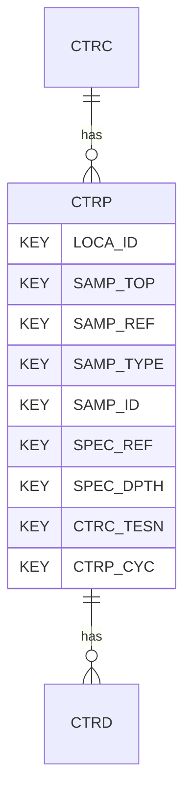

# CTRP — Cyclic Triaxial Test - Derived Parameters

## Purpose
> [!quote] The **CTRP** group — Cyclic Triaxial Test - Derived Parameters. It is a **child of [[CTRC]]** in the PROJ-rooted hierarchy. See [[parent-child-graph]].

## Position in the model

- Parent: [[CTRC]]
- Children: [[CTRD]]
- See [[parent-child-graph]] · [[key-tuple-pseudo-keys]] · [[heading-status-vocabulary]]

## Headings
> [!quote] Rendered from `repo:rust-packages/laterite-ags4-reference/data/ags_dictionary.json groups[code=CTRP]` (the repo's model authority — AGS edition 4.2). Suggested UNITs + worked examples are in the cited spec PDF, not duplicated here.

34 heading(s) — `**KEY**` = pseudo-key tuple, `*REQ*` = REQUIRED (non-null, Rule 10b), `DEP` = deprecated, OTHER = scope-dependent.

| Heading | Status | Type | Description |
|---|---|---|---|
| `LOCA_ID` | **KEY** | `ID` | Location identifier |
| `SAMP_TOP` | **KEY** | `2DP` | Depth to top of sample |
| `SAMP_REF` | **KEY** | `X` | Sample reference |
| `SAMP_TYPE` | **KEY** | `PA` | Sample type |
| `SAMP_ID` | **KEY** | `ID` | Sample unique identifier |
| `SPEC_REF` | **KEY** | `X` | Specimen reference |
| `SPEC_DPTH` | **KEY** | `2DP` | Depth to top of test specimen |
| `CTRC_TESN` | **KEY** | `X` | Test / Stage Number |
| `CTRP_CYC` | **KEY** | `0DP` | Cycle number |
| `CTRP_CYCF` | OTHER | `0DP` | Cycle number of failure |
| `CTRP_PWPM` | OTHER | `1DP` | Maximum excess porewater pressure |
| `CTRP_MNPP` | OTHER | `1DP` | Minimum excess porewater pressure |
| `CTRP_MXSS` | OTHER | `1DP` | Maximum shear stress |
| `CTRP_MNSS` | OTHER | `1DP` | Minimum shear stress |
| `CTRP_AVSS` | OTHER | `1DP` | Mean shear stress |
| `CTRP_CSS` | OTHER | `1DP` | Cyclic shear stress ((Max-Min)/2) |
| `CTRP_ACVS` | OTHER | `1DP` | Average cyclic axial stress |
| `CTRP_ASF` | OTHER | `3DP` | Axial strain at failure |
| `CTRP_FPWP` | OTHER | `1DP` | Porewater pressure at failure |
| `CTRP_QMAX` | OTHER | `1DP` | Maximum deviatoric stress |
| `CTRP_QMIN` | OTHER | `1DP` | Minimum deviatoric stress |
| `CTRP_MNES` | OTHER | `1DP` | Mean effective stress at end of CTRD_CYC |
| `CTRP_EAMX` | OTHER | `3DP` | Maximum axial strain |
| `CTRP_EAMN` | OTHER | `3DP` | Minimum axial strain |
| `CTRP_FVR` | OTHER | `3DP` | Final voids ratio |
| `CTRP_QEMX` | OTHER | `1DP` | Deviatoric stress at maximum axial strain |
| `CTRP_QEMN` | OTHER | `1DP` | Deviatoric stress at minimum axial strain |
| `CTRP_ESEC` | OTHER | `1DP` | Secant modulus |
| `CTRP_DAMP` | OTHER | `2DP` | Damping ratio |
| `CTRP_MODE` | OTHER | `X` | Mode of failure |
| `CTRP_DIPL` | OTHER | `2DP` | Percent Difference from Programmed Load |
| `CTRP_OBP` | OTHER | `X` | Observed Performance (Visual) |
| `CTRP_REM` | OTHER | `X` | Remarks |
| `FILE_FSET` | OTHER | `X` | Associated file reference (e.g. test result sheets) |

Full cross-edition heading deltas: AGS Change Log (see [[ags4-rules-frozen-dictionary-evolves]]).

## Relational notes
KEY tuple: `LOCA_ID`, `SAMP_TOP`, `SAMP_REF`, `SAMP_TYPE`, `SAMP_ID`, `SPEC_REF`, `SPEC_DPTH`, `CTRC_TESN`, `CTRP_CYC`. Children (1): [[CTRD]]. As a child it **denormalises** its parent's KEY columns into every row; [[rule-10c-parent-child]] re-resolves that repeated tuple upward to [[CTRC]]. See [[key-tuple-pseudo-keys]] · [[denormalised-child-rows]].

## Variations
No group-level change at 4.2 (present across the in-scope editions). Granular per-heading edition deltas live in the AGS online **Change Log** — the spec's own cited delta source (`spec:AGS4-4.2-2025.pdf` Foreword → ags.org.uk/.../change-log). Heading-level archaeology is deferred to a targeted Ingest if a rule/O-N interaction needs it (per [[ags4-rules-frozen-dictionary-evolves]]).

## Related
[[parent-child-graph]] · [[key-tuple-pseudo-keys]] · [[heading-status-vocabulary]] · [[rule-10c-parent-child]] · [[CTRC]] · [[CTRD]]
