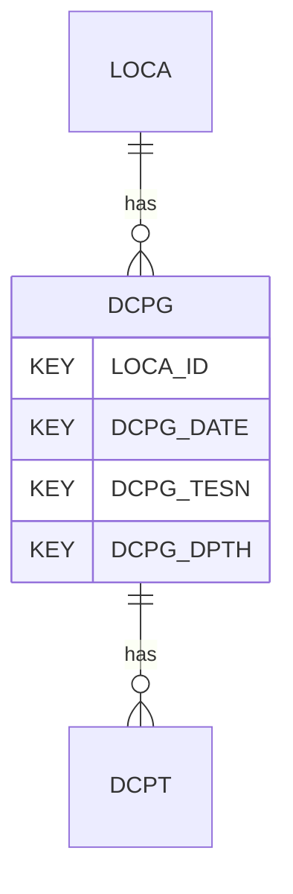

# DCPG — Dynamic Cone Penetrometer Tests - General

## Purpose
> [!quote] The **DCPG** group — Dynamic Cone Penetrometer Tests - General. It is a **child of [[LOCA]]** in the PROJ-rooted hierarchy. See [[parent-child-graph]].

## Position in the model

- Parent: [[LOCA]]
- Children: [[DCPT]]
- See [[parent-child-graph]] · [[key-tuple-pseudo-keys]] · [[heading-status-vocabulary]]

## Headings
> [!quote] Rendered from `repo:rust-packages/laterite-ags4-reference/data/ags_dictionary.json groups[code=DCPG]` (the repo's model authority — AGS edition 4.2). Suggested UNITs + worked examples are in the cited spec PDF, not duplicated here.

14 heading(s) — `**KEY**` = pseudo-key tuple, `*REQ*` = REQUIRED (non-null, Rule 10b), `DEP` = deprecated, OTHER = scope-dependent.

| Heading | Status | Type | Description |
|---|---|---|---|
| `LOCA_ID` | **KEY** | `ID` | Location identifier |
| `DCPG_DATE` | **KEY** | `DT` | Test date |
| `DCPG_TESN` | **KEY** | `X` | Test reference |
| `DCPG_DPTH` | **KEY** | `2DP` | Depth from surface to start of test |
| `DCPG_ZERO` | OTHER | `0DP` | Zero reading |
| `DCPG_LREM` | OTHER | `X` | Details of surface and base layers removed prior to/during the test (if applicable) |
| `DCPG_REM` | OTHER | `X` | Test remarks |
| `DCPG_ENV` | OTHER | `X` | Details of weather and environmental conditions during test |
| `DCPG_METH` | OTHER | `X` | Test method |
| `DCPG_CONT` | OTHER | `X` | Name of testing organization |
| `DCPG_CRED` | OTHER | `X` | Accrediting body and reference number (when appropriate) |
| `TEST_STAT` | OTHER | `X` | Test status |
| `FILE_FSET` | OTHER | `X` | Associated file reference (e.g. field record sheets) |
| `DCPG_OPER` | OTHER | `X` | Name of test operator |

Full cross-edition heading deltas: AGS Change Log (see [[ags4-rules-frozen-dictionary-evolves]]).

## Relational notes
KEY tuple: `LOCA_ID`, `DCPG_DATE`, `DCPG_TESN`, `DCPG_DPTH`. Children (1): [[DCPT]]. As a child it **denormalises** its parent's KEY columns into every row; [[rule-10c-parent-child]] re-resolves that repeated tuple upward to [[LOCA]]. See [[key-tuple-pseudo-keys]] · [[denormalised-child-rows]].

## Variations
No group-level change at 4.2 (present across the in-scope editions). Granular per-heading edition deltas live in the AGS online **Change Log** — the spec's own cited delta source (`spec:AGS4-4.2-2025.pdf` Foreword → ags.org.uk/.../change-log). Heading-level archaeology is deferred to a targeted Ingest if a rule/O-N interaction needs it (per [[ags4-rules-frozen-dictionary-evolves]]).

## Related
[[parent-child-graph]] · [[key-tuple-pseudo-keys]] · [[heading-status-vocabulary]] · [[rule-10c-parent-child]] · [[LOCA]] · [[DCPT]]
