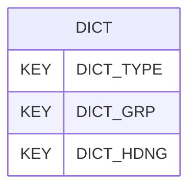

# DICT — User Defined Groups and Headings

## Purpose
> [!quote] The **DICT** group — User Defined Groups and Headings. It is a **root / non-hierarchy** group (file submission & description — Rules 13–18 territory). See [[parent-child-graph]].

## Position in the model

- Parent: _(root — no parent)_
- Children: _none_
- See [[parent-child-graph]] · [[key-tuple-pseudo-keys]] · [[heading-status-vocabulary]]

## Headings
> [!quote] Rendered from `repo:rust-packages/laterite-ags4-reference/data/ags_dictionary.json groups[code=DICT]` (the repo's model authority — AGS edition 4.2). Suggested UNITs + worked examples are in the cited spec PDF, not duplicated here.

11 heading(s) — `**KEY**` = pseudo-key tuple, `*REQ*` = REQUIRED (non-null, Rule 10b), `DEP` = deprecated, OTHER = scope-dependent.

| Heading | Status | Type | Description |
|---|---|---|---|
| `DICT_TYPE` | **KEY** | `PA` | Flag to indicate definition is a GROUP or HEADING (i.e. can be either of GROUP or HEADING) |
| `DICT_GRP` | **KEY** | `X` | Group name |
| `DICT_HDNG` | **KEY** | `X` | Heading name (Note: This data is REQUIRED where DICT_TYPE='HEADING') |
| `DICT_STAT` | OTHER | `PA` | Heading status KEY, REQUIRED or OTHER  (Note: This data is REQUIRED where DICT_TYPE='HEADING') |
| `DICT_DTYP` | OTHER | `PT` | Type of data and format  (Note: This data is REQUIRED where DICT_TYPE='HEADING') |
| `DICT_DESC` | *REQ* | `X` | Description |
| `DICT_UNIT` | OTHER | `PU` | Units  (Note: This data is REQUIRED where DICT_TYPE='HEADING') |
| `DICT_EXMP` | OTHER | `X` | Example |
| `DICT_PGRP` | OTHER | `X` | Parent group name  (Note: This data is REQUIRED where DICT_TYPE='GROUP') |
| `DICT_REM` | OTHER | `X` | Remarks |
| `FILE_FSET` | OTHER | `X` | Associated file reference |

Full cross-edition heading deltas: AGS Change Log (see [[ags4-rules-frozen-dictionary-evolves]]).

## Relational notes
KEY tuple: `DICT_TYPE`, `DICT_GRP`, `DICT_HDNG`. Children (0): _none_. Parent linkage is implicit/absent — Rule 10c is skipped for root groups (see [[non-hierarchy-ten-vs-parentless-list]]). See [[key-tuple-pseudo-keys]] · [[denormalised-child-rows]].

## Variations
No group-level change at 4.2 (present across the in-scope editions). Granular per-heading edition deltas live in the AGS online **Change Log** — the spec's own cited delta source (`spec:AGS4-4.2-2025.pdf` Foreword → ags.org.uk/.../change-log). Heading-level archaeology is deferred to a targeted Ingest if a rule/O-N interaction needs it (per [[ags4-rules-frozen-dictionary-evolves]]).

## Related
[[parent-child-graph]] · [[key-tuple-pseudo-keys]] · [[heading-status-vocabulary]] · [[rule-10c-parent-child]]
