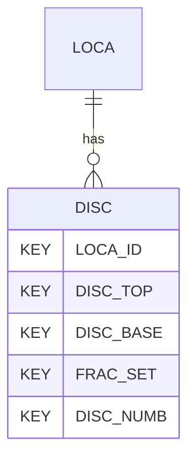

# DISC — Discontinuity Data

## Purpose
> [!quote] The **DISC** group — Discontinuity Data. It is a **child of [[LOCA]]** in the PROJ-rooted hierarchy. See [[parent-child-graph]].

## Position in the model

- Parent: [[LOCA]]
- Children: _none_
- See [[parent-child-graph]] · [[key-tuple-pseudo-keys]] · [[heading-status-vocabulary]]

## Headings
> [!quote] Rendered from `repo:rust-packages/laterite-ags4-reference/data/ags_dictionary.json groups[code=DISC]` (the repo's model authority — AGS edition 4.2). Suggested UNITs + worked examples are in the cited spec PDF, not duplicated here.

26 heading(s) — `**KEY**` = pseudo-key tuple, `*REQ*` = REQUIRED (non-null, Rule 10b), `DEP` = deprecated, OTHER = scope-dependent.

| Heading | Status | Type | Description |
|---|---|---|---|
| `LOCA_ID` | **KEY** | `ID` | Location identifier |
| `DISC_TOP` | **KEY** | `2DP` | Depth to top in hole, or distance to start on traverse, of discontinuity zone, or discontinuity |
| `DISC_BASE` | **KEY** | `2DP` | Depth to base in hole, or distance to end on traverse, of discontinuity zone |
| `FRAC_SET` | **KEY** | `X` | Discontinuity set reference |
| `DISC_NUMB` | **KEY** | `X` | Discontinuity reference |
| `DISC_TYPE` | OTHER | `PA` | Type of discontinuity |
| `DISC_DIP` | OTHER | `X` | Dip of discontinuity |
| `DISC_DIR` | OTHER | `X` | Dip direction of discontinuity |
| `DISC_RGH` | OTHER | `X` | Small scale roughness |
| `DISC_PLAN` | OTHER | `X` | Medium scale roughness |
| `DISC_WAVE` | OTHER | `1DP` | Large scale roughness, wavelength |
| `DISC_AMP` | OTHER | `1DP` | Large scale roughness, amplitude |
| `DISC_JRC` | OTHER | `0DP` | Joint Roughness Coefficient |
| `DISC_APP` | OTHER | `X` | Surface appearance |
| `DISC_APT` | OTHER | `XN` | Discontinuity aperture measurement |
| `DISC_APOB` | OTHER | `X` | Discontinuity aperture observation |
| `DISC_INFM` | OTHER | `X` | Infilling material |
| `DISC_TERM` | OTHER | `PA` | Discontinuity termination (lower, upper) |
| `DISC_PERS` | OTHER | `1DP` | Persistence measurement |
| `DISC_STR` | OTHER | `0DP` | Discontinuity wall strength |
| `DISC_WETH` | OTHER | `X` | Discontinuity wall weathering |
| `DISC_SEEP` | OTHER | `X` | Seepage rating |
| `DISC_FLOW` | OTHER | `0DP` | Water flow estimate |
| `DISC_REM` | OTHER | `X` | Remarks |
| `FILE_FSET` | OTHER | `X` | Associated file reference (e.g. logging field sheets) |
| `DISC_MID` | OTHER | `2DP` | Depth to mid-point in hole, or distance to mid-point on traverse, of discontinuity zone |

Full cross-edition heading deltas: AGS Change Log (see [[ags4-rules-frozen-dictionary-evolves]]).

## Relational notes
KEY tuple: `LOCA_ID`, `DISC_TOP`, `DISC_BASE`, `FRAC_SET`, `DISC_NUMB`. Children (0): _none_. As a child it **denormalises** its parent's KEY columns into every row; [[rule-10c-parent-child]] re-resolves that repeated tuple upward to [[LOCA]]. See [[key-tuple-pseudo-keys]] · [[denormalised-child-rows]].

## Variations
No group-level change at 4.2 (present across the in-scope editions). Granular per-heading edition deltas live in the AGS online **Change Log** — the spec's own cited delta source (`spec:AGS4-4.2-2025.pdf` Foreword → ags.org.uk/.../change-log). Heading-level archaeology is deferred to a targeted Ingest if a rule/O-N interaction needs it (per [[ags4-rules-frozen-dictionary-evolves]]).

## Related
[[parent-child-graph]] · [[key-tuple-pseudo-keys]] · [[heading-status-vocabulary]] · [[rule-10c-parent-child]] · [[LOCA]]
